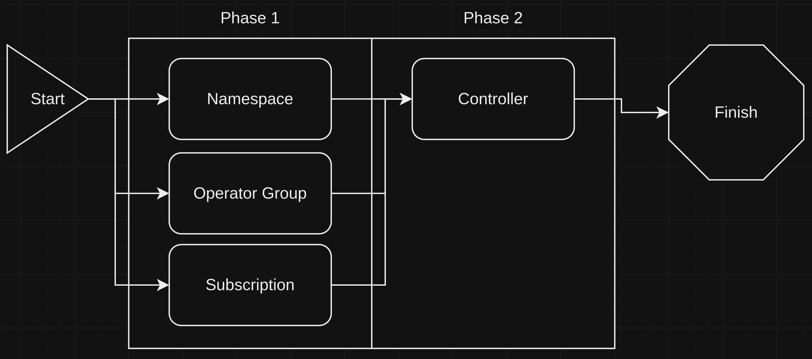

# Installing Ansible Automation Platform on an ACP
This block outlines how to install Ansible Automation Platform, an IT automation service, on an ACP, and deploy an instance of Controller.

## Information
| Key | Value |
| --- | ---|
| **Platform:** | Red Hat OpenShift |
| **Scope:** | Bootstrapping |
| **Tooling:** | CLI, yaml, helm, GitOps |
| **Pre-requisite Blocks:** | <ul><li>[Helm Getting Started](../helm-getting-started/README.md)</li><li>[Installing Operators via Yaml](../installing-operators-yaml/README.md)</li><li>[GitOps Cluster Config](../gitops-cluster-config-rbac/README.md)</li></ul> |
| **Pre-requisite Patterns:** | N/A |
| **Example Application**: | N/A |

## Table of Contents
* [Part 0 - Assumptions and Network Layout](#part-0---assumptions-and-network-layout)
* [Part 1 - Defining Configuration](#part-1---defining-configuration)
* [Part 2 - Installing the Ansible Automation Platform Operator](#part-2---installing-the-ansible-automation-platform-operator)
* [Part 3 - Controller Instance](#part-3---controller-instance)
* [Part 4 - Investigating IT Automation Service Availability](#part-4---investigating-it-automation-service-availability)

## Part 0 - Assumptions and Network Layout
This block has a few key assumptions, in an attempt to keep things digestable:
1. A target platform is installed and reachable.
2. The installation content for the ansible automation platform operator is available.
3. Persistent storage is available, either by local or converged storage.

The following example subnets/VLANs will be used:
| VLAN | Subnet | Description |
| --- | ---| --- |
| 2000 | 172.16.0.0/24 | Out of band management interfaces of hardware |
| 2001 | 172.16.1.0/24 | Hyperconverged storage network |
| 2002 | 172.16.2.0/23 | Cluster primary network for ingress, load balanced services, and MetalLB pools |
| 2003 | 172.16.4.0/24 | First dedicated network for bridged virtual machines |
| 2004 | 172.16.5.0/24 | Second dedicated network for bridged virtual machines |
| 2005 | 172.16.6.0/24 | Third dedicated network for bridged virtual machines |

The following network information will be used:
| IP Address | Device | Description |
| --- | --- | --- |
| 172.16.2.1 | Router | Router IP address for subnet |
| 172.16.2.2 | Rendezvous | Rendezvous IP address for bootstrapping cluster, temporary |
| 172.16.2.2 | node0 | node0's cluster IP address |
| 172.16.2.3 | node1 | node1's cluster IP address |
| 172.16.2.4 | node1 | node2's cluster IP address |
| 172.16.2.10 | API | Cluster's API address |
| 172.16.2.11 | Ingress | Cluster's ingress address |
| 172.16.1.2 | node0-storage | node0's storage IP address |
| 172.16.1.3 | node1-storage | node1's storage IP address |
| 172.16.1.4 | node2-storage | node2's storage IP address |
| 10.1.3.106 | DNS | DNS server address |

The following cluster information will be used:
```yaml
cluster_info:
  name: example-cluster
  version: stable
  base_domain: your-domain.com
  masters: 3
  workers: 0
  api_ip: 172.16.2.10
  ingress_ip: 172.16.2.11
  host_network_cidr: 172.16.2.0/23
```

The following node information will be used:
```yaml
nodes:
  - name: node0
    cluster_link:
      mac_address: b8:ca:3a:6e:69:40
      ip_address: 172.16.2.2
  - name: node1
    cluster_link:
      mac_address: 24:6e:96:69:56:90
      ip_address: 172.16.2.3
  - name: node2
    cluster_link:
      mac_address: b8:ca:3a:6e:17:d8
      ip_address: 172.16.2.4
```

Topology:


## Part 1 - Defining Configuration
To get started, the desired network configuration of the IT automation platform will be defined. Most of the desired state will center on the persistent storage options.

```yaml
---
ansibleAutomationPlatform:
  version: stable-2.4
  controller:
    name: controller
    storageClass: ocs-storagecluster-ceph-rbd
    replicas: 1
```

## Part 2 - Installing the Ansible Automation Platform Operator
IT automation capabilities are provided by the Ansible Automation Platform operator, which can be installed via GitOps. Refer to the [GitOps Deployment](../gitops-deployment-k8s/README.md) block for more information.

The installation process itself is handled over two phases, however it's recommended to have persistent storage available for the database component of the service.


The following resources are all foundational to the next phase:

### Namespace
```yaml
{{ if .Values.ansibleAutomationPlatform }}
---
apiVersion: v1
kind: Namespace
metadata:
  annotations:
    argocd.argoproj.io/sync-wave: "1"
  labels:
    openshift.io/cluster-monitoring: "true"
  name: ansible-automation-platform
{{ end }}
```

### Operator Group
```yaml
{{ if .Values.ansibleAutomationPlatform }}
---
apiVersion: operators.coreos.com/v1
kind: OperatorGroup
metadata:
  name: ansible-automation-platform-operator
  namespace: ansible-automation-platform
  annotations:
    argocd.argoproj.io/sync-wave: "1"
spec:
  targetNamespaces:
    - ansible-automation-platform
{{ end }}
```

### Subscription
```yaml
{{ if .Values.ansibleAutomationPlatform }}
---
apiVersion: operators.coreos.com/v1alpha1
kind: Subscription
metadata:
  name: ansible-automation-platform
  namespace: ansible-automation-platform
  annotations:
    argocd.argoproj.io/sync-wave: "1"
spec:
  channel: '{{ .Values.ansibleAutomationPlatform.version | default "stable-2.4" }}'
  installPlanApproval: Automatic
  name: ansible-automation-platform-operator
  source: redhat-operators
  sourceNamespace: openshift-marketplace
{{ end }}
```

## Part 3 - Controller Instance
An instance of Controller, deployed by the operator, is the central tool used for managing and executing IT automation tasks.

Here, the sync wave is set to 5, as to go after converged storage has been deployed and reached a healthy state, however this can be changed if only local storage is in use, or if another storage solution is already available.

```yaml
{{ if .Values.ansibleAutomationPlatform.controller  }}
---
apiVersion: automationcontroller.ansible.com/v1beta1
kind: AutomationController
metadata:
  name: {{ .Values.ansibleAutomationPlatform.controller.name }}
  namespace: ansible-automation-platform
  annotations:
    argocd.argoproj.io/sync-wave: "5" # Change if needed
    argocd.argoproj.io/sync-options: SkipDryRunOnMissingResource=true
spec:
  replicas: {{ .Values.ansibleAutomationPlatform.controller.replicas }}
  postgres_storage_class: {{ .Values.ansibleAutomationPlatform.controller.storageClass }}
{{ end }}
```

## Part 4 - Investigating IT Automation Service Availability
With the service now available, Controller can be accessed and leveraged to perform IT automation tasks. 


The administrative password can be found in a secret


