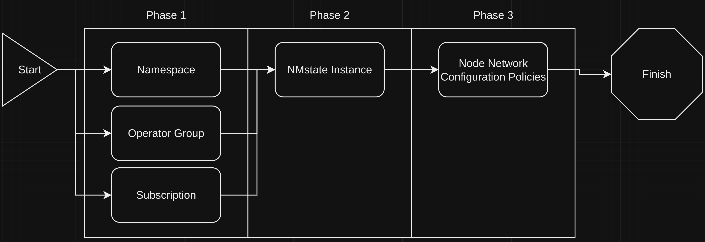
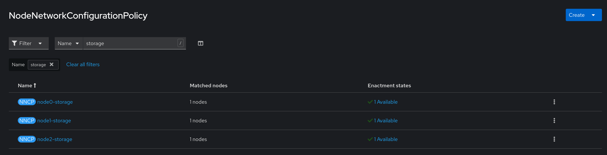
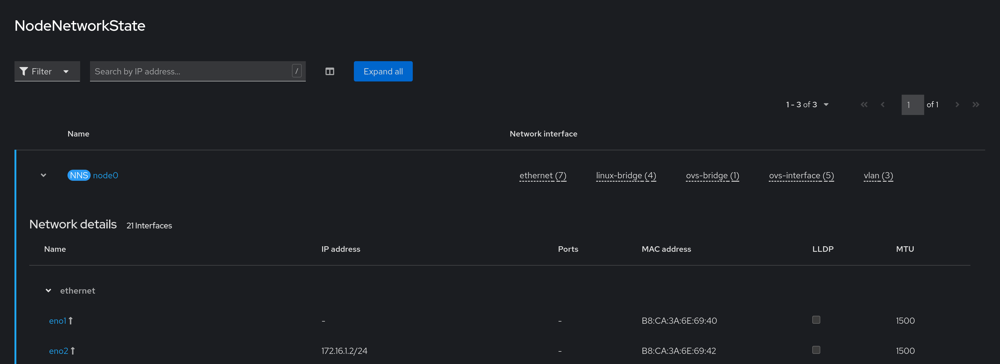

# Creating Bridged Networks on an ACP
This block outlines how to create and manage VLAN and bridged networks on an ACP, with the intention of being used for connecting virtual machines directly to a network.

## Information
| Key | Value |
| --- | ---|
| **Platform:** | Red Hat OpenShift |
| **Scope:** | Bootstrapping |
| **Tooling:** | CLI, yaml, helm, GitOps |
| **Pre-requisite Blocks:** | <ul><li>[Helm Getting Started](../helm-getting-started/README.md)</li><li>[Installing Operators via Yaml](../installing-operators-yaml/README.md)</li><li>[GitOps Cluster Config](../gitops-cluster-config-rbac/README.md)</li></ul> |
| **Pre-requisite Patterns:** | N/A |
| **Example Application**: | N/A |

## Table of Contents
* [Part 0 - Assumptions and Network Layout](#part-0---assumptions-and-network-layout)
* [Part 1 - Defining Configuration](#part-1---defining-configuration)
* [Part 2 - Installing the NMstate Operator](#part-2---installing-the-nmstate-operator)
* [Part 3 - NMstate Instance](#part-3---nmstate-instance)
* [Part 4 - Applying Network Configurations](#part-4---applying-network-configurations)
* [Part 5 - Applied Network Configurations](#part-5---applied-network-configurations)

## Part 0 - Assumptions and Network Layout
This block has a few key assumptions, in an attempt to keep things digestable:
1. A target platform is installed and reachable.
2. The installation content for the local storage operator is available.
3. Local disks meeting the ODF requirements are installed in the nodes.

The following example subnets/VLANs will be used:
| VLAN | Subnet | Description |
| --- | ---| --- |
| 2000 | 172.16.0.0/24 | Out of band management interfaces of hardware |
| 2001 | 172.16.1.0/24 | Hyperconverged storage network |
| 2002 | 172.16.2.0/23 | Cluster primary network for ingress, load balanced services, and MetalLB pools |
| 2003 | 172.16.4.0/24 | First dedicated network for bridged virtual machines |
| 2004 | 172.16.5.0/24 | Second dedicated network for bridged virtual machines |
| 2005 | 172.16.6.0/24 | Third dedicated network for bridged virtual machines |

The following network information will be used:
| IP Address | Device | Description |
| --- | --- | --- |
| 172.16.2.1 | Router | Router IP address for subnet |
| 172.16.2.2 | Rendezvous | Rendezvous IP address for bootstrapping cluster, temporary |
| 172.16.2.2 | node0 | node0's cluster IP address |
| 172.16.2.3 | node1 | node1's cluster IP address |
| 172.16.2.4 | node1 | node2's cluster IP address |
| 172.16.2.10 | API | Cluster's API address |
| 172.16.2.11 | Ingress | Cluster's ingress address |
| 172.16.1.2 | node0-storage | node0's storage IP address |
| 172.16.1.3 | node1-storage | node1's storage IP address |
| 172.16.1.4 | node2-storage | node2's storage IP address |
| 10.1.3.106 | DNS | DNS server address |

The following cluster information will be used:
```yaml
cluster_info:
  name: example-cluster
  version: stable
  base_domain: your-domain.com
  masters: 3
  workers: 0
  api_ip: 172.16.2.10
  ingress_ip: 172.16.2.11
  host_network_cidr: 172.16.2.0/23
```

The following node information will be used:
```yaml
nodes:
  - name: node0
    cluster_link:
      mac_address: b8:ca:3a:6e:69:40
      ip_address: 172.16.2.2
  - name: node1
    cluster_link:
      mac_address: 24:6e:96:69:56:90
      ip_address: 172.16.2.3
  - name: node2
    cluster_link:
      mac_address: b8:ca:3a:6e:17:d8
      ip_address: 172.16.2.4
```

Topology:


## Part 1 - Defining Configuration
To get started, the desired network configuration will be defined. For clarity within this block, we'll just be defining the storage interfaces, however this process scales for multiple uses.

Just as during cluster installation where cluster interface configuration was defined via [nmstate](https://nmstate.io), the same format is used for additional interface configuration:
```yaml
---
nodeNetworkConfigurationPolicies:
  - name: node0-storage
    node: node0
    interfaces:
      - name: eno2
        description: storage
        type: ethernet
        state: up
        ipv4:
          dhcp: false
          enabled: true
          address:
            - ip: 172.16.1.2
              prefix-length: 24
        ipv6:
          enabled: false
  - name: node1-storage
    node: node1
    interfaces:
      - name: eno2
        description: storage
        type: ethernet
        state: up
        ipv4:
          dhcp: false
          enabled: true
          address:
            - ip: 172.16.1.3
              prefix-length: 24
        ipv6:
          enabled: false
  - name: node2-storage
    node: node2
    interfaces:
      - name: eno2
        description: storage
        type: ethernet
        state: up
        ipv4:
          dhcp: false
          enabled: true
          address:
            - ip: 172.16.1.4
              prefix-length: 24
        ipv6:
          enabled: false
```

## Part 2 - Installing the NMstate Operator
Network configuration functionality is provided by the NMstate operator, which can be installed via GitOps. Refer to the [GitOps Deployment](../gitops-deployment-k8s/README.md) block for more information.

The installation happens over two phases, as the operator create the NMstate cluster resource definition. A third phase is used for applying node network configuration policies, as an instance of nmstate must be available.


The following resources are all foundational to the next phase:

### Namespace
```yaml
{{- if .Values.nodeNetworkConfigurationPolicies }}
---
apiVersion: v1
kind: Namespace
metadata:
  annotations:
    argocd.argoproj.io/sync-wave: "1"
  labels:
    kubernetes.io/metadata.name: openshift-nmstate
    name: openshift-nmstate
  name: openshift-nmstate
spec:
  finalizers:
  - kubernetes
{{ end }}
```

### Operator Group
```yaml
{{- if .Values.nodeNetworkConfigurationPolicies }}
---
apiVersion: operators.coreos.com/v1
kind: OperatorGroup
metadata:
  annotations:
    olm.providedAPIs: NMState.v1.nmstate.io
    argocd.argoproj.io/sync-wave: "1"
  name: openshift-nmstate
  namespace: openshift-nmstate
spec:
  targetNamespaces:
  - openshift-nmstate
{{ end }}
```

### Subscription
```yaml
{{- if .Values.nodeNetworkConfigurationPolicies }}
---
apiVersion: operators.coreos.com/v1alpha1
kind: Subscription
metadata:
  annotations:
    argocd.argoproj.io/sync-wave: "1"
  labels:
    operators.coreos.com/kubernetes-nmstate-operator.openshift-nmstate: ""
  name: kubernetes-nmstate-operator
  namespace: openshift-nmstate
spec:
  channel: stable
  installPlanApproval: Automatic
  name: kubernetes-nmstate-operator
  source: redhat-operators
  sourceNamespace: openshift-marketplace
{{ end }}
```

## Part 3 - NMstate Instance
An instance of NMstate will handle taking the desired network configuration and applying it to nodes, according to the specified information. Creation of an instance is configurable, but is often not necessary.

```yaml
{{- if .Values.nodeNetworkConfigurationPolicies }}
---
apiVersion: nmstate.io/v1
kind: NMState
metadata:
  name: nmstate
  annotations:
    argocd.argoproj.io/sync-wave: "2"
    argocd.argoproj.io/sync-options: SkipDryRunOnMissingResource=true
{{ end }}
```

## Part 4 - Applying Network Configurations
Network configurations can now be applied via `NodeNetworkConfigurationPolicy`. This template will create multiple NNCPs depending on what information is specified.

For the example cluster, three NNCPs will be created, mapped to a node, and a specific interface on that node, allowing for fine-grained control.

```yaml
{{- if .Values.nodeNetworkConfigurationPolicies }}
{{- range .Values.nodeNetworkConfigurationPolicies }}
---
apiVersion: nmstate.io/v1
kind: NodeNetworkConfigurationPolicy
metadata:
  name: {{ .name }}
  annotations:
    argocd.argoproj.io/sync-wave: "3"
    argocd.argoproj.io/sync-options: SkipDryRunOnMissingResource=true
spec:
  nodeSelector:
    kubernetes.io/hostname: {{ .node }}
  desiredState:
    interfaces:
{{- toYaml .interfaces | nindent 4 }}
{{- end }}
{{- end }}
```

## Part 5 - Applied Network Configurations
Once deployed, network configuration will begin, and the enactment states will be reported back.

Assuming correct configuration, our NNCPs should match one node each, and be applied successfully:




