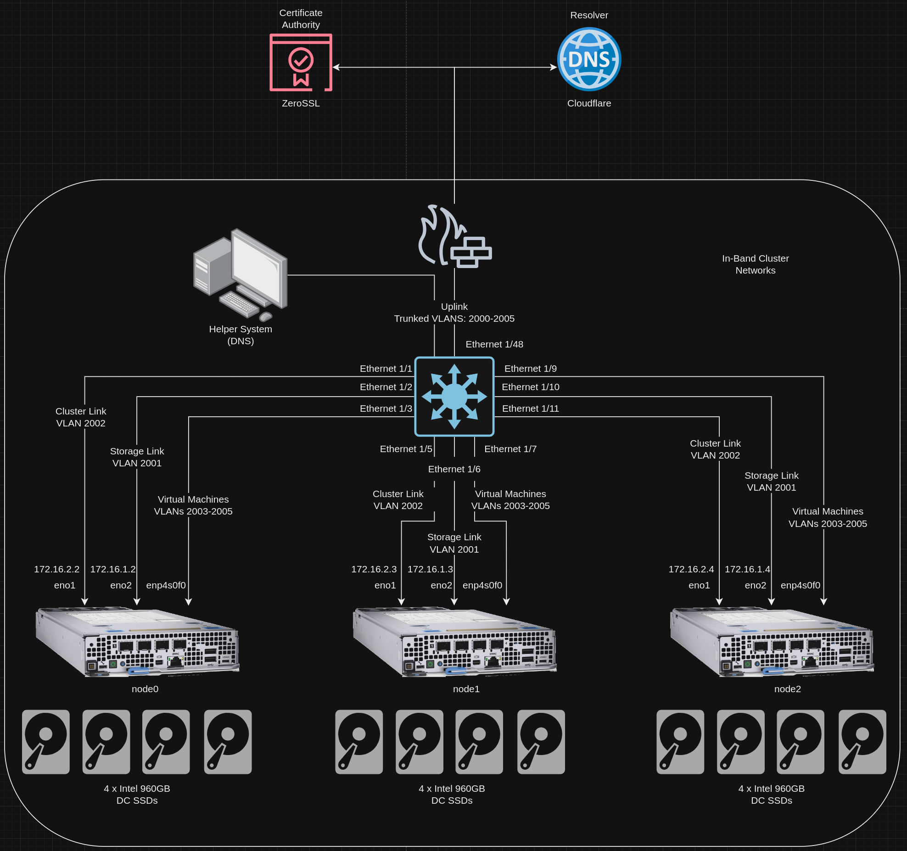
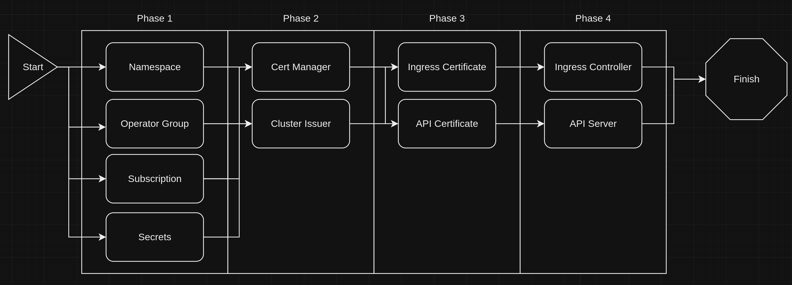
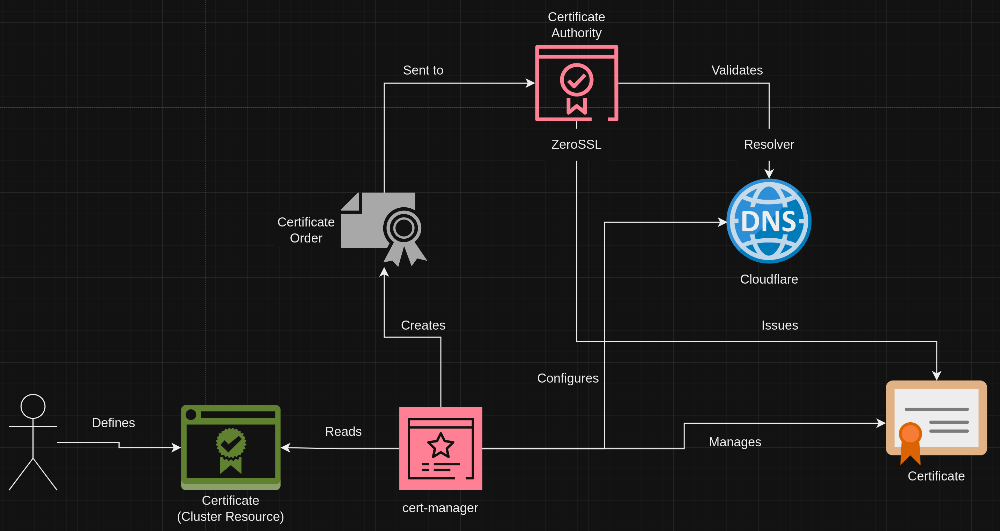
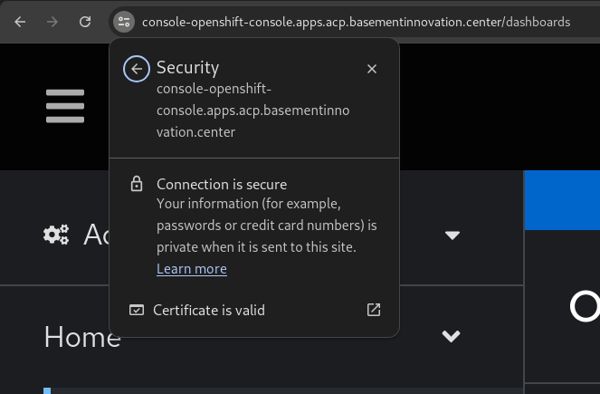
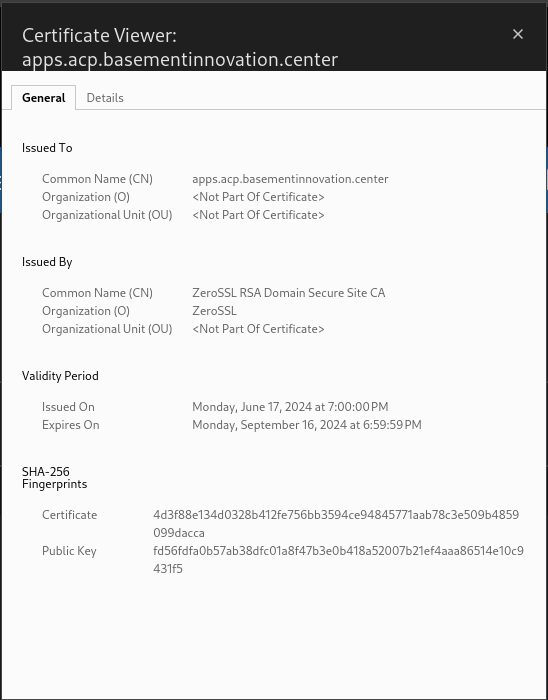

# Certificate Management for ACPs
This block outlines how to leverage cert-manager for certificate management on ACPs.

## Information
| Key | Value |
| --- | ---|
| **Platform:** | Red Hat OpenShift |
| **Scope:** | Bootstrapping |
| **Tooling:** | CLI, yaml, helm, GitOps |
| **Pre-requisite Blocks:** | <ul><li>[Helm Getting Started](../helm-getting-started/README.md)</li><li>[Installing Operators via Yaml](../installing-operators-yaml/README.md)</li><li>[GitOps Cluster Config](../gitops-cluster-config-rbac/README.md)</li></ul> |
| **Pre-requisite Patterns:** | N/A |
| **Example Application**: | N/A |

## Table of Contents
* [Part 0 - Assumptions and Network Layout](#part-0---assumptions-and-network-layout)
* [Part 1 - Defining Configuration](#part-1---defining-configuration)
* [Part 2 - Installing the cert-manager Operator](#part-2---installing-the-cert-manager-operator)
* [Part 3 - Cert Manager and Cluster Issuer](#part-3---cert-manager-and-cluster-issuer)
* [Part 4 - Requesting Certificates](#part-4---requesting-certificates)
* [Part 5 - Consuming the Certificates](#part-5---consuming-the-certificates)
* [Part 6 - Confirming Certificates](#part-6---confirming-certificates)

## Part 0 - Assumptions and Network Layout
This block has a few key assumptions, in an attempt to keep things digestable:
1. A target platform is installed and reachable.
2. The installation content for the cert-manager operator is available.
3. A certificate authority is available for consumption.
4. A resolver, such as a DNS resolver, is available for consumption.

The following example subnets/VLANs will be used:
| VLAN | Subnet | Description |
| --- | ---| --- |
| 2000 | 172.16.0.0/24 | Out of band management interfaces of hardware |
| 2001 | 172.16.1.0/24 | Hyperconverged storage network |
| 2002 | 172.16.2.0/23 | Cluster primary network for ingress, load balanced services, and MetalLB pools |
| 2003 | 172.16.4.0/24 | First dedicated network for bridged virtual machines |
| 2004 | 172.16.5.0/24 | Second dedicated network for bridged virtual machines |
| 2005 | 172.16.6.0/24 | Third dedicated network for bridged virtual machines |

The following network information will be used:
| IP Address | Device | Description |
| --- | --- | --- |
| 172.16.2.1 | Router | Router IP address for subnet |
| 172.16.2.2 | Rendezvous | Rendezvous IP address for bootstrapping cluster, temporary |
| 172.16.2.2 | node0 | node0's cluster IP address |
| 172.16.2.3 | node1 | node1's cluster IP address |
| 172.16.2.4 | node1 | node2's cluster IP address |
| 172.16.2.10 | API | Cluster's API address |
| 172.16.2.11 | Ingress | Cluster's ingress address |
| 172.16.1.2 | node0-storage | node0's storage IP address |
| 172.16.1.3 | node1-storage | node1's storage IP address |
| 172.16.1.4 | node2-storage | node2's storage IP address |
| 10.1.3.106 | DNS | DNS server address |

The following cluster information will be used:
```yaml
cluster_info:
  name: acp
  version: stable
  base_domain: basementinnovation.center
  masters: 3
  workers: 0
  api_ip: 172.16.2.10
  ingress_ip: 172.16.2.11
  host_network_cidr: 172.16.2.0/23
```

> Note:
>
> The DNS domain `basementinnovation.center` is a public domain owned for the example use of constructing this block.

ZeroSSL will be the certificate authority used to issue certificates, and Cloudflare will be used for DNS resolution of the certificate challenges.

The following node information will be used:
```yaml
nodes:
  - name: node0
    cluster_link:
      mac_address: b8:ca:3a:6e:69:40
      ip_address: 172.16.2.2
  - name: node1
    cluster_link:
      mac_address: 24:6e:96:69:56:90
      ip_address: 172.16.2.3
  - name: node2
    cluster_link:
      mac_address: b8:ca:3a:6e:17:d8
      ip_address: 172.16.2.4
```

Topology:


## Part 1 - Defining Configuration
To get started, a few configuration items will be defined. These will provide credentials to access services on the certificate authority and DNS services, as well as specify issuers and solvers, which are explained in detail later.

In addition, two certificates will be requested: one for the platform ingress in wildcard form, so anything on the cluster using the ingress will have a valid certificate access externally will present a valid certificate, and one for the API endpoint.

```yaml
---
certManager:
  issueAPICert: true
  issueIngressCert: true
  secrets:
    - name: zero-ssl-eabsecret
      stringData:
        secret: redacted
    - name: cloudflare-api-token-secret
      stringData:
        api-token: redacted
  issuer:
    name: zerossl-production
    spec:
      acme:
        server: https://acme.zerossl.com/v2/DV90
        email: your-email@you.com
        privateKeySecretRef:
          name: zerossl-prod
        externalAccountBinding:
          keyID: redacted
          keySecretRef:
            name: zero-ssl-eabsecret
            key: secret
          keyAlgorithm: HS256
        solvers:
          - dns01:
              cloudflare:
                email: your-email@you.com
                apiTokenSecretRef:
                  name: cloudflare-api-token-secret
                  key: api-token
            selector:
              dnsZones:
                  - acp.basementinnovation.center
                  - basementinnovation.center
```

## Part 2 - Installing the cert-manager Operator
Certificate management functionality is provided by the cert-manager operator, which can be installed via GitOps. Refer to the [GitOps Deployment](../gitops-deployment-k8s/README.md) block for more information.

The installation happens over four total phases, as certain cluster resource definitions are available after the operator installation has finished, and configuration of the ingress controller and api server happen after certificates have been issued.


The following resources are all foundational to the next phase:

### Namespaces
```yaml
---
{{ if .Values.certManager }}
---
apiVersion: v1
kind: Namespace
metadata:
  name: cert-manager-operator
  annotations:
    argocd.argoproj.io/sync-wave: "1"
---
apiVersion: v1
kind: Namespace
metadata:
  name: cert-manager
  annotations:
    argocd.argoproj.io/sync-wave: "1"
{{ end }}
```

### Operator Group
```yaml
{{ if .Values.certManager }}
---
apiVersion: operators.coreos.com/v1
kind: OperatorGroup
metadata:
  name: cert-manager-operator
  namespace: cert-manager-operator
  annotations:
    argocd.argoproj.io/sync-wave: "1"
spec:
  upgradeStrategy: Default
  targetNamespaces:
    - cert-manager-operator
{{ end }}
```

### Subscription
```yaml
{{ if .Values.certManager }}
---
apiVersion: operators.coreos.com/v1alpha1
kind: Subscription
metadata:
  name: openshift-cert-manager-operator
  namespace: cert-manager-operator
  annotations:
    argocd.argoproj.io/sync-wave: "1"
spec:
  channel: stable-v1
  installPlanApproval: Automatic
  name: openshift-cert-manager-operator
  source: redhat-operators
  sourceNamespace: openshift-marketplace
  startingCSV: cert-manager-operator.v{{ .Values.certManager.version | default "1.13.1' }}
{{ end }}
```

### Secrets
```yaml
{{ if .Values.certManager.secrets }}
{{- range .Values.certManager.secrets }}
---
apiVersion: v1
kind: Secret
metadata:
  name: {{ .name }}
  namespace: cert-manager
  annotations:
    argocd.argoproj.io/sync-wave: "1"
stringData:
{{- toYaml .stringData | nindent 2 }}
{{- end }}
{{ end }}
```

## Part 3 - Cert Manager and Cluster Issuer
Two main components provide the functionality to manage certificates: CertManager, which is an instance that handles certificate management, similar to an instance of NMstate, and a ClusterIssuer, which defines how certificates can be issued across the entire cluster.

### Cert Manager
First, an instance of `CertManager` will be created, with a few overrides of the default values:

```yaml
{{ if .Values.certManager }}
---
apiVersion: operator.openshift.io/v1alpha1
kind: CertManager
metadata:
  name: cluster
  annotations:
    argocd.argoproj.io/sync-wave: "2"
    argocd.argoproj.io/sync-options: SkipDryRunOnMissingResource=true
spec:
  logLevel: Normal
  managementState: Managed
  operatorLogLevel: Normal
  controllerConfig:
    overrideArgs:
      - "--dns01-recursive-nameservers=8.8.8.8:53,1.1.1.1:53"
      - "--dns01-recursive-nameservers-only"
{{ end }}
```

Because the example cluster will use DNS resolution for certificate challenges, using public DNS servers typically results in faster challenge completion.

### Cluster Issuer
A cluster issuer allows certificates to be issued for the entire cluster, and is scoped accordingly.

```yaml
{{ if .Values.certManager }}
---
apiVersion: cert-manager.io/v1
kind: ClusterIssuer
metadata:
  name: {{ .Values.certManager.issuer.name }}
  annotations:
    argocd.argoproj.io/sync-wave: "2"
    argocd.argoproj.io/sync-options: SkipDryRunOnMissingResource=true
spec:
{{- toYaml .Values.certManager.issuer.spec | nindent 2 }}
{{ end }}
```

The spec of this resource is nearly completely fed in from the desired state configruation defined above, as certificate issuer and solver configurations vary greatly. Refer to the [cert-manager documentation](https://cert-manager.io/docs/) for examples of various issuers and solvers.

The general way to think of the relationship between issuer and solvers is: issuers are what issue certificates, solvers prove the certificate can be issued. ACME issuers will validate the certificate request against the solvers, typically via DNS or http.

## Part 4 - Requesting Certificates
Once configuration is complete, certificates can now be requested. The cluster issuer and underlying capabilities of cert management will handle the steps necessary to complete the certificate issuing process.

For example, here are the certificates requested for the example cluster:

```yaml
{{ if .Values.certManager }}
{{ if .Values.certManager.issueAPICert }}
---
apiVersion: cert-manager.io/v1
kind: Certificate
metadata:
  name: openshift-api
  namespace: openshift-config
  annotations:
    argocd.argoproj.io/sync-wave: "3"
    argocd.argoproj.io/sync-options: SkipDryRunOnMissingResource=true
spec:
  dnsNames:
    - api.{{ .Values.clusterSettings.baseURL }}
  issuerRef:
    group: cert-manager.io
    kind: ClusterIssuer
    name: {{ .Values.certManager.issuer.name }}
  secretName: openshift-api-cert
{{ end }}
{{ if .Values.certManager.issueIngressCert }}
---
apiVersion: cert-manager.io/v1
kind: Certificate
metadata:
  name: router-default
  namespace: openshift-ingress
  annotations:
    argocd.argoproj.io/sync-wave: "3"
    argocd.argoproj.io/sync-options: SkipDryRunOnMissingResource=true
spec:
  dnsNames:
      - apps.{{ .Values.clusterSettings.baseURL }}
      - "*.apps.{{ .Values.clusterSettings.baseURL }}"
  issuerRef:
    group: cert-manager.io
    kind: ClusterIssuer
    name: {{ .Values.certManager.issuer.name }}
  secretName: router-cert
{{ end }}
{{ end }}
```

Certificates are created in a specific namespace, ideally the namespace where other resources will leverage them. Since a cluster issuer has been configured, any namespace can leverage it. `.spec.secretName` defines where the issued certificate will be stored.

The `cerfificate` resource represents the desired state of having a certificate for what's specified in the `dnsNames` field of the spec. If this certificate exists, then it can immediately be leveraged. If not, then cert-manager will leverage the specified issuer to have a certificate issued.



## Part 5 - Consuming the Certificates
Since the certificates are intended to be used for ingress and the API, a few updates need to be made to the corresponding resources to leverage them.

### API Server
```yaml
{{ if .Values.certManager }}
{{ if .Values.issueAPICert }}
---
apiVersion: config.openshift.io/v1
kind: APIServer
metadata:
  name: cluster
  annotations:
    argocd.argoproj.io/sync-wave: "4"
spec:
  servingCerts:
    namedCertificates:
      - names:
          - api.{{ .Values.clusterSettings.baseURL }}
        servingCertificate:
          name: openshift-api-cert
{{ end }}
{{ end }}
```

### Ingress Controller
```yaml
{{ if .Values.certManager.issueIngressCert }}
---
apiVersion: operator.openshift.io/v1
kind: IngressController
metadata:
  name: default
  namespace: openshift-ingress-operator
  annotations:
    argocd.argoproj.io/sync-wave: "4"
spec:
  defaultCertificate:
    name: router-cert
{{ end }}
```

These resources are synced after the certificates have been issued and created by cert manager.

## Part 6 - Confirming Certificates
After the resources are finished updating, valid certificates should now be presented when accessing cluster resources.

### Cluster Ingress/Dashboard
Accessing the cluster dashboard should now have a valid certificate:




### API Certificate
If the cluster was installed without specifying certificates, then self-signed certificate authority data are placed into the generated kubeconfig, which can now be removed as the API certificate is valid:
```yaml
clusters:
- cluster:
    # This line can be removed
    certificate-authority-data:
      LONGSTRINGOFCERTAUTHDATA=
    server: https://api.acp.basementinnovation.center:6443
  name: acp
contexts:
- context:
    cluster: acp
    user: admin
  name: admin
current-context: admin
preferences: {}
users:
- name: admin
  user:
    client-certificate-data:
      CLIENTCERTIFICATEDATA=
    client-key-data:
      CLIENTKEYDATA=
```

```
oc get certificate -A
NAMESPACE           NAME             READY   SECRET               AGE
openshift-config    openshift-api    True    openshift-api-cert   2d20h
openshift-ingress   router-default   True    router-cert          2d20h
```