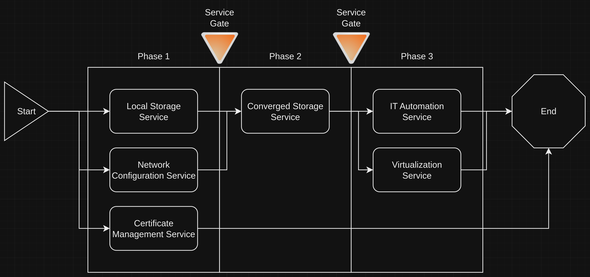
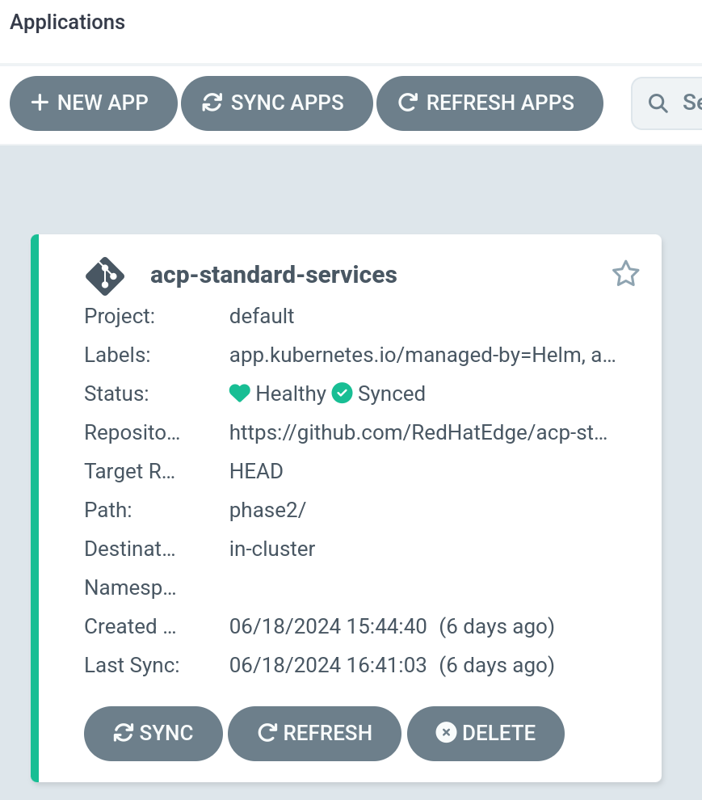
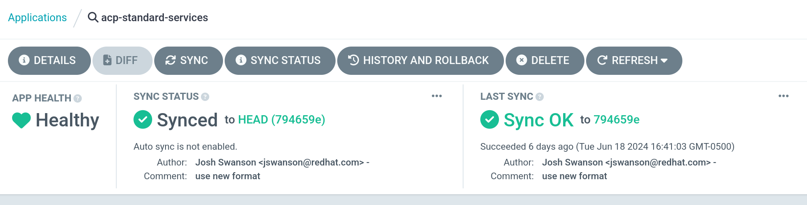
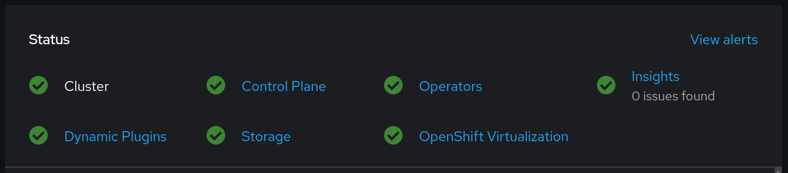

# Installing Red Hat Provided Core Services on an ACP
This is a "meta" block that summarizies and streamlines the installation of core services on an ACP.

Refer to the underlying blocks for more detailed information on the invdividual services.

## Information
| Key | Value |
| --- | ---|
| **Platform:** | Red Hat OpenShift |
| **Scope:** | Bootstrapping |
| **Tooling:** | CLI, yaml, helm, GitOps |
| **Pre-requisite Blocks** | <ul><li>[Getting Started with Helm](../../blocks/helm-getting-started/README.md)</li><li>[GitOps Deployment](../../blocks/gitops-deployment-k8s/README.md)</li><li>[Bootstrapping GitOps Functionality](../../blocks/bootstrapping-gitops/README.md)</li><li>[Local Storage for Converged Storage](../../blocks/local-storage-for-converged-storage/README.md)</li><li>[Network Configuration on an ACP](../../blocks/acp-network-configuration/README.md)</li><li>[Automated Certificate Management on ACP](../../blocks/acp-cert-management/README.md)</li><li>[Converged Storage with OpenShift Data Foundation](../../blocks/converged-storage-odf/README.md)</li><li>[Installing IT Automation Functionality on an ACP](../../blocks/aap-on-acp-install/README.md)</li><li>[Deploying Virtualization Functionality](../../blocks/virtualization-on-acp/README.md)</li></ul> |
| **Pre-requisite Patterns** | <ul><li>[ACP Standard Architecture]()</li><li>[Red Hat Provided ACP Standard Services]()</li></ul> |
| **Example Application**: | N/A |

## Table of Contents
* [Part 0 - Assumptions and Network Layout](#part-0---assumptions-and-network-layout)
* [Part 1 - Defining Configuration](#part-1---defining-configuration)
* [Part 2 - Conditionalizing Deployments and Configuration](#part-2---conditionalizing-deployments-and-configuration)
* [Part 3 - Installation Process and Sync Waves](#part-3---installation-process-and-sync-waves)
* [Part 4 - Installation via GitOps](#part-4---installation-via-gitops)
* [Part 5 - Initiation of Sync](#part-5---initiation-of-sync)
* [Part 6 - Validation of Services](#part-6---validation-of-services)

## Part 0 - Assumptions and Network Layout
This block has a few key assumptions, in an attempt to keep things digestable:
1. A target platform is installed and reachable.
2. The installation content for the various services is available.
3. All assumptions and preconditions of the underlying blocks have been met.

The following example subnets/VLANs will be used:
| VLAN | Subnet | Description |
| --- | ---| --- |
| 2000 | 172.16.0.0/24 | Out of band management interfaces of hardware |
| 2001 | 172.16.1.0/24 | Hyperconverged storage network |
| 2002 | 172.16.2.0/23 | Cluster primary network for ingress, load balanced services, and MetalLB pools |
| 2003 | 172.16.4.0/24 | First dedicated network for bridged virtual machines |
| 2004 | 172.16.5.0/24 | Second dedicated network for bridged virtual machines |
| 2005 | 172.16.6.0/24 | Third dedicated network for bridged virtual machines |

The following network information will be used:
| IP Address | Device | Description |
| --- | --- | --- |
| 172.16.2.1 | Router | Router IP address for subnet |
| 172.16.2.2 | Rendezvous | Rendezvous IP address for bootstrapping cluster, temporary |
| 172.16.2.2 | node0 | node0's cluster IP address |
| 172.16.2.3 | node1 | node1's cluster IP address |
| 172.16.2.4 | node1 | node2's cluster IP address |
| 172.16.2.10 | API | Cluster's API address |
| 172.16.2.11 | Ingress | Cluster's ingress address |
| 172.16.1.2 | node0-storage | node0's storage IP address |
| 172.16.1.3 | node1-storage | node1's storage IP address |
| 172.16.1.4 | node2-storage | node2's storage IP address |
| 10.1.3.106 | DNS | DNS server address |

The following cluster information will be used:
```yaml
cluster_info:
  name: acp
  version: stable
  base_domain: basementinnovation.center
  masters: 3
  workers: 0
  api_ip: 172.16.2.10
  ingress_ip: 172.16.2.11
  host_network_cidr: 172.16.2.0/23
```

The following node information will be used:
```yaml
nodes:
  - name: node0
    cluster_link:
      mac_address: b8:ca:3a:6e:69:40
      ip_address: 172.16.2.2
  - name: node1
    cluster_link:
      mac_address: 24:6e:96:69:56:90
      ip_address: 172.16.2.3
  - name: node2
    cluster_link:
      mac_address: b8:ca:3a:6e:17:d8
      ip_address: 172.16.2.4
```

Topology:


## Part 1 - Defining Configuration
Similar to the underlying blocks, the desired configuration is defined before the installation process begins.

This defintion will contain a large amount of information, but will be broken down into sections.

### Cluster Definition
`clusterSettings` the base information of the cluster:
```yaml
clusterSettings:
  baseURL: acp.basementinnovation.center
  version: 4.15
```

### Local Storage Desired Configuration
`localStorage` contains the desired configuration for the local storage service:
```yaml
localStorage:
  nodes:
    - node0
    - node1
    - node2
  storageClassName: local-disks
  volumeMode: Block
  deviceInclusionSpec:
    deviceTypes:
      - disk
    deviceMechanicalProperties:
      - NonRotational
```

### Node Networking Desired Configuration
`nodeNetworkConfigurationPolicies` defines the desired configuration of networking on nodes:
```yaml
nodeNetworkConfigurationPolicies:
  - name: node0-storage
    node: node0
    interfaces:
      - name: eno2
        description: storage
        type: ethernet
        state: up
        ipv4:
          dhcp: false
          enabled: true
          address:
            - ip: 172.16.1.2
              prefix-length: 24
        ipv6:
          enabled: false
  - name: node1-storage
    node: node1
    interfaces:
      - name: eno2
        description: storage
        type: ethernet
        state: up
        ipv4:
          dhcp: false
          enabled: true
          address:
            - ip: 172.16.1.3
              prefix-length: 24
        ipv6:
          enabled: false
  - name: node2-storage
    node: node2
    interfaces:
      - name: eno2
        description: storage
        type: ethernet
        state: up
        ipv4:
          dhcp: false
          enabled: true
          address:
            - ip: 172.16.1.4
              prefix-length: 24
        ipv6:
          enabled: false
```

### Certificate Management Desired Configuration
`certManager` contains the desired configuration for the certificate management service:
```yaml
certManager:
  issueAPICert: true
  issueIngressCert: true
  secrets:
    - name: zero-ssl-eabsecret
      stringData:
        secret: redacted
    - name: cloudflare-api-token-secret
      stringData:
        api-token: redacted
  issuer:
    name: zerossl-production
    spec:
      acme:
        server: https://acme.zerossl.com/v2/DV90
        email: you@your-email.com
        privateKeySecretRef:
          name: zerossl-prod
        externalAccountBinding:
          keyID: redacted
          keySecretRef:
            name: zero-ssl-eabsecret
            key: secret
          keyAlgorithm: HS256
        solvers:
          - dns01:
              cloudflare:
                email: you@your-email.com
                apiTokenSecretRef:
                  name: cloudflare-api-token-secret
                  key: api-token
            selector:
              dnsZones:
                  - acp.basementinnovation.center
                  - basementinnovation.center
```

### Converged Storage Desired Configuration
`convergedStorage` contains the desired configuration for converged storage:
```yaml
convergedStorage:
  nodes:
    - node0
    - node1
    - node2
  network: 172.16.1.0/24
  interface: eno2
  totalNumDisks: 12
  replicas: 3
```

### Virtualization Desired Configuration
`virtualization` contains the desired configuration for the virtualization service:
```yaml
virtualization:
  nonRoot: true
  hostCPUPassThrough: true
```

### IT Automation Desired Configuration
`ansibleAutomationPlatform` contains the desired configruation for the IT automation service:
```yaml
ansibleAutomationPlatform:
  controller:
    name: controller
    storageClass: ocs-storagecluster-ceph-rbd
    replicas: 1
```

## Part 2 - Conditionalizing Deployments and Configuration
For flexability, the templates included in this block are conditionalized, as to support for inclusion or exclusion of specific services or functionality as needed.

For example, if `virtualization` above is not defined, then the virtualization service would not be installed or configured.

This is accomplished using conditionals around the base definitions in the templates:
```yaml
{{ if .Values.virtualization }} # If the virtualization service's desired state is defined
---
apiVersion: v1
kind: Namespace
metadata:
  name: openshift-cnv
  annotations:
    argocd.argoproj.io/sync-wave: "1"
{{ end }} # End conditional
```

These services can be enabled later, if desired, however remember: some services depend on others for functionality.

## Part 3 - Installation Process and Sync Waves
ArgoCD's `sync-wave` functionality is used throughout the installation process, to ensure the health of various components before attempting installtion of the next wave of components.

In addition, the `SkipDryRunOnMissingResource` is also used, as not all cluster resources will be available until the previous wave has fully synced.

The overall installation flow can be represented accordingly:


For the installation flow of each service, refer to the service's corresponding block,

## Part 4 - Installation via GitOps
To begin the installation, an application and secret containing the git repository need to be created in the `openshift-gitops` namespace.

### Git Repository Secret
This secret creates a connection to the specified git repo:
```yaml
---
apiVersion: v1
kind: Secret
metadata:
  name: acp-standard-services-code
  namespace: openshift-gitops
  labels:
    argocd.argoproj.io/secret-type: repository
stringData:
  type: git
  url: https://github.com/RedHatEdge/patterns.git
```

### Application
This creates an application in OpenShift GitOps that represnts the standard set of services to be deployed and configured:
```yaml
---
apiVersion: argoproj.io/v1alpha1
kind: Application
metadata:
  name: acp-standard-services
  namespace: openshift-gitops
  labels:
    application: acp-standard-services
spec:
  destination: # The deployment destination. In this example, services are deployed to the "local" cluster.
    name: ""
    server: https://kubernetes.default.svc
  project: default
  source:
    repoURL: https://github.com/RedHatEdge/patterns.git
    targetRevision: HEAD
    path: blocks/acp-rh-core-services-install/code/acp-standard-services
    helm:
      values: |
{{- toYaml .Values | nindent 8 }} # Puts the contents of the `Values.yaml` file from above into the application definition.
```

> Note:
>
> This method will include potentially sensitive values in the application definition. Be sure to control permissions accordingly, or use other secret storage methods.

### Creation via Helm CLI
If deploying directly from this repo, place the `Values.yaml` file containing the desired state into `code/acp-standard-services-application/` directory, as we want the values created as part of the `acp-standard-services` application.

```
helm install -f code/acp-standard-services-application/Values.yaml acp-standard-services code/acp-standard-services/
```

Once complete, the application will have been created:


## Part 5 - Initiation of Sync
Once the application is configured in OpenShift GitOps, a sync can be triggered using either the argoCD CLI or the WebUI:


The sync will take time to complete, as services are installed and configured. ArgoCD will track the rollout and display the progress and status, and when complete, report a status of `Synced`.

## Part 6 - Validation of Services
Once complete, the OpenShift web console will show additional information in the main `Status` section that was not displayed previously:


Refer to the individual service's corresponding block to investigate service functionality more thoroughly.
