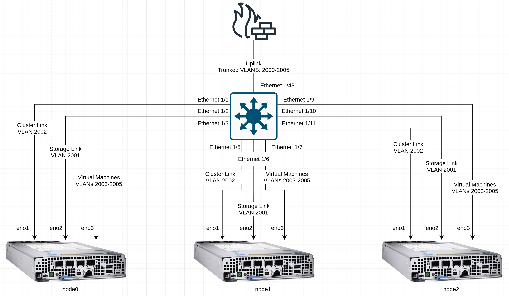
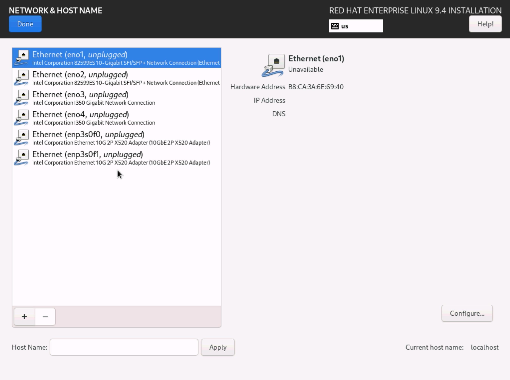
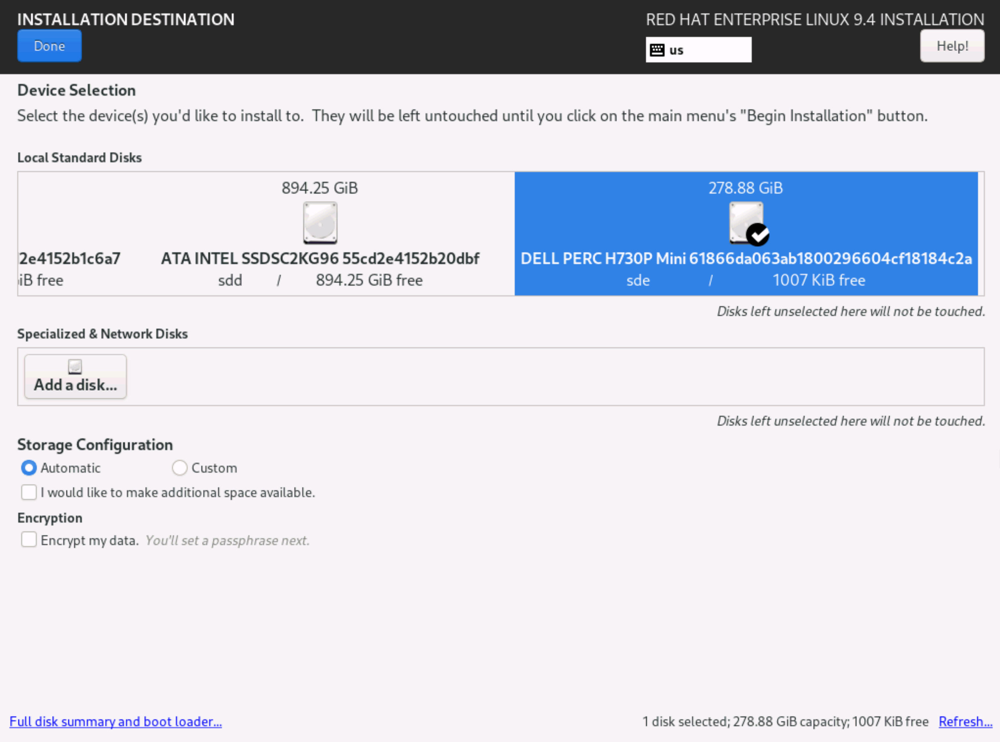

# Agent Config and Install Config
This block is an example of creating the necessary installation config files for install bare-metal OpenShift clusters, such as those that will be ACPs.

The agent-based installer is an efficient way to install bare-metal clusters, as the process also does not require a dedicated bootstrap node, as the first node of the cluster is used as the bootstrap temporarily to support the installation process.

The agent-based installation method for OpenShift combines the assisted installation service, which allows for easy declaration of the desired state of a cluster, with the capability to run in disconnected or air-gapped situations.

The flow is as follows:


Two main required configuration files drive the installation process: `agent-config.yaml` and `install-config.yaml`. These two files are consumed by the agent installation process, and define the desired state of the installed cluster.

## Information
- **Platform:** Red Hat OpenShift
- **Scope:** Bootstrapping
- **Tooling:** CLI, yaml
- **Pre-requisite Patterns:** N/A
- **Example Application**: N/A

## Table of Contents
* [Part 0 - Assumptions and Network Layout](#part-0---assumptions-and-network-layout)
* [Part 1 - Retrieving Node Information](#part-2---retrieving-node-information)
  * [Section 1 - Cluster Link](#section-1---cluster-link)
  * [Section 2 - Installation Disk](#section-2---installation-disk)
* [Part 2 - The Agent Configuration File](#part-3---the-agent-configuration-file)
  * [Section 1 - Base Cluster Configuration](#section-1---base-cluster-configuration)
  * [Section 2 - Node Configuration Information](#section-2---node-configuration-information)
* [Part 3 - The Installation Configuration File](#part-4---the-installation-configuration-file)
* [Part 4 - Creating Installation Media](#part-5---creating-installation-media)

## Part 0 - Assumptions and Network Layout
This block has a few key assumptions, in an attempt to keep things digestable:
1. A compact, three node cluster will be deployed.
2. All cabling has already been completed.
3. Network configuration has been completed.
4. DNS has been configured and is available.
5. Internet access is avaiable, however this can be used without it.

The following example subnets/VLANs will be used:
| VLAN | Subnet | Description |
| --- | --- | --- |
| 2000 | 172.16.0.0/24 | Out of band management interfaces of hardware |
| 2001 | 172.16.1.0/24 | Hyperconverged storage network |
| 2002 | 172.16.2.0/23 | Cluster primary network for ingress, load balanced services, and MetalLB pools |
| 2003 | 172.16.4.0/24 | First dedicated network for bridged virtual machines |
| 2004 | 172.16.5.0/24 | Second dedicated network for bridged virtual machines |
| 2005 | 172.16.6.0/24 | Third dedicated network for bridged virtual machines |

Topology:


## Part 1 - Retrieving Node Information
The main pieces of information to capture from the target hardware is the interface name and mac address that will be the primary or cluster link, and the target installation disk.

If these pieces of information are not known, a quick way to identify them is to boot the devices to a standard RHEL installation ISO.

### Section 1 - Cluster Link
The cluster link represents the link that the node will use to communicate with other nodes in the cluster, and where the ingress capabilities for the cluster will live. This is usually the first available interface on the device.

### Section 2 - Installation Disk
The installation disk represents what storage device will contain RHCOS, the immutable operating system under OpenShift.

To retrieve network interface information when booted into the RHEL installation ISO, use the network and hostname tab:


## Part 2 - The Agent Configuration File
The agent configuration file, `agent-config.yaml`, contains base information about the cluster, the rendezvous IP address, and the base network configuration of the nodes.

To access storage devices when booted into the RHEL installation ISO, use the installation destination tab:


### Section 1 - Base Cluster Configuration
This section covers the name of the cluster and rendezvous IP address:
```yaml
apiVersion: v1beta1
kind: AgentConfig
metadata:
  # Name of the cluster
  name: cluster-name
# IP address to use for the agent-based install - can be the same as the first node's final IP address
rendezvousIP: 172.16.2.2
```

### Section 2 - Node Configuration Information
This section of the file contains the installation device and desired cluster networking settings for the nodes.
```yaml
hosts:
  # Repeat for each node
  - hostname: node0
    interfaces:
      - name: eno1
        macAddress: b8:ca:3a:6e:69:40
    rootDeviceHints: 
      deviceName: /dev/disk/by-path/pci-0000:02:00.0-scsi-0:2:0:0
    networkConfig: 
      interfaces:
        - name: eno1
          type: ethernet
          state: up
          mac-address: b8:ca:3a:6e:69:40
          ipv4:
            enabled: true
            address:
              - ip: 172.16.2.2
                prefix-length: 23
            dhcp: false
      dns-resolver:
        config:
          server:
            - 8.8.8.8
            - 8.8.4.4
      routes:
        config:
          - destination: 0.0.0.0/0
            next-hop-address: 172.16.2.1
            next-hop-interface: eno1
            table-id: 254
```

A full example agent-config.yaml can be found in the [code](./code/) directory.

> Note:
>
> While multiple links are identified in the topology view above, these will be configured after cluster install va the NMstate operator. All that's needed for cluster installation is the primary/cluster link.

> Note:
>
> Networking configuration uses [nmstate](nmstate.io).

## Part 3 - The Installation Configuration File
This file contains the desired state of the cluster and the desired topology of the defined nodes in the `agent-config.yaml` file.

Since our desired topology is a three node compact cluster, three controlPlane nodes will be specified, with zero compute nodes.

```yaml
apiVersion: v1
baseDomain: your-domain.com
compute:
- architecture: amd64 
  hyperthreading: Enabled
  name: worker
  replicas: 0
controlPlane:
  architecture: amd64
  hyperthreading: Enabled
  name: node
  replicas: 3
metadata:
  name: example-cluster
networking:
  clusterNetwork:
  - cidr: 10.128.0.0/14
    hostPrefix: 23
  machineNetwork:
  - cidr: 172.16.2.0/23
  networkType: OVNKubernetes 
  serviceNetwork:
  - 172.30.0.0/16
platform: 
  baremetal: {}
pullSecret: 'your-pull-secret' 
sshKey: 'your-ssh-key' 
```

Pull secrets and ssh keys are relative, be sure to replace with your unique values.

## Part 4 - Creating Installation Media
Once the `agent-config.yaml` and `install-config.yaml` files have been crafted, place them in a directory, such as `ocp-install`.

Then, use the `openshift-install` CLI tool to create the installation media:
```
openshift-install --dir ocp-install/ agent create image
```

This will create a bootable ISO that can be used to install the cluster.
