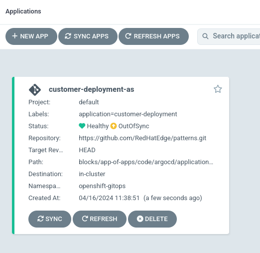
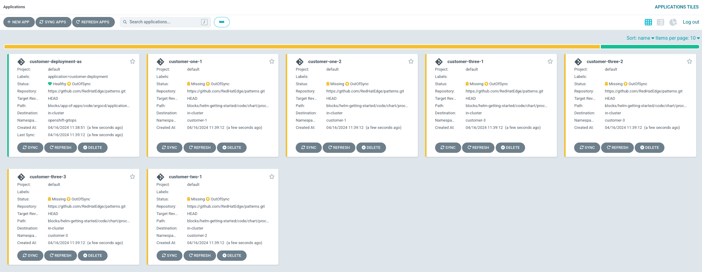
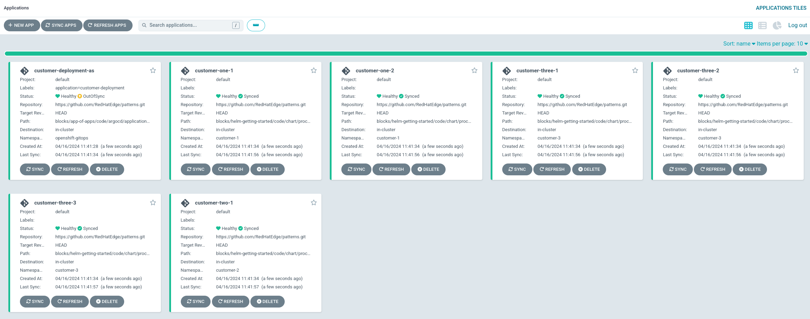

# "App of Apps" for Scaling Deployments
This block gives an example of using GitOps to scale deployments through a full automation.

## Information
**Platform:** Red Hat Device Edge with Microshift, Red Hat Openshift
**Scope:** Application deployment
**Tooling:** Red Hat OpenShift GitOps
**Pre-requisite Patterns:** [Kubernetes Core Concepts](../k8s-core-concepts/README.md), [Scaling GitOps Deployment](../scaling-gitops-deployment-k8s/README.md),[Helm Getting Started](../helm-getting-started/README.md), [GitOps Deployments](../gitops-deployment-k8s/README.md)
**Example Application**: Process Control

## Table of Contents
* [Part 1 - Using the Files Git Generator](#part-1---using-the-files-git-generator)
* [Part 2 - ApplicationSets as Applications](#part-2---applicationsets-as-applications)
* [Part 3 - Assembled Process Flow](#part-3---assembled-process-flow)
* [Part 4 - Example Deployment](#part-4---example-deployment)

## Part 1 - Using the Files Git Generator
In a previous block, the list generator was used to showcase ApplicationSet functionality, however in a production deployment it may make sense to continue to use a code repository as a source of truth for wide-ranging deployments.

The [files git generator](https://argo-cd.readthedocs.io/en/stable/operator-manual/applicationset/Generators-Git/#git-generator-files) can be configured to scan files in a code repository and template out applications.

Let's consider the following layout:
```
blocks/app-of-apps/code/customer-deployments/
├── customer-1
│   ├── deployment-1.yaml
│   └── deployment-2.yaml
├── customer-2
│   └── deployment-1.yaml
└── customer-3
    ├── deployment-1.yaml
    ├── deployment-2.yaml
    └── deployment-3.yaml
```

Here, we have 3 different customers with varying deployments for each customer, resulting in a total of 6 application deployments across them.

Then, in the ApplicationSet, we configure the git generator to search for our deployment files and template out applications:
```yaml
---
apiVersion: argoproj.io/v1alpha1
kind: ApplicationSet
metadata:
  name: process-control-multicustomer-asS
  namespace: openshift-gitops
spec:
  syncPolicy:
    syncOptions:
      - CreateNamespace=true
  goTemplate: true
  goTemplateOptions: ["missingkey=error"]
  generators:
  - git:
      repoURL: https://github.com/RedHatEdge/patterns.git
      revision: HEAD
      files:
      - path: "blocks/app-of-apps/code/customer-deployments/**/deployment-*.yaml"
  template:
    metadata:
      name: '{{displayName}}-{{deploymentNumber}}'
      annotations:
        companyName: '{{companyName}}'
        billingAddress: '{{billingAddress}}'
        billingCity: '{{billingCity}}'
        billingState: '{{billingState}}'
        billingZipCode: '{{billingZipCode}}'
        deploymentAddress: '{{deploymentAddress}}'
        deploymentCity: '{{deploymentCity}}'
        deploymentState: '{{deploymentState}}'
        deploymentZipCode: '{{deploymentZipCode}}'
        serviceProvider: '{{serviceProvider}}'
    spec:
      project: default
      syncPolicy:
        syncOptions:
          - CreateNamespace=true
      source:
        repoURL: https://github.com/RedHatEdge/patterns.git
        targetRevision: HEAD
        path: blocks/helm-getting-started/code/chart/process-control
      destination:
        server: https://kubernetes.default.svc
        namespace: '{{namespace}}'
```

What this will result in is anytime a deployment is added, removed, or modified in the code repo, the changes will be rolled out accordingly.

## Part 2 - ApplicationSets as Applications
To push the full gitops experience, we can use the same methods and tooling to roll out our ApplicationSet, ensuring proper deployment and management over time.

Let's create an application to deploy our application set:
```yaml
---
apiVersion: argoproj.io/v1alpha1
kind: Application
metadata:
  name: customer-deployment-as
  namespace: openshift-gitops
  labels:
    application: customer-deployment
spec:
  syncPolicy:
    syncOptions:
      - CreateNamespace=true
  destination:
    name: ""
    namespace: openshift-gitops
    server: https://kubernetes.default.svc
  project: default
  source:
    repoURL: https://github.com/RedHatEdge/patterns.git
    targetRevision: HEAD
    path: blocks/app-of-apps/code/argocd/applicationset
```

The path in our application references the applicationset defined above, ensuring it's managed like any other resource.

## Part 3 - Assembled Process Flow
With the building blocks built, we can review what happens in the whole process:

### Build
| Step | Description | Action Owner |
| ---- | ----------- | ------------ |
| 1. | Application of ApplicationSet deployed | Human |
| 2. | Applications deployed from ApplicationSet | ApplicationSet Controller |
| 3. | Deployments synced to clusters | OpenShift GitOps |

### Run
| Step | Description | Action Owner |
| ---- | ----------- | ------------ |
| 1. | Deployment configs are updated | Human |
| 2. | Application containing ApplicationSet is re-synced | Human/Automatic |
| 3. | Applications are synced | ApplicationSet Controller | ApplicationSet |
| 4. | Deployments synced to clusters | OpenShift GitOps |

Now, all changes to deployments are controlled by simple configuration files, which are then automatically created, destroyed, or updated according to code changes.

## Part 4 - Example Deployment
To test deployment from this repository, use the followng:
```
oc apply -f code/argocd/application/application.yaml
```

Once applied, the following phases can be observed:

### 1. Application Deploys ApplicationSet


### 2. Applications Deployed


### 3. Deployments Synced
