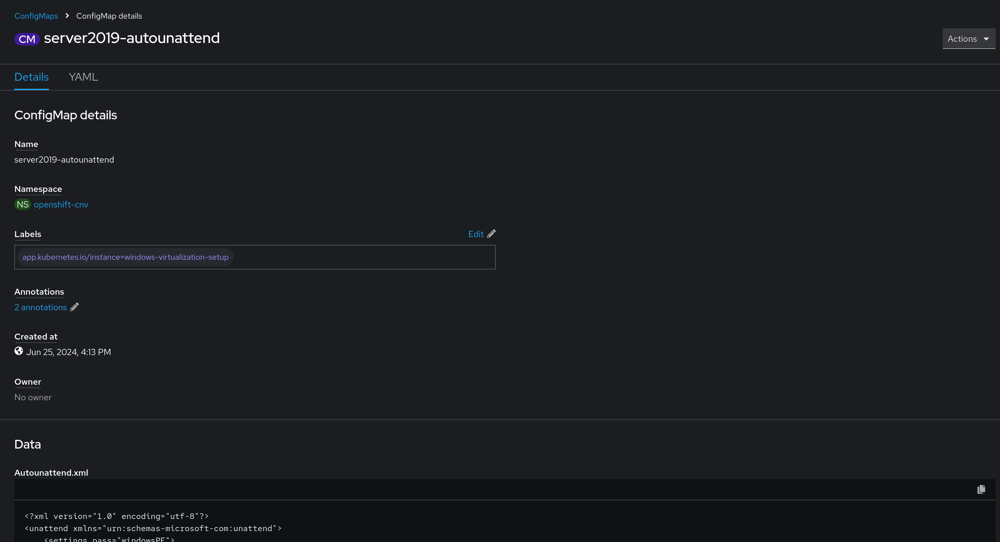

# Attaching Autounattend Files to Windows Virtual Machines
This block outlines how to attach autounattend and post-install files to a virtual machine for automatic Windows installation.

## Information
| Key | Value |
| --- | ---|
| **Platform:** | Red Hat OpenShift |
| **Scope:** | Virtualization |
| **Tooling:** | CLI, yaml, helm, GitOps |
| **Pre-requisite Blocks:** | <ul><li>[Autounattend for Windows](../autounattend-for-windows/README.md)</li></ul> |
| **Pre-requisite Patterns:** | N/A |
| **Example Application**: | N/A |

## Table of Contents
* [Part 0 - Assumptions and Network Layout](#part-0---assumptions-and-network-layout)
* [Part 1 - Attaching ConfigMaps to a Windows Virtual Machine](#part-1---attaching-configmaps-to-a-windows-virtual-machine)

## Part 0 - Assumptions and Network Layout
This block has a few key assumptions, in an attempt to keep things digestable:
1. A target platform is installed and reachable.
2. The installation content for the OpenShift virtualization operator is available.
3. Persistent storage is available, either by local or converged storage, or another storage solution.
4. Virtualization functionality is enabled in the BIOS of the underlying compute resources.

The following example subnets/VLANs will be used:
| VLAN | Subnet | Description |
| --- | ---| --- |
| 2000 | 172.16.0.0/24 | Out of band management interfaces of hardware |
| 2001 | 172.16.1.0/24 | Hyperconverged storage network |
| 2002 | 172.16.2.0/23 | Cluster primary network for ingress, load balanced services, and MetalLB pools |
| 2003 | 172.16.4.0/24 | First dedicated network for bridged virtual machines |
| 2004 | 172.16.5.0/24 | Second dedicated network for bridged virtual machines |
| 2005 | 172.16.6.0/24 | Third dedicated network for bridged virtual machines |

The following network information will be used:
| IP Address | Device | Description |
| --- | --- | --- |
| 172.16.2.1 | Router | Router IP address for subnet |
| 172.16.2.2 | Rendezvous | Rendezvous IP address for bootstrapping cluster, temporary |
| 172.16.2.2 | node0 | node0's cluster IP address |
| 172.16.2.3 | node1 | node1's cluster IP address |
| 172.16.2.4 | node1 | node2's cluster IP address |
| 172.16.2.10 | API | Cluster's API address |
| 172.16.2.11 | Ingress | Cluster's ingress address |
| 172.16.1.2 | node0-storage | node0's storage IP address |
| 172.16.1.3 | node1-storage | node1's storage IP address |
| 172.16.1.4 | node2-storage | node2's storage IP address |
| 10.1.3.106 | DNS | DNS server address |

The following cluster information will be used:
```yaml
cluster_info:
  name: example-cluster
  version: stable
  base_domain: your-domain.com
  masters: 3
  workers: 0
  api_ip: 172.16.2.10
  ingress_ip: 172.16.2.11
  host_network_cidr: 172.16.2.0/23
```

The following node information will be used:
```yaml
nodes:
  - name: node0
    cluster_link:
      mac_address: b8:ca:3a:6e:69:40
      ip_address: 172.16.2.2
  - name: node1
    cluster_link:
      mac_address: 24:6e:96:69:56:90
      ip_address: 172.16.2.3
  - name: node2
    cluster_link:
      mac_address: b8:ca:3a:6e:17:d8
      ip_address: 172.16.2.4
```

Topology:


This block also assumes virtualization has been installed and is ready, and that `autounattend.xml` and `post-install.ps1` files have been created and are added to a ConfigMap.


## Part 1 - Attaching ConfigMaps to a Windows Virtual Machine
When creating a Windows virtual machine, the ConfigMap can be specified as a volume, and a corresponding disk then attached to the virtual machine:
```yaml
devices:
    disks:
    - name: installcdrom
        cdrom:
        bus: sata
        bootOrder: 1
    - name: rootdisk
        bootOrder: 2
        disk:
        bus: virtio
    - name: virtiocontainerdisk
        cdrom:
        bus: sata
    - name: sysprepconfig # Matches the volune name below
        cdrom:
        bus: sata
networks:
- name: default
    pod: {}
volumes:
- name: installcdrom
    dataVolume:
    name: '$(tasks.copy-installer-iso.results.name)'
- name: rootdisk
    dataVolume:
    name: '$(tasks.create-install-destination.results.name)'
- name: virtiocontainerdisk
    containerDisk:
    image: quay.io/kubevirt/virtio-container-disk:v1.1.1
- name: sysprepconfig # Volume containing the ConfigMap with scripts
    sysprep: # Specifies use for sysprep purposes
    configMap:
        name: name-of-configmap-with-autounattend-and-post-install
```

These configurations, when added to the virtual machine definition, will attach another virtual CD that the operating system can access.
