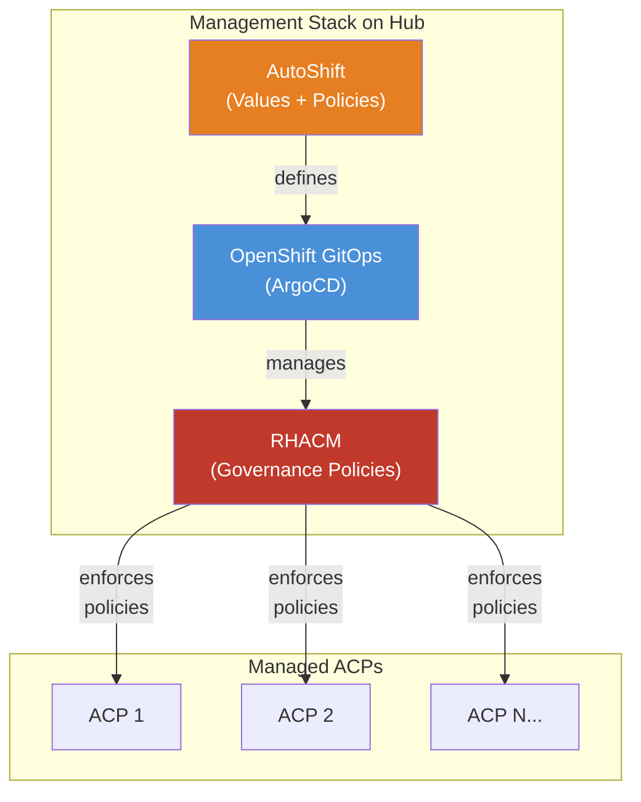
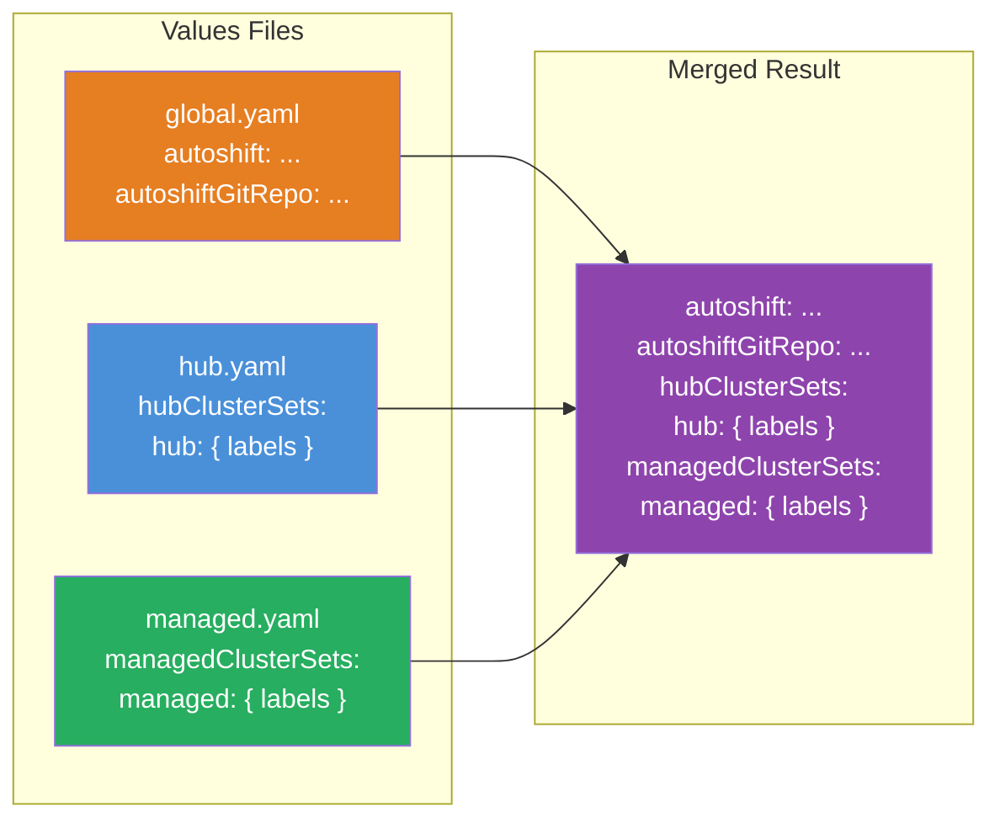
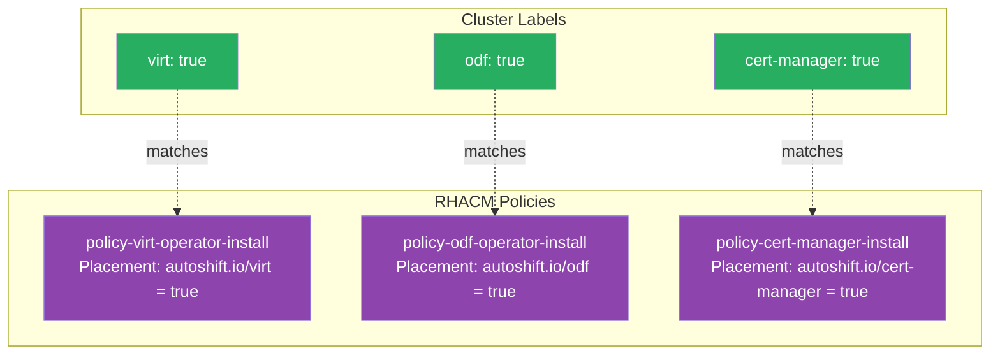
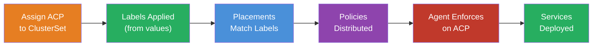

# Deploying ACP Standard Services with AutoShift
This block outlines how to use AutoShift to deploy and enforce the standard set of ACP services from a hub cluster using RHACM governance policies and OpenShift GitOps. AutoShift is an Infrastructure-as-Code (IaC) framework that provides a modular, label-driven model for managing OpenShift platform services at scale.

## Information
| Key | Value |
| --- | ---|
| **Platform:** | Red Hat OpenShift |
| **Scope:** | Fleet Management, Service Deployment |
| **Tooling:** | CLI, helm, GitOps, RHACM |
| **Pre-requisite Blocks:** | <ul><li>[Helm Getting Started](../helm-getting-started/README.md)</li><li>[Installing Operators via Yaml](../installing-operators-yaml/README.md)</li><li>[GitOps Cluster Config](../gitops-cluster-config-rbac/README.md)</li></ul> |
| **Pre-requisite Patterns:** | <ul><li>[Hub Standard Services](../../patterns/rh-hub-standard-services/README.md)</li><li>[ACP Standard Services](../../patterns/rh-acp-standard-services/README.md)</li></ul> |
| **Example Application**: | N/A |

## Table of Contents
* [Part 0 - Assumptions and Prerequisites](#part-0---assumptions-and-prerequisites)
* [Part 1 - Understanding the AutoShift Architecture](#part-1---understanding-the-autoshift-architecture)
* [Part 2 - Bootstrapping the Hub](#part-2---bootstrapping-the-hub)
* [Part 3 - Defining ACP Service Profiles](#part-3---defining-acp-service-profiles)
* [Part 4 - Deploying AutoShift](#part-4---deploying-autoshift)
* [Part 5 - Assigning ACPs to Profiles](#part-5---assigning-acps-to-profiles)
* [Part 6 - Validating Service Deployment](#part-6---validating-service-deployment)
* [Part 7 - Managing Service Lifecycle](#part-7---managing-service-lifecycle)
* [Part 8 - Real-World Example: Edge Lab Configuration](#part-8---real-world-example-edge-lab-configuration)

## Part 0 - Assumptions and Prerequisites
This block has a few key assumptions:
1. A hub OpenShift cluster (4.20+) is available and reachable.
2. The `oc` CLI and `helm` are installed locally.
3. The hub has internet access (or mirrored content is available for disconnected environments).
4. One or more ACPs are installed and reachable from the hub.
5. The user has `cluster-admin` privileges on the hub.

### What is AutoShift?
[AutoShift](https://github.com/auto-shift/autoshiftv2) is an opinionated IaC framework that uses OpenShift GitOps (ArgoCD) to declaratively manage RHACM (Red Hat Advanced Cluster Management), which then manages cluster resources and components across a fleet. It eliminates the operator toil of individually installing and configuring services on each cluster by expressing the desired service portfolio as composable values files that drive RHACM governance policies.

### How AutoShift Fits in the Stack



AutoShift sits above GitOps and RHACM, providing the configuration layer. It does not replace either tool — it composes them into a cohesive deployment pipeline.

## Part 1 - Understanding the AutoShift Architecture

### Values File Composition
AutoShift uses a composable values file pattern. Configuration is split into focused files that are combined via Helm's `-f` flag:

```
autoshift/values/
  global.yaml                        # Shared config: git repo, branch, dryRun
  clustersets/
    hub.yaml                         # Hub clusterset — full enterprise
    hub-minimal.yaml                 # Hub — minimal (GitOps + ACM only)
    hub-baremetal-sno.yaml           # Hub — baremetal single-node
    hub-baremetal-compact.yaml       # Hub — baremetal compact (3-node)
    managed.yaml                     # Managed spokes — full enterprise
    sbx.yaml                         # Managed spokes — sandbox
  clusters/
    _example.yaml                    # Per-cluster overrides
```

Helm deep-merges these files, with each file owning a unique top-level key:



### Label-Based Policy Targeting
Each service is controlled by a set of labels. When a label like `virt: true` is set on a clusterset, every cluster in that clusterset receives the virtualization policy:



### Label Precedence
Labels follow this override precedence (highest to lowest):
1. **Per-cluster overrides** (`values/clusters/my-cluster.yaml`)
2. **ClusterSet labels** (`values/clustersets/hub.yaml`)
3. **Helm chart defaults** (`values.yaml`)

### Operator Label Pattern
Each operator follows a consistent label pattern:
```yaml
# Enable the operator
<operator>: 'true'

# Subscription configuration
<operator>-subscription-name: '<package-name>'
<operator>-channel: '<channel>'
<operator>-source: 'redhat-operators'
<operator>-source-namespace: 'openshift-marketplace'

# Optional: pin to a specific version (sets manual install plan approval)
# <operator>-version: '<csv-version>'
```

### Available Policies
AutoShift ships with policies covering the full ACP service portfolio:

| Category | Policies |
| --- | --- |
| **Storage** | openshift-data-foundation, lvm, local-storage, storage-nodes |
| **Virtualization** | openshift-virtualization, mtv (migration toolkit) |
| **Networking** | nmstate, metallb |
| **Security** | advanced-cluster-security, openshift-compliance-operator, cert-manager |
| **Observability** | cluster-observability, opentelemetry, logging, loki, tempo |
| **CI/CD** | openshift-pipelines, openshift-gitops |
| **Platform** | user-workload-monitoring, openshift-image-registry, openshift-dns |
| **Lifecycle** | machine-health-checks, node-maintenance, workload-partitioning |
| **Hub** | advanced-cluster-management, cluster-install, cluster-labels |

### ACP Standard Services to AutoShift Label Mapping
The following table maps each [ACP Standard Service](../../patterns/rh-acp-standard-services/README.md) to the AutoShift labels that control its deployment. This is the reference for translating the desired ACP service portfolio into values file configuration.

| ACP Standard Service | Red Hat Product | AutoShift Enable Label | Subscription Labels | Placement Key |
| --- | --- | --- | --- | --- |
| **Certificate Management** | cert-manager Operator | `cert-manager: 'true'` | `cert-manager-channel`, `cert-manager-source`, `cert-manager-source-namespace`, `cert-manager-subscription-name` | `autoshift.io/cert-manager` |
| **Converged Storage (HA)** | OpenShift Data Foundation | `odf: 'true'` | `odf-channel`, `odf-source`, `odf-source-namespace`, `odf-subscription-name`, `odf-resource-profile` | `autoshift.io/odf` |
| **Local Storage (Non-HA)** | LVM Storage | `lvm: 'true'` | `lvm-channel`, `lvm-source`, `lvm-source-namespace`, `lvm-subscription-name` | `autoshift.io/lvm` |
| **Local Storage (Backing)** | Local Storage Operator | `local-storage: 'true'` | `local-storage-channel`, `local-storage-source`, `local-storage-source-namespace`, `local-storage-subscription-name` | `autoshift.io/local-storage` |
| **Virtualization** | OpenShift Virtualization | `virt: 'true'` | `virt-channel`, `virt-source`, `virt-source-namespace`, `virt-subscription-name` | `autoshift.io/virt` |
| **Network Interface Management** | NMState Operator | `nmstate: 'true'` | `nmstate-channel`, `nmstate-source`, `nmstate-source-namespace`, `nmstate-subscription-name` | `autoshift.io/nmstate` |
| **IT Automation** | Ansible Automation Platform | `aap: 'true'` | `aap-channel`, `aap-source`, `aap-source-namespace`, `aap-subscription-name` | `autoshift.io/aap` |
| **Declarative State Management** | OpenShift GitOps | `gitops: 'true'` | `gitops-channel`, `gitops-source`, `gitops-source-namespace`, `gitops-subscription-name` | `autoshift.io/gitops` |
| **Compliance** | Compliance Operator | `compliance: 'true'` | `compliance-channel`, `compliance-source`, `compliance-source-namespace`, `compliance-subscription-name` | `autoshift.io/compliance` |
| **Telemetry** | Red Hat build of OpenTelemetry | `opentelemetry: 'true'` | `opentelemetry-channel`, `opentelemetry-source`, `opentelemetry-source-namespace`, `opentelemetry-subscription-name` | `autoshift.io/opentelemetry` |
| **Observability** | Cluster Observability Operator | `coo: 'true'` | `coo-channel`, `coo-source`, `coo-source-namespace`, `coo-subscription-name` | `autoshift.io/coo` |

Additional supporting services available through AutoShift:

| Service | AutoShift Enable Label | Subscription Labels | Placement Key |
| --- | --- | --- | --- |
| **Logging** | `logging: 'true'` | `logging-channel`, `logging-source`, `logging-source-namespace`, `logging-subscription-name` | `autoshift.io/logging` |
| **Log Storage (Loki)** | `loki: 'true'` | `loki-channel`, `loki-source`, `loki-source-namespace`, `loki-subscription-name`, `loki-size` | `autoshift.io/loki` |
| **Distributed Tracing (Tempo)** | `tempo: 'true'` | `tempo-channel`, `tempo-source`, `tempo-source-namespace`, `tempo-subscription-name` | `autoshift.io/tempo` |
| **User Workload Monitoring** | `uwm: 'true'` | N/A (platform configuration) | `autoshift.io/uwm` |
| **Security (ACS)** | `acs: 'true'` | `acs-channel`, `acs-source`, `acs-source-namespace`, `acs-subscription-name` | `autoshift.io/acs` |
| **Storage Nodes (HA)** | `storage-nodes: '<count>'` | N/A (creates MachineSets) | N/A |
| **Node Maintenance** | `node-maintenance: 'true'` | `node-maintenance-channel`, `node-maintenance-source`, `node-maintenance-source-namespace`, `node-maintenance-subscription-name` | `autoshift.io/node-maintenance` |

Every enable label also supports an optional version pin label (`<operator>-version`) that locks the operator to a specific CSV. See [Part 7](#part-7---managing-service-lifecycle) for details.

## Part 2 - Bootstrapping the Hub
Before AutoShift can manage the fleet, two foundational services must be installed on the hub: Advanced Cluster Management and OpenShift GitOps.

> **Important:** ACM must be installed **before** OpenShift GitOps. The GitOps repo-server sources the PolicyGenerator plugin's init-container image from ACM's `multicluster-operators-hub-subscription` deployment at install time. If GitOps is installed first, the repo-server fails to start.

### Step 1: Install Advanced Cluster Management
```bash
helm upgrade --install advanced-cluster-management advanced-cluster-management
```

Wait for ACM to reach a running state:
```bash
oc get mch -A -w
```

Expected output (after ~10 minutes):
```
NAMESPACE                 NAME              STATUS    AGE     CURRENTVERSION
open-cluster-management   multiclusterhub   Running   6m28s   2.17.0
```

> On bare-metal clusters without the internal image registry, add `--set image=registry.redhat.io/openshift4/ose-cli:latest` to the helm command.

### Step 2: Install OpenShift GitOps
```bash
helm upgrade --install openshift-gitops openshift-gitops \
  -f policies/stable/openshift-gitops/values.yaml
```

Verify GitOps is running:
```bash
oc get argocd -A
```

Expected output:
```
NAMESPACE          NAME             AGE
openshift-gitops   infra-gitops     29s
```

After bootstrap, both services will be managed by AutoShift itself, creating a self-managing loop.

## Part 3 - Defining ACP Service Profiles
Service profiles are defined in values files under `autoshift/values/clustersets/`. Each file defines a clusterset with its labels, which control which policies target its member clusters.

### Global Configuration
The global configuration sets shared settings:
```yaml
# autoshift/values/global.yaml
autoshift:
  dryRun: false
  policyStandard: "Advanced Compute Platform"
  policyStandardHub: "Advanced Compute Platform Hub"

autoshiftGitRepo: https://github.com/your-org/autoshiftv2.git
autoshiftGitBranchTag: main
policyGenerator: true
```

| Key | Description |
| --- | --- |
| `dryRun` | When `true`, all policies report violations without enforcing (inform mode) |
| `policyStandard` | ACM Governance standard name for managed cluster policies |
| `policyStandardHub` | Separate standard for hub-targeting policies |
| `policyGenerator` | Must be `true` for source/Git mode; `false` for OCI mode |

### Hub Profile
The hub profile configures services running on the hub cluster itself:
```yaml
# autoshift/values/clustersets/hub.yaml
hubClusterSets:
  hub:
    labels:
      self-managed: 'true'

      # Hub infrastructure
      acm: 'true'
      acm-channel: release-2.17
      acm-source: redhat-operators
      acm-source-namespace: openshift-marketplace
      acm-subscription-name: advanced-cluster-management

      acs: 'true'
      acs-channel: stable
      acs-source: redhat-operators
      acs-source-namespace: openshift-marketplace
      acs-subscription-name: rhacs-operator

      gitops: 'true'
      gitops-channel: gitops-1.21
      gitops-source: redhat-operators
      gitops-source-namespace: openshift-marketplace
      gitops-subscription-name: openshift-gitops-operator

      cert-manager: 'true'
      cert-manager-channel: stable-v1
      cert-manager-source: redhat-operators
      cert-manager-source-namespace: openshift-marketplace
      cert-manager-subscription-name: openshift-cert-manager-operator

      cluster-install: 'true'
      htpasswd: 'true'
      remove-kubeadmin: 'true'
```

### HA Managed ACP Profile
HA clusters receive ODF for replicated storage:
```yaml
# autoshift/values/clustersets/ha-production.yaml
managedClusterSets:
  ha-production:
    labels:
      # Storage: HA (ODF)
      odf: 'true'
      odf-channel: stable-4.22
      odf-source: redhat-operators
      odf-source-namespace: openshift-marketplace
      odf-subscription-name: odf-operator
      odf-resource-profile: balanced
      storage-nodes: '3'

      # Common baseline
      virt: 'true'
      virt-channel: stable
      virt-source: redhat-operators
      virt-source-namespace: openshift-marketplace
      virt-subscription-name: kubevirt-hyperconverged

      nmstate: 'true'
      nmstate-channel: stable
      nmstate-source: redhat-operators
      nmstate-source-namespace: openshift-marketplace
      nmstate-subscription-name: kubernetes-nmstate-operator

      cert-manager: 'true'
      cert-manager-channel: stable-v1
      cert-manager-source: redhat-operators
      cert-manager-source-namespace: openshift-marketplace
      cert-manager-subscription-name: openshift-cert-manager-operator

      acs: 'true'
      acs-channel: stable
      acs-source: redhat-operators
      acs-source-namespace: openshift-marketplace
      acs-subscription-name: rhacs-operator

      logging: 'true'
      logging-channel: stable-6.5
      logging-source: redhat-operators
      logging-source-namespace: openshift-marketplace
      logging-subscription-name: cluster-logging
```

### Non-HA / Edge ACP Profile
Non-HA clusters use LVM for local storage:
```yaml
# autoshift/values/clustersets/non-ha-edge.yaml
managedClusterSets:
  non-ha-edge:
    labels:
      # Storage: Non-HA (LVM)
      lvm: 'true'
      lvm-channel: stable-4.22
      lvm-source: redhat-operators
      lvm-source-namespace: openshift-marketplace
      lvm-subscription-name: lvms-operator

      # Common baseline (same as HA)
      virt: 'true'
      virt-channel: stable
      virt-source: redhat-operators
      virt-source-namespace: openshift-marketplace
      virt-subscription-name: kubevirt-hyperconverged

      nmstate: 'true'
      nmstate-channel: stable
      nmstate-source: redhat-operators
      nmstate-source-namespace: openshift-marketplace
      nmstate-subscription-name: kubernetes-nmstate-operator

      cert-manager: 'true'
      cert-manager-channel: stable-v1
      cert-manager-source: redhat-operators
      cert-manager-source-namespace: openshift-marketplace
      cert-manager-subscription-name: openshift-cert-manager-operator

      acs: 'true'
      acs-channel: stable
      acs-source: redhat-operators
      acs-source-namespace: openshift-marketplace
      acs-subscription-name: rhacs-operator
```

### How Profiles Separate HA from Non-HA
Both profiles appear under the same ACM Governance standard. The difference is placement:

```
                 Advanced Compute Platform (standard)
                 ─────────────────────────────────────

   Shared policies (target both via matching labels):
   ┌──────────────────────────────────────────────────┐
   │  virt: true     -->  OpenShift Virtualization     │
   │  acs: true      -->  ACS SecuredCluster           │
   │  nmstate: true  -->  NMState                      │
   │  cert-manager   -->  Cert-manager                 │
   └──────────────────────────────────────────────────┘

   Storage policies (mutually exclusive by label):
   ┌───────────────────┐    ┌───────────────────┐
   │  odf: true        │    │  lvm: true        │
   │  ODF Operator     │    │  LVM Operator     │
   │  StorageCluster   │    │  LVMCluster       │
   │  Storage Nodes    │    │                   │
   │                   │    │  Targets:         │
   │  Targets:         │    │  non-ha-edge      │
   │  ha-production    │    └───────────────────┘
   └───────────────────┘
```

## Part 4 - Deploying AutoShift
AutoShift can be deployed from source (Git) or from OCI artifacts. Source mode is recommended for development and customization; OCI mode is recommended for production.

### Option A: Deploy from Source (Git)
Create an ArgoCD Application that points to the AutoShift chart in your Git repository:
```bash
export APP_NAME="autoshift"
export REPO_URL="https://github.com/your-org/autoshiftv2.git"
export TARGET_REVISION="main"

cat << EOF | oc apply -f -
apiVersion: argoproj.io/v1alpha1
kind: Application
metadata:
  name: $APP_NAME
  namespace: openshift-gitops
spec:
  destination:
    namespace: openshift-gitops
    server: https://kubernetes.default.svc
  source:
    path: autoshift
    repoURL: $REPO_URL
    targetRevision: $TARGET_REVISION
    helm:
      valueFiles:
        - values/global.yaml
        - values/clustersets/hub.yaml
        - values/clustersets/managed.yaml
      values: |-
        autoshiftGitRepo: $REPO_URL
        autoshiftGitBranchTag: $TARGET_REVISION
  project: default
  syncPolicy:
    automated:
      prune: false
      selfHeal: true
EOF
```

### Option B: Deploy from OCI (Production)
```bash
export OCI_REGISTRY="quay.io/autoshift"
export VERSION="X.Y.Z"

cat << EOF | oc apply -f -
apiVersion: argoproj.io/v1alpha1
kind: Application
metadata:
  name: autoshift
  namespace: openshift-gitops
spec:
  project: default
  source:
    repoURL: ${OCI_REGISTRY}
    chart: autoshift
    targetRevision: "${VERSION}"
    helm:
      valueFiles:
        - values/global.yaml
        - values/clustersets/hub.yaml
        - values/clustersets/managed.yaml
      values: |
        autoshiftOciRegistry: true
        autoshiftOciRepo: oci://${OCI_REGISTRY}/policies
        autoshiftOciVersion: "${VERSION}"
  destination:
    server: https://kubernetes.default.svc
    namespace: openshift-gitops
  syncPolicy:
    automated:
      prune: true
      selfHeal: true
EOF
```

### Option C: Direct Helm (Development Only)
For rapid iteration without committing to Git:
```bash
helm upgrade --install autoshift ./autoshift \
  -n openshift-gitops \
  -f autoshift/values/global.yaml \
  -f autoshift/values/clustersets/hub.yaml \
  -f autoshift/values/clustersets/managed.yaml
```

> This installs the ApplicationSet directly via Helm. Only values are read locally — policies are still pulled from Git.

## Part 5 - Assigning ACPs to Profiles
After deploying AutoShift, ACPs must be assigned to clustersets to receive their policies.

### Assign the Hub
```bash
oc label managedcluster local-cluster \
  cluster.open-cluster-management.io/clusterset=hub --overwrite
```

### Assign Managed ACPs
```bash
# HA production ACPs
oc label managedcluster acp-site-1 \
  cluster.open-cluster-management.io/clusterset=ha-production --overwrite

oc label managedcluster acp-site-2 \
  cluster.open-cluster-management.io/clusterset=ha-production --overwrite

# Non-HA edge ACPs
oc label managedcluster edge-acp-1 \
  cluster.open-cluster-management.io/clusterset=non-ha-edge --overwrite
```

Clusters can also be assigned via the RHACM console at **All Clusters > Infrastructure > Clusters > Cluster Sets**.

Once assigned, RHACM automatically matches the cluster's labels against policy placements and begins distributing the appropriate policies. The flow:



## Part 6 - Validating Service Deployment
After assigning clusters, verify that policies are being applied correctly.

### Check ArgoCD Applications
```bash
oc get applications.argoproj.io -n openshift-gitops | grep autoshift
```

Each policy becomes an ArgoCD Application:
```
autoshift-cert-manager                 Synced    Healthy
autoshift-cluster-labels               Synced    Healthy
autoshift-logging                      Synced    Healthy
autoshift-nmstate                      Synced    Healthy
autoshift-openshift-data-foundation    Synced    Healthy
autoshift-openshift-virtualization     Synced    Healthy
...
```

### Check RHACM Policy Compliance
```bash
oc get policies -A
```

Policies should show `Compliant` once the services finish deploying:
```
NAMESPACE             NAME                                 REMEDIATION   COMPLIANCE
policies-autoshift    policy-virt-operator-install          enforce       Compliant
policies-autoshift    policy-virtualization-hyperconverged  enforce       Compliant
policies-autoshift    policy-odf-operator-install           enforce       Compliant
policies-autoshift    policy-cert-manager-install           enforce       Compliant
...
```

### Check via RHACM Governance Dashboard
In the RHACM console, navigate to **Governance** and filter by standard:

```
┌──────────────────────────────────────────────┐
│              ACM Governance                  │
│                                              │
│  Filter by Standard:                         │
│  ┌────────────────────────────────────────┐  │
│  │ [x] Advanced Compute Platform         │  │
│  │ [x] Advanced Compute Platform Hub     │  │
│  └────────────────────────────────────────┘  │
│                                              │
│  Policies: 42 compliant / 0 non-compliant    │
└──────────────────────────────────────────────┘
```

### Check Individual Service on an ACP
To verify a specific service deployed correctly on a managed ACP:
```bash
# Check from the hub - view the policy status for a specific cluster
oc get policy policy-virt-operator-install \
  -n acp-site-1 -o jsonpath='{.status.compliant}'

# Or SSH/debug on the ACP itself
oc get csv -n openshift-cnv
```

## Part 7 - Managing Service Lifecycle

### Adding a New Service
To deploy a new service across the fleet, add its labels to the relevant profiles:
```yaml
managedClusterSets:
  ha-production:
    labels:
      # New service
      compliance: 'true'
      compliance-channel: stable
      compliance-source: redhat-operators
      compliance-source-namespace: openshift-marketplace
      compliance-subscription-name: compliance-operator
```

Commit and push the change. ArgoCD detects the update, re-renders the ApplicationSet, and the new policy is distributed to all matching clusters.

### Removing a Service
Remove or set the label to `false`:
```yaml
# Remove the compliance operator
compliance: 'false'
```

The policy is pruned, and the operator is removed from targeted clusters (when `autoshift.dryRun` is `false` and sync policy prune is enabled).

### Pinning an Operator Version
Add a version label to lock an operator:
```yaml
virt-version: 'kubevirt-hyperconverged.v4.19.0'
```

This sets the operator subscription to manual install plan approval. RHACM only approves the specified CSV version. To upgrade, update the version label.

### Per-Cluster Overrides
Override specific labels for individual clusters:
```yaml
# autoshift/values/clusters/special-acp.yaml
clusters:
  special-acp:
    labels:
      virt: 'false'           # Disable virtualization on this ACP
      odf-resource-profile: lean   # Use lean ODF profile
```

### Dry-Run Mode
Test changes before enforcing:
```yaml
autoshift:
  dryRun: true
```

All policies switch to inform mode — violations are reported but not remediated. Review the Governance dashboard to see what would change, then set `dryRun: false` to enforce.

## Part 8 - Real-World Example: Edge Lab Configuration
The following is a condensed version of a real-world AutoShift deployment managing a hub and a fleet of non-HA ACPs at edge sites. This example is based on a live configuration managing multiple edge ACPs with a comprehensive service portfolio.

### Hub Configuration
The hub runs the full management stack plus its own workloads:
```yaml
autoshift:
  dryRun: false
autoshiftGitBranchTag: main
autoshiftGitRepo: https://github.com/your-org/autoshiftv2.git
excludePolicies:
  - infra-nodes
  - worker-nodes
policyGenerator: true

hubClusterSets:
  default:
    labels:
      # Core management services
      acm: "true"
      acm-channel: release-2.16
      acm-source: redhat-operators
      acm-source-namespace: openshift-marketplace
      acm-subscription-name: advanced-cluster-management

      acs: "true"
      acs-channel: stable
      acs-source: redhat-operators
      acs-source-namespace: openshift-marketplace
      acs-subscription-name: rhacs-operator

      gitops: "true"
      gitops-channel: gitops-1.21
      gitops-source: redhat-operators
      gitops-source-namespace: openshift-marketplace
      gitops-subscription-name: openshift-gitops-operator

      # Security and identity
      cert-manager: "true"
      cert-manager-acme-issuer: "true"
      cert-manager-api-cert: "true"
      cert-manager-ingress-cert: "true"
      cert-manager-channel: stable-v1
      cert-manager-source: redhat-operators
      cert-manager-source-namespace: openshift-marketplace
      cert-manager-subscription-name: openshift-cert-manager-operator

      htpasswd: "true"
      remove-kubeadmin: "true"

      # Platform lifecycle
      cluster-install: "true"
      self-managed: "true"

      # Storage (hub uses ODF)
      odf-channel: stable-4.22
      odf-resource-profile: balanced
      odf-source: redhat-operators
      odf-source-namespace: openshift-marketplace
      odf-subscription-name: odf-operator

      # Observability
      coo-channel: stable
      coo-source: redhat-operators
      coo-source-namespace: openshift-marketplace
      coo-subscription-name: cluster-observability-operator

      opentelemetry-channel: stable
      opentelemetry-source: redhat-operators
      opentelemetry-source-namespace: openshift-marketplace
      opentelemetry-subscription-name: opentelemetry-product
```

### Managed Non-HA ACPs
The edge ACPs use LVM storage and a comprehensive baseline:
```yaml
managedClusterSets:
  non-ha-acps:
    labels:
      # Storage: LVM for non-HA
      lvm: "true"
      lvm-channel: stable-4.22
      lvm-default: "true"
      lvm-source: redhat-operators
      lvm-source-namespace: openshift-marketplace
      lvm-subscription-name: lvms-operator

      # Virtualization
      virt: "true"
      virt-channel: stable
      virt-source: redhat-operators
      virt-source-namespace: openshift-marketplace
      virt-subscription-name: kubevirt-hyperconverged

      # Networking
      nmstate: "true"
      nmstate-channel: stable
      nmstate-source: redhat-operators
      nmstate-source-namespace: openshift-marketplace
      nmstate-subscription-name: kubernetes-nmstate-operator

      # Security
      acs: "true"
      acs-channel: stable
      acs-source: redhat-operators
      acs-source-namespace: openshift-marketplace
      acs-subscription-name: rhacs-operator
      acs-version: rhacs-operator.v4.11.2

      # Observability
      coo-channel: stable
      coo-source: redhat-operators
      coo-source-namespace: openshift-marketplace
      coo-subscription-name: cluster-observability-operator

      logging-channel: stable-6.5
      logging-source: redhat-operators
      logging-source-namespace: openshift-marketplace
      logging-subscription-name: cluster-logging
```

Note the use of version pinning (`acs-version: rhacs-operator.v4.11.2`) on the managed ACPs — this locks ACS to a specific version while allowing other operators to follow their channels automatically.

### Deployment
This configuration is deployed with:
```bash
helm upgrade --install autoshift ./autoshift \
  -n openshift-gitops \
  -f helm-values.yaml
```

Or via an ArgoCD Application referencing the values file in Git, as shown in [Part 4](#part-4---deploying-autoshift).

After deployment, assigning an ACP to the `non-ha-acps` clusterset automatically provisions the entire service stack — LVM storage, virtualization, NMState networking, ACS security, observability, and logging — with no further per-site configuration.
