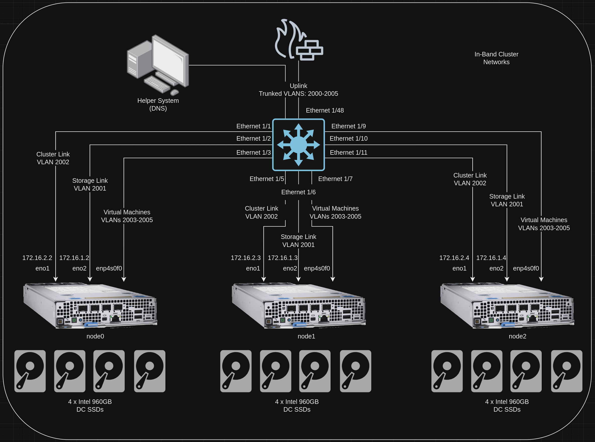
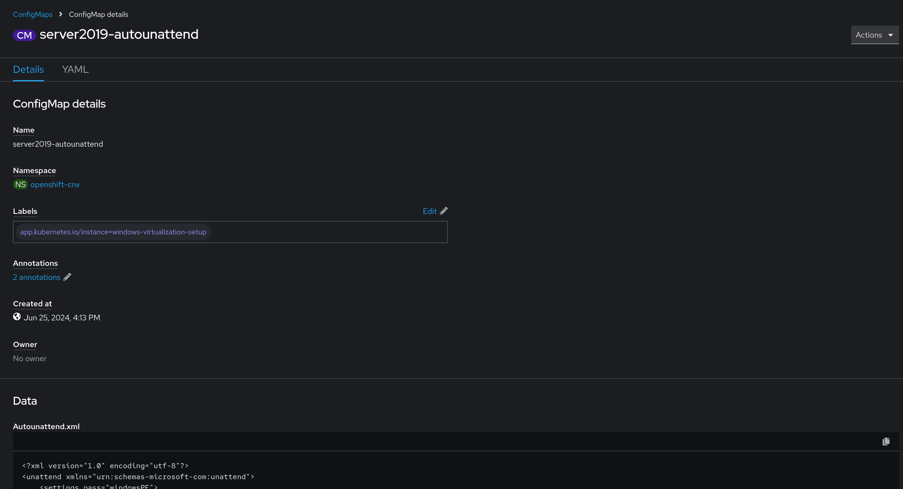

# Autounattend and Post-Install Scripts for Automated Windows Installs
This block outlines what autounattend files are, how they are structured, and including additional post-installation steps in a single automated flow.

## Information
| Key | Value |
| --- | ---|
| **Platform:** | Red Hat OpenShift |
| **Scope:** | Virtualization |
| **Tooling:** | CLI, yaml, helm, GitOps |
| **Pre-requisite Blocks:** | <ul><li>[Helm Getting Started](../helm-getting-started/README.md)</li><li>[Installing Operators via Yaml](../installing-operators-yaml/README.md)</li><li>[GitOps Cluster Config](../gitops-cluster-config-rbac/README.md)</li></ul> |
| **Pre-requisite Patterns:** | N/A |
| **Example Application**: | N/A |

## Table of Contents
* [Part 0 - Assumptions and Network Layout](#part-0---assumptions-and-network-layout)
* [Part 1 - Introduction to Autounattend Files](#part-1---introduction-to-autounattend-files)
* [Part 2 - Example Autounattend.xml File](#part-2---example-autounattendxml-file)
* [Part 3 - Example Post-Install.ps1 File](#part-3---example-post-installps1-file)
* [Part 4 - Crafting a ConfigMap](#part-4---crafting-a-configmap)
* [Part 5 - Creating a ConfigMap via the CLI](#part-5---creating-a-configmap-via-the-cli)

## Part 0 - Assumptions and Network Layout
This block has a few key assumptions, in an attempt to keep things digestable:
1. A target platform is installed and reachable.
2. The installation content for the OpenShift virtualization operator is available.
3. Persistent storage is available, either by local or converged storage, or another storage solution.
4. Virtualization functionality is enabled in the BIOS of the underlying compute resources.

The following example subnets/VLANs will be used:
| VLAN | Subnet | Description |
| --- | ---| --- |
| 2000 | 172.16.0.0/24 | Out of band management interfaces of hardware |
| 2001 | 172.16.1.0/24 | Hyperconverged storage network |
| 2002 | 172.16.2.0/23 | Cluster primary network for ingress, load balanced services, and MetalLB pools |
| 2003 | 172.16.4.0/24 | First dedicated network for bridged virtual machines |
| 2004 | 172.16.5.0/24 | Second dedicated network for bridged virtual machines |
| 2005 | 172.16.6.0/24 | Third dedicated network for bridged virtual machines |

The following network information will be used:
| IP Address | Device | Description |
| --- | --- | --- |
| 172.16.2.1 | Router | Router IP address for subnet |
| 172.16.2.2 | Rendezvous | Rendezvous IP address for bootstrapping cluster, temporary |
| 172.16.2.2 | node0 | node0's cluster IP address |
| 172.16.2.3 | node1 | node1's cluster IP address |
| 172.16.2.4 | node1 | node2's cluster IP address |
| 172.16.2.10 | API | Cluster's API address |
| 172.16.2.11 | Ingress | Cluster's ingress address |
| 172.16.1.2 | node0-storage | node0's storage IP address |
| 172.16.1.3 | node1-storage | node1's storage IP address |
| 172.16.1.4 | node2-storage | node2's storage IP address |
| 10.1.3.106 | DNS | DNS server address |

The following cluster information will be used:
```yaml
cluster_info:
  name: example-cluster
  version: stable
  base_domain: your-domain.com
  masters: 3
  workers: 0
  api_ip: 172.16.2.10
  ingress_ip: 172.16.2.11
  host_network_cidr: 172.16.2.0/23
```

The following node information will be used:
```yaml
nodes:
  - name: node0
    cluster_link:
      mac_address: b8:ca:3a:6e:69:40
      ip_address: 172.16.2.2
  - name: node1
    cluster_link:
      mac_address: 24:6e:96:69:56:90
      ip_address: 172.16.2.3
  - name: node2
    cluster_link:
      mac_address: b8:ca:3a:6e:17:d8
      ip_address: 172.16.2.4
```

Topology:


This block also assumes virtualization has been installed and is ready.

## Part 1 - Introduction to Autounattend Files
`Autounattend.xml` files are are used to automate the installation of Windows. When booted to a Windows installation image, Windows looks for these files and, if found, attempts to read them and execute the specified installation.

These files allow for a complete installation of Windows without manual intervention, making them very useful for integrating Windows installs into automated flows.


## Part 2 - Example Autounattend.xml File
`Autounattend.xml` files are broken into a few sections that specify configurations or phases of installation. A full example can be found in the `code/` directory, however a few sections will be broken down and described.

### Setting Language and Keyboard Layout
This block sets the various language settings for the operating system:
```xml
<?xml version="1.0" encoding="utf-8"?>
<unattend xmlns="urn:schemas-microsoft-com:unattend">
    <settings pass="windowsPE">
        <component xmlns:wcm="http://schemas.microsoft.com/WMIConfig/2002/State" xmlns:xsi="http://www.w3.org/2001/XMLSchema-instance" language="neutral" name="Microsoft-Windows-International-Core-WinPE" processorArchitecture="amd64" publicKeyToken="31bf3856ad364e35" versionScope="nonSxS">
            <SetupUILanguage>
                <UILanguage>en-US</UILanguage>
            </SetupUILanguage>
            <InputLocale>en-US</InputLocale>
            <SystemLocale>en-US</SystemLocale>
            <UILanguage>en-US</UILanguage>
            <UILanguageFallback>en-US</UILanguageFallback>
            <UserLocale>en-US</UserLocale>
        </component>
```

### Setting the Driver Path
This block sets the path to drivers to be used during install, which is located on the installation ISO:
```xml
        <component xmlns:wcm="http://schemas.microsoft.com/WMIConfig/2002/State" xmlns:xsi="http://www.w3.org/2001/XMLSchema-instance" language="neutral" name="Microsoft-Windows-PnpCustomizationsWinPE" processorArchitecture="amd64" publicKeyToken="31bf3856ad364e35" versionScope="nonSxS">
            <DriverPaths>
                <PathAndCredentials wcm:action="add" wcm:keyValue="1">
                    <Path>E:\amd64\2k19\</Path>
                </PathAndCredentials>
            </DriverPaths>
        </component>
```

### Disk Partitioning
This block creates partitions on the installation disk to be used for installation:
```xml
        <component xmlns:wcm="http://schemas.microsoft.com/WMIConfig/2002/State" xmlns:xsi="http://www.w3.org/2001/XMLSchema-instance" language="neutral" name="Microsoft-Windows-Setup" processorArchitecture="amd64" publicKeyToken="31bf3856ad364e35" versionScope="nonSxS">
            <DiskConfiguration>
                <Disk wcm:action="add">
                    <CreatePartitions>
                        <CreatePartition wcm:action="add">
                            <Order>1</Order>
                            <Type>Primary</Type>
                            <Size>100</Size>
                        </CreatePartition>
                        <CreatePartition wcm:action="add">
                            <Extend>true</Extend>
                            <Order>2</Order>
                            <Type>Primary</Type>
                        </CreatePartition>
                    </CreatePartitions>
                    <ModifyPartitions>
                        <ModifyPartition wcm:action="add">
                            <Active>true</Active>
                            <Format>NTFS</Format>
                            <Label>System Reserved</Label>
                            <Order>1</Order>
                            <PartitionID>1</PartitionID>
                            <TypeID>0x27</TypeID>
                        </ModifyPartition>
                        <ModifyPartition wcm:action="add">
                            <Active>true</Active>
                            <Format>NTFS</Format>
                            <Label>OS</Label>
                            <Letter>C</Letter>
                            <Order>2</Order>
                            <PartitionID>2</PartitionID>
                        </ModifyPartition>
                    </ModifyPartitions>
                    <DiskID>0</DiskID>
                    <WillWipeDisk>true</WillWipeDisk>
                </Disk>
            </DiskConfiguration>
```

### Image Install Settings
These settings select what image to install (Standard/Datacenter, etc) and what partition to install to:
```xml
            <ImageInstall>
                <OSImage>
                    <InstallFrom>
                        <MetaData wcm:action="add">
                            <Key>/IMAGE/NAME</Key>
                            <Value>Windows Server 2019 SERVERSTANDARD</Value>
                        </MetaData>
                    </InstallFrom>
                    <InstallTo>
                        <DiskID>0</DiskID>
                        <PartitionID>2</PartitionID>
                    </InstallTo>
                </OSImage>
            </ImageInstall>
```

### Installation User Data
These settings accept the EULA as the Administrator user:
```xml
            <UserData>
                <ProductKey>
                    <WillShowUI>OnError</WillShowUI>
                </ProductKey>
                <AcceptEula>true</AcceptEula>
                <FullName>Administrator</FullName>
                <Organization></Organization>
            </UserData>
        </component>
    </settings>
```

### Configuration Settings
This section modifies some settings of the OS:
```xml
    <settings pass="offlineServicing">
        <component name="Microsoft-Windows-LUA-Settings" processorArchitecture="amd64" publicKeyToken="31bf3856ad364e35" language="neutral" versionScope="nonSxS" xmlns:wcm="http://schemas.microsoft.com/WMIConfig/2002/State" xmlns:xsi="http://www.w3.org/2001/XMLSchema-instance">
            <EnableLUA>false</EnableLUA>
        </component>
    </settings>
    <settings pass="generalize">
        <component name="Microsoft-Windows-Security-SPP" processorArchitecture="amd64" publicKeyToken="31bf3856ad364e35" language="neutral" versionScope="nonSxS" xmlns:wcm="http://schemas.microsoft.com/WMIConfig/2002/State" xmlns:xsi="http://www.w3.org/2001/XMLSchema-instance">
            <SkipRearm>1</SkipRearm>
        </component>
    </settings>
    <settings pass="specialize">
        <component name="Microsoft-Windows-International-Core" processorArchitecture="amd64" publicKeyToken="31bf3856ad364e35" language="neutral" versionScope="nonSxS" xmlns:wcm="http://schemas.microsoft.com/WMIConfig/2002/State" xmlns:xsi="http://www.w3.org/2001/XMLSchema-instance">
            <InputLocale>0409:00000409</InputLocale>
            <SystemLocale>en-US</SystemLocale>
            <UILanguage>en-US</UILanguage>
            <UILanguageFallback>en-US</UILanguageFallback>
            <UserLocale>en-US</UserLocale>
        </component>
        <component name="Microsoft-Windows-Security-SPP-UX" processorArchitecture="amd64" publicKeyToken="31bf3856ad364e35" language="neutral" versionScope="nonSxS" xmlns:wcm="http://schemas.microsoft.com/WMIConfig/2002/State" xmlns:xsi="http://www.w3.org/2001/XMLSchema-instance">
            <SkipAutoActivation>true</SkipAutoActivation>
        </component>
        <component name="Microsoft-Windows-SQMApi" processorArchitecture="amd64" publicKeyToken="31bf3856ad364e35" language="neutral" versionScope="nonSxS" xmlns:wcm="http://schemas.microsoft.com/WMIConfig/2002/State" xmlns:xsi="http://www.w3.org/2001/XMLSchema-instance">
            <CEIPEnabled>0</CEIPEnabled>
        </component>
    </settings>
```

### Out-of-the-Box Experience Settings
These settings are passed to the out-of-the-box experience, which happens after the system finishes installing to disk and reboots. This section is what calls the `post-install.ps1` script.
```xml
    <settings pass="oobeSystem">
        <component name="Microsoft-Windows-Shell-Setup" processorArchitecture="amd64" publicKeyToken="31bf3856ad364e35" language="neutral" versionScope="nonSxS" xmlns:wcm="http://schemas.microsoft.com/WMIConfig/2002/State" xmlns:xsi="http://www.w3.org/2001/XMLSchema-instance">
            <AutoLogon>
                <Password>
                    <Value>ExamplePasswordHere</Value>
                    <PlainText>true</PlainText>
                </Password>
                <Enabled>true</Enabled>
                <Username>Administrator</Username>
            </AutoLogon>
            <OOBE>
                <HideEULAPage>true</HideEULAPage>
                <HideOEMRegistrationScreen>true</HideOEMRegistrationScreen>
                <HideOnlineAccountScreens>true</HideOnlineAccountScreens>
                <HideWirelessSetupInOOBE>true</HideWirelessSetupInOOBE>
                <NetworkLocation>Work</NetworkLocation>
                <SkipUserOOBE>true</SkipUserOOBE>
                <SkipMachineOOBE>true</SkipMachineOOBE>
                <ProtectYourPC>3</ProtectYourPC>
            </OOBE>
            <UserAccounts>
                <LocalAccounts>
                    <LocalAccount wcm:action="add">
                        <Password>
                            <Value>ExamplePasswordHere</Value>
                            <PlainText>true</PlainText>
                        </Password>
                        <Description></Description>
                        <DisplayName>Administrator</DisplayName>
                        <Group>Administrators</Group>
                        <Name>Administrator</Name>
                    </LocalAccount>
                </LocalAccounts>
            </UserAccounts>
            <RegisteredOrganization></RegisteredOrganization>
            <RegisteredOwner>Administrator</RegisteredOwner>
            <DisableAutoDaylightTimeSet>false</DisableAutoDaylightTimeSet>
            <FirstLogonCommands>
                <SynchronousCommand wcm:action="add">
                    <Order>1</Order>
                    <Description>Run post-install tasks</Description>
                    <RequiresUserInput>false</RequiresUserInput>
                    <CommandLine>powershell -ExecutionPolicy Bypass -NoProfile F:\post-install.ps1</CommandLine>
                </SynchronousCommand>
            </FirstLogonCommands>
            <TimeZone>Central Standard Time</TimeZone>
        </component>
    </settings>
</unattend>
```

## Part 3 - Example post-install.ps1 File
To further customize the operating system after the installation has been finished, and tell the OS to generalize and shut down, a PowerShell script is called from the `autounattend.xml` file. An example file will be discribed here, however the full script can be found in the `code/` directory.

### Enable Trace Level 1 for Debugging
At the top of the script, the `Set-PSDebug` cmdlet can be used to enable a deeper level of debugging during execution of the script:
```powershell
Set-PSDebug -Trace 1
```

### Basic Configurations
The first block handles some basic configurations on the system:
```powershell
#####################################
# Perform some basic configurations #
#####################################

Write-Host "Performing some basic configurations"
# Configure legacy control panel view
Start-Process reg -Wait -ArgumentList 'add "HKEY_CURRENT_USER\Software\Microsoft\Windows\CurrentVersion\Explorer\ControlPanel" /v StartupPage /t REG_DWORD /d 1 /f'
# Modify control panel icon size
Start-Process reg -Wait -ArgumentList 'add "HKEY_CURRENT_USER\Software\Microsoft\Windows\CurrentVersion\Explorer\ControlPanel" /v AllItemsIconView /t REG_DWORD /d 0 /f'
# Remove automatic admin login
Start-Process reg -Wait -ArgumentList 'add "HKEY_LOCAL_MACHINE\Software\Microsoft\Windows NT\CurrentVersion\Winlogon" /v AutoAdminLogon /t REG_SZ /d 0 /f'
# Disable Windows SmartScreen Filter
Start-Process reg -Wait -ArgumentList 'add "HKEY_LOCAL_MACHINE\SOFTWARE\Policies\Microsoft\Windows\System" /v EnableSmartScreen /t REG_DWORD /d 0 /f'
# Prevent password expiration
Start-Process wmic -Wait -ArgumentList 'useraccount where name="Administrator" set PasswordExpires=false'
```

### Installing VirtIO Drivers and Guest Agent
The next section installs the VirtIO drivers from a mounted CD, and also installs the QEMU guest agent. These are handled by calling the respective installers with appropriate flags:

```powershell
Write-Host "Installing additional drivers"
# Install all remaining VirtIO drivers
Start-Process msiexec -Wait -ArgumentList "/i E:\virtio-win-gt-x64.msi /qn /passive /norestart ADDLOCAL=FE_balloon_driver,FE_network_driver,FE_vioinput_driver,FE_viorng_driver,FE_vioscsi_driver,FE_vioserial_driver,FE_viostor_driver,FE_viofs_driver,FE_viogpudo_driver"
# Install qemu Guest Agent
Start-Process msiexec -Wait -ArgumentList "/i E:\guest-agent\qemu-ga-x86_64.msi /qn /passive /norestart"
```

### Enabling Remote Desktop and Simple Auth
This section enables RDP, allows it through the Windows firewall, and also disables the requirements for network level authentication, falling back to local authentication. This can be re-enabled later if desired, for example, if the virtual machine is joined to a domain.
```powershell
Write-Host "Enabling RDP"
# Enable RDP
Set-ItemProperty -Path 'HKLM:\System\CurrentControlSet\Control\Terminal Server' -name "fDenyTSConnections" -value 0
# Disable NLA
Set-ItemProperty -Path 'HKLM:\System\CurrentControlSet\Control\Terminal Server\WinStations\RDP-Tcp' -name "UserAuthentication" -value 0
# Open firewall ports
Enable-NetFirewallRule -DisplayGroup "Remote Desktop"
```

### Enabling WinRM for Ansible
This next section enables WinRM, allows it through the Windows firewall, and sets it up for local authentication. This is useful for enabling Ansible to begin automating against the system as soon as it's provisioned:
```powershell
####################################
#     Enable WinRM for Ansible     #
####################################

# Enable PSRemoting
Write-Host "Enabling WinRM service"
Enable-PSRemoting -Force

# Allow unencrypted traffic
Write-Host "Allowing unencrypted traffic"
Set-Item WSMan:\localhost\Service\AllowUnencrypted -Value $true

# Enable Basic Authentication
Write-Host "Enabling Basic Authentication"
Set-Item WSMan:\localhost\Service\Auth\Basic -Value $true

# Set the WinRM service to start automatically
Write-Host "Set WinRM service to start automatically"
Set-Service -Name WinRM -StartupType Automatic

# Start the WinRM service
Write-Host "Start WinRM service"
Start-Service -Name WinRM

# Configure firewall to allow WinRM traffic
Write-Host "Configuring firewall"
netsh advfirewall firewall add rule name="Allow WinRM HTTP" dir=in action=allow protocol=TCP localport=5985

# Dump listener config
Write-Host "Dump listener config"
winrm enumerate winrm/config/listener

# Let output be confirmed
Start-Sleep -s 10
```

### Finalize and Shutdown
To allow for creation of a template, rename the autounattend file, eject the disk containing the autounattend and post-install scripts, and shut the system down.
```powershell
#####################################
# Finalize installation via sysprep #
#####################################

Write-Host "Finalizaing"
# Prevent picking up old autounattend.xml
mv C:\Windows\Panther\unattend.xml C:\Windows\Panther\unattend.install.xml
# Eject disk to prevent additional sysprep pickup
(New-Object -COM Shell.Application).NameSpace(17).ParseName('F:').InvokeVerb('Eject')
# Just shut down
Start-Process shutdown -ArgumentList '/s /f /t 5'
```

## Part 4 - Crafting a ConfigMap
The files above should be stored in a code repository, and can be created on OpenShift by containing them in a ConfigMap.

ConfigMaps can contain entire files, and can contain multiple files by using key/value pairs.

For example, a ConfigMap containing the files above would be structured as so:
```yaml
---
apiVersion: v1
kind: ConfigMap
metadata:
  name: server2019-autounattend
  namespace: openshift-cnv
  annotations:
    argocd.argoproj.io/sync-wave: "1"
data:
  Autounattend.xml: |
    <?xml version="1.0" encoding="utf-8"?>
    <unattend xmlns="urn:schemas-microsoft-com:unattend">
        <settings pass="windowsPE">
        ...

  post-install.ps1: |-
    Set-PSDebug -Trace 1
    #####################################
    # Perform some basic configurations #
    #####################################

    Write-Host "Performing some basic configurations"
    ...
```

> Note:
>
> The full config files have been shortened for clarity.

## Part 5 - Creating a ConfigMap via the CLI
With the ConfigMap created, the yaml file can be uploaded to OpenShift using the CLI:
```
oc apply -f code/server2019/configmap.yaml
```

This will create the ConfigMap:

