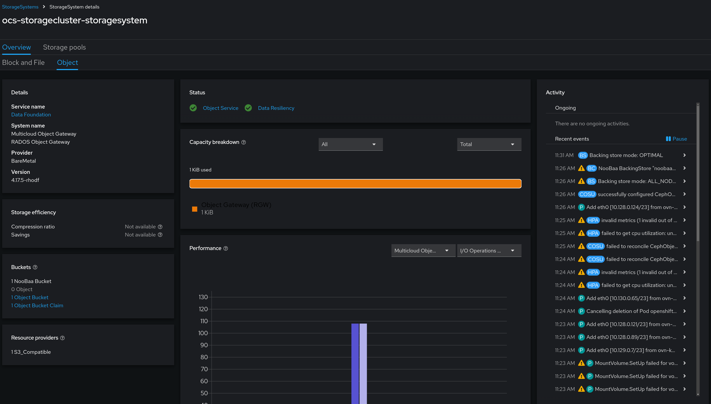

# Backing the Internal Registry with Persistent Storage on an HA ACP
This block outlines how to configure the internal registry to use persistent storage provided by ODF, specifically, object storage, to allow for retention of images. In addition, the internal registry will be exposed for consumption during platform upgrades, and optionally for external consumption.

## Information
| Key | Value |
| --- | ---|
| **Platform:** | Red Hat OpenShift |
| **Scope:** | N/A |
| **Tooling:** | CLI, yaml, helm, GitOps |
| **Pre-requisite Blocks:** | <ul><li>[K8s Core Concepts](../k8s-core-concepts/README.md)</li><li>[Getting Started with Helm](../helm-getting-started/README.md)</li><li>[Deploying GitOps Functionality](../gitops-deployment-k8s/README.md)</li></ul> |
| **Pre-requisite Patterns:** | N/A |
| **Example Application**: | N/A |

## Table of Contents
* [Part 0 - Assumptions and Network Layout](#part-0---assumptions-and-network-layout)
* [Part 1 - Reviewing Existing Deployment Automation](#part-1---reviewing-existing-deployment-automation)
* [Part 2 - Reviewing Available Customizations](#part-2---reviewing-available-customizations)
* [Part 3 - Deploying the Chart](#part-3---deploying-the-chart)


## Part 0 - Assumptions and Network Layout
This block has a few key assumptions, in an attempt to keep things digestable:
1. A target platform is installed and reachable.
2. Persistent storage is available, either by converged storage (ODF), or another storage solution is available that provides object storage.

The following example subnets/VLANs will be used:
| VLAN | Subnet | Description |
| --- | ---| --- |
| 2000 | 172.16.0.0/24 | Out of band management interfaces of hardware |
| 2001 | 172.16.1.0/24 | Hyperconverged storage network |
| 2002 | 172.16.2.0/23 | Cluster primary network for ingress, load balanced services, and MetalLB pools |
| 2003 | 172.16.4.0/24 | First dedicated network for bridged virtual machines |
| 2004 | 172.16.5.0/24 | Second dedicated network for bridged virtual machines |
| 2005 | 172.16.6.0/24 | Third dedicated network for bridged virtual machines |

The following network information will be used:
| IP Address | Device | Description |
| --- | --- | --- |
| 172.16.2.1 | Router | Router IP address for subnet |
| 172.16.2.2 | Rendezvous | Rendezvous IP address for bootstrapping cluster, temporary |
| 172.16.2.2 | node0 | node0's cluster IP address |
| 172.16.2.3 | node1 | node1's cluster IP address |
| 172.16.2.4 | node1 | node2's cluster IP address |
| 172.16.2.10 | API | Cluster's API address |
| 172.16.2.11 | Ingress | Cluster's ingress address |
| 172.16.1.2 | node0-storage | node0's storage IP address |
| 172.16.1.3 | node1-storage | node1's storage IP address |
| 172.16.1.4 | node2-storage | node2's storage IP address |
| 10.1.3.106 | DNS | DNS server address |

The following cluster information will be used:
```yaml
cluster_info:
  name: example-cluster
  version: stable
  base_domain: your-domain.com
  masters: 3
  workers: 0
  api_ip: 172.16.2.10
  ingress_ip: 172.16.2.11
  host_network_cidr: 172.16.2.0/23
```

The following node information will be used:
```yaml
nodes:
  - name: node0
    cluster_link:
      mac_address: b8:ca:3a:6e:69:40
      ip_address: 172.16.2.2
  - name: node1
    cluster_link:
      mac_address: 24:6e:96:69:56:90
      ip_address: 172.16.2.3
  - name: node2
    cluster_link:
      mac_address: b8:ca:3a:6e:17:d8
      ip_address: 172.16.2.4
```

Topology:


This block also assumes that:
- the converged storage (ODF) service has been installed and is ready for consumption

- the declarative state management (argoCD) service has been installed and is ready for consumption

## Part 1 - Reviewing Existing Deployment Automation
The configuration of the internal registry has been captured and automated as a [Helm chart](https://github.com/RedHatEdge/acp-operations/tree/main/charts/internal-registry-config), allowing for rapid rollout.

This chart is intended to be leveraged with the declarative state management service (ArgoCD), which uses a gitops methodology to roll out desired changes.

## Part 2 - Reviewing Available Customizations
The chart contains an [example values file](https://github.com/RedHatEdge/acp-operations/blob/main/charts/internal-registry-config/example-values.yaml) that can be customized, if desired. The contents are repeated here for informational purposes only.

```yaml
---
bucketClass: ocs-storagecluster-ceph-rgw
useServiceCA: true

openshiftToolsImage: 'quay.io/openshift-release-dev/ocp-v4.0-art-dev@sha256:535ce24b5f1894d2a07bfa7eed7ad028ffde0659693f2a571ac4712a21cd028c'

resources:
  requests:
    memory: 8Gi
    cpu: '4'
  limits:
    memory: 8Gi
    cpu: '4'
```

Review the documentation in the chart's [readme](https://github.com/RedHatEdge/acp-operations/blob/main/charts/internal-registry-config/README.md#required-values) to customize the deployment.

## Part 3 - Deploying the Chart
The chart leverages the sync wave functionality in the declarative state management (ArgoCD) service. To help accomplish this, a ["meta" chart](https://github.com/RedHatEdge/acp-operations/blob/main/charts/internal-registry-config-app/README.md) has been created that creates the appropriate resources so ArgoCD handles the rollout.

Review the meta chart's [readme](https://github.com/RedHatEdge/acp-operations/blob/main/charts/internal-registry-config-app/README.md) for further documentation.

Once the rollout is executed, a new application tile will appear in ArgoCD, and the registry configuration will be handled by the tooling.

