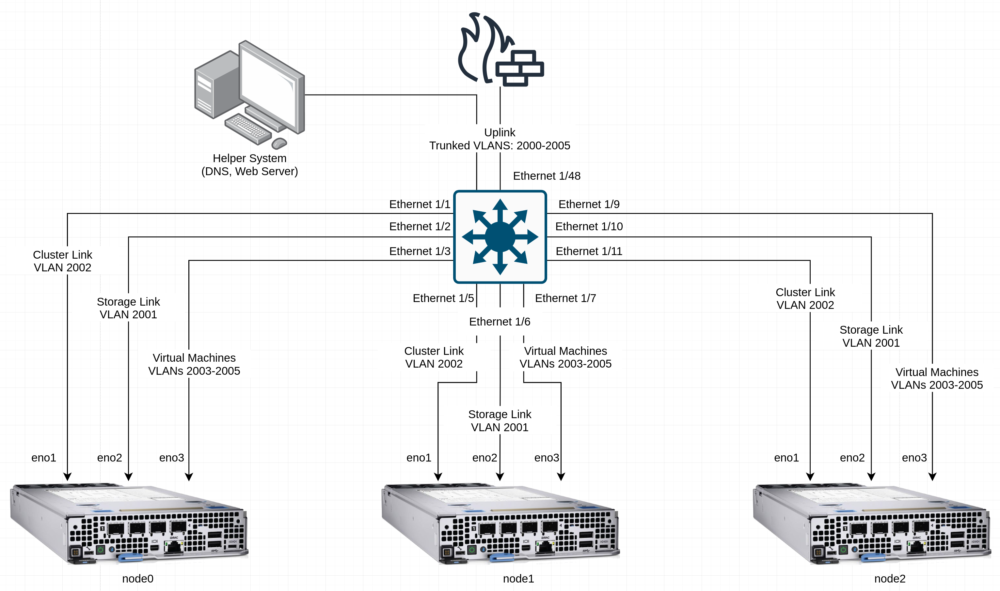
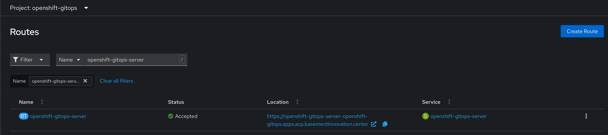
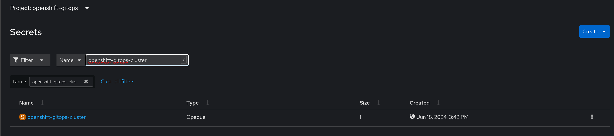
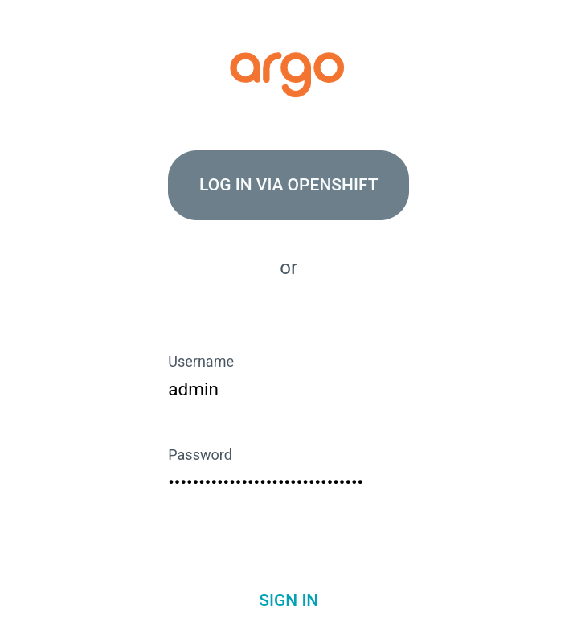

# Bootstrapping GitOps Functionality
This block outlines how to get gitops functionality ready and running.

## Information
| Key | Value |
| --- | ---|
| **Platform:** | Red Hat OpenShift |
| **Scope:** | Bootstrapping |
| **Tooling:** | CLI, yaml, helm |
| **Pre-requisite Blocks:** | <ul><li>[Helm Getting Started](../helm-getting-started/README.md)</li><li>[Installing Operators via Yaml](../installing-operators-yaml/README.md)</li><li>[GitOps Cluster Config](../gitops-cluster-config-rbac/README.md)</li></ul> |
| **Pre-requisite Patterns:** | N/A |
| **Example Application**: | N/A |

## Table of Contents
* [Part 0 - Assumptions and Network Layout](#part-0---assumptions-and-network-layout)
* [Part 1 - Installing via Operator](#part-1---installing-via-operator)
* [Part 2 - Accessing ArgoCD](#part-2---accessing-argocd)

## Part 0 - Assumptions and Network Layout
This block has a few key assumptions, in an attempt to keep things digestable:
1. A target platform is installed and reachable.
2. The installation content for Red Hat OpenShift GitOps is available.

The following example subnets/VLANs will be used:
| VLAN | Subnet | Description |
| --- | ---| --- |
| 2000 | 172.16.0.0/24 | Out of band management interfaces of hardware |
| 2001 | 172.16.1.0/24 | Hyperconverged storage network |
| 2002 | 172.16.2.0/23 | Cluster primary network for ingress, load balanced services, and MetalLB pools |
| 2003 | 172.16.4.0/24 | First dedicated network for bridged virtual machines |
| 2004 | 172.16.5.0/24 | Second dedicated network for bridged virtual machines |
| 2005 | 172.16.6.0/24 | Third dedicated network for bridged virtual machines |

The following network information will be used:
| IP Address | Device | Description |
| --- | --- | --- |
| 172.16.2.1 | Router | Router IP address for subnet |
| 172.16.2.2 | Rendezvous | Rendezvous IP address for bootstrapping cluster, temporary |
| 172.16.2.2 | node0 | node0's cluster IP address |
| 172.16.2.3 | node1 | node1's cluster IP address |
| 172.16.2.4 | node1 | node2's cluster IP address |
| 172.16.2.10 | API | Cluster's API address |
| 172.16.2.11 | Ingress | Cluster's ingress address |
| 10.1.3.106 | DNS | DNS server address

The following cluster information will be used:
```yaml
cluster_info:
  name: example-cluster
  version: stable
  base_domain: your-domain.com
  masters: 3
  workers: 0
  api_ip: 172.16.2.10
  ingress_ip: 172.16.2.11
  host_network_cidr: 172.16.2.0/23
```

The following node information will be used:
```yaml
nodes:
  - name: node0
    cluster_link:
      mac_address: b8:ca:3a:6e:69:40
      ip_address: 172.16.2.2
  - name: node1
    cluster_link:
      mac_address: 24:6e:96:69:56:90
      ip_address: 172.16.2.3
  - name: node2
    cluster_link:
      mac_address: b8:ca:3a:6e:17:d8
      ip_address: 172.16.2.4
```

Topology:


## Part 1 - Installing via Operator
Red Hat OpenShift GitOps is delivered to clusters via an operator, and can be installed using helm. The following helm templates can be used to trigger the install.

### Namespace
```yaml
---
apiVersion: v1
kind: Namespace
metadata:
  name: openshift-gitops-operator
  labels:
    openshift.io/cluster-monitoring: 'true'
```

### Operator Group
```yaml
---
apiVersion: operators.coreos.com/v1
kind: OperatorGroup
metadata:
  name: openshift-gitops-operator
  namespace: openshift-gitops-operator
spec:
  upgradeStrategy: Default
```

### Subscription
```yaml
---
apiVersion: operators.coreos.com/v1alpha1
kind: Subscription
metadata:
  name: openshift-gitops-operator
  namespace: openshift-gitops-operator
spec:
  channel: latest
  installPlanApproval: Automatic
  name: openshift-gitops-operator
  source: redhat-operators
  sourceNamespace: openshift-marketplace
```

### Cluster Role Binding
Refer to [this block](../gitops-cluster-config-rbac/README.md) for more details.
```yaml
---
kind: ClusterRoleBinding
apiVersion: rbac.authorization.k8s.io/v1
metadata:
  name: openshift-gitops-admin
subjects:
  - kind: ServiceAccount
    name: gitops-service-cluster
    namespace: openshift-gitops
  - kind: ServiceAccount
    name: openshift-gitops-applicationset-controller
    namespace: openshift-gitops
  - kind: ServiceAccount
    name: openshift-gitops-argocd-application-controller
    namespace: openshift-gitops
  - kind: ServiceAccount
    name: openshift-gitops-argocd-dex-server
    namespace: openshift-gitops
  - kind: ServiceAccount
    name: openshift-gitops-argocd-grafana
    namespace: openshift-gitops
  - kind: ServiceAccount
    name: openshift-gitops-argocd-redis
    namespace: openshift-gitops
  - kind: ServiceAccount
    name: openshift-gitops-argocd-redis-ha
    namespace: openshift-gitops
  - kind: ServiceAccount
    name: openshift-gitops-argocd-server
    namespace: openshift-gitops
  - kind: ServiceAccount
    name: openshift-gitops-operator-controller-manager
    namespace: openshift-operators
roleRef:
  apiGroup: rbac.authorization.k8s.io
  kind: ClusterRole
  name: cluster-admin
```

## Part 2 - Accessing ArgoCD
After a few minutes, the operator will install an instance of ArgoCD that can be used to deploy applications and drive platform configuration changes, if desired.

The created instance will come with a route and a secret that contains the admin password, allowing access:

### Route


### Secret


### WebUI Login
