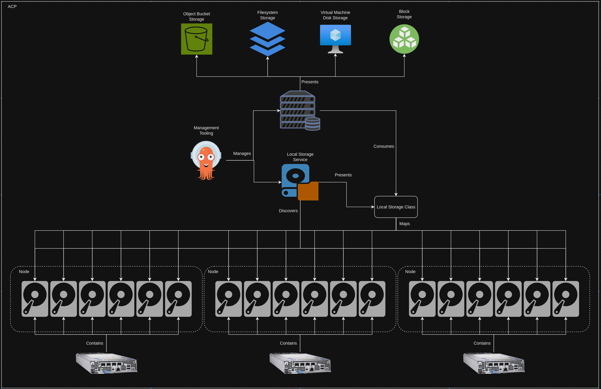
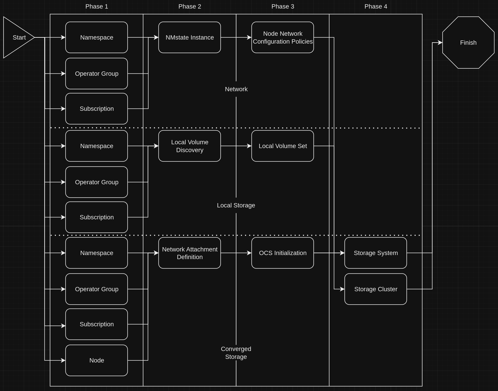
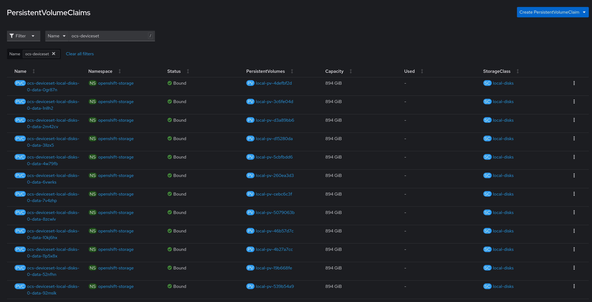
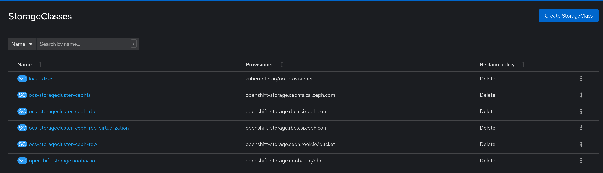
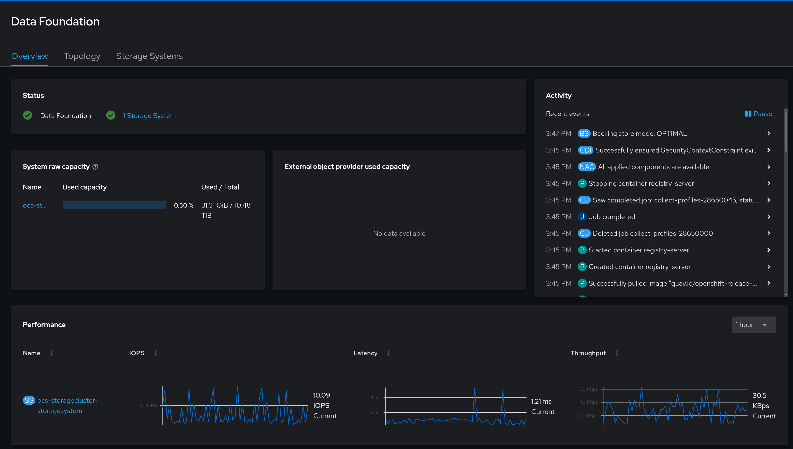
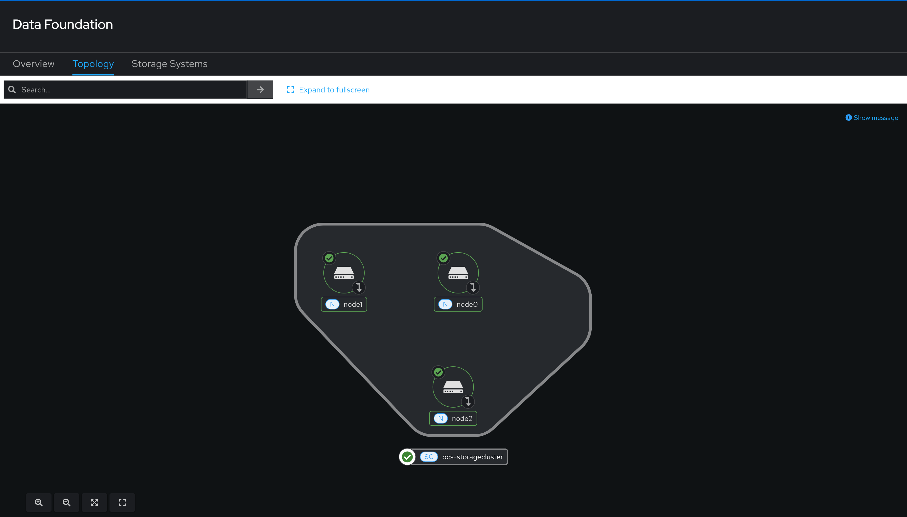

# Converged Storage on an ACP using OpenShift Data Foundation
This block outlines how to install and configure OpenShift Data Foundation to provide converged storage.

## Information
| Key | Value |
| --- | ---|
| **Platform:** | Red Hat OpenShift |
| **Scope:** | Bootstrapping |
| **Tooling:** | CLI, yaml, helm, GitOps |
| **Pre-requisite Blocks:** | <ul><li>[Helm Getting Started](../helm-getting-started/README.md)</li><li>[Installing Operators via Yaml](../installing-operators-yaml/README.md)</li><li>[GitOps Cluster Config](../gitops-cluster-config-rbac/README.md)</li><li>[ACP Network Configuration](../acp-network-configuration/README.md)</li><li>[Local Storage for Converged Storage](../local-storage-for-converged-storage/README.md)</li></ul> |
| **Pre-requisite Patterns:** | N/A |
| **Example Application**: | N/A |

## Table of Contents
* [Part 0 - Assumptions and Network Layout](#part-0---assumptions-and-network-layout)
* [Part 1 - Defining Configuration](#part-1---defining-configuration)
* [Part 2 - Installing the OpenShift Data Foundation Operator](#part-2---installing-the-openshift-data-foundation-operator)
* [Part 3 - Network Attachment Definition](#part-3---network-attachment-definition)
* [Part 4 - OCS Initialization](#part-4---ocs-initialization)
* [Part 5 - Storage System and Storage Cluster](#part-5---storage-system-and-storage-cluster)
* [Part 6 - Investigating Converged Storage](#part-6---investigating-converged-storage)

## Part 0 - Assumptions and Network Layout
This block has a few key assumptions, in an attempt to keep things digestable:
1. A target platform is installed and reachable.
2. The installation content for the local storage operator is available.
3. Local disks meeting the ODF requirements are installed in the nodes.
4. Upstream networking configuration has been done according to [Example Network Configuration](../example-network-config/README.md)
4. Networking for converged storage has been completed according to [ACP Network Configuration](../acp-network-configuration/README.md)
5. Local storage has been configured according to [Local Storage for Converged Storage](../local-storage-for-converged-storage/README.md)

The following example subnets/VLANs will be used:
| VLAN | Subnet | Description |
| --- | ---| --- |
| 2000 | 172.16.0.0/24 | Out of band management interfaces of hardware |
| 2001 | 172.16.1.0/24 | Hyperconverged storage network |
| 2002 | 172.16.2.0/23 | Cluster primary network for ingress, load balanced services, and MetalLB pools |
| 2003 | 172.16.4.0/24 | First dedicated network for bridged virtual machines |
| 2004 | 172.16.5.0/24 | Second dedicated network for bridged virtual machines |
| 2005 | 172.16.6.0/24 | Third dedicated network for bridged virtual machines |

The following network information will be used:
| IP Address | Device | Description |
| --- | --- | --- |
| 172.16.2.1 | Router | Router IP address for subnet |
| 172.16.2.2 | Rendezvous | Rendezvous IP address for bootstrapping cluster, temporary |
| 172.16.2.2 | node0 | node0's cluster IP address |
| 172.16.2.3 | node1 | node1's cluster IP address |
| 172.16.2.4 | node1 | node2's cluster IP address |
| 172.16.2.10 | API | Cluster's API address |
| 172.16.2.11 | Ingress | Cluster's ingress address |
| 172.16.1.2 | node0-storage | node0's storage IP address |
| 172.16.1.3 | node1-storage | node1's storage IP address |
| 172.16.1.4 | node2-storage | node2's storage IP address |
| 10.1.3.106 | DNS | DNS server address |

The following cluster information will be used:
```yaml
cluster_info:
  name: example-cluster
  version: stable
  base_domain: your-domain.com
  masters: 3
  workers: 0
  api_ip: 172.16.2.10
  ingress_ip: 172.16.2.11
  host_network_cidr: 172.16.2.0/23
```

The following node information will be used:
```yaml
nodes:
  - name: node0
    cluster_link:
      mac_address: b8:ca:3a:6e:69:40
      ip_address: 172.16.2.2
  - name: node1
    cluster_link:
      mac_address: 24:6e:96:69:56:90
      ip_address: 172.16.2.3
  - name: node2
    cluster_link:
      mac_address: b8:ca:3a:6e:17:d8
      ip_address: 172.16.2.4
```

Topology:


Service Topology:


## Part 1 - Defining Configuration
To get started, the desired converged storage state is defined. This will drive the configuration of the converged storage layer.

Since converged storage is predicated on a few "underlying" services (local storage and network configuration), their desired states will also be included for reference.
```yaml
---
convergedStorage:
  nodes:
    - node0
    - node1
    - node2
  network: 172.16.1.0/24
  interface: eno2
  totalNumDisks: 12
  replicas: 3

# Used in an earlier block to configure local storage
localStorage:
  nodes:
    - node0
    - node1
    - node2
  storageClassName: local-disks
  volumeMode: Block
  deviceInclusionSpec:
    deviceTypes:
      - disk
    deviceMechanicalProperties:
      - NonRotational

# Used in an earlier block to configure networking
nodeNetworkConfigurationPolicies:
  - name: node0-storage
    node: node0
    interfaces:
      - name: eno2
        description: storage
        type: ethernet
        state: up
        ipv4:
          dhcp: false
          enabled: true
          address:
            - ip: 172.16.1.2
              prefix-length: 24
        ipv6:
          enabled: false
  - name: node1-storage
    node: node1
    interfaces:
      - name: eno2
        description: storage
        type: ethernet
        state: up
        ipv4:
          dhcp: false
          enabled: true
          address:
            - ip: 172.16.1.3
              prefix-length: 24
        ipv6:
          enabled: false
  - name: node2-storage
    node: node2
    interfaces:
      - name: eno2
        description: storage
        type: ethernet
        state: up
        ipv4:
          dhcp: false
          enabled: true
          address:
            - ip: 172.16.1.4
              prefix-length: 24
        ipv6:
          enabled: false
```

## Part 2 - Installing the OpenShift Data Foundation Operator
Converged storage functionality is provided by the OpenShift Data Foundation operator, which can be installed via GitOps. Refer to the [GitOps Deployment](../gitops-deployment-k8s/README.md) block for more information.

The installation happens over several phases, some of which are used for the underlying service installation. Converged storage also has a few phases as part of the installation, which the management tooling will handle for us via sync waves.


The following resources are all foundational to the next phase:

### Namespace
```yaml
{{ if .Values.convergedStorage }}
---
apiVersion: v1
kind: Namespace
metadata:
  labels:
    openshift.io/cluster-monitoring: "true"
  annotations:
    argocd.argoproj.io/sync-wave: "1"
  name: openshift-storage
{{ end }}
```

### Operator Group
```yaml
{{ if .Values.convergedStorage }}
---
apiVersion: operators.coreos.com/v1
kind: OperatorGroup
metadata:
  name: openshift-storage-operatorgroup
  namespace: openshift-storage
  annotations:
    argocd.argoproj.io/sync-wave: "1"
spec:
  targetNamespaces:
  - openshift-storage
{{ end }}
```

### Subscription
```yaml
{{ if .Values.convergedStorage }}
---
apiVersion: operators.coreos.com/v1alpha1
kind: Subscription
metadata:
  name: odf-operator
  namespace: openshift-storage
  annotations:
    argocd.argoproj.io/sync-wave: "1"
spec:
  channel: "stable-{{ .Values.clusterSettings.version }}"
  installPlanApproval: Automatic
  name: odf-operator
  source: redhat-operators
  sourceNamespace: openshift-marketplace
{{ end }}
```

In addition to the standard set of resources to install an operator, the nodes specified in `.Values.convergedStorage.nodes` need to be tagged as storage nodes:
```yaml
{{ if .Values.convergedStorage }}
{{- range .Values.convergedStorage.nodes }}
---
kind: Node
apiVersion: v1
metadata:
  name: {{ . }}
  labels:
    cluster.ocs.openshift.io/openshift-storage: ''
  annotations:
    argocd.argoproj.io/sync-wave: "1"
    argocd.argoproj.io/sync-options: Prune=false
{{- end }}
{{ end }}
```

## Part 3 - Network Attachment Definition
To segment internal storage traffic to the dedicated interface and network, a [Network Attachment Definition](https://docs.openshift.com/container-platform/4.15/rest_api/network_apis/networkattachmentdefinition-k8s-cni-cncf-io-v1.html) is created. A NAD encompasses the intention to attach pods to specific interfaces.

For the example cluster's converged storage, a NAD will be created that references the intended NIC and network specified under `.Values.convergedStorage`, which align with the configured interfaces denoted for storage under `.Values.nodeNetworkAttachmentDefinitions`.
```yaml
{{ if .Values.convergedStorage }}
---
apiVersion: "k8s.cni.cncf.io/v1"
kind: NetworkAttachmentDefinition
metadata:
  name: ocs-public-cluster
  namespace: openshift-storage
  annotations:
    argocd.argoproj.io/sync-wave: "2"
spec:
  config: '{
  	"cniVersion": "0.3.1",
  	"type": "macvlan",
  	"master": "{{ .Values.convergedStorage.interface }}",
  	"mode": "bridge",
  	"ipam": {
    	    "type": "whereabouts",
    	    "range": "{{ .Values.convergedStorage.network }}"
  	}
  }'
{{ end }}
```

## Part 4 - OCS Initialization
Next, additional tooling can be installed to support the underlying software that powers OpenShift Data Foundation:
```yaml
{{ if .Values.convergedStorage }}
---
apiVersion: ocs.openshift.io/v1
kind: OCSInitialization
metadata:
  name: ocsinit
  namespace: openshift-storage
  annotations:
    argocd.argoproj.io/sync-options: SkipDryRunOnMissingResource=true
    argocd.argoproj.io/sync-wave: "3"
spec:
  enableCephTools: {{ .Values.convergedStorage.enableCephTools | default true }}
{{ end }}
```

## Part 5 - Storage System and Storage Cluster
A StorageSystem is an instance of the ODF operator, which handles grouping of resources under a logical bucket. A StorageCluster represents the consumption of underlying storage devices, converged, then presented to the cluster as a single, consumable resource, optionally broken out into different storage classes.

### StorageSystem
```yaml
{{ if .Values.convergedStorage }}
---
apiVersion: odf.openshift.io/v1alpha1
kind: StorageSystem
metadata:
  name: ocs-storagecluster-storagesystem
  namespace: openshift-storage
  annotations:
    argocd.argoproj.io/sync-options: SkipDryRunOnMissingResource=true
    argocd.argoproj.io/sync-wave: "4"
spec:
  kind: storagecluster.ocs.openshift.io/v1
  name: ocs-storagecluster
{{ end }}
```

### StorageCluster
```yaml
{{ if .Values.convergedStorage }}
---
apiVersion: ocs.openshift.io/v1
kind: StorageCluster
metadata:
  name: {{ .Values.convergedStorage.name | default "ocs-storagecluster" }}
  namespace: openshift-storage
  annotations:
    argocd.argoproj.io/sync-wave: "4"
    argocd.argoproj.io/sync-options: SkipDryRunOnMissingResource=true
spec:
  monDataDirHostPath: /var/lib/rook
  storageDeviceSets:
    - config: {}
      count: {{ .Values.convergedStorage.totalNumDisks }}
      dataPVCTemplate:
        spec:
          accessModes:
            - ReadWriteOnce
          resources:
            requests:
              storage: '1'
          storageClassName: {{ .Values.localStorage.storageClassName }}
          volumeMode: {{ .Values.localStorage.volumeMode }}
      name: ocs-deviceset-{{ .Values.localStorage.storageClassName }}
      replica: 1
  network:
    provider: multus
    selectors:
      cluster: openshift-storage/ocs-public-cluster
      public: openshift-storage/ocs-public-cluster
  externalStorage: {}
  flexibleScaling: true
  failureDomain: host
  failureDomainKey: kubernetes.io/hostname
{{ end }}
```

These resources can be created in the same wave, and will take a few minutes to reach a healthy state.

## Part 6 - Investigating Converged Storage
After the installation and configuration finishes, new resources will have been made available, and some pre-existing resources will now be consumed.

### Consumption of Local Storage
PersistentVolumeClaims have been created that are mapped to individual devices by the local storage service, via the `local-disks` StorageClass. No space was reserved, so the PVC capacity matches that of the underlying device:



### New Storage Classes
New storage classes have been created and are now ready for consumption by workloads. Each storage class has specific types of storage offered, all backed by the same set of physical devices:



### Data Foundation Dashboard
In addition, new views will be available via the cluster dashboard that give insight into the health of the converged storage:





