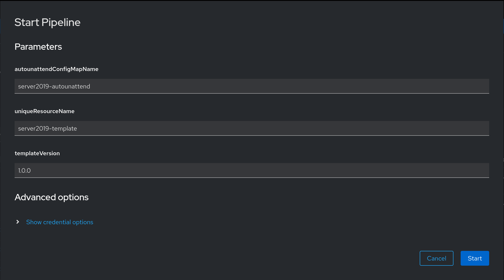
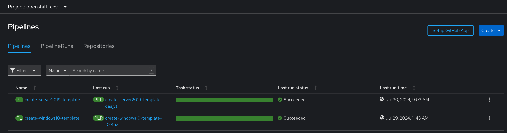

# Creating Windows Template Prep Pipelines
This block focuses on creating pipelines that handle the creation of Windows templates for use in virtual machine deployments.

## Information
| Key | Value |
| --- | ---|
| **Platform:** | Red Hat OpenShift |
| **Scope:** | Virtualization |
| **Tooling:** | CLI, yaml |
| **Pre-requisite Blocks:** | <ul><li>[Importing Installer ISOs](../importing-installer-isos/README.md)</li><li>[Autounattend for Windows](../autounattend-for-windows/README.md)</li><li>[Attaching Autounattend Files to Windows Virtual Machines](../attaching-autounattend-files-to-virtual-machine/README.md)</li><li>[Installing Operators via Yaml](../installing-operators-yaml/README.md)</li><li>[Enabling Tekton Virtual Machine Tasks](../enabling-tekton-vm-tasks/README.md)</li></ul> |
| **Pre-requisite Patterns:** | [Creating Windows Virtual Machine Templates for Virtualization on an ACP](../../patterns/windows-templates-acp-virtualization/README.md) |
| **Example Application**: | N/A |

## Table of Contents
* [Part 0 - Assumptions and Network Layout](#part-0---assumptions-and-network-layout)
* [Part 1 - Introduction to Pipelines](#part-1---introduction-to-pipelines)
* [Part 2 - Parameters of a Pipeline](#part-2---paramaters-of-a-pipeline)
* [Part 3 - Pipeline Tasks](#part-3---pipeline-tasks)
* [Part 4 - Passing Values](#part-4---passing-values)
* [Part 5 - Controlling Flow](#part-5---controlling-flow)
* [Part 6 - Results](#part-6---results)
* [Part 7 - Creating Pipelines via the OpenShift CLI](#part-7---creating-pipelines-via-the-openshift-cli)

## Part 0 - Assumptions and Network Layout
This block has a few key assumptions, in an attempt to keep things digestable:
1. A target platform is installed and reachable.
2. The installation content for the OpenShift virtualization operator is available.
3. Persistent storage is available, either by local or converged storage, or another storage solution.
4. Virtualization functionality is enabled in the BIOS of the underlying compute resources.

The following example subnets/VLANs will be used:
| VLAN | Subnet | Description |
| --- | ---| --- |
| 2000 | 172.16.0.0/24 | Out of band management interfaces of hardware |
| 2001 | 172.16.1.0/24 | Hyperconverged storage network |
| 2002 | 172.16.2.0/23 | Cluster primary network for ingress, load balanced services, and MetalLB pools |
| 2003 | 172.16.4.0/24 | First dedicated network for bridged virtual machines |
| 2004 | 172.16.5.0/24 | Second dedicated network for bridged virtual machines |
| 2005 | 172.16.6.0/24 | Third dedicated network for bridged virtual machines |

The following network information will be used:
| IP Address | Device | Description |
| --- | --- | --- |
| 172.16.2.1 | Router | Router IP address for subnet |
| 172.16.2.2 | Rendezvous | Rendezvous IP address for bootstrapping cluster, temporary |
| 172.16.2.2 | node0 | node0's cluster IP address |
| 172.16.2.3 | node1 | node1's cluster IP address |
| 172.16.2.4 | node1 | node2's cluster IP address |
| 172.16.2.10 | API | Cluster's API address |
| 172.16.2.11 | Ingress | Cluster's ingress address |
| 172.16.1.2 | node0-storage | node0's storage IP address |
| 172.16.1.3 | node1-storage | node1's storage IP address |
| 172.16.1.4 | node2-storage | node2's storage IP address |
| 10.1.3.106 | DNS | DNS server address |

The following cluster information will be used:
```yaml
cluster_info:
  name: example-cluster
  version: stable
  base_domain: your-domain.com
  masters: 3
  workers: 0
  api_ip: 172.16.2.10
  ingress_ip: 172.16.2.11
  host_network_cidr: 172.16.2.0/23
```

The following node information will be used:
```yaml
nodes:
  - name: node0
    cluster_link:
      mac_address: b8:ca:3a:6e:69:40
      ip_address: 172.16.2.2
  - name: node1
    cluster_link:
      mac_address: 24:6e:96:69:56:90
      ip_address: 172.16.2.3
  - name: node2
    cluster_link:
      mac_address: b8:ca:3a:6e:17:d8
      ip_address: 172.16.2.4
```

Topology:


This block also assumes the specified pre-requisite blocks have been reviewed and deployed as documented, and that the pre-requisite pattern has been reviewed. This block will focus on how to create a pipeline with some information about key concepts, whereas the pattern explains the tasks within the pipeline.

## Part 1 - Introduction to Pipelines
Pipelines are collections of tasks, assembled with flow control verbs to describe how and when tasks should be executed.

Pipelines are an object type provided by the OpenShift Pipelines API, and can be created using the CLI, API, and other appropriate tooling.

For example:

```yaml
---
apiVersion: tekton.dev/v1beta1
kind: Pipeline
metadata:
  name: create-server2019-template
  namespace: openshift-cnv
```

This block represents the start of a pipeline definition, with the appropriate resource kind and API endpoint to leverage.

## Part 2 - Paramaters of a Pipeline
Under the `.spec` of a pipeline, params can be specified as dynamic input for a pipeline run. These are defined against the pipeline, and need to be populated when beginning the pipeline run, unless a default value is specified.

In this example, three parameters are configured, and default values are specified:
```yaml
spec:
  params:
    - name: autounattendConfigMapName
      default: server2019-autounattend
      type: string
    - name: uniqueResourceName
      type: string
      default: server2019-template
    - name: templateVersion
      type: string
      default: '1.0.0'
```

When launching a pipeline run from the GUI, these values will be prompted for.


## Part 3 - Pipeline Tasks
Tasks are the individual units of work strung together to form a pipeline. Tasks typically take a set of parameters, capture status and results, and include the actual steps of work to be done.

For example, the `modify-data-object` task has the following `.spec`:

```yaml
spec:
  description: This task modifies a data object (DataVolume or DataSource). It can optionally wait until CDI imports finish.
  params:
    - default: ''
      description: YAML manifest of a data object to be created.
      name: manifest
      type: string
    - default: ''
      description: Namespace where to create the data object. (defaults to manifest namespace or active namespace)
      name: namespace
      type: string
    - default: 'false'
      description: Set to "true" or "false" if container should wait for Ready condition of the data object.
      name: waitForSuccess
      type: string
    - default: 'false'
      description: Allow replacing an already existing data object (same combination name/namespace). Allowed values true/false
      name: allowReplace
      type: string
    - default: 'false'
      description: 'Set to `true` or `false` if task should delete the specified DataVolume, DataSource or PersistentVolumeClaim. If set to ''true'' the ds/dv/pvc will be deleted and all other parameters are ignored.'
      name: deleteObject
      type: string
    - default: ''
      description: Kind of the data object to delete. This parameter is used only for Delete operation.
      name: deleteObjectKind
      type: string
    - default: ''
      description: Name of the data object to delete. This parameter is used only for Delete operation.
      name: deleteObjectName
      type: string
  results:
    - description: The name of the data object that was created.
      name: name
      type: string
    - description: The namespace of the data object that was created.
      name: namespace
      type: string
  steps:
    - args:
        - '--output=yaml'
      command:
        - modify-data-object
      computeResources: {}
      env:
        - name: DATA_OBJECT_MANIFEST
          value: $(params.manifest)
        - name: DATA_OBJECT_NAMESPACE
          value: $(params.namespace)
        - name: WAIT_FOR_SUCCESS
          value: $(params.waitForSuccess)
        - name: ALLOW_REPLACE
          value: $(params.allowReplace)
        - name: DELETE_OBJECT
          value: $(params.deleteObject)
        - name: DELETE_OBJECT_KIND
          value: $(params.deleteObjectKind)
        - name: DELETE_OBJECT_NAME
          value: $(params.deleteObjectName)
      image: 'registry.redhat.io/container-native-virtualization/kubevirt-tekton-tasks-create-datavolume-rhel9@sha256:c4fdaa3bd874cc73fbff93045ad98f2a2c0cb3b7340d3faad2ff6759b95a87ae'
      name: modify-data-object
```

For this task, a set of parameters is defined acting as inputs to the task, there's one step of work to be done by the task with the input parameters, and the results are captured and returned to the pipeline run.

For some pipelines, the pipeline tasks reference individual tasks, leveraging the input (parameters) and output (results) functions of the task to drive action.

For example, to leverage the `modify-data-object` task above to copy a `DataVolume`, a task is specified under `.spec.tasks` of the pipeline:

```yaml
- name: copy-installer-iso # Name of the task in the pipeline
  displayName: Copy Installer ISO # Display name for the task
  description: Copies the installation ISO to prepare for an installation # What this pipeline task does
  taskRef: # Reference to an existing task
    kind: Task
    name: modify-data-object # Call the 'modify-data-object' task
  params: # What parameters to send to the task
  - name: manifest # Send a manifest to the task's manifest parameter (input)
      value: |- # This manifest specifies a DataVolume with the name 'server2019-installer-iso-copy' that is a copy of 'server2019-installer-iso' PVC, and requests 10Gi of RWO storage
      apiVersion: cdi.kubevirt.io/v1beta1
      kind: DataVolume
      metadata:
          name: server2019-installer-iso-copy
          annotations:
          "cdi.kubevirt.io/storage.bind.immediate.requested": "true"
      spec:
          pvc:
          accessModes:
              - ReadWriteOnce
          resources:
              requests:
              storage: 10Gi
          volumeMode: Block
          source:
          pvc:
              name: server2019-installer-iso
              namespace: openshift-cnv
  - name: waitForSuccess # Wait for the task to complete before moving on
      value: "true"
  - name: allowReplace # If 'server2019-installer-iso-copy' exists, allow it to be replaced
      value: "true"
```

## Part 4 - Passing Values
The values of both parameters and tasks as they are run are referenceable by later tasks during a pipeline run, allowing for data to be passed on and leveraged later. To reference these values, the notation `$([param/task].[name].[key])` is used.

For example, this pipeline task waits for the results of another task before allowing the pipeline run to continue:
```yaml
- name: wait-for-virtual-machine-install
  displayName: Wait for VM Shutdown
  description: Wait for the installation and customization process to finish, after which the VM will shut down
  params:
  - name: vmiName
    value: $(tasks.create-template-virtual-machine.results.name) # Wait for a virtual machine task to succeed, identified by the task 'create-template-virtual-machine' results, specifically 'name'.
  - name: vmiNamespace
    value: ""
  - name: successCondition
    value: status.phase == Succeeded
  - name: failureCondition
    value: "status.phase in (Failed, Unknown)"
  runAfter:
  - create-template-virtual-machine
  taskRef:
    kind: Task
    name: wait-for-vmi-status
```

## Part 5 - Controlling Flow
Two main flow control mechanisms within pipelines are used frequently: `runAfter` and `finally`.

`runAfter` is specified at the task level, indicating that a task should run after one (or many) other task(s).

For example, this task will run after the task named `wait-for-virtual-machine-install` has completed:

```yaml
- name: snapshot-virtual-machine-disk
  displayName: Snapshot VM disk image
  description: Saves the VM disk image as a new gold image to allow easy VM creation from it
  params:
  - name: manifest
    value: |
      apiVersion: cdi.kubevirt.io/v1beta1
      kind: DataVolume
      metadata:
          annotations:
          "cdi.kubevirt.io/storage.bind.immediate.requested": "true"
          name: $(params.uniqueResourceName)-$(params.templateVersion)
          namespace: openshift-virtualization-os-images
      spec:
          pvc:
          accessModes:
              - ReadWriteOnce
          resources:
              requests:
              storage: 50Gi
          volumeMode: Block
          storageClassName: ocs-storagecluster-ceph-rbd-virtualization
          source:
          pvc:
              name: $(tasks.create-install-destination.results.name)
              namespace: openshift-cnv
  - name: waitForSuccess
    value: "true"
  - name: allowReplace
    value: "true"
  runAfter:
  - wait-for-virtual-machine-install # Wait for the task named 'wait-for-virtual-machine-install' to finish before beginning
  taskRef:
    kind: Task
    name: modify-data-object
```

`finally` is a list of tasks that should be executed at the end of the pipeline, after all other tasks have been completed. Note: these tasks will execute even if there are failures or the pipeline run is cancelled, making it useful for cleanup tasks.

```yaml
finally:
- name: cleanup-template-virtual-machine
  displayName: Cleanup Template Virtual Machine
  description: Tears down the ephemeral VM instance used for installation and customization
  params:
  - name: vmName
    value: $(tasks.create-template-virtual-machine.results.name)
  - name: delete
    value: "true"
  taskRef:
    kind: Task
    name: cleanup-vm
  timeout: 10m0s
- name: delete-copied-installer-iso
  displayName: Delete Copy of {{ .displayName }} Installer ISO
  description: Delete the copied PVC
  params:
  - name: deleteObject
    value: "true"
  - name: deleteObjectKind
    value: DataVolume
  - name: deleteObjectName
    value: $(tasks.copy-installer-iso.results.name)
  taskRef:
    kind: Task
    name: modify-data-object
- name: delete-template-vm-disk
  displayName: Remove Template Virtual Machine Disk
  description: Deletes disk of template virtual machine
  params:
  - name: deleteObject
    value: "true"
  - name: deleteObjectKind
    value: DataVolume
  - name: deleteObjectName
    value: $(tasks.create-install-destination.results.name)
  taskRef:
    kind: Task
    name: modify-data-object
```

These tasks will run after all others, and clean up temporary artifacts created during the pipeline run.

## Part 6 - Results
The results are the presistent outputs of the pipeline, usually generated artifacts such as `DataVolumes`, container images, or results of tests and builds. These are captured and can be referenced after the pipeline run has completed.

In this example, two results are captured: the name of the created DataVolume, and the namespace the DataVolume is in:

```yaml
results:
- description: Name of the created base DataVolume
  name: baseDvName
  value: $(tasks.create-template-data-source.results.name)
- description: Namespace of the created base DataVolume
  name: baseDvNamespace
  value: $(tasks.create-template-data-source.results.namespace)
```

## Part 7 - Creating Pipelines via the OpenShift CLI
With a full pipeline definition created, uploading to OpenShift can be handled using the CLI:
```
oc apply -f code/pipeline.yaml
```

Once complete, the pipeline will be created:

