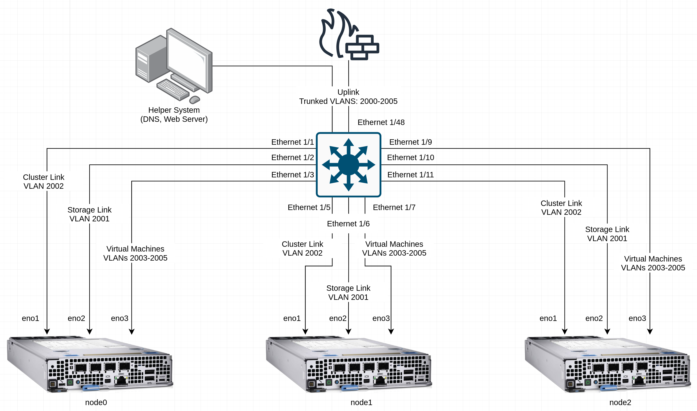

# Automation for Creating Installation Media
This block is an example of using Ansible to create installation media for a cluster, such as one that will become an ACP.

## Information
| Key | Value |
| --- | ---|
| **Platform:** | Red Hat OpenShift |
| **Scope:** | Bootstrapping |
| **Tooling:** | CLI, yaml, Ansible |
| **Pre-requisite Blocks:** | <ul><li>[Introduction to Agent Config and Install Config](../agent-config-and-install-config/README.md)</li></ul> |
| **Pre-requisite Patterns:** | N/A |
| **Example Application**: | N/A |

## Table of Contents
* [Part 0 - Assumptions and Network Layout](#part-0---assumptions-and-network-layout)
* [Part 1 - Outline of Steps](#part-1---outline-of-steps)
* [Part 2 - Structuring Node Information](#part-2---structuring-node-information)
  * [Section 1 - General Information](#section-1---general-information)
  * [Section 2 - Cluster Information](#section-2---cluster-information)
  * [Section 3 - Node Specific Information](#section-3---node-specific-information)
  * [Section 4 - All Node Settings](#section-4---all-node-settings)
* [Part 3 - Templating agent-config.yaml](#part-3---templating-agent-configyaml)
* [Part 4 - Templating install-config.yaml](#part-4---templating-install-configyaml)
* [Part 5 - Creating an Inventory for the Helper Node](#part-5---creating-an-inventory-for-the-helper-node)
* [Part 6 - Creating a Playbook](#part-6---creating-a-playbook)
  * [Section 1 - Play Setup and Vars](#section-1---play-setup-and-vars)
  * [Section 2 - Pre-tasks](#section-2---pre-tasks)
  * [Section 3 - Tasks](#section-3---tasks)
  * [Section 4 - Post-tasks](#section-4---post-tasks)
* [Part 7 - Running the Playbook](#part-7---running-the-playbook)

## Part 0 - Assumptions and Network Layout
This block has a few key assumptions, in an attempt to keep things digestable:
1. A compact, three node cluster will be deployed.
2. Network configuration has been completed.
3. DNS has been configured and is available.
4. Internet access is avaiable, however this can be used without it.
5. Static addresses will be used for the cluster links, however DHCP is also an option.
6. A "helper" system is used as the target for Ansible. This system could simply be a laptop or temporary device.

The following example subnets/VLANs will be used:
| VLAN | Subnet | Description |
| --- | ---| --- |
| 2000 | 172.16.0.0/24 | Out of band management interfaces of hardware |
| 2001 | 172.16.1.0/24 | Hyperconverged storage network |
| 2002 | 172.16.2.0/23 | Cluster primary network for ingress, load balanced services, and MetalLB pools |
| 2003 | 172.16.4.0/24 | First dedicated network for bridged virtual machines |
| 2004 | 172.16.5.0/24 | Second dedicated network for bridged virtual machines |
| 2005 | 172.16.6.0/24 | Third dedicated network for bridged virtual machines |

Topology:


## Part 1 - Outline of Steps
The process for creating installation media is outlined in the [OpenShift Installation Docs](https://docs.openshift.com/container-platform/4.15/installing/installing_with_agent_based_installer/installing-with-agent-based-installer.html), however most of the steps are repeatable and predictable, meaning some simple automation can help ensure consistency.

The main steps are:
1. Install nmstate
2. Create an installation directory
3. Download the `openshift-install` utility
4. Create `install-config.yaml`
5. Create `agent-config.yaml`
6. Use the `openshift-install` utility to create installation media

The objective of our automation will be to take in node information from a simplified format and translate it to the appropriate format for the `openshift-install` utility to consume.

## Part 2 - Structuring Node Information
The necessary information for creating an `agent-config.yaml` and `install-config.yaml` can be grouped logically, and also consolidated to avoid repeating common information applicable to multiple nodes.

### Section 1 - General Information
The first set of information contains what rendezvous IP address to use, in this case, the same address as the first node in the cluster, a pull secret, and an ssh key for troubleshooting.
```yaml
rendezvous_ip: 172.16.2.2
# Pull secrets can be found here: https://console.redhat.com/openshift/downloads#tool-pull-secret
pull_secret: 'your-pull-secret'
ssh_key: 'your-ssh-key'
```

### Section 2 - Cluster Information
This block contains base information about the cluster.
```yaml
cluster_info:
  # Name will become part of the base zone of the cluster: **example-cluster**.your-domain.com
  name: example-cluster
  # A specific version, or 'stable' for latest stable release
  version: stable
  # The base DNS zone for the cluster:  example-cluster.**your-domain.com**
  base_domain: your-domain.com
  # The number of control plane nodes
  masters: 3
  # The number of worker nodes - set to 0 for single-node and three-node clusters
  workers: 0
  # The ip address to use for the API
  api_ip: 172.16.2.10
  # The ip address to use for ingress
  ingress_ip: 172.16.2.11
  # The network CIDR of the network the nodes reside in
  host_network_cidr: 172.16.2.0/23
```

### Section 3 - Node Specific Information
The next section is information specific to the individual nodes - usually their name, IP address, and mac address of the interface to be used for the cluster link.
```yaml
nodes:
  - name: node0
    cluster_link:
      mac_address: b8:ca:3a:6e:69:40
      ip_address: 172.16.2.2
  - name: node1
    cluster_link:
      mac_address: 24:6e:96:69:56:90
      ip_address: 172.16.2.3
  - name: node2
    cluster_link:
      mac_address: b8:ca:3a:6e:17:d8
      ip_address: 172.16.2.4
```

### Section 4 - All Node Settings
If there are certain configuration settings that apply to all nodes, such as DNS servers or routes, they can be grouped together:

```yaml
all_nodes_settings:
  installation_device: /dev/disk/by-path/pci-0000:02:00.0-scsi-0:2:0:0
  cluster_link:
    interface: eno1
    subnet_length: 23
  dns_servers:
    - 8.8.8.8
    - 8.8.4.4
  routes:
    - destination: 0.0.0.0/0
      router_address: 172.16.2.1
      interface: eno1
      table_id: 254
  architecture: amd64
  hyperthreading: 'Enabled'
```


## Part 3 - Templating agent-config.yaml
Ansible leverages the jinja2 templating engine which we'll use to create a template of an `agent-config.yaml` file. In addition, we'll use the [`default`](https://docs.ansible.com/ansible/latest/playbook_guide/playbooks_filters.html#providing-default-values) filter in ansible to prefer node-specific values if they're defined, and if not, fall back to the value in `all_nodes_settings`.

The template will loop through nodes and settings that are defined as lists or dicts as needed.
```jinja
---
apiVersion: v1beta1
kind: AgentConfig
metadata:
  name: {{ cluster_info.name }}
rendezvousIP: {{ rendezvous_ip }}
hosts:

  - hostname: {{ node.name }}
    interfaces:
      - name: {{ node.cluster_link.inteface | default(all_node_settings.cluster_link.interface) }}
        macAddress: {{ node.cluster_link.mac_address }}
    rootDeviceHints:
      deviceName: {{ node.installation_device | default(all_node_settings.installation_device) }}
    networkConfig:
      interfaces:
        - name: {{ node.cluster_link.inteface | default(all_node_settings.cluster_link.interface) }}
          type: ethernet
          state: up
          mac-address: {{ node.cluster_link.mac_address }}
          ipv4:
            enabled: true
            address:
              - ip: {{ node.cluster_link.ip_address }}
                prefix-length: {{ node.cluster_link.subnet_length | default(all_node_settings.cluster_link.subnet_length) }}
            dhcp: false
      dns-resolver:
        config:
          server:


            - {{ dns_server }}


      routes:
        config:

          - destination: {{ route.destination }}
            next-hop-address: {{ route.router_address }}
            next-hop-interface: {{ route.interface }}
            table-id: {{ route.table_id }}


```

## Part 4 - Templating install-config.yaml
Same idea as above, the static `install-config.yaml` will be converted into a template for Ansible to fill in.

Some default values in this template have been pulled from the default values found in the OpenShift installtion docs.
```jinja
---
apiVersion: v1
baseDomain: {{ cluster_info.base_domain }}
compute:
- architecture: {{ all_node_settings.architecture }}
  hyperthreading: {{ all_node_settings.hyperthreading }}
  name: worker
  replicas: {{ cluster_info.workers }}
controlPlane:
  architecture: {{ all_node_settings.architecture }}
  hyperthreading: {{ all_node_settings.hyperthreading }}
  name: master
  replicas: {{ cluster_info.masters }}
metadata:
  name: {{ cluster_info.name }}
networking:
  clusterNetwork:
  - cidr: {{ cluster_info.cluster_network.cidr | default('10.128.0.0/14') }}
    hostPrefix: {{ cluster_info.cluster_network.host_prefix | default ('23') }}
  machineNetwork:
  - cidr: {{ cluster_info.host_network_cidr }}
  networkType: OVNKubernetes 
  serviceNetwork:
  - {{ cluster_info.service_network | default('172.30.0.0/16') }}
platform: 
  baremetal:
    apiVIPs:
    - {{ cluster_info.api_ip }}
    ingressVIPs:
    - {{ cluster_info.ingress_ip }}
pullSecret: '{{ pull_secret }}' 
sshKey: '{{ ssh_key }}'  
```

## Part 5 - Creating an Inventory for the Helper Node
With the templates prepared, an inventory is needed for the helper node. This can be a remote system, but could also be the local device running Ansible.

To use the local system, use `ansible_connection: local` in the inventory:
```yaml
---
all:
  hosts:
    helper:
      ansible_connection: local
      ansible_user: your-user
      ansible_become_password: your-sudo-password
```

## Part 6 - Creating a Playbook
With the other components ready, all that remains is to create a playbook that leverages our templates and inventory, and encompasses the steps in the installation docs.

### Section 1 - Play Setup and Vars
The first section of the playbook sets up the play, leveraging the helper node, and sets the target directory for the rendered files and installation media to be placed in.
```yaml
---
- name: Create installation media
  hosts:
    - helper
  # Can be overriden via extra-vars if desired
  vars:
    install_dir: "/home/{{ ansible_user }}/ocp-install"
```

### Section 2 - Pre-tasks
The pre-tasks section of the playbook handles installing `nmstate` and downloading/placing the OpenShift installation and CLI tooling into the appropriate places. Pre-tasks are always executed before tasks and post-tasks, even if they're declared later in the playbook.
```yaml
  pre_tasks:
    - name: Ensure nmstate is present
      ansible.builtin.package:
        name: nmstate
      become: true
    - name: Create install_dir
      ansible.builtin.file:
        path: "{{ install_dir }}"
        state: directory
        mode: '0755'
    - name: Download ocp installer
      ansible.builtin.get_url:
        url: "https://mirror.openshift.com/pub/openshift-v4/x86_64/clients/ocp/{{ cluster_info.version | default('stable') }}/openshift-install-linux.tar.gz"
        dest: "{{ install_dir }}"
        mode: '0755'
    - name: Extract install tooling
      ansible.builtin.unarchive:
        src: "{{ install_dir }}/openshift-install-linux.tar.gz"
        dest: "{{ install_dir }}"
        remote_src: true
    - name: Download oc CLI tool
      ansible.builtin.get_url:
        url: "https://mirror.openshift.com/pub/openshift-v4/x86_64/clients/ocp/{{ cluster_info.version | default('stable') }}/openshift-client-linux.tar.gz"
        dest: "{{ install_dir }}"
        mode: '0755'
    - name: Extract oc CLI tool
      ansible.builtin.unarchive:
        src: "{{ install_dir }}/openshift-client-linux.tar.gz"
        dest: "{{ install_dir }}"
        remote_src: true
    - name: Copy OC tool to /bin
      ansible.builtin.copy:
        src: "{{ install_dir }}/oc"
        dest: /bin/oc
        owner: root
        group: root
        mode: '0755'
        remote_src: true
      become: true
```

### Section 3 - Tasks
The tasks section of the playbook templates out our `agent-config.yaml` and `install-config.yaml` files, and calls the `openshift-install` tool to create our installation media.
```yaml
  tasks:
    - name: Template out install-config.yaml
      ansible.builtin.template:
        src: templates/install-config.yaml.j2
        dest: "{{ install_dir }}/install-config.yaml"
        mode: '0644'
    - name: Template out agent-config.yaml
      ansible.builtin.template:
        src: templates/agent-config.yaml.j2
        dest: "{{ install_dir }}/agent-config.yaml"
        mode: '0644'
    - name: Create installer ISO
      ansible.builtin.command:
        cmd: ./openshift-install --dir ./ agent create image
      args:
        chdir: "{{ install_dir }}/"
        creates: "{{ install_dir }}/agent.x86_64.iso"
```

### Section 4 - Post-tasks
The post-tasks section runs tasks related to copying the installation media to a web server on the helper node. This section is entirely optional, but useful if the ISO will be mounted to out-of-band management later on, or is not being generated on the local system.
```yaml
  post_tasks:
    - name: Block for tasks to host on web server, if requested
      when:
        - host_on_webserver is defined
        - host_on_webserver
      become: true
      block:
        - name: Install web server
          ansible.builtin.dnf:
            name: httpd
        - name: Allow 80 through firewalld
          ansible.posix.firewalld:
            port: 80/tcp
            immediate: true
            permanent: true
            zone: "{{ firewalld_zone | default('public') }}"
            state: enabled
        - name: Copy iso to web location
          ansible.builtin.copy:
            src: "{{ install_dir }}/agent.x86_64.iso"
            dest: /var/www/html/
            remote_src: true
```

## Part 7 - Running the Playbook
With everything set and defined, our automation can now be leveraged to create installation media without human intervention:
```
ansible-playbook code/ansible/create-install-media.yml --inventory code/ansible/inventory.yml --extra-vars @code/ansible/extra-vars.yml -vv
```