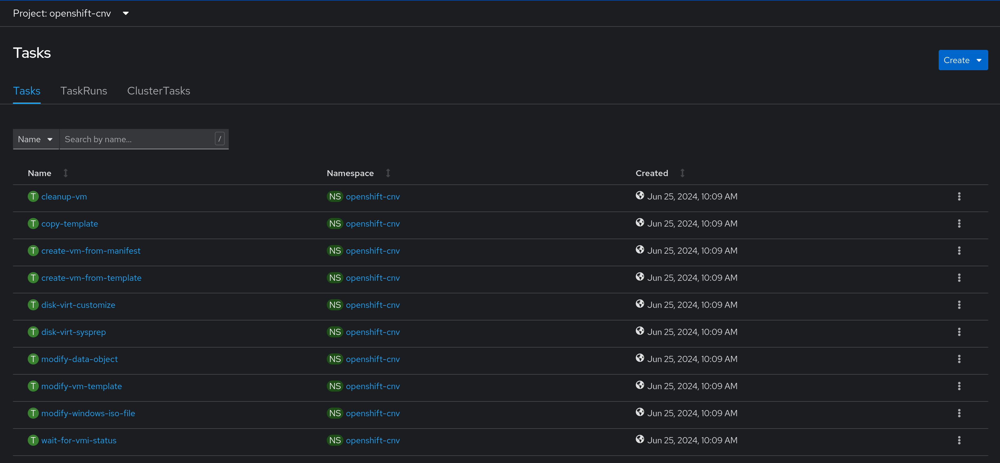

# Enabling Tekton Task Resources
This block outlines how to enable Tekton tasks for managing virtual machines, which are useful for creating and managing virtual machines on an ACP.

## Information
| Key | Value |
| --- | ---|
| **Platform:** | Red Hat OpenShift |
| **Scope:** | Virtualization |
| **Tooling:** | CLI, yaml, helm, GitOps |
| **Pre-requisite Blocks:** | <ul><li>[Installing Operators via Yaml](../installing-operators-yaml/README.md)</li></ul> |
| **Pre-requisite Patterns:** | N/A |
| **Example Application**: | N/A |

## Table of Contents
* [Part 0 - Assumptions and Network Layout](#part-0---assumptions-and-network-layout)
* [Part 1 - Available Tasks](#part-1---available-tasks)
* [Part 2 - Enabling Tekton Task Resources](#part-2---enabling-tekton-task-resources)

## Part 0 - Assumptions and Network Layout
This block has a few key assumptions, in an attempt to keep things digestable:
1. A target platform is installed and reachable.
2. The installation content for the OpenShift virtualization operator is available.
3. Persistent storage is available, either by local or converged storage, or another storage solution.
4. Virtualization functionality is enabled in the BIOS of the underlying compute resources.

The following example subnets/VLANs will be used:
| VLAN | Subnet | Description |
| --- | ---| --- |
| 2000 | 172.16.0.0/24 | Out of band management interfaces of hardware |
| 2001 | 172.16.1.0/24 | Hyperconverged storage network |
| 2002 | 172.16.2.0/23 | Cluster primary network for ingress, load balanced services, and MetalLB pools |
| 2003 | 172.16.4.0/24 | First dedicated network for bridged virtual machines |
| 2004 | 172.16.5.0/24 | Second dedicated network for bridged virtual machines |
| 2005 | 172.16.6.0/24 | Third dedicated network for bridged virtual machines |

The following network information will be used:
| IP Address | Device | Description |
| --- | --- | --- |
| 172.16.2.1 | Router | Router IP address for subnet |
| 172.16.2.2 | Rendezvous | Rendezvous IP address for bootstrapping cluster, temporary |
| 172.16.2.2 | node0 | node0's cluster IP address |
| 172.16.2.3 | node1 | node1's cluster IP address |
| 172.16.2.4 | node1 | node2's cluster IP address |
| 172.16.2.10 | API | Cluster's API address |
| 172.16.2.11 | Ingress | Cluster's ingress address |
| 172.16.1.2 | node0-storage | node0's storage IP address |
| 172.16.1.3 | node1-storage | node1's storage IP address |
| 172.16.1.4 | node2-storage | node2's storage IP address |
| 10.1.3.106 | DNS | DNS server address |

The following cluster information will be used:
```yaml
cluster_info:
  name: example-cluster
  version: stable
  base_domain: your-domain.com
  masters: 3
  workers: 0
  api_ip: 172.16.2.10
  ingress_ip: 172.16.2.11
  host_network_cidr: 172.16.2.0/23
```

The following node information will be used:
```yaml
nodes:
  - name: node0
    cluster_link:
      mac_address: b8:ca:3a:6e:69:40
      ip_address: 172.16.2.2
  - name: node1
    cluster_link:
      mac_address: 24:6e:96:69:56:90
      ip_address: 172.16.2.3
  - name: node2
    cluster_link:
      mac_address: b8:ca:3a:6e:17:d8
      ip_address: 172.16.2.4
```

Topology:


This block also assumes virtualization has been installed and is ready, and OpenShift Pipelines (pipeline service) is installed and ready.

## Part 1 - Available Tasks
The core set of tasks that can be enabled are listed below, with a brief descripion on what the task does:

| Task | Description |
| --- | --- |
| create-vm-from-template | Create a virtual machine from a template |
| copy-template | Copy a virtual machine template |
| modify-vm-template | Modify a virtual machine template |
| modify-data-object | Create or delete data volumes or data sources |
| cleanup-vm | Run a script or a command in a virtual machine and stop or delete the virtual machine afterward |
| disk-virt-customize | Use the virt-customize tool to run a customization script on a target PVC |
| disk-virt-sysprep | Use the virt-sysprep tool to run a sysprep script on a target PVC |
| wait-for-vmi-status | Wait for a specific status of a virtual machine instance and fail or succeed based on the status |

## Part 2 - Enabling Tekton Task Resources
The Hyperconverged operator has a an additional feature gate that, when enabled, will create the tasks listed above.

```yaml
apiVersion: hco.kubevirt.io/v1beta1
kind: HyperConverged
metadata:
  name: kubevirt-hyperconverged
  namespace: kubevirt-hyperconverged
spec:
  tektonPipelinesNamespace: openshift-cnv
  featureGates:
    deployTektonTaskResources: true # Set to true
```

This can be set when installing OpenShift Virtualization, or after by editing the `HyperConverged` object.

> Note:
>
> Ensure that Openshift Pipelines are installed/available before setting this feature gate, or rollout of the `HyperConverged` instance will be blocked.

Once the rollout completes, the tasks will be available:

