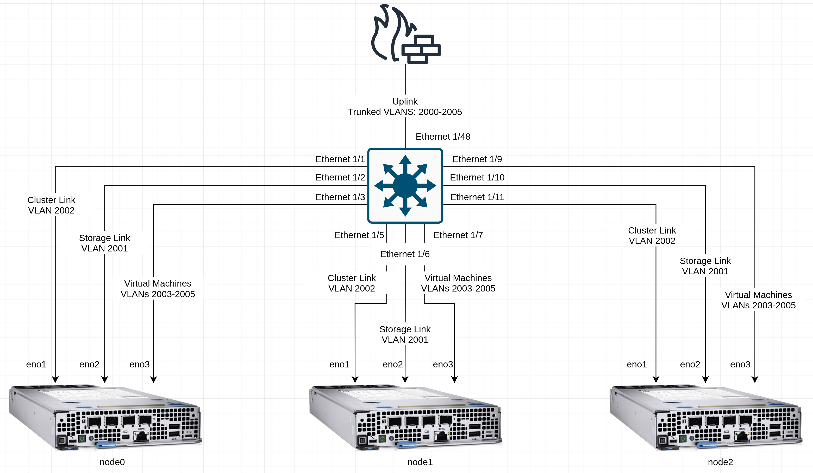

# Example Network Configuration
This block is an example of using Ansible to configure networking devices to support an ACP, using a Cisco switch as the "core" of the network.

## Information
**Platform:** Red Hat Ansible Automation Platform
**Scope:** Bootstrapping
**Tooling:** Ansible, CLI
**Pre-requisite Patterns:** N/A
**Example Application**: N/A

## Table of Contents
* [Part 0 - Assumptions and Network Layout](#part-0---assumptions-and-network-layout)
* [Part 1 - Ansible Networking Collections](#part-1---ansible-networking-collections)
* [Part 2 - Inventory for Networking Devicess](#part-2---inventory-for-networking-devices)
* [Part 3 - Swtich Variables](#part-3---swtich-variables)
  * [Section 1 - VLANs](#section-1---vlans)
  * [Section 2 - Interfaces](#section-2---interfaces)
  * [Section 3 - L2 Interfaces](#section-3---l2-interfaces)
* [Part 4 - Creating a Playbook](#part-4---creating-a-playbook)
* [Part 5 - Applying the Configuration](#part-5---applying-the-configuration)

## Part 0 - Assumptions and Network Layout
This block has a few key assumptions, in an attempt to keep things digestable:
1. The focus will be on configuring a Cisco switch to act in a layer 2 mode, pushing routing and ACLs up to a firewall.
2. The firewall is already configured and ready, and is connected to the switch.
3. Connections to the supporting hardware will all be single 10Gbps links, no link aggregration.
4. Access to the switch has already been established.

The following example subnets/VLANs will be used:
| VLAN | Subnet | Description |
| --- | ---| --- |
| 2000 | 172.16.0.0/24 | Out of band management interfaces of hardware |
| 2001 | 172.16.1.0/24 | Hyperconverged storage network |
| 2002 | 172.16.2.0/23 | Cluster primary network for ingress, load balanced services, and MetalLB pools |
| 2003 | 172.16.4.0/24 | First dedicated network for bridged virtual machines |
| 2004 | 172.16.5.0/24 | Second dedicated network for bridged virtual machines |
| 2005 | 172.16.6.0/24 | Third dedicated network for bridged virtual machines |

Topology:


## Part 1 - Ansible Networking Collections
Ansible features a large number of collections, including those that can be used to automate against networking devices.

To make network automation more simple, a "meta" collection called [`ansible.network`](https://github.com/ansible-collections/ansible.network) has been created, which will install a core set of collections for automating against network infrastructure:
```yaml
- ansible.netcommon
- ansible.network
- ansible.utils
- arista.eos
- cisco.ios
- cisco.iosxr
- cisco.nxos
- frr.frr
- junipernetworks.junos
- openvswitch.openvswitch
- vyos.vyos
```

Additional collections are available, however the meta collection covers this block's use case.

The collection can be installed using the `ansible-galaxy` utility:
```
ansible-galaxy collection install ansible.network
```

## Part 2 - Inventory for Networking Devices
To get started with automating against our switch, we'll define what Ansible will talk to, along with how Ansible will talk to it.

```yaml
---
all:
  hosts:
    switch:
      # Define the endpoint if not in DNS
      ansible_host: 172.16.0.2
      # Define the network operating system of the device (Cisco NX-OS)
      ansible_network_os: cisco.nxos.nxos
      # Define the username to authenticate with
      ansible_user: admin
      # Define the password to authenticate with
      ansible_password: 'switch-password'
      # Have ansible elevate privileges
      ansible_become: true
      # Add common args for SSH, for example if only older algorithms are supported by the switch
      ansible_ssh_common_args: '-o PubkeyAcceptedAlgorithms=+ssh-rsa -o HostkeyAlgorithms=+ssh-rsa'
      # Use the CLI over an SSH connection, instead of an API or other connection mechanism
      ansible_connection: network_cli
```

This example inventory will allow Ansible to connect to and manage our switch.

## Part 3 - Swtich Variables
In a variables file, we'll define the key configuration items for our automation to handle. The main ones are: VLANs, interfaces, and L2 Interfaces.

### Section 1 - VLANs
Oue VLANs, as outlined above, represent the logical boundries within the network for various services and types of traffic. They'll be defined under one parent variable.
```yaml
vlans:
  - name: out-of-band
    vlan_id: 2000
    enabled: true
    state: active
  - name: Storage
    vlan_id: 2001
    enabled: true
    state: active
  - name: cluster
    vlan_id: 2002
    enabled: true
    state: active
  - name: virtual-machines-1
    vlan_id: 2003
    enabled: true
    state: active
  - name: virtual-machines-2
    vlan_id: 2004
    enabled: true
    state: active
  - name: virtual-machines-3
    vlan_id: 2005
    enabled: true
    state: active
```

### Section 2 - Interfaces
In Cisco + Ansible terms, interfaces refers to the settings and configuration of the physical interface itself, AKA layer 1.

We don't need to set link speed or other interface settings, but descriptions are helpful, and we'll ensure the ports are on.
```yaml
interfaces:
  - name: Ethernet1/48
    description: uplink-to-unifi
    speed: 1000
    enabled: true
  - name: Ethernet1/1
    description: node0-cluster
    enabled: true
  - name: Ethernet1/2
    description: node0-storage
    enabled: true
  - name: Ethernet1/3
    description: node0-virtualization
    enabled: true
  - name: Ethernet1/5
    description: node1-cluster
    enabled: true
  - name: Ethernet1/6
    description: node1-storage
    enabled: true
  - name: Ethernet1/7
    description: node1-virtualization
    enabled: true
  - name: Ethernet1/9
    description: node2-cluster
    enabled: true
  - name: Ethernet1/10
    description: node2-storage
    enabled: true
  - name: Ethernet1/11
    description: node2-virtualization
    enabled: true
```

### Section 3 - L2 Interfaces
Again in Cisco + Ansible terms, layer 2 interfaces represent the union of VLANs and switch mode: trunk or access. We'll define ours under one umbrella variable again:
```yaml
l2_interfaces:
  # Uplink
  - name: Ethernet1/48
    trunk:
      native_vlan: 2000
      allowed_vlans: 2000,2001,2002,2003,2004,2005
  # Cluster links
  - name: Ethernet1/1
    access:
      vlan: 2002
  - name: Ethernet1/5
    access:
      vlan: 2002
  - name: Ethernet1/9
    access:
      vlan: 2002
  # Storage links
  - name: Ethernet1/2
    access:
      vlan: 2001
  - name: Ethernet1/6
    access:
      vlan: 2001
  - name: Ethernet1/10
    access:
      vlan: 2001
  # Virtual machine links
  - name: Ethernet1/3
    trunk:
      native_vlan: 2003
      allowed_vlans: 2003,2004,2005
  - name: Ethernet1/7
    trunk:
      native_vlan: 2003
      allowed_vlans: 2003,2004,2005
  - name: Ethernet1/11
    trunk:
      native_vlan: 2003
      allowed_vlans: 2003,2004,2005
```

## Part 4 - Creating a Playbook
With our configuration definitions ready, all that's needed is to leverage the appropriate modules installed by the meta collection to configure the switch:
```yaml
---
- name: Configure switches
  hosts:
    - all
  tasks:
    - name: Configure VLANs
      cisco.nxos.nxos_vlans:
        config: "{{ vlans }}"
        state: merged
      notify:
        - copy_run_start
    - name: Configure interfaces
      cisco.nxos.interfaces:
        config: "{{ interfaces }}"
        state: merged
      notify:
        - copy_run_start
    - name: configure l2 interfaces
      cisco.nxos.l2_interfaces:
        config: "{{ l2_interfaces }}"
        state: replaced
      notify:
        - copy_run_start
  handlers:
    - name: Copy run start
      cisco.nxos.nxos_config:
        save_when: always
      listen:
        - copy_run_start
```

Importantly, if changes are made along the way by Ansible, a handler is notified, and the running configuration is saved to persistent storage.

## Part 5 - Applying the Configuration
With everything configured, the switch configuration can now be applied:
```
ansible-playbook code/ansible/playbook.yml --inventory code/ansible/inventory.yml --extra-vars code/ansible/extra-vars.yml
```

Once the run is completed, the switch is configured and ready.