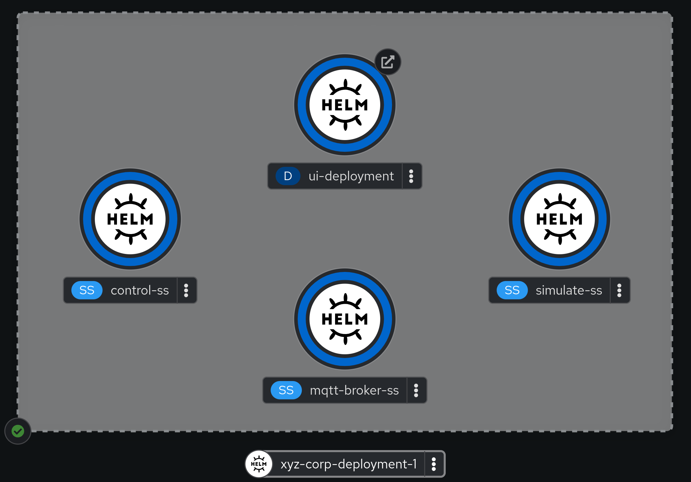

# Getting Started with Helm Charts
This pattern is for "leveling up" the deployment of Kubernetes-based applications to use [Helm](https://helm.sh/docs/intro/quickstart/).

## Information
**Platform:** Red Hat Device Edge with Microshift, Red Hat Openshift
**Scope:** Application deployment
**Tooling:** Git, Helm
**Pre-requisite Patterns:** [Kubernetes Core Concepts](../k8s-core-concepts/README.md)
**Example Application**: Process Control

## Table of Contents
* [Part 1 - Introduction to Helm](#part-1---introduction-to-helm)
* [Part 2 - Writing a Chart for the Example Application](#part-2---introduction-to-charts)
  * [Section 1 - Layout](#section-1---layout)
  * [Section 2 - Chart.yaml and values.yaml](#section-2---chartyaml-and-valuesyaml)
  * [Section 3 - Creating Templates for Resources](#section-3---creating-templates-for-resources)
* [Part 3 - Deploying the Example Application](#part-3---deploying-the-example-application)

## Part 1 - Introduction to Helm
Helm is a popular package manager for Kubernetes It simplifies the deployment and management of applications on Kubernetes by providing a way to define, install, and upgrade complex Kubernetes applications through easy-to-use packages called charts. Helm charts encapsulate all the necessary Kubernetes resources, configurations, and dependencies needed to deploy an application, making it easier to share and reuse configurations across different environments.

At a high level, a Helm Chart is a package that contains all the necessary components to deploy an application to Kubernetes. It also provides for templating functionality, replacing values "on the fly" to allow for customization per deployment.

Our goal is to leverage the templating functionality of Helm to allow us to deploy multiple instances of an application without having to hand-craft our resource definitions. The Helm documentation features a full guide on how to create charts, however we’ll walk through a simplified example.

## Part 2 - Introduction to Charts
> Note: Code snippets have been pulled from the [code](./code/) directory in this repo.

As stated, charts are packages that contain everything requried to get an application up and running, and optionally make use of templating.

### Section 1 - Layout
To get started, we can use a generic layout to structure our chart code:

```
fedora:~$ tree
.
└── process-control
    ├── Chart.yaml
    ├── templates
    └── values.yaml
```

### Section 2 - Chart.yaml and values.yaml
Two files provide information about our chart. First, `Chart.yaml`, which provides information about the chart:
```yaml
apiVersion: v2
name: process-control
description: A Helm chart to deploy the sample process control application on Kubernetes
type: application
version: 1.0.0
appVersion: "4.0.0"
```

And to compliment, a `values.yaml` file that defines values to be used when rendering resource definitions:
```yaml
---
# "Meta" information about the deployment
instanceAnnotations:
  companyName: "Example_Company_Inc"
  billingAddress: "100_East_Davie_Street"
  billingCity: "Raleigh"
  billingState: "North Carolina"
  billingZipCode: "27601"
  deploymentAddress: "1_Main_St_SE"
  deploymentCity: "Minneapolis"
  deploymentState: "Minnesota"
  deploymentZipCode: "55414"
  serviceProvider: "Managed_Services_Inc"
  
# Technical/resource values for the deployment
uiReplicas: 2
resourceLimitOverrides:
  control:
    cpu: 500m
    memory: 500Mi
```

### Section 3 - Creating Templates for Resources
Since our example application has four main parts, our templates directory can contain sub-directories to house resource templates related to each component:
```
fedora:~$ tree templates/
templates/
├── control
│   ├── applicationset.yaml
│   └── service.yaml
├── mqtt-broker
│   ├── applicationset.yaml
│   └── service.yaml
├── simulate
│   ├── applicationset.yaml
│   └── service.yaml
└── ui
    ├── deployment.yaml
    ├── route.yaml
    └── service.yaml
```

In each template, our resource is defined, and optionally, some of the values are converted to variables. For example:
```yaml
---
apiVersion: apps/v1
kind: StatefulSet
metadata:
  name: simulate-ss
  labels:
    app.kubernetes.io/name: simulate-ss
    app.kubernetes.io/instance: {{ .Release.Name }}
    app.kubernetes.io/version: "1.0.0"
    app.kubernetes.io/component: simulate
    app.kubernetes.io/part-of: process-control
spec:
  selector:
    matchLabels:
      app.kubernetes.io/name: simulate
      app.kubernetes.io/instance: {{ .Release.Name }}
      app.kubernetes.io/part-of: process-control
  serviceName: "simulate-service"
  replicas: 1
  minReadySeconds: 10
  template:
    metadata:
      labels:
        app.kubernetes.io/name: simulate
        app.kubernetes.io/instance: {{ .Release.Name }}
        app.kubernetes.io/part-of: process-control
    spec:
      terminationGracePeriodSeconds: 10
      containers:
        - name: simulate
          image: quay.io/device-edge-workshops/process-control-simulate-k8s:1.0.0
          resources:
            limits:
              memory: {{ .Values.resourceLimitOverrides.control.memory | default "100Mi" }}
              cpu: {{ .Values.resourceLimitOverrides.control.cpu | default "100m" }}
```

Here we've taken a static definition of a StatefulSet and converted it to a a template, complete with variables set for some labels and resource requirements. Helm will automatically render and replace with values specified from either `values.yaml` or from values passed in from the CLI.

> Note: Helm includes some [Built-in Objects](https://helm.sh/docs/chart_template_guide/builtin_objects/) that can be referenced.

## Part 3 - Deploying the Example Application
With the chart created, the application can be deployed using the Helm CLI:
```
fedora:~$ helm install xyz-corp-deployment-1 ./process-control
NAME: xyz-corp-deployment-1
LAST DEPLOYED: Thu Apr  4 15:11:40 2024
NAMESPACE: helm-example
STATUS: deployed
REVISION: 1
TEST SUITE: None
```

In this example, the chart was deployed with a deployment name of `xyz-corp-deployment-1`:


Since a few values in our `values.yaml` file define information about the deployed instnace, these values can be set on the CLI when deploying as well:
```
fedora:~$ helm install xyz-corp-deployment-1 ./process-control --set instanceAnnotations.companyName="XYZ Corporation"
NAME: xyz-corp-deployment-1
LAST DEPLOYED: Thu Apr  4 15:20:27 2024
NAMESPACE: helm-example
STATUS: deployed
REVISION: 1
TEST SUITE: None
```

Here, the value of `instanceAnnotations.companyName` was overriden by the CLI to be "XYZ Corporation".