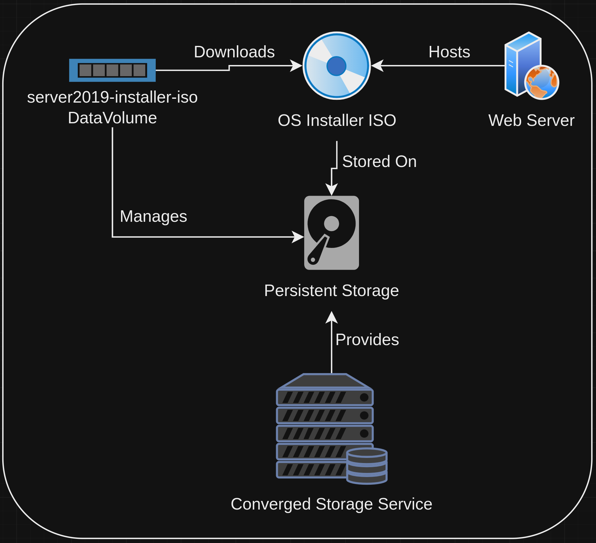
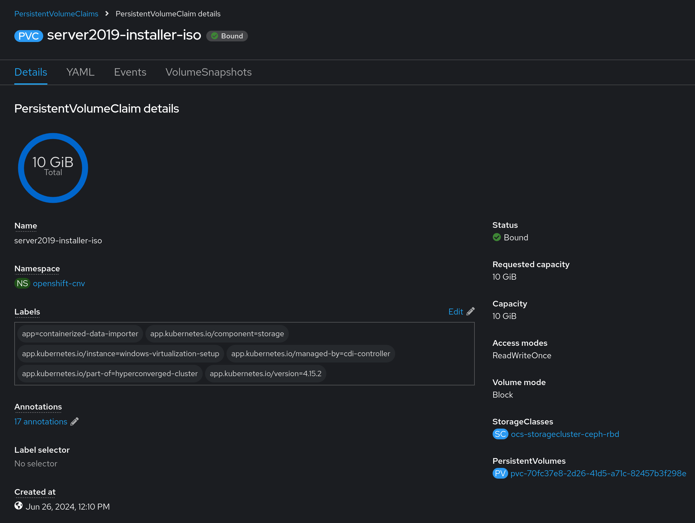

# Installing Virtualization on an ACP
This block outlines how to install virtualization functionality on an ACP, and includes a preview of the installed assets.

## Information
| Key | Value |
| --- | ---|
| **Platform:** | Red Hat OpenShift |
| **Scope:** | Bootstrapping |
| **Tooling:** | CLI, yaml, helm, GitOps |
| **Pre-requisite Blocks:** | <ul><li>[Helm Getting Started](../helm-getting-started/README.md)</li><li>[Installing Operators via Yaml](../installing-operators-yaml/README.md)</li><li>[GitOps Cluster Config](../gitops-cluster-config-rbac/README.md)</li></ul> |
| **Pre-requisite Patterns:** | N/A |
| **Example Application**: | N/A |

## Table of Contents
* [Part 0 - Assumptions and Network Layout](#part-0---assumptions-and-network-layout)
* [Part 1 - Defining Configuration](#part-1---defining-configuration)
* [Part 2 - Installing the Virtualization Operator](#part-2---installing-the-virtualization-operator)
* [Part 3 - HyperConverged Instance](#part-3---hyperconverged-instance)
* [Part 4 - Investigating Virtualization Functionality](#part-4---investigating-virtualization-functionality)

## Part 0 - Assumptions and Network Layout
This block has a few key assumptions, in an attempt to keep things digestable:
1. A target platform is installed and reachable.
2. The installation content for the OpenShift virtualization operator is available.
3. Persistent storage is available, either by local or converged storage, or another storage solution.
4. Virtualization functionality is enabled in the BIOS of the underlying compute resources.

The following example subnets/VLANs will be used:
| VLAN | Subnet | Description |
| --- | ---| --- |
| 2000 | 172.16.0.0/24 | Out of band management interfaces of hardware |
| 2001 | 172.16.1.0/24 | Hyperconverged storage network |
| 2002 | 172.16.2.0/23 | Cluster primary network for ingress, load balanced services, and MetalLB pools |
| 2003 | 172.16.4.0/24 | First dedicated network for bridged virtual machines |
| 2004 | 172.16.5.0/24 | Second dedicated network for bridged virtual machines |
| 2005 | 172.16.6.0/24 | Third dedicated network for bridged virtual machines |

The following network information will be used:
| IP Address | Device | Description |
| --- | --- | --- |
| 172.16.2.1 | Router | Router IP address for subnet |
| 172.16.2.2 | Rendezvous | Rendezvous IP address for bootstrapping cluster, temporary |
| 172.16.2.2 | node0 | node0's cluster IP address |
| 172.16.2.3 | node1 | node1's cluster IP address |
| 172.16.2.4 | node1 | node2's cluster IP address |
| 172.16.2.10 | API | Cluster's API address |
| 172.16.2.11 | Ingress | Cluster's ingress address |
| 172.16.1.2 | node0-storage | node0's storage IP address |
| 172.16.1.3 | node1-storage | node1's storage IP address |
| 172.16.1.4 | node2-storage | node2's storage IP address |
| 10.1.3.106 | DNS | DNS server address |

The following cluster information will be used:
```yaml
cluster_info:
  name: example-cluster
  version: stable
  base_domain: your-domain.com
  masters: 3
  workers: 0
  api_ip: 172.16.2.10
  ingress_ip: 172.16.2.11
  host_network_cidr: 172.16.2.0/23
```

The following node information will be used:
```yaml
nodes:
  - name: node0
    cluster_link:
      mac_address: b8:ca:3a:6e:69:40
      ip_address: 172.16.2.2
  - name: node1
    cluster_link:
      mac_address: 24:6e:96:69:56:90
      ip_address: 172.16.2.3
  - name: node2
    cluster_link:
      mac_address: b8:ca:3a:6e:17:d8
      ip_address: 172.16.2.4
```

Topology:


## Part 1 - Introduction to Data Volumes
DataVolumes in OpenShift are custom resources used to manage the lifecycle of persistent volumes and persistent volume claims, serving as an abstraction layer over these resource types. They are espically useful for virtualization workloads, as they can be used for data disks for virtual machines and their installer media.


## Part 2 - Uploading Installer ISOs
To upload ISOs, a DataVolume can be configured with two main items: where to access the desired ISO to store, and what storage will actually contain it.

For example, an ISO hosted on an internal web server could be uploaded to a 10Gi PV using the following DataSource configuration:

```yaml
---
apiVersion: cdi.kubevirt.io/v1beta1
kind: DataVolume
metadata:
  name: server2019-installer-iso
  namespace: openshift-cnv
  annotations:
    "cdi.kubevirt.io/storage.bind.immediate.requested": "true"
spec:
  pvc:
    accessModes:
      - ReadWriteOnce
    resources:
      requests:
        storage: 10Gi
    volumeMode: Block
  source:
    http:
      url: "http://10.0.0.10/server2019.iso"
```

This configuration would instruct OpenShift to create a PVC (and associated PV) of 10Gi, and download the specified ISO to it.

## Part 3 - Creating the DataVolume via the CLI
To create the DataVolume and begin the import process, the OpenShift CLI can be used:
```
oc apply -f code/datavolume.yaml
```

After applying the yaml file, a PVC should be created, and the import process will begin.

