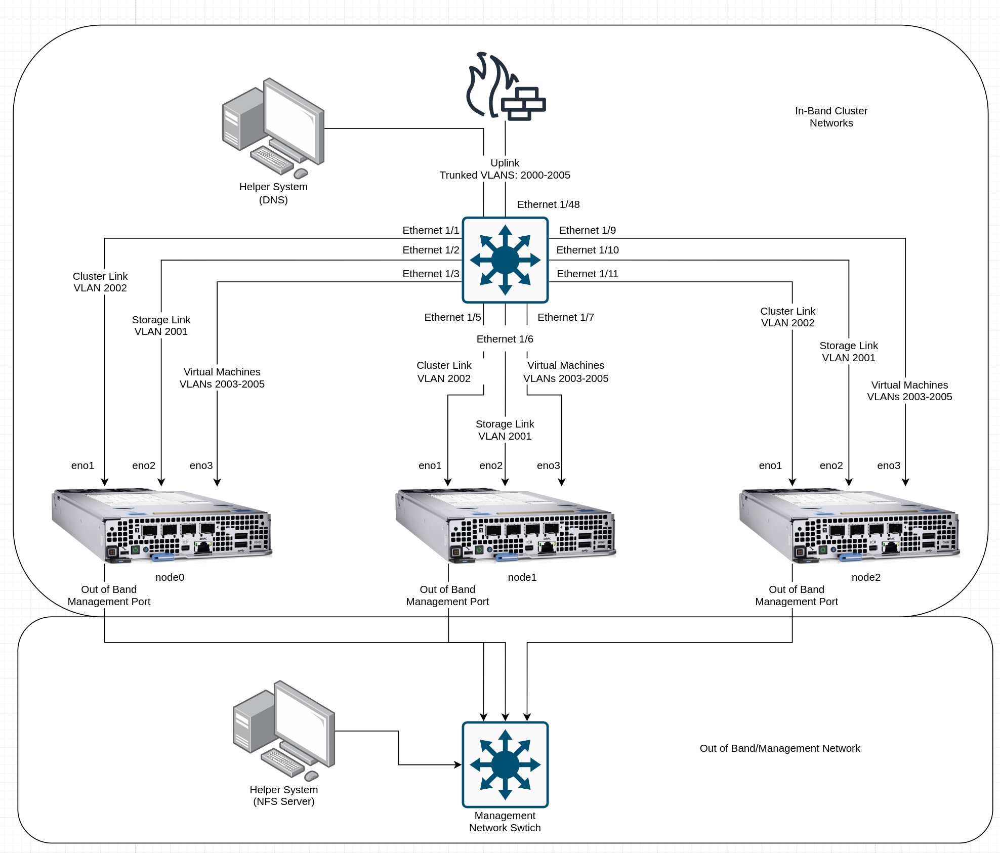
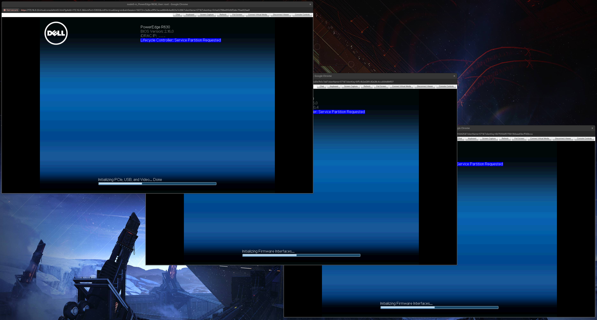
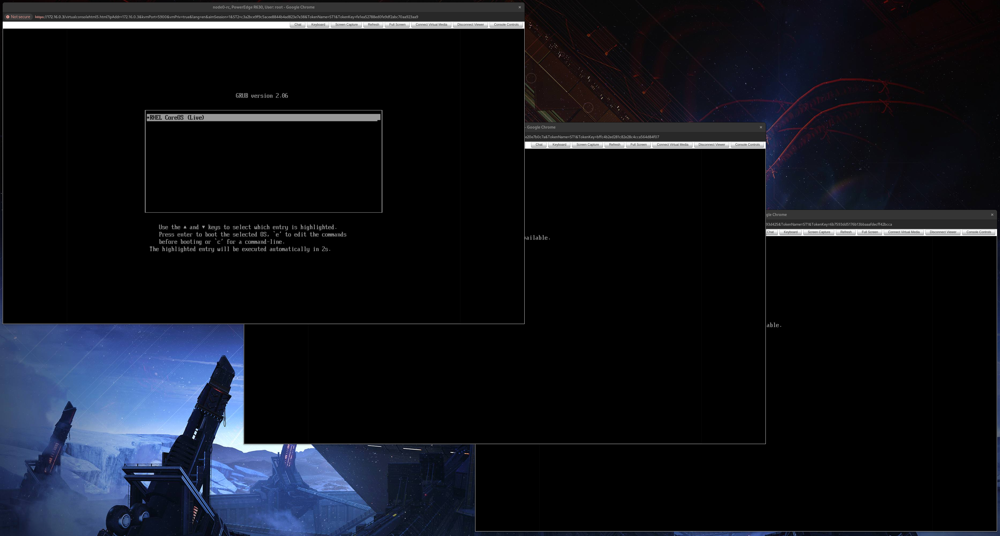
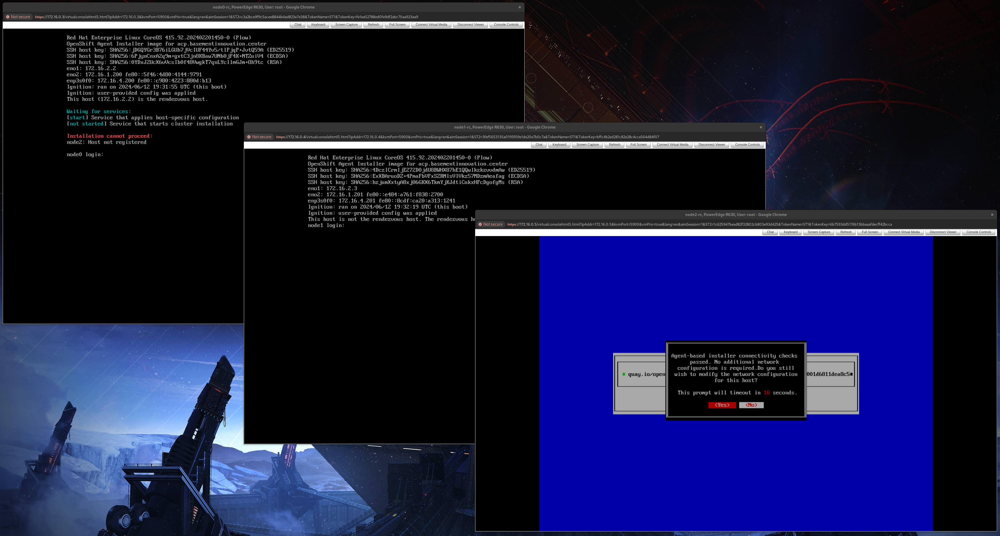
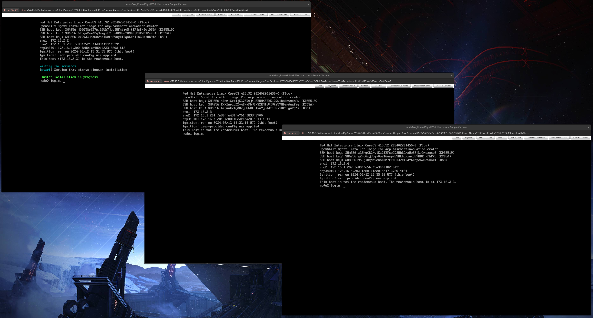

# Installing a Cluster with Automation via Out of Band Management
This block outlines using Ansible to mount installation media to systems for cluster/ACP installation.

## Information
| Key | Value |
| --- | ---|
| **Platform:** | Red Hat OpenShift |
| **Scope:** | Bootstrapping |
| **Tooling:** | CLI, yaml, Ansible |
| **Pre-requisite Blocks:** | N/A |
| **Pre-requisite Patterns:** | N/A |
| **Example Application**: | N/A |

## Table of Contents
* [Part 0 - Assumptions and Network Layout](#part-0---assumptions-and-network-layout)
* [Part 1 - Using Out of Band Management](#part-1---using-out-of-band-management)
* [Part 2 - Creating an Inventory](#part-2---creating-an-inventory)
* [Part 3 - Creating a Playbook](#part-3---creating-a-playbook)
* [Part 4 - Running the Automation](#part-4---running-the-automation)
* [Part 5 - Monitoring Cluster Installation via Remote Console](#part-5---monitoring-cluster-installation-via-remote-console)

## Part 0 - Assumptions and Network Layout
This block has a few key assumptions, in an attempt to keep things digestable:
1. Network configuration has been completed.
2. DNS configuration has been completed.
3. Installation media has been generated, and is available to the target systems.

The following example subnets/VLANs will be used:
| VLAN | Subnet | Description |
| --- | ---| --- |
| 2000 | 172.16.0.0/24 | Out of band management interfaces of hardware |
| 2001 | 172.16.1.0/24 | Hyperconverged storage network |
| 2002 | 172.16.2.0/23 | Cluster primary network for ingress, load balanced services, and MetalLB pools |
| 2003 | 172.16.4.0/24 | First dedicated network for bridged virtual machines |
| 2004 | 172.16.5.0/24 | Second dedicated network for bridged virtual machines |
| 2005 | 172.16.6.0/24 | Third dedicated network for bridged virtual machines |

The following network information will be used:
| IP Address | Device | Description |
| --- | --- | --- |
| 172.16.2.1 | Router | Router IP address for cluster subnet |
| 172.16.2.2 | Rendezvous | Rendezvous IP address for bootstrapping cluster, temporary |
| 172.16.2.2 | node0 | node0's cluster IP address |
| 172.16.2.3 | node1 | node1's cluster IP address |
| 172.16.2.4 | node1 | node2's cluster IP address |
| 172.16.2.10 | API | Cluster's API address |
| 172.16.2.11 | Ingress | Cluster's ingress address |
| 10.1.3.106 | DNS | DNS server address |
| 172.16.0.3 | node0-rc | node0's remote management (iDRAC) interface |
| 172.16.0.4 | node1-rc | node1's remote management (iDRAC) interface |
| 172.16.0.5 | node2-rc | node2's remote management (iDRAC) interface |

The following cluster information will be used:
```yaml
cluster_info:
  name: example-cluster
  version: stable
  base_domain: your-domain.com
  masters: 3
  workers: 0
  api_ip: 172.16.2.10
  ingress_ip: 172.16.2.11
  host_network_cidr: 172.16.2.0/23
```

The following node information will be used:
```yaml
nodes:
  - name: node0
    cluster_link:
      mac_address: b8:ca:3a:6e:69:40
      ip_address: 172.16.2.2
  - name: node1
    cluster_link:
      mac_address: 24:6e:96:69:56:90
      ip_address: 172.16.2.3
  - name: node2
    cluster_link:
      mac_address: b8:ca:3a:6e:17:d8
      ip_address: 172.16.2.4
```

Topology:


## Part 1 - Using Out of Band Management
Most server-grade systems provide an out-of-band management interface that is able to make changes to system or BIOS settings, mount remote media, and present a virtual console. These are provided to enable complete remote administration of a system, once the physical network connections have been made.

This block will use Dell servers with 8th generation iDRACs to install a cluster, and will leverage Ansible to do the automated communcation with the iDRACs. However, this process is portable to other hardware platforms, with some tweaks to the code.

## Part 2 - Creating an Inventory
Since Ansible will be handling the communication to the target systems, an inventory will need to be created.

A tweak to Ansible's native operating model will also be done here: by default, Ansible expects to communicate directly with the specified endpoint, and execute on it. However, our targets are not Linux or Windows systems, but embedded management systems that don't allow the same level of access or communication. However, it's still desired to operate against the servers as individual targets, like a normal Ansible flow would, which allows them to each have unique variables, and allows for parallel operations.

To perform this tweak, an inventory will be set up like normal, with variables for the iDRACs:

```yaml
---
all:
  children:
    servers:
      node0:
        ansible_host: 172.16.2.2
        idrac_address: 172.16.0.3
      node1:
        ansible_host: 172.16.2.3
        idrac_address: 172.16.0.4
      node2:
        ansible_host: 172.16.2.4
        idrac_address: 172.16.0.5
  vars:
    idrac_auth:
      username: root
      password: calvin
```

## Part 3 - Creating a Playbook
With an inventory created, a playbook to consume it can also be created:
```yaml
---
- name: Install cluster via mounting media
  hosts:
    - servers
  gather_facts: false
  connection: local
  tasks:
    - name: Run OS install
      dellemc.openmanage.idrac_os_deployment:
        idrac_ip: "{{ idrac_address }}"
        idrac_user: "{{ idrac_auth.username }}"
        idrac_password: "{{ idrac_auth.password }}"
        validate_certs: false
        share_name: "10.1.3.106:/mnt/storage/nfs"
        iso_image: agent.x86_64.iso
        expose_duration: 240
```

A few key notes about this playbook:
- The target hosts of the playbook is still set to `servers`.
- Fact gathering is disabled, as we don't want Ansible to try to connect and gather facts
- The `connection` variable is set to `local`, meaning tasks will be executed by the system running Ansible instead of the remote systems. This is similar to `delegate_to: localhost` at the task level.
- The [dellemc.openmanage](https://docs.ansible.com/ansible/latest/collections/dellemc/openmanage/index.html) collection has a module that leverages the lifecycle controller of the servers to mount the remote media and trigger an install.

## Part 4 - Running the Automation
With a playbook and inventory ready, running the automation will begin the remote cluster installation:
```
ansible-playbook code/ansible/install-cluster.yml --inventory code/ansible/inventory.yml -vv
```

## Part 5 - Monitoring Cluster Installation via Remote Console
Just to confirm the automation is working as expected, checking the remote consoles can show progress or indicate a failure.

First, during boot, a flag is shown that the lifecycle controller is being invoked to install an operating system:


Then, CoreOS can be seen booting:


After that, the agent-based installer will perform some basic checks:


Then, after the nodes have checked in with the rendevous host, the hosts will be validated, and the cluster installation will begin:


The systems will reboot a few times during install.