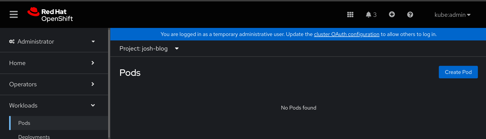
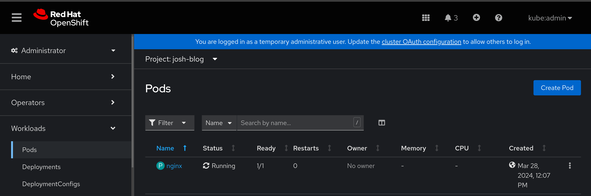

# Kubernetes Core Concepts
This block is for gaining a base understanding of [kubernetes](kubernetes.io).

## Information
**Platform:** Red Hat Device Edge with Microshift, Red Hat Openshift
**Scope:** Platform, information
**Tooling:** k8s
**Pre-requisite Patterns:** N/A
**Example Application**: Nginx, Process Control

## Table of Contents
* [Part 1 - Introduction to Kubernetes](#part-1---introduction-to-kubernetes)
* [Part 2 - Deploying a Sample Application Backend](#part-2---deploying-a-sample-application-backend)
* [Part 3 - Deploying a Sample Application Frontend](#part-3---deploying-a-sample-application-frontend)
* [Part 4 - Creating Services and Routes](#part-4---creating-services-and-routes)
* [Part 5 - Deploying the Application](#part-5---deploying-the-application)

## Part 1 - Introduction to Kubernetes
Kubernetes is, generally speaking, two main concepts: truth and reconciliation. Truth refers to the ability to define what we want, as simple key/value pairs, paired with reconciliation: the native function of Kubernetes to constantly watch and manage what we’ve defined.

Let’s consider an example, first, defining what we want:
```yaml
---
apiVersion: v1
kind: Pod
metadata:
  name: nginx
spec:
  containers:
  - name: nginx
    image: nginx:latest
    ports:
    - containerPort: 80
```

At the top, we define a few key things: the kind of resource we want, in this case a pod: a group of one or more containers that share resources, and what API is responsible for that resource. Since pods are a core resource to Kubernetes, we can simply let the core API, denoted by ‘v1’, handle this request.

Next, we define some metadata about the resource: here we’re using a key value pair of “name: nginx” to define a name for the resource.

Now, we use the spec field to define our pod. In this example, we want a single container, with the name of ‘nginx’, and have defined what container image should be used. In addition, we’ve also defined what ports we’ll want to have exposed, in this case port 80.

If we take this example and give it to our OpenShift cluster, we’ll see the reconciliation side of Kubernetes take over.

First, our empty space, with no running resources:


Then, after telling Kubernetes what we want, the pod will be brought into existence and will constantly be watched:


Now, this resource is under the management of Kubernetes, meaning it will be constantly watched and tracked, and always reconciled to what we’ve defined. This means that as nodes fail, network interruptions happen, or any other failure events occur, our defined resource will be constantly reconciled to be in a healthy state. This could mean moving to another node, being rescheduled to specific nodes to meet constraints, or simply restarted should the application in the container fail, causing the container to stop.

There are many resources available to us, and we’ll use some others in the upcoming deployment of our example process control application.

## Part 2 - Deploying a Sample Application Backend
Using our core concepts of truth and reconciliation, we can now start to define the resources we need to run our example application on kubernets.

Let's start by defining how we’ll run an instance of the application, using a different resource known as a deployment. Deployments give us a bit more freedom around running pods, specifically, allowing us to handle updates and upgrades, rollback, and scaling, all by defining our desired state. Since we’ll want upgrade and rollback functionality in the future, a deployment perfectly meets our requirements.

Since our sample application is compromised of different parts, we'll need to define each individually. Let's start with a deployment for our mqtt broker:
```yaml
---
apiVersion: apps/v1
kind: StatefulSet
metadata:
  name: mqtt-broker-ss
  labels:
    app.kubernetes.io/name: mqtt-broker-ss
    app.kubernetes.io/instance: process-control
    app.kubernetes.io/version: "1.0.0"
    app.kubernetes.io/component: mqtt-broker
    app.kubernetes.io/part-of: process-control
```

We’ve defined what API handles this resource, in this case `apps/v1`, and what kind of resource we want: a StatefulSet. We’ve also defined some information in the metadata field, again providing our resource a name, but also adding in more information via labels. Labels are key/value pairs that allow us to search for resources, so if we wanted to search for all statefulsets of this application, we could ask the API “Give me all statefulsets with the label app.kubernetes.io/name=mqtt-broker-ss”.

Now, we’ll define the spec of the deployment, starting with a few key things: the number of replicas we want, here noted as just one, meaning only one instance of Niagara4 will be created, and how this deployment will find and select the resources that should be managed by it. Remember before, we defined labels that could be used to locate resources; in the same way, Kubernetes can use labels to find resources as well. In addition, we've defined the service that will be used to track the state of our pods, which we'll create later, and the number of replicas.
```yaml
spec:
  selector:
    matchLabels:
      app.kubernetes.io/name: mqtt-broker
      app.kubernetes.io/instance: process-control
      app.kubernetes.io/part-of: process-control
  serviceName: "mqtt-service"
  replicas: 1
```

The template field denotes what resources we’re asking the statefulset to template out. First, we start with the labels to match:
```yaml
---
template:
  metadata:
    labels:
      app.kubernetes.io/name: mqtt-broker
      app.kubernetes.io/instance: process-control
      app.kubernetes.io/part-of: process-control
```

Now, under the spec of the template, we can define our pod. Similar to above, we’re defined a name, image, and ports, however we’ve added a few additional things: resource limits, which constrain the maximum amount of resources a single pod can consume.
```yaml
---
spec:
  terminationGracePeriodSeconds: 10
  containers:
    - name: mqtt-broker
      image: quay.io/device-edge-workshops/process-control-mqtt:1.0.0
      ports:
        - containerPort: 1883
          name: mqtt-port
      resources:
        limits:
          memory: "100Mi"
          cpu: "100m"
```

## Part 3 - Deploying a Sample Application Frontend
Since our frontend is what the end user stations will be accessing, we may need to deploy multiple instances to handle the load. Another type of resource that we can leverage is a `Deployment`, which can be easily scaled up and down based on demand.
```yaml
---
apiVersion: apps/v1
kind: Deployment
metadata:
  name: ui-deployment
  labels:
    app.kubernetes.io/name: ui-deployment
    app.kubernetes.io/instance: process-control
    app.kubernetes.io/version: "1.0.0"
    app.kubernetes.io/component: ui
    app.kubernetes.io/part-of: process-control
spec:
  selector:
    matchLabels:
      app.kubernetes.io/name: ui
  replicas: 2
  template:
    metadata:
      labels:
        app.kubernetes.io/name: ui
        app.kubernetes.io/part-of: process-control
    spec:
      containers:
      - name: ui
        image: quay.io/device-edge-workshops/process-control-ui-k8s:4.1.0
        env:
          - name: MQTT_URI
            value: mqtt://mqtt
        ports:
          - containerPort: 1880
            name: ui-port
        resources:
          limits:
              memory: "250Mi"
              cpu: "100m"
```

## Part 4 - Creating Services and Routes
At a base level, a service is how we expose an application, running in a pod, over a network. Similar to before, we’ll define what we want, and even though a service is different from a deployment, the format will look very similar, only here we'll define ports under the `spec` field, and a selector to match our deployments:
```yaml
---
apiVersion: v1
kind: Service
metadata:
  name: ui-service
  labels:
    app.kubernetes.io/name: ui-service
    app.kubernetes.io/instance: process-control
    app.kubernetes.io/part-of: process-control
spec:
  ports:
    - port: 1880
      protocol: TCP
      targetPort: 1880
  selector:
    app.kubernetes.io/name: ui
```

Specific to Red Hat OpenShift, we can also define a resource known as a route, which allows applications to be hosted over a public URL:
```yaml
---
kind: Route
apiVersion: route.openshift.io/v1
metadata:
  name: hmi
  annotations:
    haproxy.router.openshift.io/rewrite-target: /ui
  labels:
    app.kubernetes.io/name: ui-route
    app.kubernetes.io/instance: process-control
    app.kubernetes.io/part-of: process-control
spec:
  to:
    kind: Service
    name: ui-service
  port:
    targetPort: 1880
  tls:
    termination: edge
```

Notably, here, we use a different API to create our route, but the format beyond that is very similar to our previous resources. In addition, we tie this route to the service we created above, specifically for port 1880. Since our route is tied to a service, and our service is tied to a pod, ( route → service → pod), OpenShift’s ingress controller will pass inbound traffic off to the appropriate endpoint, being our Niagara4 pod.

> Note:
>
> For full examples, check the [code](./code/k8s/) directory.

## Part 5 - Deploying the Application
With all the resources defined and built, all that's needed is to send our resources to the cluster:
```
oc apply -f resources.yaml
```

If there are sub-directories, the `--recursive` flag can be used. For example, to deploy the sample application from this repo, use the following:
```
oc apply -f code/k8s/ --recursive
```
