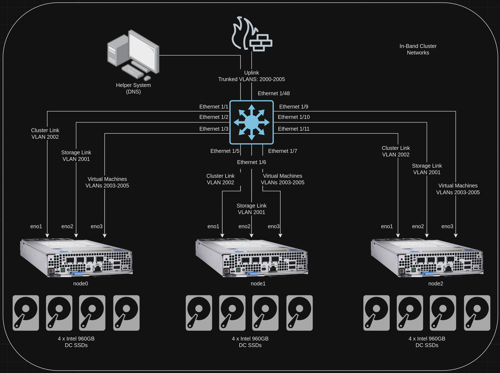
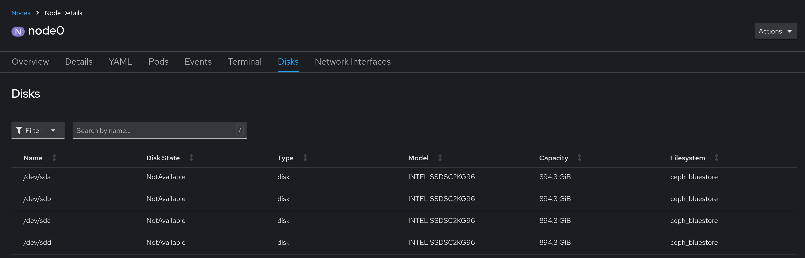
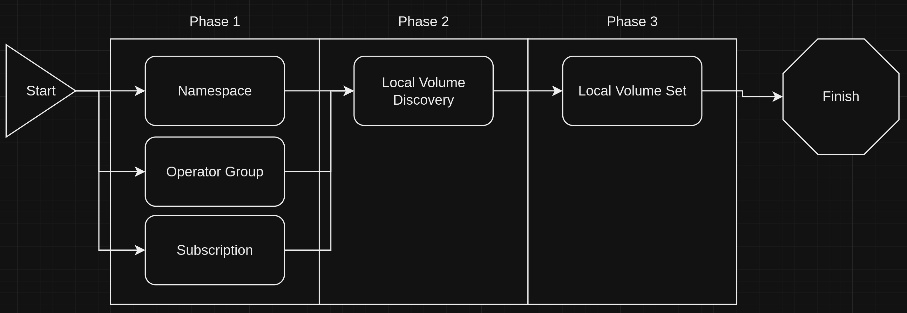

# Local Storage for Converged Storage
This block outlines how to setup local storage for consumption later in converged storage.

## Information
| Key | Value |
| --- | ---|
| **Platform:** | Red Hat OpenShift |
| **Scope:** | Bootstrapping |
| **Tooling:** | CLI, yaml, helm, GitOps |
| **Pre-requisite Blocks:** | <ul><li>[Helm Getting Started](../helm-getting-started/README.md)</li><li>[Installing Operators via Yaml](../installing-operators-yaml/README.md)</li><li>[GitOps Cluster Config](../gitops-cluster-config-rbac/README.md)</li></ul> |
| **Pre-requisite Patterns:** | N/A |
| **Example Application**: | N/A |

## Table of Contents
* [Part 0 - Assumptions and Network Layout](#part-0---assumptions-and-network-layout)
* [Part 1 - Defining Configuration](#part-1---defining-configuration)
* [Part 2 - Installing the Local Storage Operator](#part-2---installing-the-local-storage-operator)
* [Part 3 - Local Volume Discovery](#part-3---local-volume-discovery)
* [Part 4 - Local Volume Set](#part-4---local-volume-set)
* [Part 5 - Created Storage Class](#part-5---created-storage-class)

## Part 0 - Assumptions and Network Layout
This block has a few key assumptions, in an attempt to keep things digestable:
1. A target platform is installed and reachable.
2. The installation content for the local storage operator is available.
3. Local disks meeting the ODF requirements are installed in the nodes.

The following example subnets/VLANs will be used:
| VLAN | Subnet | Description |
| --- | ---| --- |
| 2000 | 172.16.0.0/24 | Out of band management interfaces of hardware |
| 2001 | 172.16.1.0/24 | Hyperconverged storage network |
| 2002 | 172.16.2.0/23 | Cluster primary network for ingress, load balanced services, and MetalLB pools |
| 2003 | 172.16.4.0/24 | First dedicated network for bridged virtual machines |
| 2004 | 172.16.5.0/24 | Second dedicated network for bridged virtual machines |
| 2005 | 172.16.6.0/24 | Third dedicated network for bridged virtual machines |

The following network information will be used:
| IP Address | Device | Description |
| --- | --- | --- |
| 172.16.2.1 | Router | Router IP address for subnet |
| 172.16.2.2 | Rendezvous | Rendezvous IP address for bootstrapping cluster, temporary |
| 172.16.2.2 | node0 | node0's cluster IP address |
| 172.16.2.3 | node1 | node1's cluster IP address |
| 172.16.2.4 | node1 | node2's cluster IP address |
| 172.16.2.10 | API | Cluster's API address |
| 172.16.2.11 | Ingress | Cluster's ingress address |
| 10.1.3.106 | DNS | DNS server address

The following cluster information will be used:
```yaml
cluster_info:
  name: example-cluster
  version: stable
  base_domain: your-domain.com
  masters: 3
  workers: 0
  api_ip: 172.16.2.10
  ingress_ip: 172.16.2.11
  host_network_cidr: 172.16.2.0/23
```

The following node information will be used:
```yaml
nodes:
  - name: node0
    cluster_link:
      mac_address: b8:ca:3a:6e:69:40
      ip_address: 172.16.2.2
  - name: node1
    cluster_link:
      mac_address: 24:6e:96:69:56:90
      ip_address: 172.16.2.3
  - name: node2
    cluster_link:
      mac_address: b8:ca:3a:6e:17:d8
      ip_address: 172.16.2.4
```

Topology:


Identified Disks:
```
sh-5.1# lsblk | grep disk | grep 894
sda      8:0    0 894.3G  0 disk 
sdb      8:16   0 894.3G  0 disk 
sdc      8:32   0 894.3G  0 disk 
sdd      8:48   0 894.3G  0 disk 
```



## Part 1 - Defining Configuration
To get started, a few configuration items should be defined:
- What nodes to discover disks on
- What type of disks to use in a storage class
- Storage class information

Full explanations are provided below, but for now, the following values will define the configuration on the example cluster:
```yaml
---
localStorage:
  nodes:
    - node0
    - node1
    - node2
  storageClassName: local-disks
  volumeMode: Block
  deviceInclusionSpec:
    deviceTypes:
      - disk
    deviceMechanicalProperties:
      - NonRotational
```

## Part 2 - Installing the Local Storage Operator
Local storage functionality is provided by the local storage operator, which can be installed via GitOps. Refer to the [GitOps Deployment](../gitops-deployment-k8s/README.md) block for more information.

The installation happens over different phases, as some configuration components need to happen after others have completed.


The following resources are all foundational to the next phase

### Namespace
```yaml
---
{{ if .Values.localStorage }}
---
apiVersion: v1
kind: Namespace
metadata:
  name: openshift-local-storage
  annotations:
    argocd.argoproj.io/sync-wave: "1"
{{ end }}
```

### Operator Group
```yaml
---
apiVersion: operators.coreos.com/v1
kind: OperatorGroup
metadata:
  name: local-operator-group
  namespace: openshift-local-storage
  annotations:
    argocd.argoproj.io/sync-wave: "1"
spec:
  targetNamespaces:
  - openshift-local-storage
{{ end }}
```

### Subscription
```yaml
---
{{ if .Values.localStorage }}
---
apiVersion: operators.coreos.com/v1alpha1
kind: Subscription
metadata:
  name: local-storage-operator
  namespace: openshift-local-storage
  annotations:
    argocd.argoproj.io/sync-wave: "1"
spec:
  channel: "stable"
  installPlanApproval: Automatic
  name: local-storage-operator
  source: redhat-operators
  sourceNamespace: openshift-marketplace
{{ end }}
```

> Note:
>
> Calling out sync wave 1 is not technically required, however it is in included for clarity.

## Part 3 - Local Volume Discovery
Local volume discovery is the functionality that identifies disks on specified nodes that can be used to create a volume set. This is a dynamic discovery approach, allowing for automatic discovery of devices.

In the example cluster, all 3 nodes have 4 disks that will be discovered as available for consumption, so all nodes from `.Values.localStorage.nodes` are templated into the `nodeSelector`.

```yaml
{{ if .Values.localStorage }}
---
apiVersion: local.storage.openshift.io/v1alpha1
kind: LocalVolumeDiscovery
metadata:
  name: auto-discover-devices
  namespace: openshift-local-storage
  annotations:
    argocd.argoproj.io/sync-wave: "2"
    argocd.argoproj.io/sync-options: SkipDryRunOnMissingResource=true
spec:
  nodeSelector:
    nodeSelectorTerms:
      - matchExpressions:
          - key: kubernetes.io/hostname
            operator: In
            values:
            {{- range .Values.localStorage.nodes }}
              - {{ . }}
            {{- end }}
{{ end }}
```

This will create a set of pods, some mapped 1:1 with nodes via DaemonSet, that scan for disks:
```
oc get pods -n openshift-local-storage
NAME                                     READY   STATUS    RESTARTS   AGE
diskmaker-discovery-2kjnm                2/2     Running   2          22h
diskmaker-discovery-sr2hz                2/2     Running   2          22h
diskmaker-discovery-z65xv                2/2     Running   2          22h
diskmaker-manager-96n9c                  2/2     Running   2          22h
diskmaker-manager-978bg                  2/2     Running   2          22h
diskmaker-manager-s9sft                  2/2     Running   2          22h
local-storage-operator-d575d99b8-z4d6h   1/1     Running   1          22h
```

Sync wave 2 is specified, as the operator needs to reach a healthy state for the LocalVolumeDiscovery cluster resource definition to exist.

## Part 4 - Local Volume Set
A local volume set takes discovered disks and presents them for consumption via a storage class. Multiple sets can be created with different disk selection criteria, if desired.

The example cluster has a uniform set of disks, all of which will be consumed in a single storage class, so a single local volume set can be used.

```yaml
{{ if .Values.localStorage }}
---
apiVersion: local.storage.openshift.io/v1alpha1
kind: LocalVolumeSet
metadata:
  name: local-disks
  namespace: openshift-local-storage
  annotations:
    argocd.argoproj.io/sync-wave: "3"
    argocd.argoproj.io/sync-options: SkipDryRunOnMissingResource=true
spec:
  storageClassName: {{ .Values.localStorage.storageClassName }}
  volumeMode: {{ .Values.localStorage.volumeMode }}
  deviceInclusionSpec:
{{- toYaml .Values.localStorage.deviceInclusionSpec | nindent 4 }}
{{ end }}
```

This should be configured after local volume discovery has started, so sync wave 3 is specified. In addition, the `deviceInclusionSpec` matches "any disk that is not a rotational disk", meaning the installed SSDs will be selected.

## Part 5 - Created Storage Class
Once initialization of the local volume set finishes, a storage class will be automatically created that maps requests to the underlying disks.

```yaml
kind: StorageClass
apiVersion: storage.k8s.io/v1
metadata:
  name: local-disks
  uid: 700a9c43-2768-4842-9b91-104f9ab45d8f
  resourceVersion: '45920'
  creationTimestamp: '2024-06-18T20:48:10Z'
  labels:
    local.storage.openshift.io/owner-name: local-disks
    local.storage.openshift.io/owner-namespace: openshift-local-storage
...
provisioner: kubernetes.io/no-provisioner
reclaimPolicy: Delete
volumeBindingMode: WaitForFirstConsumer
```