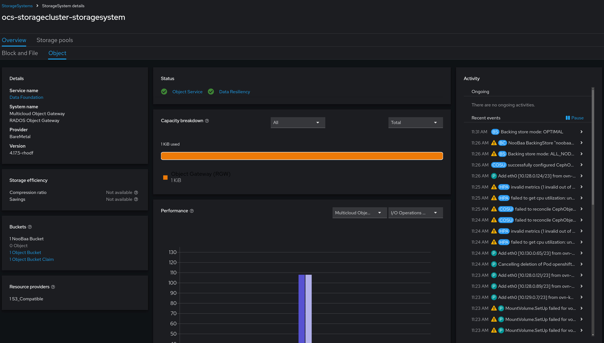
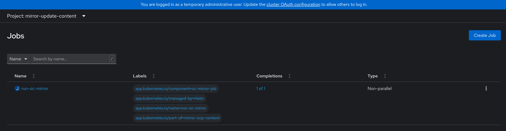
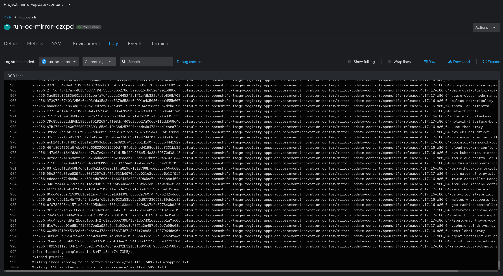
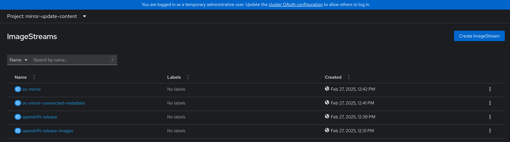
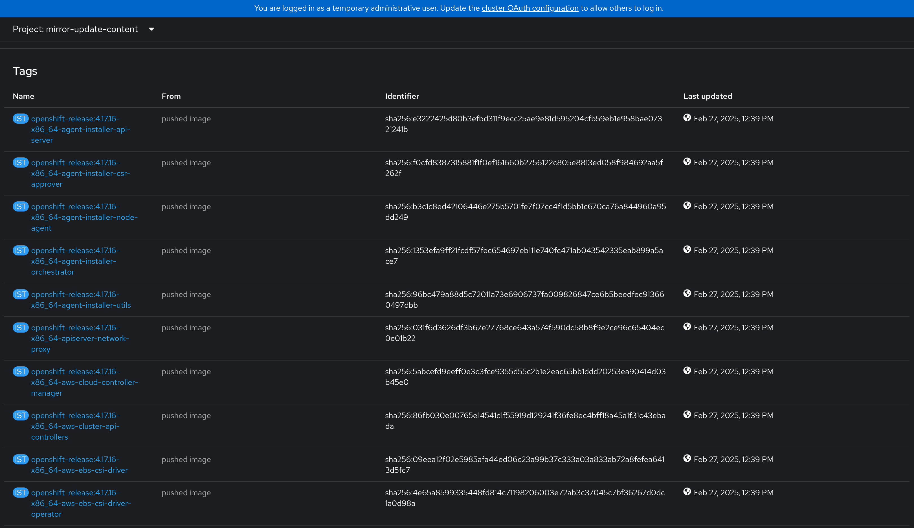

# Mirroring Update Content to an ACP
This block outlines how to leverage [oc-mirror](https://docs.openshift.com/container-platform/4.16/installing/disconnected_install/about-installing-oc-mirror-v2.html) to mirror images for running platform updates. The internal registry will be used, however any local OCI-compliant registry would also be an option.

## Information
| Key | Value |
| --- | ---|
| **Platform:** | Red Hat OpenShift |
| **Scope:** | N/A |
| **Tooling:** | CLI, yaml, helm, GitOps |
| **Pre-requisite Blocks:** | <ul><li>[K8s Core Concepts](../k8s-core-concepts/README.md)</li><li>[Getting Started with Helm](../helm-getting-started/README.md)</li><li>[Deploying GitOps Functionality](../gitops-deployment-k8s/README.md)</li><li>[Backing the Internal Registry with Persistent Storage](../backing-internal-registry-with-storage-ha/README.md)</li></ul> |
| **Pre-requisite Patterns:** | N/A |
| **Example Application**: | N/A |

## Table of Contents
* [Part 0 - Assumptions and Network Layout](#part-0---assumptions-and-network-layout)
* [Part 1 - Reviewing Existing Deployment Automation](#part-1---reviewing-existing-deployment-automation)
* [Part 2 - Reviewing Available Customizations](#part-2---reviewing-available-customizations)
* [Part 3 - Deploying the Chart](#part-3---deploying-the-chart)

## Part 0 - Assumptions and Network Layout
This block has a few key assumptions, in an attempt to keep things digestable:
1. A target platform is installed and reachable.
2. Persistent storage is available, either by converged storage (ODF), or another storage solution is available that provides object storage.

The following example subnets/VLANs will be used:
| VLAN | Subnet | Description |
| --- | ---| --- |
| 2000 | 172.16.0.0/24 | Out of band management interfaces of hardware |
| 2001 | 172.16.1.0/24 | Hyperconverged storage network |
| 2002 | 172.16.2.0/23 | Cluster primary network for ingress, load balanced services, and MetalLB pools |
| 2003 | 172.16.4.0/24 | First dedicated network for bridged virtual machines |
| 2004 | 172.16.5.0/24 | Second dedicated network for bridged virtual machines |
| 2005 | 172.16.6.0/24 | Third dedicated network for bridged virtual machines |

The following network information will be used:
| IP Address | Device | Description |
| --- | --- | --- |
| 172.16.2.1 | Router | Router IP address for subnet |
| 172.16.2.2 | Rendezvous | Rendezvous IP address for bootstrapping cluster, temporary |
| 172.16.2.2 | node0 | node0's cluster IP address |
| 172.16.2.3 | node1 | node1's cluster IP address |
| 172.16.2.4 | node1 | node2's cluster IP address |
| 172.16.2.10 | API | Cluster's API address |
| 172.16.2.11 | Ingress | Cluster's ingress address |
| 172.16.1.2 | node0-storage | node0's storage IP address |
| 172.16.1.3 | node1-storage | node1's storage IP address |
| 172.16.1.4 | node2-storage | node2's storage IP address |
| 10.1.3.106 | DNS | DNS server address |

The following cluster information will be used:
```yaml
cluster_info:
  name: example-cluster
  version: stable
  base_domain: your-domain.com
  masters: 3
  workers: 0
  api_ip: 172.16.2.10
  ingress_ip: 172.16.2.11
  host_network_cidr: 172.16.2.0/23
```

The following node information will be used:
```yaml
nodes:
  - name: node0
    cluster_link:
      mac_address: b8:ca:3a:6e:69:40
      ip_address: 172.16.2.2
  - name: node1
    cluster_link:
      mac_address: 24:6e:96:69:56:90
      ip_address: 172.16.2.3
  - name: node2
    cluster_link:
      mac_address: b8:ca:3a:6e:17:d8
      ip_address: 172.16.2.4
```

Topology:


This block also assumes that:
- the converged storage (ODF) service has been installed and is ready for consumption

- the declarative state management (argoCD) service has been installed and is ready for consumption
- the destination registry, such as the internal registry, has been backed by persistent storage

## Part 1 - Reviewing Existing Deployment Automation
A [helm chart](https://github.com/RedHatEdge/acp-operations/tree/main/charts/mirror-update-content) has been created that will automatically deploy a job, along with supporting resources, required to mirror update content to an ACP.

This chart can be deployed "stand-alone", or deployed through the declarative state management (ArgoCD) service.

## Part 2 - Reviewing Available Customizations
The chart contains an [example values file](https://github.com/RedHatEdge/acp-operations/blob/main/charts/mirror-update-content/example-values.yaml) that can be customized, if desired. The contents are repeated here for informational purposes only.

```yaml
---
---
# Specify what platform/operators/images to sync
# Refer to the oc-mirror docs for more information on how to specify what to sync: https://docs.openshift.com/container-platform/4.16/installing/disconnected_install/about-installing-oc-mirror-v2.html
# This will be applied as-is under the .mirror key, and fed to the oc-mirror job
whatToMirror:
  platform:
    graph: false
    channels:
      - name: stable-4.17
        type: ocp
        shortestPath: true
        minVersion: 4.17.16

# To go from 4.16 --> 4.17, use the following configuration:
# whatToMirror:
#   platform:
#     graph: false
#     channels:
#       - name: stable-4.17
#         type: ocp
#         shortestPath: true
#       - name: stable-4.16
#         type: ocp
#         shortestPath: true
#         minVersion: 4.16.5

# To also mirror operator content, use the following configuration:
# whatToMirror:
#   platform:
#     graph: false
#     channels:
#       - name: stable-4.17
#         type: ocp
#         shortestPath: true
#         minVersion: 4.17.16
#   operators:
#     - catalog: registry.redhat.io/redhat/redhat-operator-index:v4.17
#       packages:
#        - name: ansible-automation-platform
#        - name: openshift-cert-manager-operator
#        - name: kubernetes-nmstate-operator
#        - name: kubevirt-hyperconverged
#        - name: odf-operator
#        - name: openshift-pipelines-operator-rh

# To also mirror additional images, use the following configuration:
# whatToMirror:
#   platform:
#     graph: false
#     channels:
#       - name: stable-4.17
#         type: ocp
#         shortestPath: true
#         minVersion: 4.17.16
#   operators:
#     - catalog: registry.redhat.io/redhat/redhat-operator-index:v4.17
#       packages:
#        - name: ansible-automation-platform
#        - name: openshift-cert-manager-operator
#        - name: kubernetes-nmstate-operator
#        - name: kubevirt-hyperconverged
#        - name: odf-operator
#        - name: openshift-pipelines-operator-rh
#   additionalImages:
#    - name: registry.redhat.io/ubi8/ubi:latest
#    - name: registry.redhat.io/ubi9/ubi@sha256:20f695d2a91352d4eaa25107535126727b5945bff38ed36a3e59590f495046f0

# Where to mirror the content to
destinationRegistry:
  # Hostname of the registry with optional path to a specific repo
  host: default-route-openshift-image-registry.apps.yourcluster.com/mirror-update-content
  # If certificates should be validated
  skipTLS: 'false'
  # If this is the internal OCP regisry
  internalRegistry: true

# Tools image to use for the job
openshiftToolsImage: 'quay.io/openshift-release-dev/ocp-v4.0-art-dev@sha256:535ce24b5f1894d2a07bfa7eed7ad028ffde0659693f2a571ac4712a21cd028c'

# Base64-encoded pull secret
pullSecret: 'base64-encoded-pull-secret'
```

Review the documentation in the chart's [readme](https://github.com/RedHatEdge/acp-operations/blob/main/charts/mirror-update-content/README.md#required-values) to customize the deployment.

## Part 3 - Deploying the Chart
This chart can be deployed as a standalone application. Review the [deployment section](https://github.com/RedHatEdge/acp-operations/blob/main/charts/mirror-update-content/README.md#deployment) of the chart's readme.

In addition, this chart can be deployed through the declarative state management (ArgoCD) service. To help accomplish this, a ["meta" chart](https://github.com/RedHatEdge/acp-operations/blob/main/charts/internal-registry-config-app/README.md) has been created that creates the appropriate resources so ArgoCD handles the rollout.

Review the meta chart's [readme](https://github.com/RedHatEdge/acp-operations/blob/main/charts/internal-registry-config-app/README.md) for further documentation.

Once the rollout is executed, a new job will appear, which will run the sync job:


The logs of the sync job pod will show images being synced:


After completion, if the destination was set to the internal registry, then new ImageStreams will be created:


Within those ImageStreams, a large amount of tags will be shown, denoting images have been synced:

