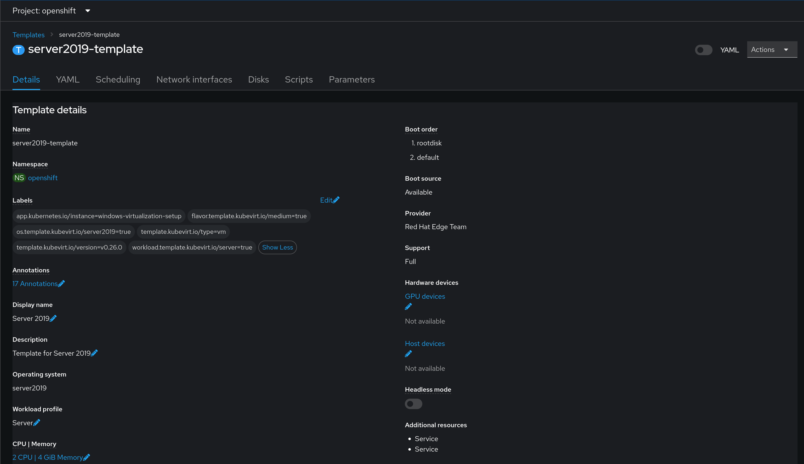
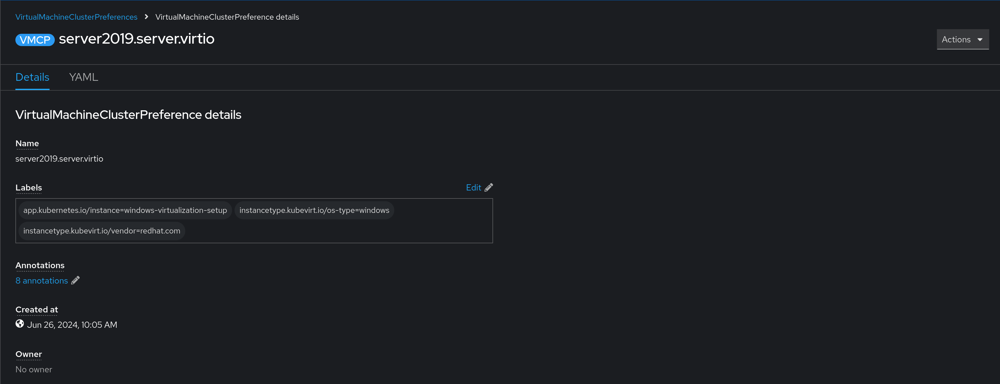

# OpenShift Virtualization Templates and Cluster Preferences
This block focuses on creating templates and setting cluster preferences for various operating systems. Windows templates will be used as an example.

## Information
| Key | Value |
| --- | ---|
| **Platform:** | Red Hat OpenShift |
| **Scope:** | Virtualization |
| **Tooling:** | CLI, yaml |
| **Pre-requisite Blocks:** | <ul><li>[Importing Installer ISOs](../importing-installer-isos/README.md)</li><li>[Autounattend for Windows](../autounattend-for-windows/README.md)</li><li>[Attaching Autounattend Files to Windows Virtual Machines](../attaching-autounattend-files-to-virtual-machine/README.md)</li><li>[Installing Operators via Yaml](../installing-operators-yaml/README.md)</li><li>[Enabling Tekton Virtual Machine Tasks](../enabling-tekton-vm-tasks/README.md)</li></ul> |
| **Pre-requisite Patterns:** | [Creating Windows Virtual Machine Templates for Virtualization on an ACP](../../patterns/windows-templates-acp-virtualization/README.md) |
| **Example Application**: | N/A |

## Table of Contents
* [Part 0 - Assumptions and Network Layout](#part-0---assumptions-and-network-layout)
* [Part 1 - Templates](#part-1---templates)
  * [Section 1 - Template Resource](#section-1---template-resource)
  * [Section 2 - Annotations](#section-2---annotations)
  * [Section 3 - Objects](#section-3---objects)
  * [Section 4 - Parameters](#section-4---parameters)
* [Part 2 - Cluster Preferences](#part-2---cluster-preferences)
* [Part 3 - Applying Templates and Cluster Preferences](#part-3---applying-templates-and-cluster-preferences)

## Part 0 - Assumptions and Network Layout
This block has a few key assumptions, in an attempt to keep things digestable:
1. A target platform is installed and reachable.
2. The installation content for the OpenShift virtualization operator is available.
3. Persistent storage is available, either by local or converged storage, or another storage solution.
4. Virtualization functionality is enabled in the BIOS of the underlying compute resources.

The following example subnets/VLANs will be used:
| VLAN | Subnet | Description |
| --- | ---| --- |
| 2000 | 172.16.0.0/24 | Out of band management interfaces of hardware |
| 2001 | 172.16.1.0/24 | Hyperconverged storage network |
| 2002 | 172.16.2.0/23 | Cluster primary network for ingress, load balanced services, and MetalLB pools |
| 2003 | 172.16.4.0/24 | First dedicated network for bridged virtual machines |
| 2004 | 172.16.5.0/24 | Second dedicated network for bridged virtual machines |
| 2005 | 172.16.6.0/24 | Third dedicated network for bridged virtual machines |

The following network information will be used:
| IP Address | Device | Description |
| --- | --- | --- |
| 172.16.2.1 | Router | Router IP address for subnet |
| 172.16.2.2 | Rendezvous | Rendezvous IP address for bootstrapping cluster, temporary |
| 172.16.2.2 | node0 | node0's cluster IP address |
| 172.16.2.3 | node1 | node1's cluster IP address |
| 172.16.2.4 | node1 | node2's cluster IP address |
| 172.16.2.10 | API | Cluster's API address |
| 172.16.2.11 | Ingress | Cluster's ingress address |
| 172.16.1.2 | node0-storage | node0's storage IP address |
| 172.16.1.3 | node1-storage | node1's storage IP address |
| 172.16.1.4 | node2-storage | node2's storage IP address |
| 10.1.3.106 | DNS | DNS server address |

The following cluster information will be used:
```yaml
cluster_info:
  name: example-cluster
  version: stable
  base_domain: your-domain.com
  masters: 3
  workers: 0
  api_ip: 172.16.2.10
  ingress_ip: 172.16.2.11
  host_network_cidr: 172.16.2.0/23
```

The following node information will be used:
```yaml
nodes:
  - name: node0
    cluster_link:
      mac_address: b8:ca:3a:6e:69:40
      ip_address: 172.16.2.2
  - name: node1
    cluster_link:
      mac_address: 24:6e:96:69:56:90
      ip_address: 172.16.2.3
  - name: node2
    cluster_link:
      mac_address: b8:ca:3a:6e:17:d8
      ip_address: 172.16.2.4
```

Topology:


This block also assumes the specified pre-requisite blocks have been reviewed and deployed as documented, and that the pre-requisite pattern has been reviewed. This block will focus on how to create a pipeline with some information about key concepts, whereas the pattern explains the tasks within the pipeline.

## Part 1 - Templates
OpenShift Virtualization provides a template resource type that is used to define the base settings and validations used when launching a virtual machine from that template. They define paramters (inputs), validations for those parameters, and what objects should be created when the template is invoked.

### Section 1 - Template Resource
The `Template` resource is handled by the `template.openshift.io/v1` API endpoint:

```yaml
---
apiVersion: template.openshift.io/v1
kind: Template
metadata:
  name: server2019-template
  namespace: openshift
```

### Section 2 - Annotations
The annotations and labels add detail to the template that will be reflected in the web interface, as well as define what fields can be edited when invoking the template:

```yaml
  annotations:
    defaults.template.kubevirt.io/disk: rootdisk
    defaults.template.kubevirt.io/network: default
    description: Template for Server 2019
    iconClass: icon-windows
    name.os.template.kubevirt.io/server2019: server2019
    openshift.io/display-name: Server 2019
    openshift.io/provider-display-name: Red Hat Edge Team
    openshift.kubevirt.io/pronounceable-suffix-for-name-expression: "true"
    tags: kubevirt,virtualmachine,windows
    template.kubevirt.io/editable: |
      /objects[0].spec.template.spec.domain.cpu.cores
      /objects[0].spec.template.spec.domain.memory.guest
      /objects[0].spec.template.spec.domain.devices.disks
      /objects[0].spec.template.spec.volumes
      /objects[0].spec.template.spec.networks
    template.kubevirt.io/provider: Red Hat Edge Team
    template.kubevirt.io/provider-support-level: Full
    template.kubevirt.io/provider-url: https://www.github.com/RedHatEdge/patterns
    template.kubevirt.io/version: v1alpha1
    template.openshift.io/bindable: "false"
  labels:
    flavor.template.kubevirt.io/medium: "true"
    os.template.kubevirt.io/server2019: "true"
    template.kubevirt.io/type: vm
    template.kubevirt.io/version: v0.26.0
    workload.template.kubevirt.io/server: "true"
```

### Section 3 - Objects
Objects are what are created when the template is invoked. Typically, this includes a `VirtualMachine`, but can also include other objects such as services, routes, or whatever else is needed:

```yaml
objects:
- apiVersion: v1 # Create a service for RDP access to the VM
  kind: Service
  metadata:
    name: ${NAME}-rdp
  spec:
    selector:
      kubevirt.io/domain: ${NAME}
    ports:
      - name: rdp
        protocol: TCP
        port: 3389
        targetPort: 3389
        nodePort: ${{ "{{" }}RDP_NODE_PORT{{ "}}" }}
    externalTrafficPolicy: ${EXTERNAL_TRAFFIC}
    type: NodePort
- apiVersion: v1
  kind: Service # Create a service for WinRM access to the VM
  metadata:
    name: ${NAME}-winrm
  spec:
    selector:
      kubevirt.io/domain: ${NAME}
    ports:
      - name: winrm
        protocol: TCP
        port: 5985
        targetPort: 5985
        nodePort: ${{ "{{" }}WINRM_NODE_PORT{{ "}}" }}
    externalTrafficPolicy: ${EXTERNAL_TRAFFIC}
    type: NodePort
- apiVersion: kubevirt.io/v1 # The virtual machine definition
  kind: VirtualMachine
  metadata:
    annotations:
      vm.kubevirt.io/validations: | # Validate the inputs from 'parameters'
        [
          {
            "name": "minimal-required-memory",
            "path": "jsonpath::.spec.domain.memory.guest",
            "rule": "integer",
            "message": "This VM requires more memory.",
            "min": 4294967296
          }, {
            "name": "windows-virtio-bus",
            "path": "jsonpath::.spec.domain.devices.disks[*].disk.bus",
            "valid": "jsonpath::.spec.domain.devices.disks[*].disk.bus",
            "rule": "enum",
            "message": "virtio disk bus type has better performance, install virtio drivers in VM and change bus type",
            "values": ["virtio"],
            "justWarning": true
          }, {
            "name": "windows-disk-bus",
            "path": "jsonpath::.spec.domain.devices.disks[*].disk.bus",
            "valid": "jsonpath::.spec.domain.devices.disks[*].disk.bus",
            "rule": "enum",
            "message": "disk bus has to be either virtio or sata or scsi",
            "values": ["virtio", "sata", "scsi"]
          }, {
            "name": "windows-cd-bus",
            "path": "jsonpath::.spec.domain.devices.disks[*].cdrom.bus",
            "valid": "jsonpath::.spec.domain.devices.disks[*].cdrom.bus",
            "rule": "enum",
            "message": "cd bus has to be sata",
            "values": ["sata"]
          }
        ]
    labels:
      app: ${NAME}
      vm.kubevirt.io/template: server2019-template
      vm.kubevirt.io/template.revision: "1"
      vm.kubevirt.io/template.version: v0.26.0
    name: ${NAME}
  spec:
    dataVolumeTemplates:
    - apiVersion: cdi.kubevirt.io/v1beta1
      kind: DataVolume
      metadata:
        name: ${NAME}
      spec:
        sourceRef:
          kind: DataSource
          name: ${DATA_SOURCE_NAME}
          namespace: ${DATA_SOURCE_NAMESPACE}
        storage:
          resources:
            requests:
              storage: 50Gi
    running: false
    template:
      metadata:
        annotations:
          vm.kubevirt.io/flavor: medium
          vm.kubevirt.io/os: server2019
          vm.kubevirt.io/workload: server
        labels:
          kubevirt.io/domain: ${NAME}
          kubevirt.io/size: medium
      spec:
        domain:
          clock:
            timer:
              hpet:
                present: false
              pit:
                tickPolicy: delay
              rtc:
                tickPolicy: catchup
          cpu:
            cores: 1
            sockets: 2
            threads: 1
          devices:
            disks:
            - disk:
                bus: sata
              name: rootdisk
            inputs:
            - bus: usb
              name: tablet
              type: tablet
            interfaces:
            - model: e1000e
              name: default
              masquerade: {}
              ports:
              - name: rdp
                protocol: TCP
                port: 3389
          features:
            hyperv:
              spinlocks:
                spinlocks: 8191
          machine:
            type: pc-q35-rhel9.2.0
          memory:
            guest: 4Gi
        networks:
        - name: default
          pod: {}
        terminationGracePeriodSeconds: 3600
        volumes:
        - dataVolume:
            name: ${NAME}
          name: rootdisk
```

> Note:
>
> To reference parameters values, use the `${VALUE}` notation.

### Section 4 - Parameters
Parameters are inputs that can be used to customize the virtual machine. These values are leveraged when creating objects.

Default values can be specififed, or optionally, generated:

```yaml
parameters:
- description: VM name
  from: windows-[a-z0-9]{6}
  generate: expression
  name: NAME
- description: Name of the DataSource to clone
  name: DATA_SOURCE_NAME
  value: server2019
- description: Namespace of the DataSource
  name: DATA_SOURCE_NAMESPACE
  value: openshift-virtualization-os-images
- description: The port on all nodes to bind for RDP for this VM
  name: RDP_NODE_PORT
  value: "31389"
- description: The port on all nodes to bind for WinRM for this VM
  name: WINRM_NODE_PORT
  value: "30000"
- description: External traffic policy for the Service
  name: EXTERNAL_TRAFFIC
  value: Cluster
```

## Part 2 - Cluster Preferences
Cluster preferences represent specific tuning parameters and settings for all virtual machines on a cluster. These are used to ensure smooth and performant operation of virtual machines without needing to specify every value in every virtual machine defintion:

```yaml
---
apiVersion: instancetype.kubevirt.io/v1beta1
kind: VirtualMachineClusterPreference
metadata:
  annotations:
    argocd.argoproj.io/sync-wave: "1"
    iconClass: icon-windows
    openshift.io/display-name: server2019.server.virtio
    openshift.io/documentation-url: https://access.redhat.com
    openshift.io/provider-display-name: Red Hat
    openshift.io/support-url: https://access.redhat.com
    tags: kubevirt,windows
  labels:
    instancetype.kubevirt.io/os-type: windows
    instancetype.kubevirt.io/vendor: redhat.com
  name: server2019.server.virtio
spec:
  clock:
    preferredTimer:
      hpet:
        present: false
      pit:
        tickPolicy: delay
      rtc:
        tickPolicy: catchup
  cpu:
    preferredCPUTopology: preferSockets
  devices:
    preferredAutoattachInputDevice: true
    preferredDiskBus: virtio
    preferredInputBus: virtio
    preferredInputType: tablet
    preferredInterfaceModel: virtio
  features:
    preferredHyperv:
      spinlocks:
        spinlocks: 8191
  preferredTerminationGracePeriodSeconds: 3600
  requirements:
    cpu:
      guest: 1
    memory:
      guest: 4Gi
```

## Part 3 - Applying Templates and Cluster Preferences
The OpenShift CLI can be used to apply both templates and cluster preferences:

```
oc apply -f code/template.yaml
oc apply -f code/clusterpreferences.yaml
```

Once complete, these resources can be reviewed in the WebUI, and are ready to be used for launching virtual machines:



