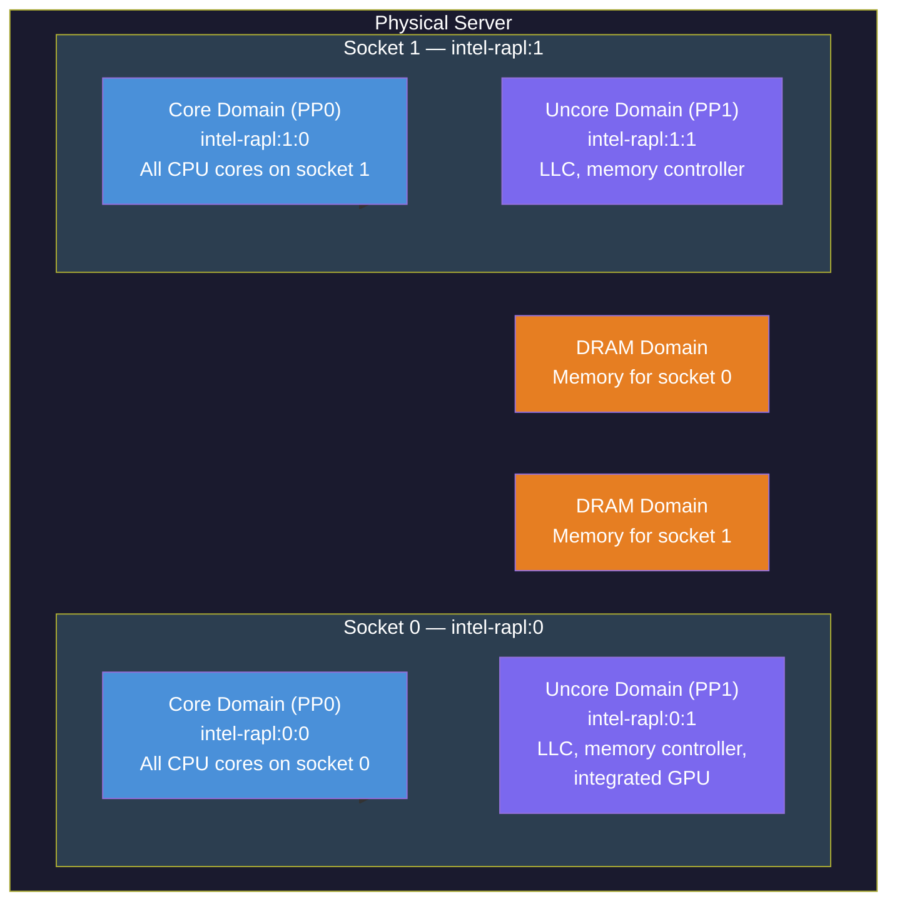
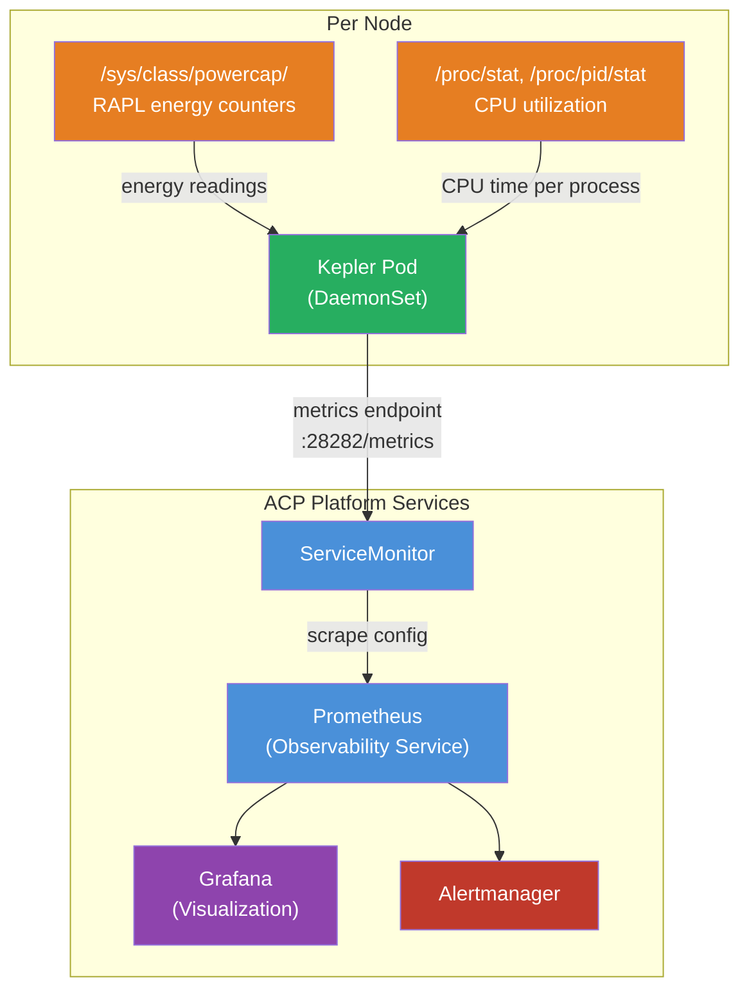
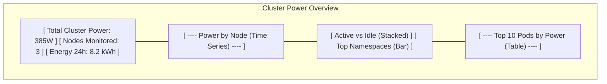

# Power Monitoring with Kepler on an ACP
This block outlines how to deploy and configure Kepler (Kubernetes-based Efficient Power Level Exporter) on an ACP to enable per-pod and per-workload power monitoring. Kepler is a CNCF sandbox project that reads hardware power meters and attributes energy consumption to individual workloads using a CPU-time proportional model.

## Information
| Key | Value |
| --- | ---|
| **Platform:** | Red Hat OpenShift |
| **Scope:** | Observability, Sustainability |
| **Tooling:** | CLI, yaml, helm, GitOps |
| **Pre-requisite Blocks:** | <ul><li>[Helm Getting Started](../helm-getting-started/README.md)</li><li>[Installing Operators via Yaml](../installing-operators-yaml/README.md)</li><li>[GitOps Cluster Config](../gitops-cluster-config-rbac/README.md)</li></ul> |
| **Pre-requisite Patterns:** | <ul><li>[Observability and Telemetry on an ACP](../../patterns/observability-and-telemetry-acp/README.md)</li></ul> |
| **Example Application**: | N/A |

## Table of Contents
* [Part 0 - Assumptions and Prerequisites](#part-0---assumptions-and-prerequisites)
* [Part 1 - Understanding the Power Monitoring Stack](#part-1---understanding-the-power-monitoring-stack)
* [Part 2 - Enabling User Workload Monitoring](#part-2---enabling-user-workload-monitoring)
* [Part 3 - Deploying Kepler](#part-3---deploying-kepler)
  * [Option A: Community Kepler Operator (OperatorHub)](#option-a-community-kepler-operator-operatorhub)
  * [Option B: Helm Chart (OCI Registry)](#option-b-helm-chart-oci-registry)
  * [Option C: GitOps-Based Deployment](#option-c-gitops-based-deployment)
* [Part 4 - Configuring Kepler](#part-4---configuring-kepler)
* [Part 5 - Validating Power Metrics](#part-5---validating-power-metrics)
* [Part 6 - Visualizing Power Data](#part-6---visualizing-power-data)
* [Part 7 - Building Alerting Rules](#part-7---building-alerting-rules)
* [Part 8 - Advanced Configuration](#part-8---advanced-configuration)

## Part 0 - Assumptions and Prerequisites
This block has a few key assumptions:
1. An ACP is installed and reachable, deployed on **bare-metal hardware** with Intel (Sandy Bridge+) or AMD (Zen+) processors.
2. The ACP's Observability service is enabled, or user workload monitoring is configured.
3. The cluster has internet access or a mirrored copy of the Kepler container image is available.
4. The user has `cluster-admin` privileges.

### A Note on Red Hat Power Monitoring Operator
Red Hat previously offered a productized distribution of Kepler as the "Power Monitoring for Red Hat OpenShift" operator. This operator reached [Technology Preview (v0.5)](https://docs.redhat.com/en/documentation/power_monitoring_for_red_hat_openshift/0.5/html/about_power_monitoring/about-power-monitoring) but has been **discontinued** — it never reached General Availability, and no further releases are planned.

This block uses the **upstream community Kepler project**, which is actively developed as a CNCF sandbox project. Three deployment methods are covered in [Part 3](#part-3---deploying-kepler):
- **Community Kepler Operator** via OperatorHub (operator-managed lifecycle)
- **Helm chart** via OCI registry (recommended quick start)
- **GitOps/manifests** for declarative state management (full control over resources)

### Bare-Metal Requirement
Kepler's primary power measurement source is RAPL (Running Average Power Limit), exposed through the Linux powercap framework at `/sys/class/powercap/`. This interface is only available on bare-metal deployments — most hypervisors and cloud providers do not expose host power management subsystems to guest VMs.

To verify RAPL availability on a node:
```bash
oc debug node/<node-name> -- chroot /host ls /sys/class/powercap/
```

Expected output on a bare-metal node with RAPL support:
```
intel-rapl:0
intel-rapl:0:0
intel-rapl:0:1
intel-rapl:1
intel-rapl:1:0
intel-rapl:1:1
```

Each `intel-rapl:X` entry represents a CPU package (socket), and sub-entries represent power domains (core, uncore, dram).

If no entries appear, the node either lacks RAPL support or is running as a virtual machine. Kepler can still operate in these environments using model-based estimation, but accuracy will be significantly reduced.

### How RAPL Power Domains Map to Hardware
Understanding the RAPL hierarchy helps interpret the metrics Kepler produces:



The **Package** reading encompasses Core + Uncore for a given socket. DRAM readings are separate. Kepler reads all available domains and exposes them via the `zone` label on metrics.

## Part 1 - Understanding the Power Monitoring Stack
Before deploying, it is helpful to understand how the components fit together:



**Data flow:**
1. Kepler runs as a DaemonSet — one pod per node
2. Each Kepler pod reads RAPL energy counters from `/sys/class/powercap/` and CPU time from `/proc`
3. Kepler calculates per-pod power attribution using the formula: `Pod Power = (Pod CPU Time Δ / Node CPU Time Δ) × Node Active Power`
4. Metrics are exposed on port 28282 in Prometheus format (configurable via `BIND_ADDRESS`)
5. A ServiceMonitor configures Prometheus to scrape these metrics
6. Grafana dashboards and Alertmanager rules consume the stored metrics

### What Kepler Reads (and Why It Needs Privileged Access)
Kepler requires access to host-level resources that are not normally available to unprivileged pods:

| Resource | Path | Purpose |
| --- | --- | --- |
| RAPL energy counters | `/sys/class/powercap/` | Read hardware energy measurements |
| Process CPU stats | `/proc/*/stat` | Determine CPU time per process for attribution |
| System CPU stats | `/proc/stat` | Calculate overall CPU utilization for active/idle power split |
| cgroup information | `/sys/fs/cgroup/` | Map processes to containers and pods |

Kepler mounts the host's `/proc` and `/sys` as read-only volumes. It does not modify any host state.

## Part 2 - Enabling User Workload Monitoring
For Kepler metrics to be scraped by OpenShift's built-in Prometheus, user workload monitoring must be enabled. If the Observability service is already configured per the [Observability and Telemetry](../../patterns/observability-and-telemetry-acp/README.md) pattern, this step may already be complete.

Check if user workload monitoring is enabled:
```bash
oc get configmap cluster-monitoring-config -n openshift-monitoring -o yaml
```

If the `enableUserWorkload` key is not set to `true`, create or update the ConfigMap:
```yaml
---
apiVersion: v1
kind: ConfigMap
metadata:
  name: cluster-monitoring-config
  namespace: openshift-monitoring
data:
  config.yaml: |
    enableUserWorkload: true
```

Apply the configuration:
```bash
oc apply -f cluster-monitoring-config.yaml
```

This causes OpenShift to deploy a Prometheus instance in the `openshift-user-workload-monitoring` namespace, which will scrape ServiceMonitors created by Kepler.

## Part 3 - Deploying Kepler
Kepler can be deployed through the community operator, via Helm, or via GitOps using the declarative state management service. This section covers all three approaches.

### Option A: Community Kepler Operator (OperatorHub)
The upstream [kepler-operator](https://github.com/sustainable-computing-io/kepler-operator) is available through OperatorHub and provides operator-managed lifecycle for Kepler. This is the closest equivalent to the discontinued Red Hat Power Monitoring Operator.

**Prerequisites:** The community Kepler Operator requires:
- **cert-manager** — for operator webhook certificates
- **Prometheus Operator** — for ServiceMonitor support (provided by OpenShift's built-in monitoring)

**Installation steps:**
1. In the OpenShift web console, navigate to **Operators → OperatorHub**
2. Search for **"kepler"**
3. Select the **Kepler Operator** (community) and click **Install**
4. Accept the default installation settings and click **Install**

Once the operator is installed, create a `PowerMonitor` custom resource to deploy Kepler:
```yaml
---
apiVersion: kepler.system.sustainable.computing.io/v1alpha1
kind: PowerMonitor
metadata:
  name: power-monitor
spec: {}
```

> The `PowerMonitor` instance **must** be named `power-monitor` — this is enforced by the operator.

The operator will deploy the Kepler DaemonSet, create the necessary RBAC, SecurityContextConstraints, Service, and ServiceMonitor resources automatically.

### Option B: Helm Chart (OCI Registry)
Kepler publishes a Helm chart as an OCI artifact. This is the recommended quick-start method for clusters where the operator is not desired.

> Note: The previously separate `kepler-helm-chart` repository has been deprecated and archived. The chart now lives in the main Kepler repository and is published as an OCI artifact.

Create the target namespace:
```yaml
---
apiVersion: v1
kind: Namespace
metadata:
  name: kepler
  labels:
    openshift.io/cluster-monitoring: "true"
```

Install Kepler from the OCI registry:
```bash
helm install kepler oci://quay.io/sustainable_computing_io/charts/kepler \
  --namespace kepler \
  --create-namespace \
  --set serviceMonitor.enabled=true
```

To pin a specific version:
```bash
helm install kepler oci://quay.io/sustainable_computing_io/charts/kepler \
  --version 0.11.4 \
  --namespace kepler \
  --create-namespace \
  --set serviceMonitor.enabled=true
```

### Option C: GitOps-Based Deployment
For deployments managed by the declarative state management service (GitOps), the following resources can be committed to the configuration repository.

#### Namespace
```yaml
---
apiVersion: v1
kind: Namespace
metadata:
  name: kepler
  labels:
    openshift.io/cluster-monitoring: "true"
  annotations:
    argocd.argoproj.io/sync-wave: "1"
```

#### ServiceAccount and RBAC
Kepler needs permissions to read node and pod information from the Kubernetes API:
```yaml
---
apiVersion: v1
kind: ServiceAccount
metadata:
  name: kepler-sa
  namespace: kepler
  annotations:
    argocd.argoproj.io/sync-wave: "1"
---
apiVersion: rbac.authorization.k8s.io/v1
kind: ClusterRole
metadata:
  name: kepler-clusterrole
  annotations:
    argocd.argoproj.io/sync-wave: "1"
rules:
  - apiGroups: [""]
    resources: ["nodes", "pods"]
    verbs: ["get", "list", "watch"]
  - apiGroups: [""]
    resources: ["nodes/metrics", "nodes/proxy", "nodes/stats"]
    verbs: ["get", "list", "watch"]
---
apiVersion: rbac.authorization.k8s.io/v1
kind: ClusterRoleBinding
metadata:
  name: kepler-clusterrole-binding
  annotations:
    argocd.argoproj.io/sync-wave: "1"
subjects:
  - kind: ServiceAccount
    name: kepler-sa
    namespace: kepler
roleRef:
  kind: ClusterRole
  name: kepler-clusterrole
  apiGroup: rbac.authorization.k8s.io
```

#### SecurityContextConstraints
On OpenShift, Kepler requires a custom SCC to access host paths:
```yaml
---
apiVersion: security.openshift.io/v1
kind: SecurityContextConstraints
metadata:
  name: kepler-scc
  annotations:
    argocd.argoproj.io/sync-wave: "1"
allowHostDirVolumePlugin: true
allowHostIPC: false
allowHostNetwork: true
allowHostPID: true
allowHostPorts: true
allowPrivilegedContainer: true
allowedCapabilities:
  - SYS_ADMIN
readOnlyRootFilesystem: true
runAsUser:
  type: RunAsAny
seLinuxContext:
  type: RunAsAny
users:
  - system:serviceaccount:kepler:kepler-sa
volumes:
  - hostPath
  - configMap
  - secret
  - projected
```

#### DaemonSet
The Kepler DaemonSet deploys one pod per node:
```yaml
---
apiVersion: apps/v1
kind: DaemonSet
metadata:
  name: kepler-exporter
  namespace: kepler
  annotations:
    argocd.argoproj.io/sync-wave: "2"
spec:
  selector:
    matchLabels:
      app: kepler
  template:
    metadata:
      labels:
        app: kepler
    spec:
      serviceAccountName: kepler-sa
      hostNetwork: true
      hostPID: true
      containers:
        - name: kepler
          image: quay.io/sustainable_computing_io/kepler:latest
          ports:
            - containerPort: 28282
              name: metrics
              protocol: TCP
          securityContext:
            privileged: true
          volumeMounts:
            - name: proc
              mountPath: /proc
              readOnly: true
            - name: sys
              mountPath: /sys
              readOnly: true
          env:
            - name: NODE_NAME
              valueFrom:
                fieldRef:
                  fieldPath: spec.nodeName
            - name: KEPLER_LOG_LEVEL
              value: "1"
          resources:
            requests:
              cpu: 100m
              memory: 128Mi
            limits:
              cpu: 500m
              memory: 256Mi
      volumes:
        - name: proc
          hostPath:
            path: /proc
            type: Directory
        - name: sys
          hostPath:
            path: /sys
            type: Directory
      tolerations:
        - operator: Exists
```

#### Service
```yaml
---
apiVersion: v1
kind: Service
metadata:
  name: kepler-exporter
  namespace: kepler
  labels:
    app: kepler
  annotations:
    argocd.argoproj.io/sync-wave: "2"
spec:
  selector:
    app: kepler
  ports:
    - name: metrics
      port: 28282
      targetPort: metrics
      protocol: TCP
  clusterIP: None
```

#### ServiceMonitor
This configures Prometheus to scrape Kepler metrics:
```yaml
---
apiVersion: monitoring.coreos.com/v1
kind: ServiceMonitor
metadata:
  name: kepler-exporter
  namespace: kepler
  labels:
    app: kepler
  annotations:
    argocd.argoproj.io/sync-wave: "3"
spec:
  selector:
    matchLabels:
      app: kepler
  endpoints:
    - port: metrics
      interval: 30s
      scheme: http
  namespaceSelector:
    matchNames:
      - kepler
```

## Part 4 - Configuring Kepler
Kepler's behavior can be tuned through environment variables on the DaemonSet. Key configuration options:

| Environment Variable | Default | Description |
| --- | --- | --- |
| `KEPLER_LOG_LEVEL` | `1` | Log verbosity: 0 = errors only, 5 = debug |
| `EXPOSE_CONTAINER_METRICS` | `true` | Expose per-container metrics |
| `EXPOSE_VM_METRICS` | `true` | Expose per-VM metrics (for OpenShift Virtualization workloads) |
| `EXPOSE_PROCESS_METRICS` | `false` | Expose per-process metrics (high cardinality — use with caution) |
| `ENABLE_GPU` | `false` | Enable GPU power monitoring via NVML (experimental) |
| `METRIC_PATH` | `/metrics` | Prometheus metrics endpoint path |
| `BIND_ADDRESS` | `0.0.0.0:28282` | Address and port for the metrics server |

For example, to enable GPU monitoring and increase the log level, add these environment variables to the DaemonSet:
```yaml
env:
  - name: ENABLE_GPU
    value: "true"
  - name: KEPLER_LOG_LEVEL
    value: "3"
```

### Metric Staleness and Scrape Interval
Kepler accumulates energy counter deltas between Prometheus scrapes. A scrape interval that is too long can cause attribution inaccuracies, as short-lived pods may be missed entirely. A 30-second scrape interval (the default in the ServiceMonitor above) provides a good balance between accuracy and Prometheus resource consumption.

## Part 5 - Validating Power Metrics
After deployment, verify that Kepler is running and producing metrics.

### Check DaemonSet Status
```bash
oc get daemonset kepler-exporter -n kepler
```

Expected output — `DESIRED` should equal `READY`, with one pod per node:
```
NAME               DESIRED   CURRENT   READY   UP-TO-DATE   AVAILABLE
kepler-exporter    3         3         3       3             3
```

### Check Pod Logs
```bash
oc logs -n kepler -l app=kepler --tail=20
```

Look for successful initialization messages indicating RAPL was discovered:
```
successfully discovered power meters: [rapl]
started kepler exporter on :28282
```

If RAPL is not available, Kepler will log that it is falling back to model-based estimation.

### Query Metrics Directly
Port-forward to a Kepler pod and query the metrics endpoint:
```bash
oc port-forward -n kepler daemonset/kepler-exporter 28282:28282
```

In another terminal:
```bash
curl -s http://localhost:28282/metrics | grep kepler_node_cpu_watts
```

Expected output:
```
kepler_node_cpu_watts{instance="node0",mode="dynamic",zone="package"} 45.2
kepler_node_cpu_watts{instance="node0",mode="idle",zone="package"} 12.8
```

### Verify Prometheus Scraping
In the OpenShift web console, navigate to **Observe → Metrics** and run:
```promql
kepler_node_cpu_watts
```

If results appear, the full pipeline — Kepler to ServiceMonitor to Prometheus — is working.

### Useful Validation Queries
| Query | Purpose |
| --- | --- |
| `kepler_node_cpu_watts` | Verify per-node power readings |
| `sum(kepler_node_cpu_watts)` | Total cluster CPU power draw |
| `topk(10, kepler_pod_cpu_watts)` | Top 10 power-consuming pods |
| `sum by (pod_namespace)(kepler_pod_cpu_watts)` | Power consumption by namespace |
| `kepler_node_cpu_idle_watts / kepler_node_cpu_watts` | Idle power ratio (higher = less efficient utilization) |

## Part 6 - Visualizing Power Data
Power metrics can be visualized through multiple channels on an ACP.

### OpenShift Web Console
If the Observability service is deployed with Grafana, custom dashboards can be created. Common panels for power monitoring include:

#### Cluster Power Overview Dashboard
A cluster-level dashboard typically includes:

| Panel | Type | PromQL |
| --- | --- | --- |
| Total Cluster Power | Stat | `sum(kepler_node_cpu_watts)` |
| Power by Node | Time Series | `kepler_node_cpu_watts` |
| Active vs Idle Power | Stacked Area | `kepler_node_cpu_active_watts` / `kepler_node_cpu_idle_watts` |
| Top 10 Namespaces by Power | Bar Chart | `topk(10, sum by (pod_namespace)(kepler_pod_cpu_watts))` |
| Top 10 Pods by Power | Table | `topk(10, kepler_pod_cpu_watts)` |
| Cluster Energy (24h) | Stat | `sum(increase(kepler_node_cpu_joules_total[24h])) / 3600000` (result in kWh) |

#### Namespace Drill-Down Dashboard
For per-namespace investigation:

| Panel | Type | PromQL |
| --- | --- | --- |
| Namespace Total Power | Stat | `sum(kepler_pod_cpu_watts{pod_namespace="$namespace"})` |
| Power by Pod | Time Series | `kepler_pod_cpu_watts{pod_namespace="$namespace"}` |
| Pod Energy Over Time | Stacked Area | `irate(kepler_pod_cpu_joules_total{pod_namespace="$namespace"}[5m])` |
| Pod Power Table | Table | `kepler_pod_cpu_watts{pod_namespace="$namespace"}` |

### Example Dashboard Layout


### Grafana Dashboard via ConfigMap
If using the community Grafana Operator, dashboards can be loaded via ConfigMap. The Kepler project provides a pre-built dashboard JSON at the [kepler-operator repository](https://github.com/sustainable-computing-io/kepler-operator). This JSON can be loaded as a GrafanaDashboard custom resource or embedded in a ConfigMap for automatic provisioning.

## Part 7 - Building Alerting Rules
Power metrics can drive alerts through the standard Prometheus alerting pipeline. Below are example alerting rules that cover common power monitoring scenarios.

### PrometheusRule Resource
```yaml
---
apiVersion: monitoring.coreos.com/v1
kind: PrometheusRule
metadata:
  name: kepler-power-alerts
  namespace: kepler
spec:
  groups:
    - name: power-consumption
      rules:
        - alert: NodeHighPowerDraw
          expr: kepler_node_cpu_watts > 300
          for: 15m
          labels:
            severity: warning
          annotations:
            summary: "Node {{ $labels.instance }} high power draw"
            description: >
              Node {{ $labels.instance }} has been drawing more
              than 300W of CPU power for over 15 minutes.
              Current value: {{ $value }}W.

        - alert: PodAnomalousPowerSpike
          expr: >
            kepler_pod_cpu_watts
            > 2 * avg_over_time(kepler_pod_cpu_watts[1h])
          for: 10m
          labels:
            severity: warning
          annotations:
            summary: "Pod {{ $labels.pod_name }} power spike"
            description: >
              Pod {{ $labels.pod_name }} in {{ $labels.pod_namespace }}
              is consuming more than 2x its 1-hour average power.

        - alert: NamespacePowerBudget
          expr: sum by (pod_namespace)(kepler_pod_cpu_watts) > 200
          for: 30m
          labels:
            severity: critical
          annotations:
            summary: "Namespace {{ $labels.pod_namespace }} over power budget"
            description: >
              Namespace {{ $labels.pod_namespace }} has been
              consuming more than 200W for over 30 minutes.
              Current value: {{ $value }}W.

        - alert: HighIdlePowerRatio
          expr: >
            kepler_node_cpu_idle_watts / kepler_node_cpu_watts > 0.7
          for: 1h
          labels:
            severity: info
          annotations:
            summary: "Node {{ $labels.instance }} mostly idle"
            description: >
              Node {{ $labels.instance }} has more than 70%
              idle power ratio for over 1 hour. Consider
              consolidating workloads for energy efficiency.
```

These rules can be deployed via GitOps alongside the Kepler DaemonSet resources.

### Alert Flow


## Part 8 - Advanced Configuration

### BMC/Redfish Platform Power (Experimental)
Kepler can read whole-node power from the Baseboard Management Controller via Redfish. This provides total platform power (including fans, NICs, PSU losses) rather than just CPU/DRAM power from RAPL.

This feature is experimental and requires BMC credentials to be provided to Kepler. Configuration varies by hardware vendor, so consult the [Kepler documentation](https://sustainable-computing.io/) for specifics.

Platform power provides a more complete picture but at lower granularity — it represents the entire node, not individual power domains.

### GPU Power Monitoring (Experimental)
For nodes with NVIDIA GPUs, Kepler can read GPU power via NVML (NVIDIA Management Library). Enable by setting the `ENABLE_GPU` environment variable to `true` on the DaemonSet.

This exposes additional metrics:
- `kepler_node_gpu_watts` — total GPU power per node
- `kepler_pod_gpu_watts` — per-pod GPU power attribution

GPU power monitoring requires the NVIDIA GPU Operator to be installed on the cluster and GPU devices to be properly configured.

### Power-Aware Workload Consolidation
While Kepler itself does not control workload placement, its metrics can inform consolidation decisions. The idle power ratio metric is particularly useful:

```promql
kepler_node_cpu_idle_watts / kepler_node_cpu_watts
```

A high idle power ratio (e.g., > 0.7) indicates a node that is consuming significant power with little productive work. Consolidating workloads onto fewer nodes and cordoning idle nodes can reduce overall power consumption.

The [Trimaran scheduler plugins](https://github.com/kubernetes-sigs/scheduler-plugins/blob/master/pkg/trimaran/README.md) (from kubernetes-sigs) provide load-aware scheduling that packs workloads onto fewer nodes, indirectly reducing power consumption by allowing idle nodes to be powered down or placed in low-power states.

### Carbon Footprint Calculation
Power metrics from Kepler provide the energy component needed for carbon footprint calculations:

```
CO₂ (grams) = Energy (kWh) × PUE × Carbon Intensity (gCO₂/kWh)
```

To calculate workload-level energy in kWh over a period:
```promql
sum by (pod_namespace)(
  increase(kepler_pod_cpu_joules_total[24h])
) / 3600000
```

Carbon intensity data can be obtained from:
- **[Electricity Maps](https://www.electricitymaps.com/)** — real-time grid carbon intensity by region
- **[WattTime](https://www.watttime.org/)** — marginal emissions data
- **Static regional averages** — as a fallback when real-time data is unavailable

### Known Limitations
Understanding the limitations of power monitoring helps set appropriate expectations:

| Limitation | Impact | Mitigation |
| --- | --- | --- |
| CPU-time-only attribution | Two pods at 50% CPU may actually consume very different power depending on instruction mix (compute-bound vs memory-bound) | Use RAPL DRAM domain metrics alongside CPU for a more complete picture |
| No storage/network I/O power | Power consumed by disk and network operations is not attributed to pods | Acknowledge this gap in reporting; use platform-level BMC power for total draw |
| Bare-metal requirement | VMs and cloud instances typically lack RAPL access | Deploy on bare-metal ACPs; accept model-based estimation on VMs |
| Short-lived pods | Pods that start and stop between scrape intervals may be missed | Reduce the scrape interval (15s minimum recommended) |
| Idle power distribution | Idle power is distributed proportionally, not causally | Note this in reports; idle attribution is an estimate per GHG Protocol guidelines |
