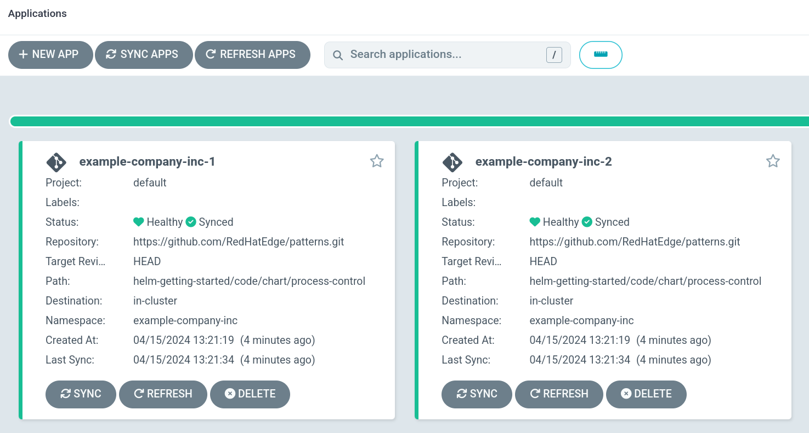

# Scaling GitOps Deployments
This block highlights how Red Hat OpenShift GitOps can scale up deployments easily.

## Table of Contents
1. Introduction to ApplicationSets
2. Scaling Up Deployments
3. Example Deployment

## Part 1 - Introduction to ApplicationSets
In OpenShift GitOps, [ApplicationSets](https://argo-cd.readthedocs.io/en/stable/operator-manual/applicationset/), a custom CRD, are used to generate applications based on a generator. These generated applications can be used to template out many deployments across a single cluster, or across many clusters. When an ApplicationSet is configured, the applications are rendered and show up as applications.

## Part 2 - Scaling Up Deployments via List Generator
Let's consider the following ApplicationSet:
```yaml
---
apiVersion: argoproj.io/v1alpha1
kind: ApplicationSet
metadata:
  name: process-control-as
  namespace: openshift-gitops
spec:
  generators:
    - list:
        elements:
          - deploymentNumber: '1'
            displayName: "example-company-inc"
            companyName: "Example_Company_Inc"
            billingAddress: "100_East_Davie_Street"
            billingCity: "Raleigh"
            billingState: "North Carolina"
            billingZipCode: "27601"
            deploymentAddress: "1_Main_St_SE"
            deploymentCity: "Minneapolis"
            deploymentState: "Minnesota"
            deploymentZipCode: "55414"
            serviceProvider: "Managed_Services_Inc"
            namespace: "example-company-inc"
          - deploymentNumber: '2'
            displayName: "example-company-inc"
            companyName: "Example_Company_Inc"
            billingAddress: "Werner-von-Siemens-Ring_12"
            billingCity: "Raleigh"
            billingState: "North Carolina"
            billingZipCode: "27601"
            deploymentAddress: "Werner-von-Siemens-Ring_12"
            deploymentCity: "Munich"
            deploymentState: "Grasbrunn"
            deploymentZipCode: "85630"
            serviceProvider: "Managed_Services_Inc"
            namespace: "example-company-inc"
  template:
    metadata:
      name: '{{displayName}}-{{deploymentNumber}}'
      annotations:
        companyName: '{{companyName}}'
        billingAddress: '{{billingAddress}}'
        billingCity: '{{billingCity}}'
        billingState: '{{billingState}}'
        billingZipCode: '{{billingZipCode}}'
        deploymentAddress: '{{deploymentAddress}}'
        deploymentCity: '{{deploymentCity}}'
        deploymentState: '{{deploymentState}}'
        deploymentZipCode: '{{deploymentZipCode}}'
        serviceProvider: '{{serviceProvider}}'
    spec:
      project: default
      source:
        repoURL: https://github.com/RedHatEdge/patterns.git
        targetRevision: HEAD
        path: helm-getting-started/code/chart/process-control
      destination:
        server: https://kubernetes.default.svc
        namespace: '{{namespace}}'
```

In this ApplicationSet, the [list generator](https://argo-cd.readthedocs.io/en/stable/operator-manual/applicationset/Generators-List/) is used to render applications from the list provided above. There are [multiple generators](https://argo-cd.readthedocs.io/en/stable/operator-manual/applicationset/Generators/) available, however.

In the list above, these two elements are defined:
```yaml
- deploymentNumber: '1'
  displayName: "example-company-inc"
  companyName: "Example_Company_Inc"
  billingAddress: "100_East_Davie_Street"
  billingCity: "Raleigh"
  billingState: "North Carolina"
  billingZipCode: "27601"
  deploymentAddress: "1_Main_St_SE"
  deploymentCity: "Minneapolis"
  deploymentState: "Minnesota"
  deploymentZipCode: "55414"
  serviceProvider: "Managed_Services_Inc"
  namespace: "example-company-inc"
- deploymentNumber: '2'
  displayName: "example-company-inc"
  companyName: "Example_Company_Inc"
  billingAddress: "Werner-von-Siemens-Ring_12"
  billingCity: "Raleigh"
  billingState: "North Carolina"
  billingZipCode: "27601"
  deploymentAddress: "Werner-von-Siemens-Ring_12"
  deploymentCity: "Munich"
  deploymentState: "Grasbrunn"
  deploymentZipCode: "85630"
  serviceProvider: "Managed_Services_Inc"
  namespace: "example-company-inc"
```

These are then templated out into the applications:
```yaml
---
template:
  metadata:
    name: '{{displayName}}-{{deploymentNumber}}'
    annotations:
      companyName: '{{companyName}}'
      billingAddress: '{{billingAddress}}'
      billingCity: '{{billingCity}}'
      billingState: '{{billingState}}'
      billingZipCode: '{{billingZipCode}}'
      deploymentAddress: '{{deploymentAddress}}'
      deploymentCity: '{{deploymentCity}}'
      deploymentState: '{{deploymentState}}'
      deploymentZipCode: '{{deploymentZipCode}}'
      serviceProvider: '{{serviceProvider}}'
```

For this example, these templated values are simply used for annotations, but can be used to template out Helm parameters, clusters, and more.

## Part 3 - Example Deployment
To test deploying using the example in this repo, use the following:
```
oc apply -f code/argocd/applicationset.yaml
```

Once applied, the ApplicationSet will be created:
```
fedora:~/code/patterns$ oc get ApplicationSets -n openshift-gitops
NAME                 AGE
process-control-as   2m43s
```

And the applications will be created:
