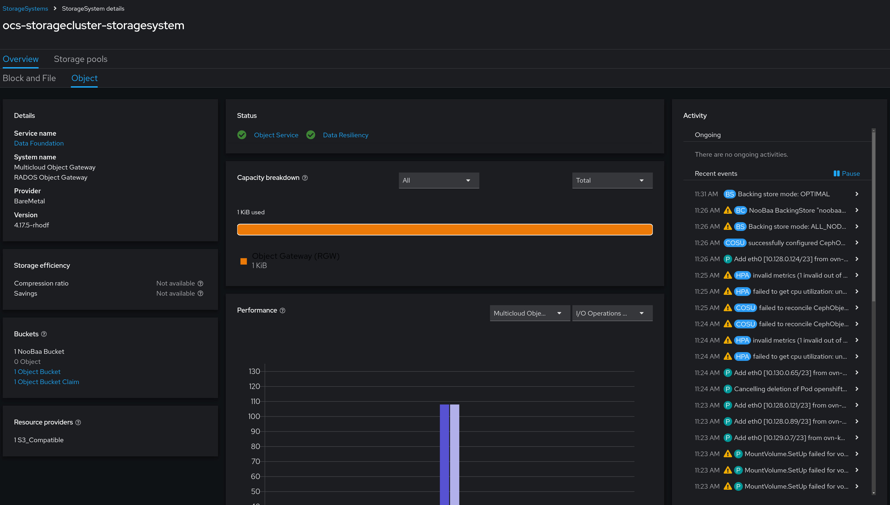
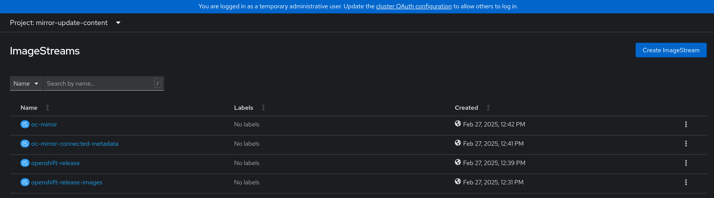
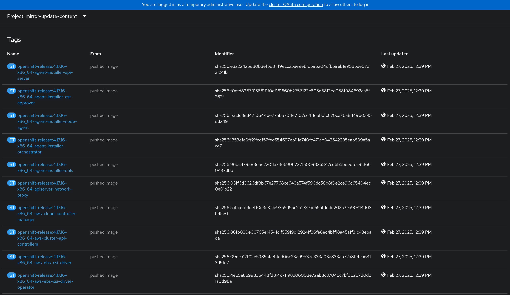

# Setting Update Content Sources for an ACP
This block outlines how to configure an ACP to pull update content from a different source than the default sources out on the internet.

## Information
| Key | Value |
| --- | ---|
| **Platform:** | Red Hat OpenShift |
| **Scope:** | N/A |
| **Tooling:** | CLI, yaml |
| **Pre-requisite Blocks:** | <ul><li>[K8s Core Concepts](../k8s-core-concepts/README.md)</li><li>[Getting Started with Helm](../helm-getting-started/README.md)</li><li>[Deploying GitOps Functionality](../gitops-deployment-k8s/README.md)</li><li>[Backing the Internal Registry with Persistent Storage](../backing-internal-registry-with-storage-ha/README.md)</li><li>[Mirroring Update Content](../mirroring-update-content/README.md)</li></ul> |
| **Pre-requisite Patterns:** | N/A |
| **Example Application**: | N/A |

## Table of Contents
* [Part 0 - Assumptions and Network Layout](#part-0---assumptions-and-network-layout)
* [Part 1 - ImageContentSourcePolicy Introduction](#part-1---imagecontentsourcepolicy-introduction)
* [Part 2 - Creating an ImageContentSourcePolicy](#part-2---creating-an-imagecontentsourcepolicy)
* [Part 3 - Example ImageContentSourcePolicy for the Internal Registry](#part-3---example-imagecontentsourcepolicy-for-the-internal-registry)
* [Part 5 - Applying a Customized ImageContentSourcePolicy](#part-4---applying-a-customized-imagecontentsourcepolicy)

## Part 0 - Assumptions and Network Layout
This block has a few key assumptions, in an attempt to keep things digestable:
1. A target platform is installed and reachable.
2. Persistent storage is available, either by converged storage (ODF), or another storage solution is available that provides object storage.

The following example subnets/VLANs will be used:
| VLAN | Subnet | Description |
| --- | ---| --- |
| 2000 | 172.16.0.0/24 | Out of band management interfaces of hardware |
| 2001 | 172.16.1.0/24 | Hyperconverged storage network |
| 2002 | 172.16.2.0/23 | Cluster primary network for ingress, load balanced services, and MetalLB pools |
| 2003 | 172.16.4.0/24 | First dedicated network for bridged virtual machines |
| 2004 | 172.16.5.0/24 | Second dedicated network for bridged virtual machines |
| 2005 | 172.16.6.0/24 | Third dedicated network for bridged virtual machines |

The following network information will be used:
| IP Address | Device | Description |
| --- | --- | --- |
| 172.16.2.1 | Router | Router IP address for subnet |
| 172.16.2.2 | Rendezvous | Rendezvous IP address for bootstrapping cluster, temporary |
| 172.16.2.2 | node0 | node0's cluster IP address |
| 172.16.2.3 | node1 | node1's cluster IP address |
| 172.16.2.4 | node1 | node2's cluster IP address |
| 172.16.2.10 | API | Cluster's API address |
| 172.16.2.11 | Ingress | Cluster's ingress address |
| 172.16.1.2 | node0-storage | node0's storage IP address |
| 172.16.1.3 | node1-storage | node1's storage IP address |
| 172.16.1.4 | node2-storage | node2's storage IP address |
| 10.1.3.106 | DNS | DNS server address |

The following cluster information will be used:
```yaml
cluster_info:
  name: example-cluster
  version: stable
  base_domain: your-domain.com
  masters: 3
  workers: 0
  api_ip: 172.16.2.10
  ingress_ip: 172.16.2.11
  host_network_cidr: 172.16.2.0/23
```

The following node information will be used:
```yaml
nodes:
  - name: node0
    cluster_link:
      mac_address: b8:ca:3a:6e:69:40
      ip_address: 172.16.2.2
  - name: node1
    cluster_link:
      mac_address: 24:6e:96:69:56:90
      ip_address: 172.16.2.3
  - name: node2
    cluster_link:
      mac_address: b8:ca:3a:6e:17:d8
      ip_address: 172.16.2.4
```

Topology:


This block also assumes that:
- the converged storage (ODF) service has been installed and is ready for consumption

- the declarative state management (argoCD) service has been installed and is ready for consumption
- the destination registry, such as the internal registry, has been backed by persistent storage
- `oc-mirror` has already been run according to the [Mirroring Update Content](../mirroring-update-content/README.md) block, and the content is accessable by the ACP

## Part 1 - `ImageContentSourcePolicy` Introduction
[ImageContentSourcePolicy](https://docs.openshift.com/container-platform/4.18/openshift_images/image-configuration.html) is a resource that configures OpenShift to redirect image downloads that match a source to a specified mirror. Should the image be available from that mirror, the image is pulled. Should the image not be available in the mirror, then OpenShift will fall back to the original source for the image.

## Part 2 - Creating an `ImageContentSourcePolicy`
To create an ImageContentSourcePolicy that will redirect image downloads for images used during a platform upgrade, two upstream sources must be defined, along with their mirrors.

Consider the following as an example:
```yaml
apiVersion: operator.openshift.io/v1alpha1
kind: ImageContentSourcePolicy
metadata:
  name: mirror-ocp
spec:
  repositoryDigestMirrors:
  - mirrors:
    - mirror-registry.com/openshift-release-images
    source: quay.io/openshift-release-dev/ocp-release 
  - mirrors:
    - mirror-registry.com/ocp-release
    source: quay.io/openshift-release-dev/ocp-v4.0-art-dev
```

In this example, when images from the `quay.io/openshift-release-dev/ocp-v4.0-art-dev` registry are requested, the platform will redirect the call to `mirror-registry.com/ocp-release`. This happens within the image pull functionality, meaning that a user (or the platform) doesn't need to modify the image paths to pull, instead, the platform will perform the replacement action transparently.

This functionality is extensible, meaning, the same can be done for any images in any upstream registries, however, this block is focused on the images needed for a platform update.

## Part 3 - Example `ImageContentSourcePolicy` for the Internal Registry
In the [Mirroring Update Content](../mirroring-update-content/README.md) block, update content is pushed into the platform's internal registry for use during an update cycle.

After the mirror job is run, new ImageStreams will be available:


Within those ImageStreams, images/tags have been created and synced:


The above example `ImageContentSourcePolicy` can be modified to point to this mirrored content:
```yaml
apiVersion: operator.openshift.io/v1alpha1
kind: ImageContentSourcePolicy
metadata:
  name: mirror-ocp
spec:
  repositoryDigestMirrors:
  - mirrors:
    - default-route-openshift-image-registry.apps.yourcluster.com/mirror-update-content/openshift-release-images
    source: quay.io/openshift-release-dev/ocp-release 
  - mirrors:
    - default-route-openshift-image-registry.apps.yourcluster.com/mirror-update-content/openshift-release
    source: quay.io/openshift-release-dev/ocp-v4.0-art-dev
```

This configuration now directs image pulls to the internal registry, essentially configuring the platform to pull update content "from itself".

## Part 4 - Applying a Customized `ImageContentSourcePolicy`
To apply an `ImageContentSourcePolicy` to a cluster, simply use the `oc` cli tool:
```
oc apply -f /path/to/imagecontentsourcepolicy.yaml
```

Once complete, the platform will handle any additional configuration needed to ensure the `ImageContentSourcePolicy` is applied to all nodes within the cluster.
