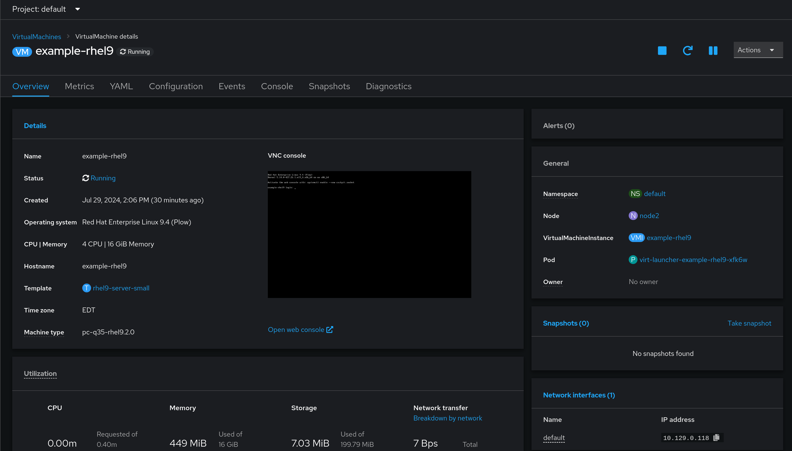

# Declaring Virtual Machines as Code
This block outlines how to create virtual machines from code, leveraging the virtualization service.

## Information
| Key | Value |
| --- | ---|
| **Platform:** | Red Hat OpenShift |
| **Scope:** | Bootstrapping |
| **Tooling:** | CLI, yaml, helm, GitOps |
| **Pre-requisite Blocks:** | <ul><li>[Helm Getting Started](../helm-getting-started/README.md)</li><li>[Installing Operators via Yaml](../installing-operators-yaml/README.md)</li><li>[GitOps Cluster Config](../gitops-cluster-config-rbac/README.md)</li><li>[Installing Virtualization on an ACP](../virtualization-on-acp/README.md)</li></ul> |
| **Pre-requisite Patterns:** | N/A |
| **Example Application**: | N/A |

## Table of Contents
* [Part 0 - Assumptions and Network Layout](#part-0---assumptions-and-network-layout)
* [Part 1 - Defining Virtual Machines](#part-1---defining-virtual-machines)
* [Part 2 - Creating Virtual Machines via the CLI](#part-2---creating-virtual-machines-via-the-cli)

## Part 0 - Assumptions and Network Layout
This block has a few key assumptions, in an attempt to keep things digestable:
1. A target platform is installed and reachable.
2. The installation content for the OpenShift virtualization operator is available.
3. Persistent storage is available, either by local or converged storage, or another storage solution.
4. Virtualization functionality is enabled in the BIOS of the underlying compute resources.

The following example subnets/VLANs will be used:
| VLAN | Subnet | Description |
| --- | ---| --- |
| 2000 | 172.16.0.0/24 | Out of band management interfaces of hardware |
| 2001 | 172.16.1.0/24 | Hyperconverged storage network |
| 2002 | 172.16.2.0/23 | Cluster primary network for ingress, load balanced services, and MetalLB pools |
| 2003 | 172.16.4.0/24 | First dedicated network for bridged virtual machines |
| 2004 | 172.16.5.0/24 | Second dedicated network for bridged virtual machines |
| 2005 | 172.16.6.0/24 | Third dedicated network for bridged virtual machines |

The following network information will be used:
| IP Address | Device | Description |
| --- | --- | --- |
| 172.16.2.1 | Router | Router IP address for subnet |
| 172.16.2.2 | Rendezvous | Rendezvous IP address for bootstrapping cluster, temporary |
| 172.16.2.2 | node0 | node0's cluster IP address |
| 172.16.2.3 | node1 | node1's cluster IP address |
| 172.16.2.4 | node1 | node2's cluster IP address |
| 172.16.2.10 | API | Cluster's API address |
| 172.16.2.11 | Ingress | Cluster's ingress address |
| 172.16.1.2 | node0-storage | node0's storage IP address |
| 172.16.1.3 | node1-storage | node1's storage IP address |
| 172.16.1.4 | node2-storage | node2's storage IP address |
| 10.1.3.106 | DNS | DNS server address |

The following cluster information will be used:
```yaml
cluster_info:
  name: example-cluster
  version: stable
  base_domain: your-domain.com
  masters: 3
  workers: 0
  api_ip: 172.16.2.10
  ingress_ip: 172.16.2.11
  host_network_cidr: 172.16.2.0/23
```

The following node information will be used:
```yaml
nodes:
  - name: node0
    cluster_link:
      mac_address: b8:ca:3a:6e:69:40
      ip_address: 172.16.2.2
  - name: node1
    cluster_link:
      mac_address: 24:6e:96:69:56:90
      ip_address: 172.16.2.3
  - name: node2
    cluster_link:
      mac_address: b8:ca:3a:6e:17:d8
      ip_address: 172.16.2.4
```

Topology:


## Part 1 - Defining Virtual Machines
Virtual machines, like other resource types, can be defined in code, and given to an ACP's virtualization service, which will result in the creation (or modification, or deletion) of the resource.

The resource kind `VirtualMachine` is one of the resourse kinds provided by the virtualization service, and is the type used to create virtual machines.

An example RHEL9 virtual machine definition, with comments:
```yaml
apiVersion: kubevirt.io/v1 # API of the virtualization service
kind: VirtualMachine  # Desired resource
metadata:
  name: example-rhel9 # Name of the virtual machine
  namespace: default # Namespace for the virtual machine
  finalizers:
    - kubevirt.io/virtualMachineControllerFinalize
  labels:
    app: example-rhel9 # More labels can be added if desired
    kubevirt.io/dynamic-credentials-support: 'true'
    vm.kubevirt.io/template: rhel9-server-small
    vm.kubevirt.io/template.namespace: openshift
    vm.kubevirt.io/template.revision: '1'
    vm.kubevirt.io/template.version: v0.27.0
spec:
  dataVolumeTemplates: # Clones the data source for RHEL9 systems for this virtual machine, essentially "create from template"
    - apiVersion: cdi.kubevirt.io/v1beta1
      kind: DataVolume
      metadata:
        name: example-rhel9
      spec:
        sourceRef:
          kind: DataSource
          name: rhel9
          namespace: openshift-virtualization-os-images
        storage:
          resources:
            requests:
              storage: 30Gi
  running: true # Start the virtual machine after provisioning
  template:
    metadata:
      annotations:
        vm.kubevirt.io/flavor: small
        vm.kubevirt.io/os: rhel9
        vm.kubevirt.io/workload: server
      creationTimestamp: null
      labels:
        kubevirt.io/domain: example-rhel9
        kubevirt.io/size: small
    spec:
      architecture: amd64
      domain:
        cpu: # CPU resources to allocate to the virtual machine
          cores: 4
          sockets: 1
          threads: 1
        devices:
          disks:
            - disk:
                bus: virtio
              name: rootdisk
            - disk: # cloud-init uses a dedicated disk
                bus: virtio
              name: cloudinitdisk
          interfaces:
            - name: default
              masquerade: {}
              model: virtio
          networkInterfaceMultiqueue: true
          rng: {}
        features:
          acpi: {}
          smm:
            enabled: true
        firmware:
          bootloader:
            efi: {}
        machine:
          type: pc-q35-rhel9.2.0
        memory:
          guest: 16Gi
        resources: {}
      networks:
        - name: default
          pod: {}
      terminationGracePeriodSeconds: 180
      volumes:
        - dataVolume:
            name: example-rhel9
          name: rootdisk
        - cloudInitNoCloud: # Fed into cloud-init
            userData: |-
              #cloud-config
              user: cloud-user
              password: "your-password-here"
              chpasswd: { expire: False }
          name: cloudinitdisk
```

## Part 2 - Creating Virtual Machines via the CLI
The OpenShift CLI can be used to create a virtual machine using the definition above, simply by feeding the yaml in:
```
oc apply -f code/example-rhel9.yaml
```

The virtual machine will then be created and started:
