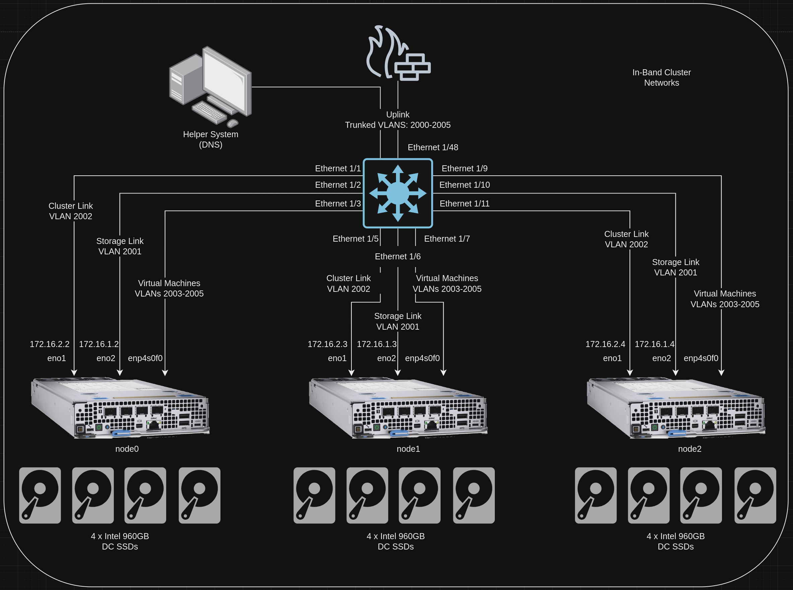
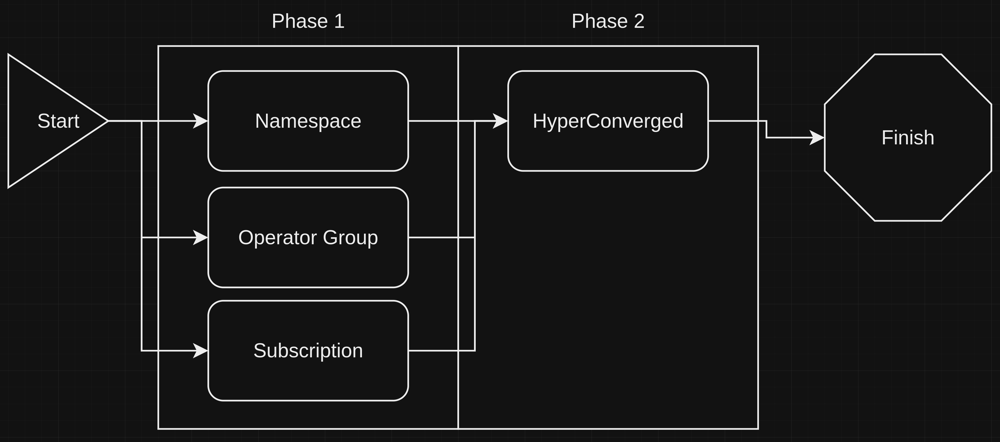
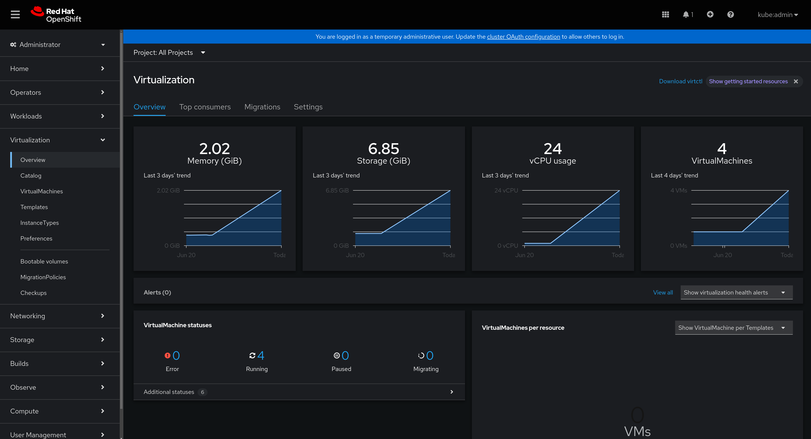
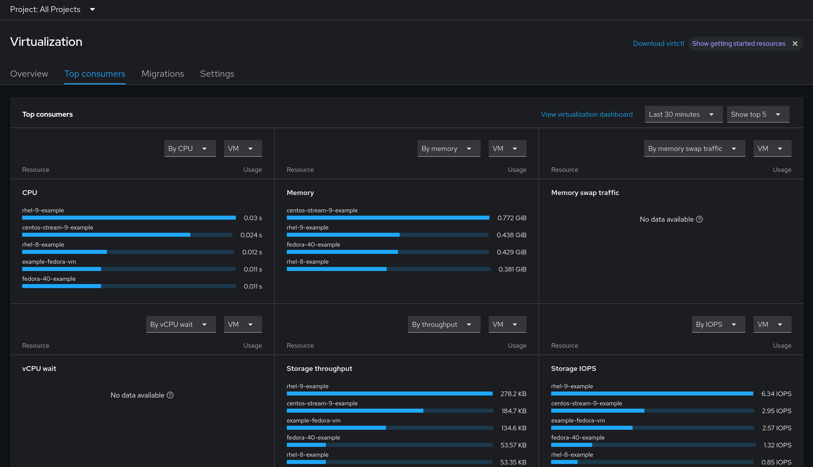
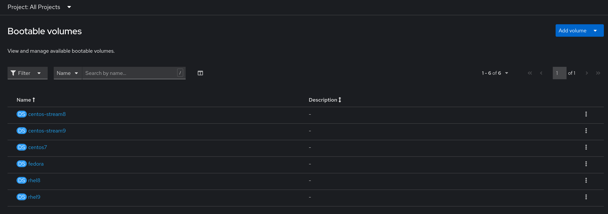
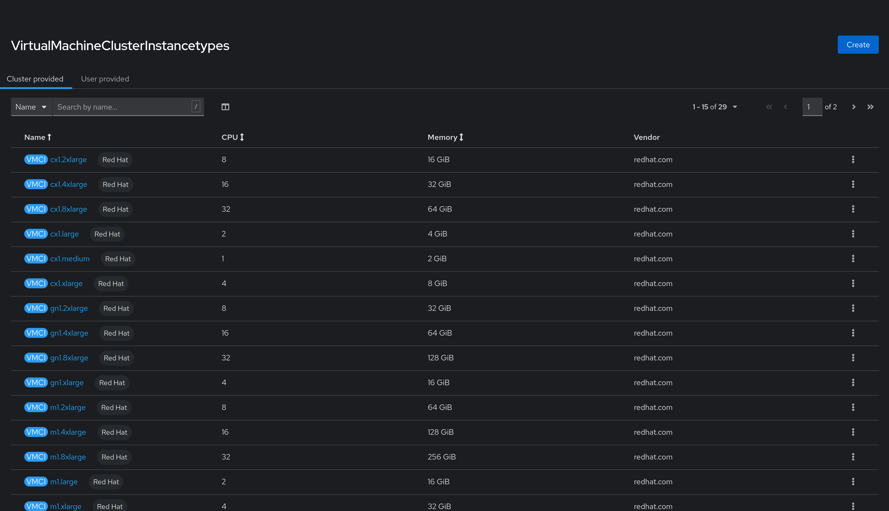
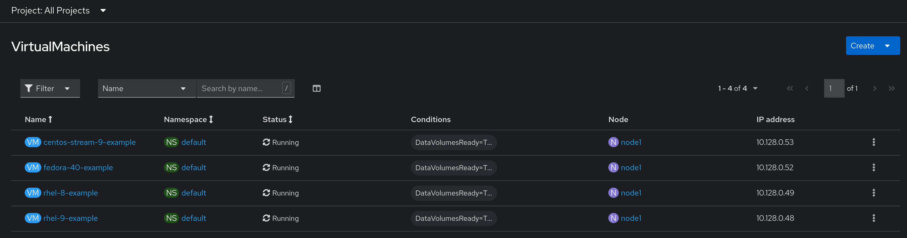
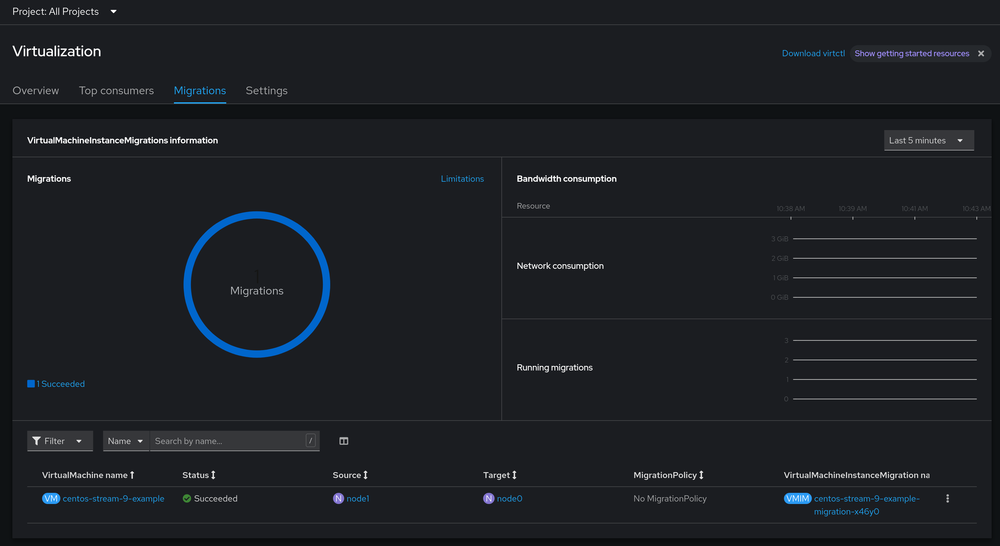

# Installing Virtualization on an ACP
This block outlines how to install virtualization functionality on an ACP, and includes a preview of the installed assets.

## Information
| Key | Value |
| --- | ---|
| **Platform:** | Red Hat OpenShift |
| **Scope:** | Bootstrapping |
| **Tooling:** | CLI, yaml, helm, GitOps |
| **Pre-requisite Blocks:** | <ul><li>[Helm Getting Started](../helm-getting-started/README.md)</li><li>[Installing Operators via Yaml](../installing-operators-yaml/README.md)</li><li>[GitOps Cluster Config](../gitops-cluster-config-rbac/README.md)</li></ul> |
| **Pre-requisite Patterns:** | N/A |
| **Example Application**: | N/A |

## Table of Contents
* [Part 0 - Assumptions and Network Layout](#part-0---assumptions-and-network-layout)
* [Part 1 - Defining Configuration](#part-1---defining-configuration)
* [Part 2 - Installing the Virtualization Operator](#part-2---installing-the-virtualization-operator)
* [Part 3 - HyperConverged Instance](#part-3---hyperconverged-instance)
* [Part 4 - Investigating Virtualization Functionality](#part-4---investigating-virtualization-functionality)

## Part 0 - Assumptions and Network Layout
This block has a few key assumptions, in an attempt to keep things digestable:
1. A target platform is installed and reachable.
2. The installation content for the OpenShift virtualization operator is available.
3. Persistent storage is available, either by local or converged storage, or another storage solution.
4. Virtualization functionality is enabled in the BIOS of the underlying compute resources.

The following example subnets/VLANs will be used:
| VLAN | Subnet | Description |
| --- | ---| --- |
| 2000 | 172.16.0.0/24 | Out of band management interfaces of hardware |
| 2001 | 172.16.1.0/24 | Hyperconverged storage network |
| 2002 | 172.16.2.0/23 | Cluster primary network for ingress, load balanced services, and MetalLB pools |
| 2003 | 172.16.4.0/24 | First dedicated network for bridged virtual machines |
| 2004 | 172.16.5.0/24 | Second dedicated network for bridged virtual machines |
| 2005 | 172.16.6.0/24 | Third dedicated network for bridged virtual machines |

The following network information will be used:
| IP Address | Device | Description |
| --- | --- | --- |
| 172.16.2.1 | Router | Router IP address for subnet |
| 172.16.2.2 | Rendezvous | Rendezvous IP address for bootstrapping cluster, temporary |
| 172.16.2.2 | node0 | node0's cluster IP address |
| 172.16.2.3 | node1 | node1's cluster IP address |
| 172.16.2.4 | node1 | node2's cluster IP address |
| 172.16.2.10 | API | Cluster's API address |
| 172.16.2.11 | Ingress | Cluster's ingress address |
| 172.16.1.2 | node0-storage | node0's storage IP address |
| 172.16.1.3 | node1-storage | node1's storage IP address |
| 172.16.1.4 | node2-storage | node2's storage IP address |
| 10.1.3.106 | DNS | DNS server address |

The following cluster information will be used:
```yaml
cluster_info:
  name: example-cluster
  version: stable
  base_domain: your-domain.com
  masters: 3
  workers: 0
  api_ip: 172.16.2.10
  ingress_ip: 172.16.2.11
  host_network_cidr: 172.16.2.0/23
```

The following node information will be used:
```yaml
nodes:
  - name: node0
    cluster_link:
      mac_address: b8:ca:3a:6e:69:40
      ip_address: 172.16.2.2
  - name: node1
    cluster_link:
      mac_address: 24:6e:96:69:56:90
      ip_address: 172.16.2.3
  - name: node2
    cluster_link:
      mac_address: b8:ca:3a:6e:17:d8
      ip_address: 172.16.2.4
```

Topology:


## Part 1 - Defining Configuration
To get started, the desired configuration of the virtualization functionality will be defined. For the purposes of this block, the defaults will work well, however two settings are called out explicitly.

```yaml
virtualization:
  version: 4.15.2
  nonRoot: true
  hostCPUPassThrough: true
```

## Part 2 - Installing the Virtualization Operator
Virtualization capabilities are provided by the OpenShift Virtualization operator, which can be installed via GitOps. Refer to the [GitOps Deployment](../gitops-deployment-k8s/README.md) block for more information.

The installation process itself is handled over two phases, however it's recommended to have persistent storage available so installation sources of some operating systems can be downloaded and made available.


The following resources are all foundational to the next phase:

### Namespace
```yaml
{{ if .Values.virtualization }}
---
apiVersion: v1
kind: Namespace
metadata:
  name: openshift-cnv
  annotations:
    argocd.argoproj.io/sync-wave: "1"
{{ end }}
```

### Operator Group
```yaml
{{ if .Values.virtualization }}
---
apiVersion: operators.coreos.com/v1
kind: OperatorGroup
metadata:
  name: kubevirt-hyperconverged-group
  namespace: openshift-cnv
  annotations:
    argocd.argoproj.io/sync-wave: "1"
spec:
  targetNamespaces:
    - openshift-cnv
{{ end }}
```

### Subscription
```yaml
{{ if .Values.virtualization }}
---
apiVersion: operators.coreos.com/v1alpha1
kind: Subscription
metadata:
  name: hco-operatorhub
  namespace: openshift-cnv
  annotations:
    argocd.argoproj.io/sync-wave: "1"
spec:
  source: redhat-operators
  sourceNamespace: openshift-marketplace
  name: kubevirt-hyperconverged
  startingCSV: kubevirt-hyperconverged-operator.v{{ .Values.virtualization.version | default "4.15.2" }}
  channel: "stable"
{{ end }}
```

## Part 3 - Hyperconverged Instance
An instance of HyperConverged, deployed by the operator, installs and manages the appropriate features and functionality for running virtual machines

Here, the sync wave is set to 5, as to go after converged storage has been deployed and reached a healthy state, however this can be changed if only local storage is in use, or if another storage solution is already available.

```yaml
{{ if .Values.virtualization }}
---
apiVersion: hco.kubevirt.io/v1beta1
kind: HyperConverged
metadata:
  name: kubevirt-hyperconverged
  namespace: openshift-cnv
  annotations:
    argocd.argoproj.io/sync-wave: "5"
    argocd.argoproj.io/sync-options: SkipDryRunOnMissingResource=true
spec:
  featureGates:
    enableCommonBootImageImport: {{ .Values.virtualization.commonBootImageImport | default true }}
    nonRoot: {{ .Values.virtualization.nonRoot | default true }}
    withHostPassthroughCPU: {{ .Values.virtualization.hostCPUPassThrough | default true }}
{{ end }}
```

## Part 4 - Investigating Virtualization Functionality
The hyperconverged instance creates resources out of the box to enable rapid deployment of virtual machines without needing additional configurations.

### Virtualization Dashboard
In the OpenShift web console, a central dashboard will be created that gives an overview of virtualization and running virtual machines on the platform:


Additional information can be found on the tabs of the dashboard, such as top consumers of resources:


### Bootable Volumes
The HyperConverged instance will automatically import bootable volumes of some operating systems, such as RHEL, CentOS-Stream, and Fedora, that can be used immediately. These are stored locally on the platform's storage.


### Instance Types
Similar to the experience in cloud marketplaces, a set of instance types are created that can be used to quickly specify what resources should be assigned to a virtual machine:


### Running VMs
Virtual machines can be launched by combining a bootable volume with an instance type, resulting in a running virutal machine:


### VM Migrations
If the underlying platform is highly available, containing more than a single node, virtual machines can be migrated between the nodes. These migrations are tracked and displayed:

