# Control Plane Sizing for Advanced Compute Platforms
This pattern outlines the considerations, trade-offs, and recommendations for sizing the control plane of an ACP at edge locations. It compares 3-node, 4-node, and 5-node control plane configurations across single and dual data room deployments, covering quorum mechanics, failure domains, workload recovery behavior, and supportability.

Control plane sizing directly impacts the availability, fault tolerance, and maintenance flexibility of the platform. At edge sites where mission-critical workloads run on bare-metal hardware, the control plane configuration must balance resilience against hardware constraints, while accounting for the physical topology of the site.

This pattern provides the analysis and rationale for selecting the appropriate control plane size, with a focus on environments where high availability is a strong requirement and hardware is distributed across one or two data rooms.

## Table of Contents
* [Abstract](#abstract)
* [Problem](#problem)
* [Context](#context)
* [Forces](#forces)
* [Solution](#solution)
  * [Understanding etcd Quorum](#understanding-etcd-quorum)
    * [Impact of Quorum Loss on Workloads](#impact-of-quorum-loss-on-workloads)
  * [3-Node Control Plane](#3-node-control-plane)
  * [4-Node Control Plane](#4-node-control-plane)
  * [5-Node Control Plane](#5-node-control-plane)
  * [Control Plane Sizing Comparison](#control-plane-sizing-comparison)
  * [Single Data Room Deployments](#single-data-room-deployments)
  * [Two Data Room Deployments](#two-data-room-deployments)
  * [Failure Scenarios and Workload Recovery](#failure-scenarios-and-workload-recovery)
* [Resulting Context](#resulting-context)
* [Examples](#examples)
* [Rationale](#rationale)
* [Further Reading](#further-reading)

## Abstract
| Key | Value |
| --- | --- |
| **Platform(s)** | Advanced Compute Platform |
| **Scope** | <ul><li>Architecture</li><li>Availability</li><li>Installation Planning</li></ul> |
| **Tooling** | <ul><li>Red Hat OpenShift</li><li>Red Hat Advanced Cluster Management (Optional)</li></ul> |
| **Pre-requisite Blocks** | N/A |
| **Pre-requisite Patterns** | <ul><li>[ACP Standardized Architecture - Highly Available](../acp-standardized-architecture-ha/README.md)</li><li>[ACP Standard Services](../rh-acp-standard-services/README.md)</li></ul> |
| **Example Application** | N/A |

## Problem
**Problem Statement:** ACPs at edge sites run mission-critical workloads on bare-metal hardware, where platform availability directly impacts operational continuity. The control plane is the foundation of platform availability: it houses etcd (the cluster state store), the API server, the scheduler, and the controller manager. The number of control plane nodes determines how many simultaneous node failures the platform can tolerate before losing the ability to schedule, reschedule, or manage workloads.

Edge sites vary in physical topology. Some have a single data room housing all hardware, while others distribute hardware across two data rooms for physical redundancy. The control plane sizing must account for both the number of nodes and how those nodes are distributed across failure domains.

Selecting the wrong control plane size can result in:
- Insufficient fault tolerance for the site's availability requirements
- Unnecessary hardware expenditure without meaningful availability gains
- Inability to survive a data room failure in dual-room deployments
- Reduced maintenance windows due to tight quorum margins

## Context
This pattern applies to ACPs deployed on bare-metal hardware at edge and industrial sites, where the platform runs both containerized and virtualized workloads. It is relevant when:
- The site has one or two data rooms housing compute hardware
- The platform must support mission-critical workloads with high availability requirements
- Hardware sizing and procurement decisions are being made for new or migrated deployments
- The organization needs to standardize on a control plane configuration across many sites

Key assumptions:
- The ACP is built on bare-metal hardware
- Control plane nodes run as combined control plane/worker nodes (compact/hyperconverged topology) unless otherwise noted
- The site's network infrastructure supports the latency requirements for etcd replication across all control plane nodes
- etcd requires less than 10ms round-trip time (RTT) between all members ([source](https://docs.openshift.com/container-platform/4.13/scalability_and_performance/recommended-performance-scale-practices/recommended-etcd-practices.html))

## Forces
- **Availability:** The platform must remain operational through node and, in dual-room sites, room-level failures. The control plane size directly determines fault tolerance depth.
- **Quorum Mechanics:** etcd uses Raft consensus, requiring a majority of members to agree on state changes. The quorum model is non-negotiable and governs all availability characteristics.
- **Hardware Constraints:** Edge sites are constrained on power, cooling, and space. Additional control plane nodes consume resources that could otherwise run workloads.
- **Maintenance Windows:** Taking control plane nodes offline for hardware service, firmware updates, or OS upgrades reduces quorum headroom. The control plane size determines how many nodes can be serviced simultaneously.
- **Failure Domain Isolation:** Sites with two data rooms gain physical redundancy, but only if the control plane is distributed in a way that preserves quorum during a room-level failure.
- **Workload Recovery:** When a node fails, the platform automatically reschedules containers and live-migrates or restarts virtual machines. The control plane must remain healthy to orchestrate this recovery.
- **Consistency Across Sites:** Organizations deploying ACPs across many sites benefit from standardizing on a control plane size, reducing operational complexity and enabling consistent automation.
- **Supportability:** The chosen configuration must be supported by Red Hat for production use. Not all control plane sizes are supported or recommended.

## Solution
The solution is to select the control plane size that best aligns with the site's availability requirements, physical topology, and hardware constraints. This section analyzes 3-node, 4-node, and 5-node configurations, then applies them to single and dual data room deployments.

### Understanding etcd Quorum
etcd is the distributed key-value store that holds all cluster state. It requires a **majority** (quorum) of members to agree on every write before it is committed and changes are allowed.

 The quorum formula is:

**Quorum = floor(n/2) + 1**

Where `n` is the total number of etcd members (control plane nodes). This formula governs the fault tolerance of every control plane configuration:

| Control Plane Nodes | Quorum Required | Max Simultaneous Failures | Notes |
|---|---|---|---|
| 3 | 2 | 1 | Standard compact cluster |
| 4 | 3 | 1 | Supported — same fault tolerance as 3-node, higher quorum threshold |
| 5 | 3 | 2 | Increased fault tolerance |

Source: [etcd FAQ — Cluster Sizing, Quorum, and Fault Tolerance](https://etcd.io/docs/v3.4/faq/)

The critical insight from this table is that **adding a node to an odd-sized cluster (making it even) increases the quorum requirement without increasing fault tolerance**. Even-numbered control planes are supported, but this trade-off should be understood when selecting a configuration.

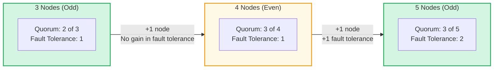

#### Impact of Quorum Loss on Workloads

Understanding what happens when etcd quorum is lost — and what happens when it is restored — is critical for sizing and placement decisions.

> **Key principle:** Quorum loss does not kill running workloads. Existing pods and virtual machines continue to execute on their current nodes. What stops is the control plane's ability to make changes — no new scheduling, no rescheduling of failed workloads, no scaling, no deployments, and no configuration updates.

**When quorum is lost:**

| Component | Behavior |
|---|---|
| **Running containers** | Continue running on their current nodes. Existing pods are not evicted or stopped. |
| **Running virtual machines** | Continue running on their current nodes. Active VM sessions (SSH, console) remain connected. |
| **API server** | Becomes effectively read-only. GET requests may still be served from cache, but all write operations (creating, updating, or deleting resources) fail. |
| **Scheduler** | Cannot place new or rescheduled pods. Pending pods remain in `Pending` state indefinitely. |
| **Controller manager** | Cannot reconcile desired state. ReplicaSets, Deployments, DaemonSets, and StatefulSets stop reacting to changes. |
| **Node health monitoring** | Nodes that fail during the quorum loss window are detected, but their workloads **cannot** be rescheduled. |
| **Operators and CRDs** | All operator reconciliation loops stall. Custom resources cannot be created or updated. |
| **Ingress / Routes** | Existing routes continue to function. New routes cannot be created or modified. |

**When quorum is re-established:**

| Phase | Behavior |
|---|---|
| **etcd resumes writes** | The etcd cluster accepts write operations again. Any pending consensus entries are committed. |
| **API server recovers** | Write operations resume. Any queued client requests that timed out must be retried by the caller. |
| **Controller manager reconciles** | All controllers catch up on the delta between desired and actual state. This may trigger a burst of activity as accumulated drift is resolved. |
| **Scheduler catches up** | Pending pods are evaluated and placed. Workloads from nodes marked `NotReady` during the outage are rescheduled to healthy nodes. |
| **Operators resume** | Operator reconciliation loops restart. Queued changes are applied in order. |
| **Node status updates** | Nodes that went `NotReady` during the outage are re-evaluated. If a node is still unreachable, its workloads are rescheduled (respecting pod disruption budgets). If the node recovered, its workloads remain in place. |

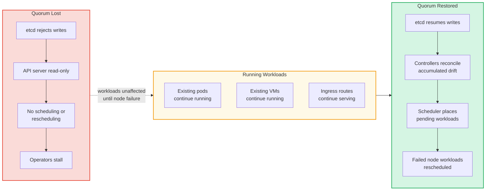

> **Planning implication:** The duration of a quorum loss event determines its severity. A brief quorum loss (e.g., during a rolling reboot that proceeds too quickly) may have no visible impact on workloads. A prolonged quorum loss becomes critical if any node fails during the window, since the platform cannot reschedule those workloads until quorum is restored. This is why fault tolerance — the number of simultaneous node failures a configuration can survive — is the primary driver for control plane sizing.

---

### 3-Node Control Plane
The 3-node control plane is the standard compact cluster configuration for ACPs. All three nodes serve as both control plane and worker nodes (schedulable), running platform services alongside workloads. This is the most common deployment model for edge and industrial sites.

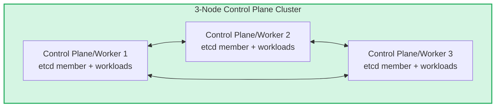

**Quorum: 2 of 3 | Fault Tolerance: 1 node**

**Pros:**
- Supported since OpenShift 4.5+ as a standard compact/edge deployment topology ([source](https://docs.openshift.com/container-platform/4.17/installing/installing_aws/installing-aws-three-node.html))
- Minimal hardware footprint — only 3 systems required for a fully functional, highly available platform
- Lower etcd write latency due to fewer replication peers ([source](https://etcd.io/docs/v3.4/op-guide/performance/))
- Lower operational complexity — fewer nodes to manage, update, and monitor
- Well-suited for power, cooling, and space-constrained edge sites

**Cons:**
- Tolerates only 1 node failure — a second failure results in loss of quorum and platform unavailability
- No simultaneous maintenance — only 1 control plane node can be taken offline at a time
- Each node represents 33% of the control plane — higher blast radius per node during upgrades ([source](https://access.redhat.com/documentation/en-us/openshift_container_platform/4.13/html-single/updating_clusters/index))
- In a dual-room deployment without a tie-breaker, the nodes cannot be evenly distributed

---

### 4-Node Control Plane
A 4-node control plane places 4 etcd members across 4 control plane nodes. This is a supported configuration, however the quorum mechanics of even-numbered clusters mean the additional node does not increase fault tolerance over a 3-node configuration.

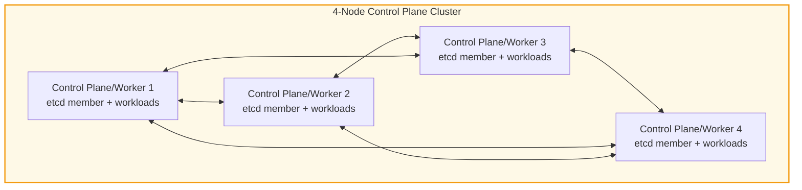

**Quorum: 3 of 4 | Fault Tolerance: 1 node**

The 4-node control plane has the same fault tolerance as a 3-node (1 failure) but requires quorum of 3 instead of 2. This means:
- There are **more nodes that can fail**, but the platform **can't tolerate more failures**
- The quorum requirement is **higher** (75% of nodes vs. 67%)
- The additional node provides workload capacity, but does not improve resilience

The etcd FAQ addresses even-numbered cluster sizing:

> *"Although adding a node to an odd-sized cluster appears better since there are more machines, the fault tolerance is worse since exactly the same number of nodes may fail without losing quorum but there are more nodes that can fail."*
> — [etcd FAQ](https://etcd.io/docs/v3.4/faq/)

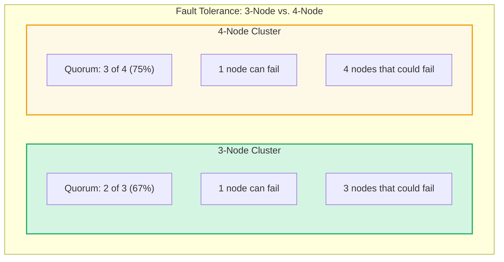

**Pros:**
- Additional schedulable node provides more capacity for workloads
- 4 API server instances provide marginally higher API throughput
- Supported control plane configuration

**Cons:**
- No fault tolerance improvement over a 3-node configuration — still only tolerates 1 failure
- Higher quorum threshold (3 of 4 = 75%) vs. 3-node (2 of 3 = 67%)
- More nodes that can fail without any increase in the number of tolerable failures
- Even-numbered etcd clusters are noted as providing no fault tolerance benefit over the next smaller odd-numbered cluster by etcd upstream documentation ([source](https://etcd.io/docs/v3.4/faq/))
- Cannot be evenly distributed across two data rooms in a way that survives a room failure (see [Two Data Room Deployments](#two-data-room-deployments))
- Higher etcd write latency than 3-node due to replicating to more peers, with no fault tolerance benefit
- If an organization has 4 available systems, a 3 control plane/worker + 1 dedicated worker node configuration provides the same workload capacity with better quorum characteristics

---

### 5-Node Control Plane
The 5-node control plane provides increased fault tolerance over the 3-node configuration, tolerating up to 2 simultaneous node failures while maintaining quorum. On bare-metal platforms, this configuration is supported in OpenShift 4.17+ ([source](https://docs.openshift.com/container-platform/4.17/architecture/control-plane.html)).

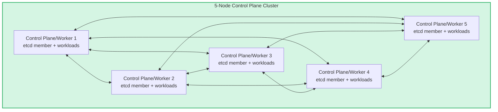

**Quorum: 3 of 5 | Fault Tolerance: 2 nodes**

**Pros:**
- Tolerates 2 simultaneous node failures — double the fault tolerance of a 3-node cluster
- Allows 2 control plane nodes to be taken offline simultaneously for maintenance
- Each node represents 20% of the control plane — lower blast radius per upgrade step
- 5 API server instances provide higher API throughput and redundancy ([source](https://kubernetes.io/docs/concepts/overview/components/))
- 4 standby candidates for scheduler/controller leader election, enabling faster failover ([source](https://kubernetes.io/docs/concepts/architecture/leases/))
- Distributes control plane resource load across more nodes, reducing per-node pressure
- In dual-room deployments with a tie-breaker, survives a full room failure (see [Two Data Room Deployments](#two-data-room-deployments))

**Cons:**
- Requires 5 systems for the control plane
- Slightly higher etcd write latency due to replicating to more peers, though well within acceptable bounds for edge deployments ([source](https://etcd.io/docs/v3.4/op-guide/performance/))

---

### Control Plane Sizing Comparison

| Aspect | 3-Node | 4-Node | 5-Node |
|---|---|---|---|
| **etcd Members** | 3 | 4 | 5 |
| **Quorum Requirement** | 2 of 3 (67%) | 3 of 4 (75%) | 3 of 5 (60%) |
| **Max Simultaneous Node Failures** | 1 | 1 | 2 |
| **Room Failure Tolerance (2 rooms + tie-breaker)** | Yes (1+1+1) | No (cannot distribute evenly) | Yes (2+2+1) |
| **API Server Instances** | 3 | 4 | 5 |
| **Scheduler/Controller Standby** | 2 standby | 3 standby | 4 standby |
| **Upgrade Blast Radius (per node)** | 33% | 25% | 20% |
| **Simultaneous Maintenance Nodes** | 1 | 1 | 2 |
| **etcd Write Latency** | Lowest | Higher (no fault tolerance benefit) | Slightly higher (with fault tolerance benefit) |
| **Hardware Required (Control Plane)** | 3 systems | 4 systems | 5 systems |
| **OpenShift Supportability** | Supported (4.5+) | Supported | Supported (4.17+, bare-metal) |
| **etcd Upstream Guidance** | Recommended (odd number) | Supported — no fault tolerance gain over 3-node | Recommended (odd number) |

Sources: [etcd FAQ](https://etcd.io/docs/v3.4/faq/), [etcd Performance Guide](https://etcd.io/docs/v3.4/op-guide/performance/), [OpenShift Control Plane Architecture](https://docs.openshift.com/container-platform/4.17/architecture/control-plane.html), [Kubernetes Components](https://kubernetes.io/docs/concepts/overview/components/), [Kubernetes Leader Election](https://kubernetes.io/docs/concepts/architecture/leases/), [OpenShift Updating Clusters](https://access.redhat.com/documentation/en-us/openshift_container_platform/4.13/html-single/updating_clusters/index)

---

### Single Data Room Deployments
When all hardware is housed in a single data room, the entire room is a single failure domain. A room-level event (power loss, cooling failure, fire suppression activation) takes down all nodes regardless of control plane size.

In this topology, the control plane size determines **node-level** fault tolerance only. Room-level fault tolerance is not achievable without distributing nodes across physically separated locations.

#### 3-Node in a Single Room

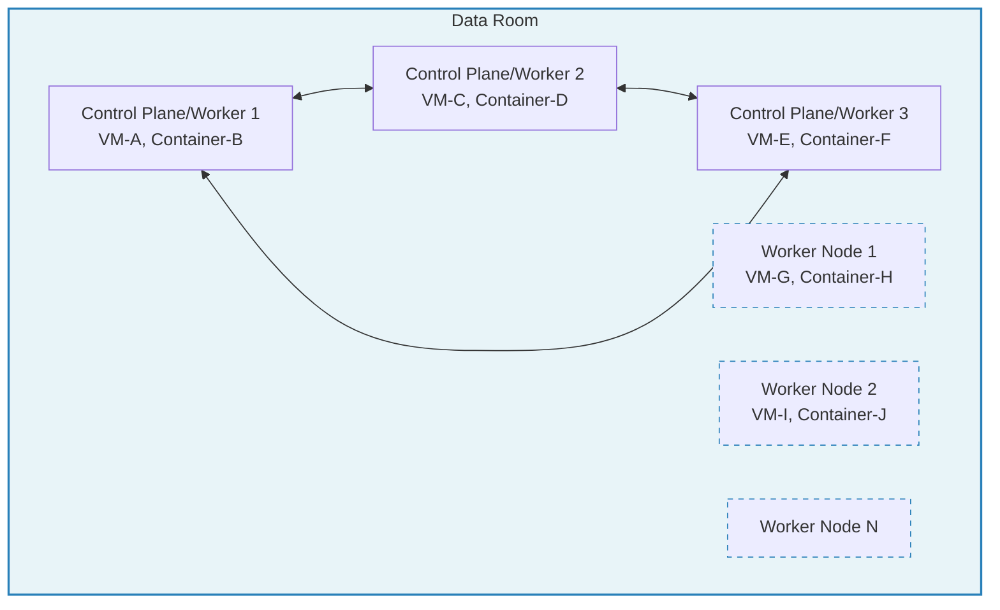

> Worker nodes shown with dashed borders are optional — the number deployed depends on workload requirements at the site.

**Node failure (1 node lost):** Quorum maintained (2 of 3). Workloads from the failed node are automatically rescheduled to surviving nodes. Virtual machines are restarted or live-migrated. Containers are rescheduled by the scheduler.

**Room failure:** Total platform loss. No recovery until the room is restored.

**Pros:**
- Simplest deployment — all hardware in one location
- No cross-room networking requirements
- Lowest etcd replication latency (all members on same LAN segment)

**Cons:**
- Room-level event is a total loss
- No physical separation of failure domains

#### 4-Node in a Single Room

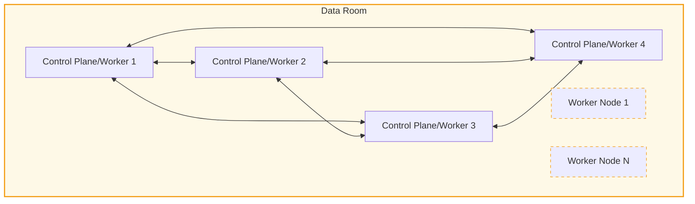

> Worker nodes shown with dashed borders are optional.

**Node failure (1 node lost):** Quorum maintained (3 of 4). Same recovery behavior as 3-node.

**2 node failures:** Quorum lost (2 of 4 < 3 required). Platform unavailable despite 2 surviving nodes.

The 4-node configuration provides one extra schedulable node over the 3-node, but the same fault tolerance with a higher quorum threshold. If the extra workload capacity is the goal, a 3-node control plane with a dedicated worker node (3+1) is an alternative that achieves the same outcome with better quorum characteristics.

**Pros:**
- Additional schedulable node for workload capacity
- All 4 nodes participate in the control plane, simplifying node role management

**Cons:**
- No fault tolerance improvement over 3-node
- Higher quorum threshold means tighter margins
- A 3 control plane + 1 worker configuration achieves the same workload capacity with a lower quorum threshold

#### 5-Node in a Single Room

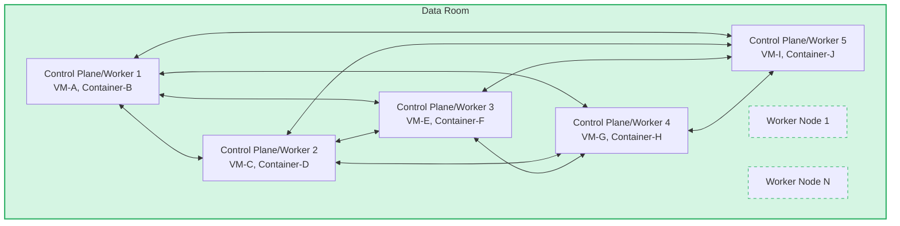

> Worker nodes shown with dashed borders are optional.

**Node failure (1 node lost):** Quorum maintained (4 of 5). Recovery proceeds normally.

**2 node failures:** Quorum still maintained (3 of 5). Platform remains fully operational. Workloads from both failed nodes are rescheduled to the 3 surviving nodes.

**Room failure:** Total platform loss, same as any single-room deployment.

**Pros:**
- Tolerates 2 simultaneous node failures
- Allows simultaneous maintenance on 2 nodes
- Highest node-level resilience available in a single room

**Cons:**
- Still vulnerable to room-level events
- Higher hardware investment for node-level fault tolerance only
- No room-level fault tolerance benefit without physical distribution

#### Single Room Summary

| Configuration | Node Fault Tolerance | Room Fault Tolerance | Simultaneous Maintenance |
|---|---|---|---|
| 3-Node | 1 failure | None | 1 node |
| 4-Node | 1 failure | None | 1 node |
| 5-Node | 2 failures | None | 2 nodes |

In a single data room, the 3-node configuration is typically sufficient, as room-level events are the dominant risk and cannot be mitigated by adding more nodes in the same room. The 5-node configuration adds value only when node-level failures (disk, NIC, motherboard) are a significant concern and the organization requires the ability to perform simultaneous maintenance.

---

### Two Data Room Deployments
When hardware is distributed across two data rooms, the control plane can be configured to survive a room-level failure by ensuring quorum is maintained even when an entire room is lost. This requires careful distribution of control plane nodes and, for odd-numbered quorum, a **tie-breaker node** in a third location.

The tie-breaker is an unschedulable control plane node — it participates in etcd quorum but does not run workloads. It can be placed in a third location at the site (a wiring closet, a separate building, etc.) and can be lower-spec hardware since it only runs etcd and control plane services.

#### 3-Node Across Two Rooms (1+1+1 with Tie-breaker)

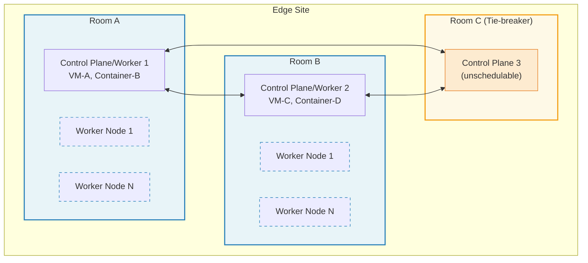

> Worker nodes shown with dashed borders are optional — the number deployed depends on workload requirements at the site.

**Quorum: 2 of 3**

| Failure Scenario | Nodes Remaining | Quorum? | Workload Impact |
|---|---|---|---|
| Room A failure | B1, C1 = 2/3 | Yes | Workloads from Room A workers reschedule to Room B |
| Room B failure | A1, C1 = 2/3 | Yes | Workloads from Room B workers reschedule to Room A |
| Room C failure | A1, B1 = 2/3 | Yes | No workload impact (tie-breaker is unschedulable) |
| 1 node failure (any) | 2/3 | Yes | Workloads from failed node reschedule |
| Room A + Room C failure | B1 = 1/3 | **No** | Platform unavailable |

**Pros:**
- Survives any single room failure
- Minimal hardware footprint — only 1 schedulable control plane node per room plus a lightweight tie-breaker
- Lower hardware investment

**Cons:**
- Only 1 schedulable control plane/worker node per room — if that node fails along with a room failure, quorum is lost
- Cannot tolerate 2 simultaneous node failures
- Workload capacity concentrated on fewer schedulable nodes

#### 4-Node Across Two Rooms

A 4-node control plane is supported, however distributing it across two data rooms for symmetric room-level fault tolerance is not achievable. The even-numbered quorum requirement (3 of 4) creates an unavoidable imbalance in every distribution:

**Option A: 2+2 split (2 per room)**
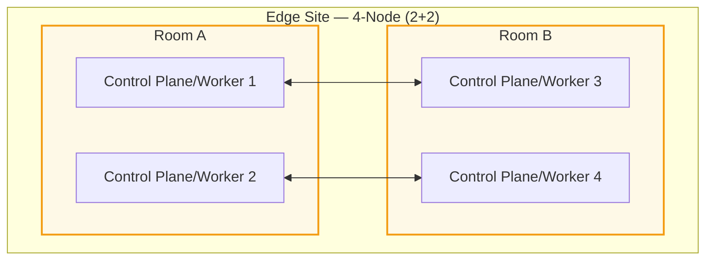

| Failure Scenario | Nodes Remaining | Quorum (3 needed)? |
|---|---|---|
| Room A failure | B1, B2 = 2/4 | **No** |
| Room B failure | A1, A2 = 2/4 | **No** |

A 2+2 split cannot survive any room failure, as neither room alone holds a quorum majority.

**Option B: 3+1 split**
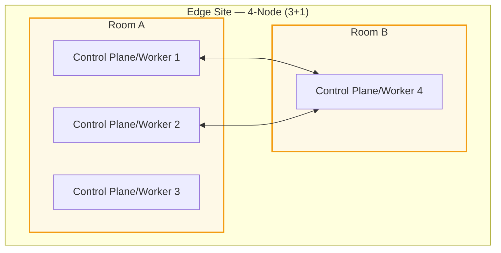

| Failure Scenario | Nodes Remaining | Quorum (3 needed)? |
|---|---|---|
| Room A failure | B1 = 1/4 | **No** |
| Room B failure | A1, A2, A3 = 3/4 | Yes |

A 3+1 split only survives the loss of Room B (the smaller room), creating an asymmetric failure domain where one room's loss is recoverable but the other's is not.

**Option C: 2+1+1 with tie-breaker**
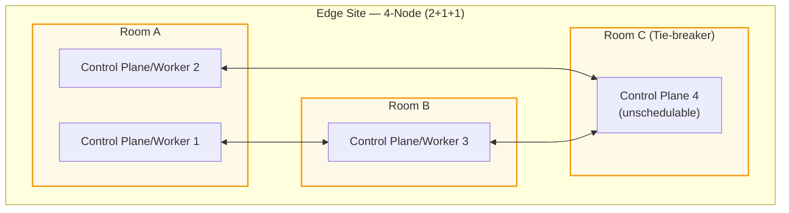

| Failure Scenario | Nodes Remaining | Quorum (3 needed)? |
|---|---|---|
| Room A failure | B1, C1 = 2/4 | **No** |
| Room B failure | A1, A2, C1 = 3/4 | Yes |
| Room C failure | A1, A2, B1 = 3/4 | Yes |

Even with a tie-breaker, a 4-node control plane only survives the loss of rooms with 1 node. Room A's loss (2 nodes) always breaks quorum. The distribution is asymmetric regardless of how nodes are arranged.

**Summary:** A 4-node control plane is supported in a single data room, but cannot provide symmetric room-level fault tolerance in any two-room distribution. For dual-room deployments requiring symmetric fault tolerance, a 3-node or 5-node configuration is needed.

#### 5-Node Across Two Rooms (2+2+1 with Tie-breaker)

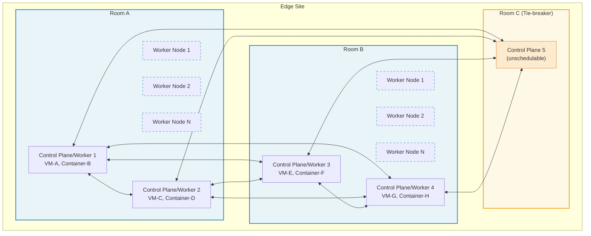

> Worker nodes shown with dashed borders are optional — the number deployed depends on workload requirements at the site.

**Quorum: 3 of 5**

| Failure Scenario | Nodes Remaining | Quorum? | Workload Impact |
|---|---|---|---|
| Room A failure (2 nodes + workers lost) | B1, B2, C1 = 3/5 | Yes | All Room A workloads reschedule to Room B |
| Room B failure (2 nodes + workers lost) | A1, A2, C1 = 3/5 | Yes | All Room B workloads reschedule to Room A |
| Room C failure (1 node lost) | A1, A2, B1, B2 = 4/5 | Yes | No workload impact |
| 1 node failure in Room A | 4/5 | Yes | Failed node's workloads reschedule |
| 1 node per room simultaneously | 3/5 | Yes | Both nodes' workloads reschedule |
| Room A + Room C failure | B1, B2 = 2/5 | **No** | Platform unavailable |

**Pros:**
- Symmetric room failure tolerance — either primary room can be lost entirely
- 2 schedulable control plane/worker nodes per room — more workload capacity and better distribution
- Allows simultaneous maintenance across rooms (1 node per room offline)
- Highest resilience achievable across two rooms with a tie-breaker

**Cons:**
- Requires 5 control plane systems (4 schedulable + 1 tie-breaker)
- Multi-room failure (2 rooms simultaneously) is still not survivable

#### Two Data Room Summary

| Configuration | Distribution | Room A Failure | Room B Failure | Symmetric? |
|---|---|---|---|---|
| 3-Node (1+1+1) | 1 per room + tie-breaker | Quorum OK | Quorum OK | Yes |
| 4-Node (2+2) | 2 per room | **Quorum Lost** | **Quorum Lost** | N/A — neither survives |
| 4-Node (3+1) | 3 in Room A, 1 in Room B | **Quorum Lost** | Quorum OK | No — asymmetric |
| 4-Node (2+1+1) | 2 in Room A, 1 in Room B + tie-breaker | **Quorum Lost** | Quorum OK | No — asymmetric |
| 5-Node (2+2+1) | 2 per room + tie-breaker | Quorum OK | Quorum OK | Yes |

The 3-node and 5-node configurations are the only ones that provide **symmetric room-level fault tolerance** in a dual-room deployment with a tie-breaker.

---

### Failure Scenarios and Workload Recovery
When a control plane/worker node fails, the platform automatically recovers workloads. The behavior differs between containers and virtual machines:

- **Containers:** The scheduler detects the node as `NotReady` and reschedules pod replicas onto healthy nodes. Stateless containers restart immediately; stateful containers restart once their persistent storage is available on the new node.
- **Virtual Machines:** OpenShift Virtualization detects the failed node and, depending on the VM's eviction strategy, either live-migrates (if the failure is graceful) or restarts the VM on a healthy node. VMs with `LiveMigrate` eviction strategy are automatically moved; VMs without it are restarted after a configurable timeout.

The control plane must remain healthy (quorum maintained) for this recovery to function.

> **If quorum is lost:** Running workloads (both containers and VMs) continue executing on their current nodes — they are not stopped or evicted. However, the platform **cannot** schedule new workloads, reschedule workloads from failed nodes, process scaling events, or apply configuration changes. If a node fails while quorum is lost, its workloads are lost until quorum is restored, at which point the scheduler and controllers catch up and reschedule affected workloads to healthy nodes. See [Impact of Quorum Loss on Workloads](#impact-of-quorum-loss-on-workloads) for full details.

#### Single Node Failure in a 3-Node Cluster (Single Room)

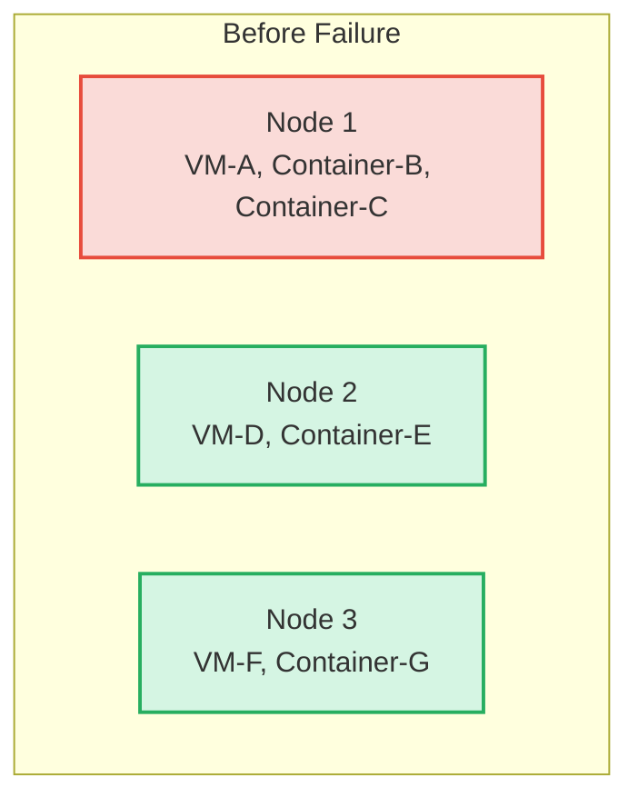

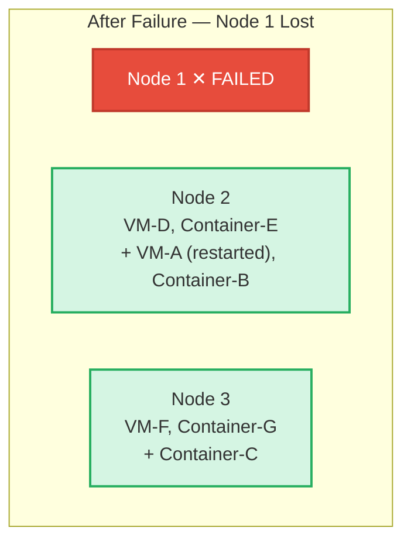

Quorum is maintained (2 of 3). The scheduler and virtualization service redistribute workloads across the 2 surviving nodes. The platform continues to operate normally, albeit with reduced capacity.

#### Room Failure in a 5-Node Cluster (Two Rooms + Tie-breaker)

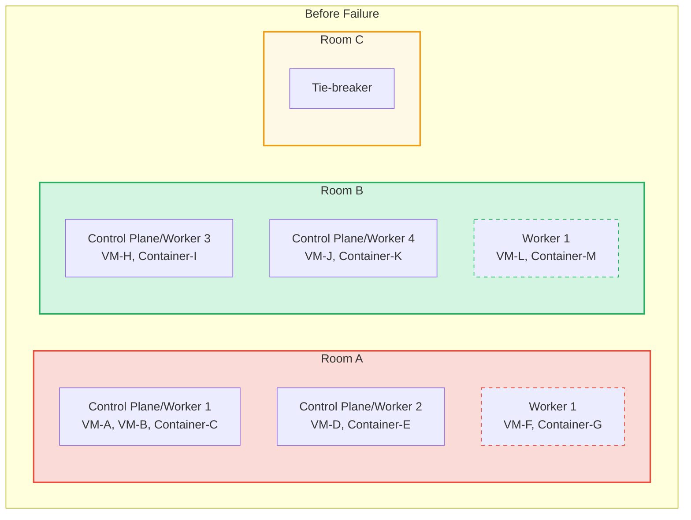

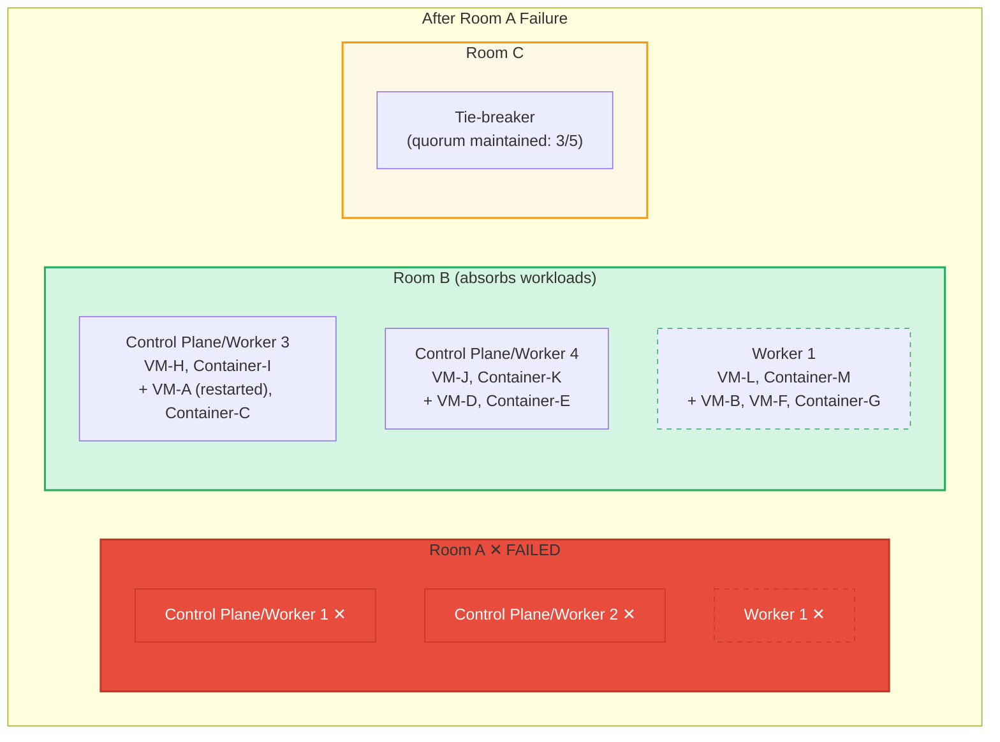

Quorum is maintained (B1, B2, C1 = 3 of 5). All workloads from Room A are automatically restarted or rescheduled to Room B nodes. The platform continues operating at reduced capacity until Room A is restored.

This recovery is only possible because:
1. The 5-node control plane maintains quorum with 3 surviving members
2. The tie-breaker in Room C provides the critical 3rd quorum vote
3. Room B has sufficient capacity (control plane/worker nodes + workers) to absorb the redistributed workloads

#### Workload Recovery Flow

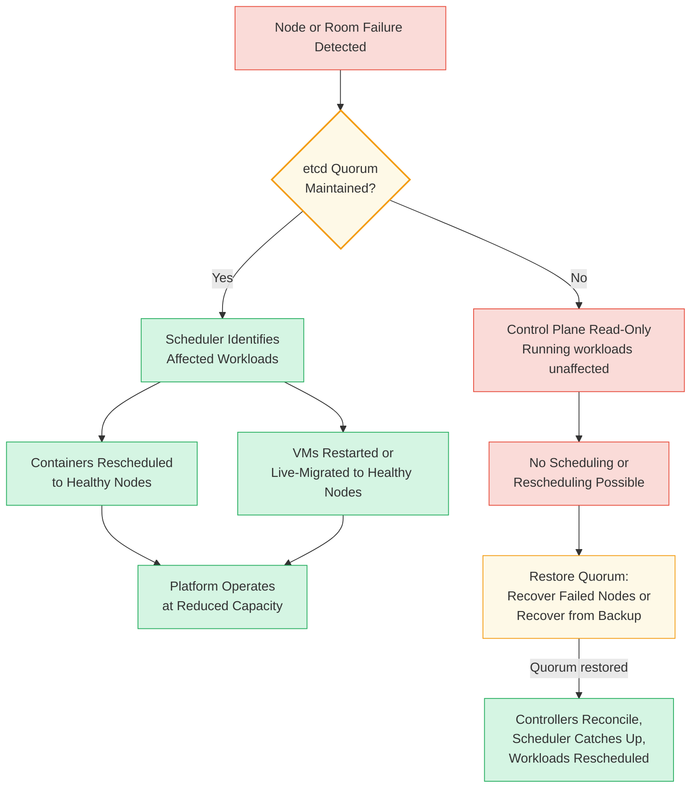

---

## Resulting Context
By selecting the appropriate control plane size based on the site's physical topology and availability requirements, organizations achieve:

- **Predictable fault tolerance** aligned to the site's risk profile — whether the primary concern is node-level failures (single room) or room-level failures (dual room)
- **Standardized configurations** that can be applied consistently across many sites with similar topologies
- **Informed hardware procurement** — the control plane size drives the minimum hardware requirements, avoiding both under-provisioning (insufficient resilience) and over-provisioning (no meaningful availability gain, as with 4-node)
- **Clear maintenance policies** — the number of simultaneously serviceable control plane nodes is a direct function of the control plane size and is known at design time
- **Automatic workload recovery** — with quorum maintained, the platform handles container rescheduling and VM restart/migration without operator intervention

The 4-node control plane is a supported configuration, but organizations should be aware that it provides no fault tolerance improvement over a 3-node configuration and cannot achieve symmetric room-level fault tolerance in dual-room deployments. Organizations with 4 available systems may also consider a 3-node control plane with 1 dedicated worker node, which provides the same workload capacity with a lower quorum threshold.

## Examples
The following examples map to common deployment scenarios, drawing from the transition approaches documented in the [3-Node vs. 5-Node Transition Approach](../../../tmp/3no-vs-5no/transition-approach.md).

### Use Case 1: Resource-Constrained Site with a Single Data Room
A small edge site has limited power, cooling, and space, with all hardware in a single room. The organization needs a highly available platform but cannot justify 5 control plane systems.

**Recommendation:** 3-node compact cluster.

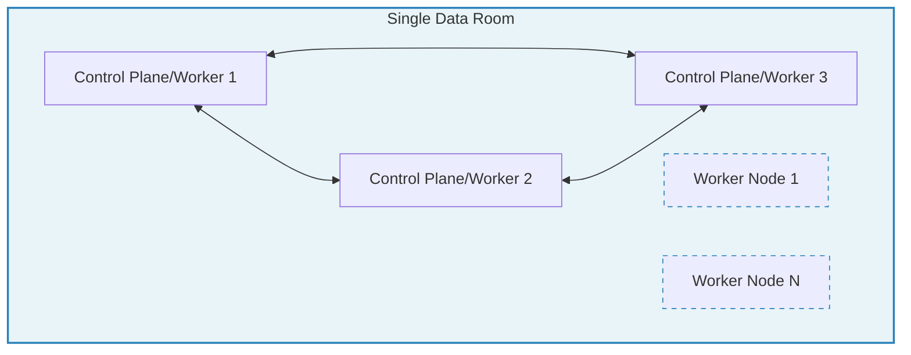

The 3-node configuration provides highly available control plane services, tolerates 1 node failure, and minimizes hardware investment. Since all hardware is in a single room, the dominant risk is a room-level event, which no control plane size can mitigate without physical distribution.

### Use Case 2: Dual-Room Site Migrating from an Existing Environment
An edge site has two data rooms and is migrating from an existing (non-OpenShift) environment. Hardware must be freed incrementally from the existing environment. The organization prefers to start the migration before net-new hardware is available.

**Recommendation:** Deploy a 3-node compact cluster initially (1 control plane/worker per room + 1 tie-breaker), then expand to 5-node when OpenShift supports in-place control plane scaling.

This approach minimizes the hardware needed to bootstrap the ACP (only 2 systems freed from the existing environment + 1 tie-breaker), allows workload migration to begin immediately, and provides room-level fault tolerance from day one. The 3-to-5 expansion is a Day 2 operation dependent on a future OpenShift feature.

#### Phase 0: Current State

The existing environment runs across both data rooms. All hardware is committed to current workloads. Room C is empty or has new hardware staged for the tie-breaker.

```mermaid
graph TB
    subgraph site["Edge Site — Phase 0: Current State"]
        subgraph roomA["Room A"]
            EA1["Existing Node"]
            EA2["Existing Node"]
            EA3["Existing Node"]
            EAn["..."]
        end
        subgraph roomB["Room B"]
            EB1["Existing Node"]
            EB2["Existing Node"]
            EB3["Existing Node"]
            EBn["..."]
        end
        subgraph roomC["Room C"]
            empty["(empty / new hardware)"]
        end
    end

    style roomA fill:#fadbd8,stroke:#e74c3c,stroke-width:2px
    style roomB fill:#fadbd8,stroke:#e74c3c,stroke-width:2px
    style roomC fill:#f2f3f4,stroke:#95a5a6,stroke-width:2px,stroke-dasharray: 5 5
```

#### Phase 1: Deploy 3-Node ACP

Free one node from each room and repurpose it as a control plane/worker node. Place the tie-breaker in Room C. Deploy a 3-node compact ACP. The existing environment continues running on its remaining hardware.

```mermaid
graph TB
    subgraph site["Edge Site — Phase 1: 3-Node ACP Deployed"]
        subgraph roomA["Room A"]
            subgraph ocpA["ACP"]
                A1["Control Plane/Worker 1"]
            end
            subgraph existA["Existing Environment"]
                EA2["Existing Node"]
                EA3["Existing Node"]
            end
        end
        subgraph roomB["Room B"]
            subgraph ocpB["ACP"]
                B1["Control Plane/Worker 2"]
            end
            subgraph existB["Existing Environment"]
                EB2["Existing Node"]
                EB3["Existing Node"]
            end
        end
        subgraph roomC["Room C"]
            C1["Tie-breaker<br/>(unschedulable)"]
        end
    end

    A1 <--> B1
    A1 <--> C1
    B1 <--> C1

    style ocpA fill:#d5f5e3,stroke:#27ae60,stroke-width:2px
    style ocpB fill:#d5f5e3,stroke:#27ae60,stroke-width:2px
    style existA fill:#fadbd8,stroke:#e74c3c,stroke-width:2px
    style existB fill:#fadbd8,stroke:#e74c3c,stroke-width:2px
    style roomC fill:#fef9e7,stroke:#f39c12,stroke-width:2px
    style C1 fill:#fdebd0,stroke:#e67e22
```

**etcd quorum: 2 of 3** — single room failure is tolerated from day one.

#### Phase 2: Iterative Workload Migration

Drain nodes from the existing environment one at a time. Repurpose each as an ACP worker node. Migrate workloads onto the ACP as capacity becomes available. Repeat until the existing environment is fully decommissioned.

```mermaid
graph TB
    subgraph site["Edge Site — Phase 2: Migration In Progress"]
        subgraph roomA["Room A"]
            subgraph ocpA["ACP"]
                A1["Control Plane/Worker 1"]
                W1["Worker Node 1<br/>(migrated)"]
                W2["Worker Node 2<br/>(migrated)"]
            end
            subgraph existA["Existing (draining)"]
                EA3["Existing Node ▸ draining"]
            end
        end
        subgraph roomB["Room B"]
            subgraph ocpB["ACP"]
                B1["Control Plane/Worker 2"]
                W3["Worker Node 1<br/>(migrated)"]
                W4["Worker Node 2<br/>(migrated)"]
            end
            subgraph existB["Existing (draining)"]
                EB3["Existing Node ▸ draining"]
            end
        end
        subgraph roomC["Room C"]
            C1["Tie-breaker<br/>(unschedulable)"]
        end
    end

    A1 <--> B1
    A1 <--> C1
    B1 <--> C1

    style ocpA fill:#d5f5e3,stroke:#27ae60,stroke-width:2px
    style ocpB fill:#d5f5e3,stroke:#27ae60,stroke-width:2px
    style existA fill:#fef9e7,stroke:#e67e22,stroke-width:2px,stroke-dasharray: 5 5
    style existB fill:#fef9e7,stroke:#e67e22,stroke-width:2px,stroke-dasharray: 5 5
    style roomC fill:#fef9e7,stroke:#f39c12,stroke-width:2px
    style C1 fill:#fdebd0,stroke:#e67e22
```

#### Phase 3: Migration Complete — 3-Node Steady State

All workloads are running on the ACP. The existing environment is fully decommissioned. The platform operates with a 3-node control plane (1+1+1) and multiple worker nodes per room.

```mermaid
graph TB
    subgraph site["Edge Site — Phase 3: Migration Complete"]
        subgraph roomA["Room A"]
            A1["Control Plane/Worker 1"]
            W1["Worker Node 1"]
            W2["Worker Node 2"]
            Wn1["Worker Node N"]
        end
        subgraph roomB["Room B"]
            B1["Control Plane/Worker 2"]
            W3["Worker Node 1"]
            W4["Worker Node 2"]
            Wn2["Worker Node N"]
        end
        subgraph roomC["Room C"]
            C1["Tie-breaker<br/>(unschedulable)"]
        end
    end

    A1 <--> B1
    A1 <--> C1
    B1 <--> C1

    style roomA fill:#d5f5e3,stroke:#27ae60,stroke-width:2px
    style roomB fill:#d5f5e3,stroke:#27ae60,stroke-width:2px
    style roomC fill:#fef9e7,stroke:#f39c12,stroke-width:2px
    style C1 fill:#fdebd0,stroke:#e67e22
```

**etcd quorum: 2 of 3** — the platform is fully operational with room-level fault tolerance, running all workloads that were previously on the existing environment.

#### Phase 4: Expand to 5-Node Control Plane (Future)

When OpenShift supports in-place control plane scaling, promote one worker node per room to a control plane/worker node. This increases fault tolerance from 1 to 2 simultaneous node failures and enables simultaneous maintenance across rooms.

```mermaid
graph LR
    subgraph before["Phase 3: 3-Node Control Plane"]
        direction TB
        bA["Room A: 1 CP/Worker + Workers"]
        bB["Room B: 1 CP/Worker + Workers"]
        bC["Room C: 1 Tie-breaker"]
    end

    before -- "Promote 1 worker<br/>per room to<br/>Control Plane/Worker" --> after

    subgraph after["Phase 4: 5-Node Control Plane"]
        direction TB
        aA["Room A: 2 CP/Workers + Workers"]
        aB["Room B: 2 CP/Workers + Workers"]
        aC["Room C: 1 Tie-breaker"]
    end

    style before fill:#e8f4f8,stroke:#2980b9,stroke-width:2px
    style after fill:#d5f5e3,stroke:#27ae60,stroke-width:2px
```

```mermaid
graph TB
    subgraph site["Edge Site — Phase 4: 5-Node Target Architecture"]
        subgraph roomA["Room A"]
            A1["Control Plane/Worker 1"]
            A2["Control Plane/Worker 2<br/>(promoted from worker)"]
            AW1["Worker Node 1"]
            AWn["Worker Node N"]
        end
        subgraph roomB["Room B"]
            B1["Control Plane/Worker 3"]
            B2["Control Plane/Worker 4<br/>(promoted from worker)"]
            BW1["Worker Node 1"]
            BWn["Worker Node N"]
        end
        subgraph roomC["Room C"]
            C1["Tie-breaker<br/>(unschedulable)"]
        end
    end

    A1 <--> A2
    A1 <--> B1
    A1 <--> B2
    A1 <--> C1
    A2 <--> B1
    A2 <--> B2
    A2 <--> C1
    B1 <--> B2
    B1 <--> C1
    B2 <--> C1

    style roomA fill:#d5f5e3,stroke:#27ae60,stroke-width:2px
    style roomB fill:#d5f5e3,stroke:#27ae60,stroke-width:2px
    style roomC fill:#fef9e7,stroke:#f39c12,stroke-width:2px
    style C1 fill:#fdebd0,stroke:#e67e22
    style A2 fill:#d5f5e3,stroke:#1e8449,stroke-width:2px
    style B2 fill:#d5f5e3,stroke:#1e8449,stroke-width:2px
    style AW1 stroke-dasharray: 5 5,stroke:#27ae60
    style AWn stroke-dasharray: 5 5,stroke:#27ae60
    style BW1 stroke-dasharray: 5 5,stroke:#27ae60
    style BWn stroke-dasharray: 5 5,stroke:#27ae60
```

**etcd quorum: 3 of 5** — the platform now tolerates 2 simultaneous node failures and either room can be lost entirely while maintaining quorum.

### Use Case 3: Dual-Room Site with Available Hardware
An edge site has two data rooms and hardware is readily available (either net-new or through a "hot potato" hardware kit rotating between sites). Availability is a strong priority.

**Recommendation:** Deploy a 5-node control plane from day one (2 control plane/worker nodes per room + 1 tie-breaker).

```mermaid
graph TB
    subgraph site["Edge Site — 5-Node from Day 1"]
        subgraph roomA["Room A"]
            A1["Control Plane/Worker 1"]
            A2["Control Plane/Worker 2"]
            AW1["Worker Node 1"]
            AWn["Worker Node N"]
        end
        subgraph roomB["Room B"]
            B1["Control Plane/Worker 3"]
            B2["Control Plane/Worker 4"]
            BW1["Worker Node 1"]
            BWn["Worker Node N"]
        end
        subgraph roomC["Room C"]
            C1["Tie-breaker"]
        end
    end

    A1 <--> A2
    A1 <--> B1
    A1 <--> B2
    A1 <--> C1
    A2 <--> B1
    A2 <--> B2
    A2 <--> C1
    B1 <--> B2
    B1 <--> C1
    B2 <--> C1

    style roomA fill:#e8f4f8,stroke:#2980b9,stroke-width:2px
    style roomB fill:#e8f4f8,stroke:#2980b9,stroke-width:2px
    style roomC fill:#fef9e7,stroke:#f39c12,stroke-width:2px
    style C1 fill:#fdebd0,stroke:#e67e22
    style AW1 stroke-dasharray: 5 5,stroke:#2980b9
    style AWn stroke-dasharray: 5 5,stroke:#2980b9
    style BW1 stroke-dasharray: 5 5,stroke:#2980b9
    style BWn stroke-dasharray: 5 5,stroke:#2980b9
```

This approach achieves the target architecture immediately, provides 2-node fault tolerance, symmetric room failure tolerance, and the ability to perform simultaneous maintenance across rooms. There is no dependency on future OpenShift features.

### Use Case 4: Site with 4 Available Systems
An edge site has exactly 4 systems available for the platform. The organization is considering a 4-node control plane.

**Recommendation:** Consider a 3-node control plane with 1 dedicated worker node (3+1).

A 4-node control plane is supported, but provides no fault tolerance improvement over a 3-node configuration — both tolerate 1 node failure. The 3+1 configuration provides the same workload capacity with a lower quorum threshold (2 of 3 instead of 3 of 4), and the dedicated worker node is fully available for workloads without also bearing control plane overhead. If the organization prefers a uniform node role (all nodes as control plane/workers), a 4-node control plane is a viable option with the caveat that the higher quorum threshold provides no additional resilience.

```mermaid
graph TB
    subgraph bad["4-Node Control Plane"]
        direction TB
        N1["Control Plane/Worker 1"]
        N2["Control Plane/Worker 2"]
        N3["Control Plane/Worker 3"]
        N4["Control Plane/Worker 4"]
        bad_q["Quorum: 3 of 4 | Fault Tolerance: 1"]
    end
    subgraph good["3+1 Configuration (Recommended)"]
        direction TB
        M1["Control Plane/Worker 1"]
        M2["Control Plane/Worker 2"]
        M3["Control Plane/Worker 3"]
        W1["Worker Node 1 (dedicated)"]
        good_q["Quorum: 2 of 3 | Fault Tolerance: 1"]
    end

    style bad fill:#fef9e7,stroke:#f39c12,stroke-width:2px
    style good fill:#d5f5e3,stroke:#27ae60,stroke-width:2px
```

## Rationale
The rationale for this pattern is to provide a clear, data-driven framework for selecting the control plane size of an ACP based on the site's physical topology and availability requirements. Control plane sizing is one of the most impactful architectural decisions for an ACP — it determines the platform's fault tolerance, maintenance flexibility, and ability to survive physical-layer failures.

By presenting the quorum mechanics, failure domain analysis, and workload recovery behavior for 3-node, 4-node, and 5-node configurations across single and dual data room deployments, this pattern enables organizations to make informed decisions that balance resilience against hardware investment. It documents the caveats of the 4-node configuration (no fault tolerance gain, asymmetric room-level behavior), provides clear guidance on when 3-node vs. 5-node is appropriate, and standardizes the architectural rationale across the organization.

The tie-breaker concept for dual-room deployments is critical to achieving room-level fault tolerance with odd-numbered quorum, and this pattern documents the mechanics that make it work — and the mechanics that prevent a 4-node configuration from achieving the same.

## Further Reading
### Transition Approaches
- [3-Node vs. 5-Node Transition Approach](../../../tmp/3no-vs-5no/transition-approach.md) — detailed migration phase diagrams for both the incremental (3→5) and net-new hardware (5 from day one) approaches

### Related Patterns
- [ACP Standardized Architecture - Highly Available](../acp-standardized-architecture-ha/README.md)
- [ACP Standardized Architecture - Non-Highly Available](../acp-standardized-architecture-non-ha/README.md)
- [ACP Standard Services](../rh-acp-standard-services/README.md)
- [Deploying ACPs to Small Form-Factor Hardware](../compact-acp-deployment/README.md)

### External References
- [etcd FAQ — Cluster Sizing, Quorum, and Fault Tolerance](https://etcd.io/docs/v3.4/faq/)
- [etcd Operations Guide — Performance](https://etcd.io/docs/v3.4/op-guide/performance/)
- [etcd Operations Guide — Hardware Recommendations](https://etcd.io/docs/v3.7/op-guide/hardware/)
- [OpenShift Container Platform 4.17 — Control Plane Architecture](https://docs.openshift.com/container-platform/4.17/architecture/control-plane.html)
- [OpenShift Container Platform — Recommended etcd Practices](https://docs.openshift.com/container-platform/4.13/scalability_and_performance/recommended-performance-scale-practices/recommended-etcd-practices.html)
- [Kubernetes Components — API Server](https://kubernetes.io/docs/concepts/overview/components/)
- [Kubernetes — Leases and Leader Election](https://kubernetes.io/docs/concepts/architecture/leases/)

## Footnotes

### Version
1.0.0

### Authors
- Josh Swanson (jswanson@redhat.com)
