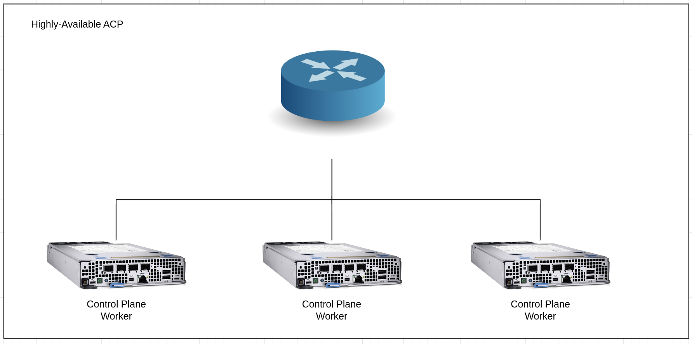
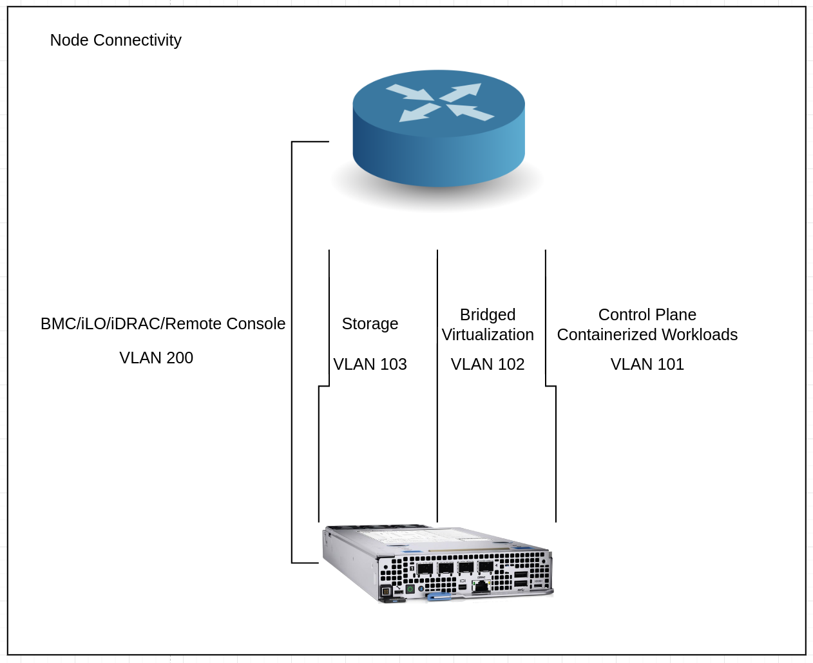
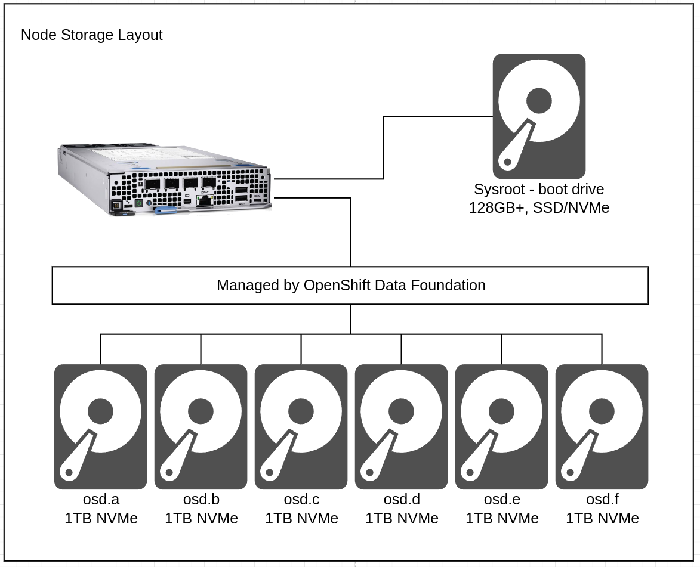

# Standardized Highly Available Computing Platform Architecture
This pattern gives a technical look at a highly available, hyper-converged style advanced computing platform on three nodes.

## Table of Contents
* [Abstract](#abstract)
* [Problem](#problem)
* [Context](#context)
* [Forces](#forces)
* [Solution](#solution)
* [Resulting Content](#resulting-context)
* [Examples](#examples)
* [Rationale](#rationale)

## Abstract
| Key | Value |
| --- | --- |
| **Platform(s)** | TBD |
| **Scope** | TBD |
| **Tooling** | TBD |
| **Pre-requisite Blocks** | TBD |
| **Example Application** | TBD |

## Problem
**Problem Statement:** Industrial sites require the ability to provide a consistent, highly available compute platform for running both legacy applications in virtual machines, along with next generation workloads.

**Resolution:** By combining the platform capabilities of Red Hat OpenShift with some additional tooling and opinionated hardware requirements, the following goals can be achieved:
1. Highly available, converged control/worker planes across three physical nodes
2. Converged storage spread across workers, consumable by nodes within the cluster
3. Ability to run virtual machine based workloads alongside containerized workloads on one platform
4. Platform configured for local autonomy and resiliancy

## Context
This pattern represents the default configuration for an ACP, operating at an industrial site, that's reponsible for mission critical applications. It attempts to provide capabilities for many types of application requirements out of the box, allowing for new workloads to be onboarded without reinstallation of the platform.

This pattern calls out recommendations for hardware, however these should be scaled according to the workloads intended for the platform. If more resources (CPU/memory) are required, the hardware is scaled accordingly.

## Forces
1. **Ease of Use:** This pattern represents a platform that's ready "out of the box", with customizations applied automatically at or immediately after installation, so the platform is ready for many different types of workloads.
2. **Flexibility:** While this pattern is heavily opinionated, it is flexible, and can be expanded, changed, or adjusted due to new requirements over time.
3. **Consistency:** ACPs should be treated as cattle, being deployed in a consistent fashion across many sides, allowing for a consistent deployment target across site boundries.
4. **High Availability:** The ACP's control plane is highly available, allowing for failure of a single node without impacting platform functionality. Non-HA workloads will be automatically recovered, and highly-available workloads will be automatically scheduled to remain available even if a node is lost.

## Solution
At a high level, a highly available ACP contains three physical systems, acting as both control plane and workers, connected to a networking stack:

All control plane functionality is run in a highly available deployment across the nodes. Workloads that are highly available will be spread across the nodes as well.

In the event of a failure of a node or of networking to that node, the lost workloads and control plane functions are automatically rescheduled:

This recovery action is performed automatically by the platform, regardless of the type of workload: pods, virtual machines, etc.

### Network Connectivity

There are three main channels of communication for highly available ACPs: control plane/containerized workloads, bridged virtual machines, and storage. It's recommended to separate these communication channels onto dedicated links for the best performance.

> Note:
>
> VLAN numbers are examples.

In this diagram, each of the communication channels are matched to a dedicated physical connection tied back to the appropriate network infrastructure. The required link speed for storage is 10Gbps/minimum. In addition, the other communication channels's links are recommended to be 10Gbps+, depending on workloads.

A remote management link is also connected if available on the hardware platform, however this is not required.

It is highly recommended to separate the vaious communication channels across subnet/VLANs, as to provide proper network segmentation for the various types of traffic.

#### Control Plane and Containerized Workload Traffic
The control plane and containerized workload traffic is any traffic using OpenShift's default ingress capabilities, along with the internal networking concepts provided by the cluster. As almost all containerized workloads leverage these concepts, application traffic will flow over this link. In addition, node to node communication for control plane traffic will also leverage this link.

Non-bridged virtual machine traffic will also use this link.

#### Storage Traffic
The storage traffic is for nodes in the cluster to replicate data being moved to and from the storage layer. Workloads do not access the storage layer on this link, instead, it is used to keep the storage system "in sync", and keeps rebalancing traffic from overwhelming other forms of traffic.

The storage traffic can be treated as "internal only", meaning the only devices in that subnet/VLAN are the node's storage links. A gateway is not required.

#### Bridged Virtual Machine Traffic
Using a network bridge for virtual machines provides the same connectivity model as what other virtualization platforms provide: the VMs appear as endpoints on the network, with their own MAC addess and IP address, and can be communicated with directly. This provides operational consistency with existing setups, however it alos bypasses the kubernetes-native networking stack, removing some of the provided segmentation and traffic control functionality. In this configuration, network segmentation and traffic isolation responsibility is offloaded to a firewall.

Multiple VLANs/subnets are possible, using VLAN interfaces on top of a bridge interface, or by scaling up the number of bridge interfaces if needed.

### HCI-style Storage Cluster
A core concept of hyper-converged infrastructure is taking available devices, such as storage devices, available on the nodes and presenting them as one consistent layer for consumption by workloads. OpenShift Data Foundation works according to this mantra as well: taking physical storage devices and presenting them as consumable storage for workloads, in a few different storage classes.

The number of physical devices required depends on throughput and IOPS requirements for workloads, however 7 physical devices will used as an example here.

Within each node, a device is dedicated to being the boot/sysroot device, then the other devices are managed by ODF:

Within the storage cluster, the failure domain for the storage layer is set to "node", so that an entire node can be lost without data being lost as well.

In highly protected situations, the number of copies of data can be set to 3, meaning that each node would have a copy of the data, for mamimum data durability in the event of failure.

## Resulting Context
Once deployed, a highly available advanced computing platform provides the functionality to run multiple types of workloads on the same common platform. 

**TODO**

Some highlights:
- **Platform Consolidation:** With 
- **Enhanced Collaboration:** GitOps encourages collaboration among teams by providing a centralized repository for managing applications. This helps improve communication, as all team members can easily access and contribute to the repository.
- **Version Control:** Git provides robust version control capabilities, allowing MSPs to track changes made to applications over time. This ensures that they can easily roll back to previous versions if needed, reducing the risk of errors or downtime.
- **Automation:** GitOps promotes the use of automation for application deployment and management. By leveraging tools like GitLab CI/CD or Argo CD, MSPs can automate the deployment process, reducing manual intervention and the risk of human error.
- **Scalability:** The app-of-apps pattern is highly scalable, allowing MSPs to easily add or remove applications as needed. This scalability ensures that MSPs can quickly adapt to changing customer requirements without significant overhead.
- **Consistency:** With the app-of-apps pattern, MSPs can ensure consistency across applications by defining common configurations and deployment processes. This helps maintain a standardized environment, reducing the risk of configuration drift.
- **Security:** GitOps promotes security best practices by enforcing code reviews, access controls, and audit logs. This helps ensure that applications are deployed securely, reducing the risk of security breaches.

## Examples
In all examples, the same overall setup and process is used:

### Adding a New Customer Deployment
When a new deployment is desired, the following process is used:
1. The production code repo is cloned
2. A new branch is created from the production branch
3. The new deployment is added to the new branch
4. A pull request is opened to merge changes to the production branch
5. The request is approved, and the new deployment code is merged
6. RHOCP GitOps syncs the code changes
7. RHCOP evaluates existing deployments against the code repositroy
8. RHOCP creates a new deployment with the specified information

### Updating All Existing Deployment
When deployments need to be modified, such as for updating the application code, the following example process can be used:
1. The production code repo is cloned
2. A new branch is created from the production branch
3. The new application code information is added
4. A pull request is opened to merge changes to the production branch
5. The request is approved, and the new deployment code is merged
6. RHOCP GitOps syncs the code changes
7. RHCOP evaluates existing deployments against the code repository
8. RHOCP begins rolling through deployments, upgrading components as specified

### Deleting a Customer Deployment
If a deployment is no longer needed, such as a customer not renewing, or a deployment no longer being needed, the following example process can be used:
1. The production code repo is cloned
2. A new branch is created from the production branch
3. The deployment definition is deleted from the code base
4. A pull request is opened to merge changes to the production branch
5. The request is approved, and the new deployment code is merged
6. RHOCP GitOps syncs the code changes
7. RHCOP evaluates existing deployments against the code repository
8. RHOCP deletes the deployment that was removed from the code repository

## Rationale
The two main points that set this process above other ways to manage deployments at scale are:
1. Using Code as a Source of Truth
2. Having GitOps Tooling Track Status Automatically

### Using Code as a Source of Truth
While manually deployments are subject to human error, deployments triggered from a code repository are always deployed according to their specification. This brings near-perfect consistency to deployments, even when operating at scale.

In addition, using code as a source of truth allows for easy audit trails, clear definitions of production environments, and can be integrated easily with other systems as needed.

Finally, code repositories almost always allow for peer or team reviews before making impactful changes, and in fact best practices for code maintenance and operations require reviews.

### Having GitOps Tooling Track Status Automatically
An "out of the box" feature of RHOCP GitOps is the ability to automatically track resources that are created as part of a deployed application. For example, if an application contains: two pods, two services, and a route, these will all be tracked as a group under the application deployment.

In the event of drift or deletion, reconsiliation will automatically happen, bringing the application back to the desired, known good state without manual intervention.

These rationales, along with the features and functionality provided by the tooling and processes described here, provide an easily adopted, highly scalable approach to running deployments at scale as a managed service provider.

## Footnotes

### Version
1.0.0

### Authors
- Josh Swanson (jswanson@redhat.com)