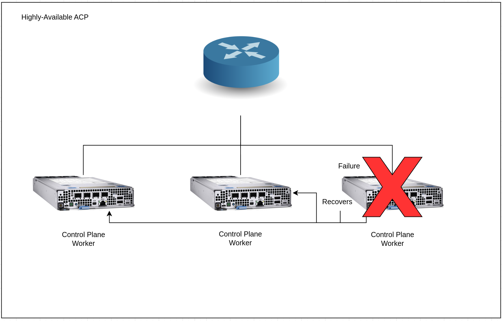

# Standardized Highly Available Computing Platform Architecture
This pattern gives a technical look at a highly available, hyper-converged style advanced computing platform on three nodes.

## Table of Contents
* [Abstract](#abstract)
* [Problem](#problem)
* [Context](#context)
* [Forces](#forces)
* [Solution](#solution)
* [Resulting Content](#resulting-context)
* [Examples](#examples)
* [Rationale](#rationale)

## Abstract
| Key | Value |
| --- | --- |
| **Platform(s)** | TBD |
| **Scope** | TBD |
| **Tooling** | TBD |
| **Pre-requisite Blocks** | TBD |
| **Example Application** | TBD |

## Problem
**Problem Statement:** Industrial sites require the ability to provide a consistent, highly available compute platform for running both legacy applications in virtual machines, along with next generation workloads.

This pattern creates a highly available platform offering at the storage, compute, scheduling, and networking layers. Applications that are highly available will benefit from this platform, while non-highly available applications will be automatically rescheduled and recovered in the event of node failure.

## Context
This pattern represents the default configuration for an ACP, operating at an industrial site, that's reponsible for mission critical applications. It attempts to provide capabilities for many types of application requirements out of the box, allowing for new workloads to be onboarded without reinstallation of the platform.

This pattern is focused on outlining the default configuration of a compact, highly available advanced computing platform, using a hyperconverged-style approach.

This pattern calls out recommendations for hardware, however these should be scaled according to the workloads intended for the platform. If more resources (CPU/memory) are required, the hardware is scaled accordingly.

Three nodes provides for true high availability of the control plane and functionality of the platform while fitting into the space, power, and cooling constrained environments found at industrial/remote sites.

## Forces
1. **Ease of Use:** This pattern represents a platform that's ready "out of the box", with customizations applied automatically at or immediately after installation, so the platform is ready for many different types of workloads.
2. **Flexibility:** While this pattern is heavily opinionated, it is flexible, and can be expanded, changed, or adjusted due to new requirements over time.
3. **Consistency:** ACPs should be treated as cattle, being deployed in a consistent fashion across many sides, allowing for a consistent deployment target across site boundries.
4. **High Availability:** The ACP's control plane is highly available, allowing for failure of a single node without impacting platform functionality. Non-HA workloads will be automatically recovered, and highly-available workloads will be automatically scheduled to remain available even if a node is lost.
5. **Limited Supporting Resources:** Edge sites are typically constrained on power and cooling, while the workloads still require a platform capable of being highly available. The platform should fit within these power and cooling constraints.

## Solution
By combining the platform capabilities of Red Hat OpenShift with some additional tooling and opinionated hardware requirements, the following goals can be achieved:
1. Highly available, converged control/worker planes across three physical nodes
2. Converged storage spread across workers, consumable by nodes within the cluster
3. Ability to run virtual machine based workloads alongside containerized workloads on one platform
4. Platform configured for local autonomy and resiliancy

At a high level, a highly available ACP contains three physical systems, acting as both control plane and workers, connected to a networking stack:

All control plane functionality is run in a highly available deployment across the nodes. Workloads that are highly available will be spread across the nodes as well.

In the event of a failure of a node or of networking to that node, the lost workloads and control plane functions are automatically rescheduled:

This recovery action is performed automatically by the platform, regardless of the type of workload: pods, virtual machines, etc.

***Note: add justification for this

### Network Connectivity

There are three main channels of communication for highly available ACPs: control plane/containerized workloads, bridged virtual machines, and storage. It's recommended to separate these communication channels onto dedicated links for the best performance.

> Note:
>
> VLAN numbers are examples.

In this diagram, each of the communication channels are matched to a dedicated physical connection tied back to the appropriate network infrastructure. The required link speed for storage is 10Gbps/minimum. In addition, the other communication channels's links are recommended to be 10Gbps+, depending on workloads.

A remote management link is also connected if available on the hardware platform, however this is not required.

It is highly recommended to separate the vaious communication channels across subnet/VLANs, as to provide proper network segmentation for the various types of traffic.

In a highly available setup, the failure of a single link or loss of a node will not impact functionality of the control plane.

For example, if a link fails:

Or, if a node fails:

#### Control Plane and Containerized Workload Traffic
The control plane and containerized workload traffic is any traffic using OpenShift's default ingress capabilities, along with the internal networking concepts provided by the cluster. As almost all containerized workloads leverage these concepts, application traffic will flow over this link. In addition, node to node communication for control plane traffic will also leverage this link.

Non-bridged virtual machine traffic will also use this link.

#### Storage Traffic
The storage traffic is for nodes in the cluster to replicate data being moved to and from the storage layer. Workloads do not access the storage layer on this link, instead, it is used to keep the storage system "in sync", and keeps rebalancing traffic from overwhelming other forms of traffic.

The storage traffic can be treated as "internal only", meaning the only devices in that subnet/VLAN are the node's storage links. A gateway is not required.

#### Bridged Virtual Machine Traffic
Using a network bridge for virtual machines provides the same connectivity model as what other virtualization platforms provide: the VMs appear as endpoints on the network, with their own MAC addess and IP address, and can be communicated with directly. This provides operational consistency with existing setups, however it alos bypasses the kubernetes-native networking stack, removing some of the provided segmentation and traffic control functionality. In this configuration, network segmentation and traffic isolation responsibility is offloaded to a firewall.

Multiple VLANs/subnets are possible, using VLAN interfaces on top of a bridge interface, or by scaling up the number of bridge interfaces if needed.

### HCI-style Storage Cluster
A core concept of hyper-converged infrastructure is taking available devices, such as storage devices, available on the nodes and presenting them as one consistent layer for consumption by workloads. OpenShift Data Foundation works according to this mantra as well: taking physical storage devices and presenting them as consumable storage for workloads, in a few different storage classes.

The number of physical devices required depends on throughput and IOPS requirements for workloads, however 7 physical devices will used as an example here.

Within each node, a device is dedicated to being the boot/sysroot device, then the other devices are managed by ODF:

Within the storage cluster, the failure domain for the storage layer is set to "node", so that an entire node can be lost without data being lost as well.

In highly protected situations, the number of copies of data can be set to 3, meaning that each node would have a copy of the data, for mamimum data durability in the event of failure.

In the event of a drive failure, the data is still available via drives on other nodes, and will continue to be served:

Once the drive is replaced, data will be replicated from other nodes/drives.

In the event of a node failure, data will continue to be read/written, as the failure domain is set to a node:

Upon recovery, data will be rebalanced and available copies will be restored.

## Resulting Context
Once deployed, a highly available advanced computing platform provides the functionality to run multiple types of workloads on the same common platform. 

Some highlights:
- **Platform Consolidation:** With a software-based platform providing capabilities around running many different types of workloads, a single platform on a single hardware stack can be used to consolidate workloads from many differnet platforms.
- **Ease of Operations:** With only a single platform deployed, operators need to only learn one technology stack, and interface with one management interface for running workloads or for platform maintenance.
- **Self-Management:** OpenShift provides management of workloads as part of the platform, automatically initiating failover and recovery actions when required. These are performed without manual intervention.
- **Scalability:** As power and cooling allow for more compute, the ACP automatically consumes and presents these additional resources for workloads to consume.
- **Consistency:** As one platform is used across multiple deployment sites, workloads can easily be deployed and scaled, and training resources can be reused at each deployment location.
- **Security:** By default, an ACP comes with a high level of pre-configured, preventing the deployment of insecure workloads, and providing some segmentation between users and workloads. These are configurable, allowing for far more control and restrictions on workloads as needed.

## Examples

In this example, three core categories of workloads are running on a converged platform, leveragng the same hardware footprint and platform, despite being different types of workloads with different requirements.

These workloads are examples, however they are representitive of workloads found on ACPs.

Ultimately, these workloads all share base requirements of connectivity, storage, and a platform to orchestrate them, however how those resources are consumed is different per workload. The ACP is responsible for providing these common resources, and faciliting their consumption.

### Control Plane Functionality
This set of functions are related to the operation of the platform and how the underlying hardware is both abstracted and presented, as well as managed over time by the platform.

This functionality is related to the ongoing availablity and capabilities of the platform, and is all self-managed, self-deployed, and simply consumed by workloads or operators.

### Manufacturing Execution System - Containerized
This workload provides the core set of functions of an MES: monitoring, tracking, documenting, and controlling the production of products at a single or many sites.

In this example, the application has been containerized, leveraging native k8s functionality provided by the ACP. Since this is a "next generation" workload with requirements around running containerized workloads, the core operating concepts of the ACP, based on k8s, are heavily utilized.

### Distributed Control System - Virtualized
This workload is representitive of a supervisory system atop industrial equipment and devices, and is a more traditional workload with requirements to match.

This application is broken up into a components, however those components are deployed on top of virtual machines, which consume resources of the ACP.

## Rationale
The two main rationalizations for a modern compute platform, such as an ACP are:
1. Running Existing Applications that Power the Business
2. Providing for Next-Generation Workloads without Replatforming

A modern approach to computing, such as an ACP as outlined above, provide for both of these points without requiring the replacement of the platform when new applications are deployed.

While there's value in running the workloads found today, applications are being modernized by internal teams, by vendors, etc, and providing a consistent, capable platform allows for any type of workload to recieve the same benefits as others, regardless of the individual differences in application type, deployment method, or operating method.

## Footnotes

### Version
1.0.0

### Authors
- Josh Swanson (jswanson@redhat.com)