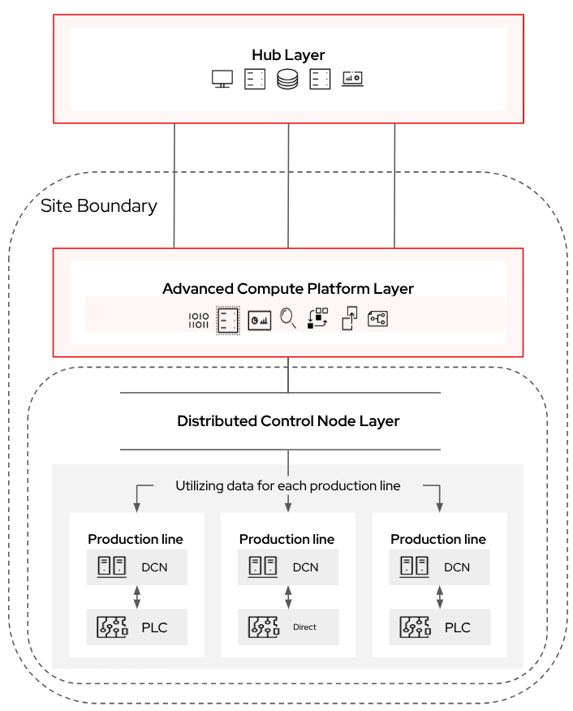

# Advanced Compute Platform Overview
This pattern outlines a solution for the advanced compute platform (ACP) layer of the industrial edge platform. The ACP represents the central compute foundation at a site, designed to run a diverse set of workloads with consistency, resiliency, and manageability. It provides the functionality needed for both existing and next generation workloads, supporting industrial operations while enabling modernization and innovation.

The overall goal of this pattern is to describe the ACP’s role as the “site-scale” compute platform, bridging the gap between centralized hub services and distributed control nodes. It provides a hyperconverged-style platform that supports virtualized, containerized, and emerging workloads, while remaining adaptable to different connectivity models and deployment constraints.

This pattern should be considered complementary to the broader [industrial edge platform pattern](../industrial-edge-platform/README.md), which outlines all three layers (hub, ACP, and DCN). This document focuses specifically on the ACP layer, providing a deeper dive into its purpose, requirements, and usage.

As a reminder, the ACP typically sits within a specific site:

An ACP loosely maps to functions found within the DMZ, layer 3, layer 3.5, and possibly even layer 2 of the traditional Purdue model:

## Table of Contents
* [Abstract](#abstract)
* [Problem](#problem)
* [Context](#context)
* [Forces](#forces)
* [Solution](#solution)
* [Resulting Context](#resulting-context)
* [Examples](#examples)
* [Rationale](#rationale)

## Abstract
| Key | Value |
| --- | --- |
| **Platform(s)** | <ul><li>Advanced Compute Platform</li></ul> |
| **Scope** | <ul><li>Installation</li><li>Operation</li><li>Workload Hosting</li></ul> |
| **Tooling** | <ul><li>Red Hat OpenShift</li><li>Red Hat Advanced Cluster Management (Optional)</li><li>Red Hat Ansible Automation Platform (Optional)</li></ul> |
| **Pre-requisite Blocks** | <ul><li>Site Hardware</li><li>Networking</li></ul> |
| **Pre-requisite Patterns** | <ul><li>Hub Services (optional)</li></ul> |
| **Example Application** | <ul><li>Manufacturing Execution Systems (MES)</li><li>Distributed Control Systems (DCS)</li><li>Supervisory Control and Data Acquisition (SCADA)</li><li>AI/ML Workloads</li></ul> |

## Problem
**Problem Statement:** At industrial sites, workloads extend far beyond basic PLCs and I/O. Many critical systems—MES, DCS, SCADA, IoT platforms, and analytics—require robust, site-level compute infrastructure. Historically, these workloads have been hosted on siloed servers or specialized hardware, creating complexity, operational overhead, and inflexibility.

Without a standardized, resilient compute layer, sites face challenges including:
- High operational costs due to fragmented management.
- Inability to run both legacy and modern workloads on a common foundation.
- Increased downtime risk due to lack of resiliency and observability.
- Difficulty scaling or adapting to new requirements like AI, edge analytics, or hybrid IT/OT workloads.

The absence of a consistent compute platform prevents sites from modernizing while maintaining mission-critical reliability.

## Context
This pattern applies whenever industrial workloads require site-local compute, but demand more flexibility and resiliency than distributed control nodes alone can provide.  

The ACP is intended to:
- Act as the primary workload host at industrial sites, consolidating diverse applications.
- Provide an abstraction layer between hardware and applications, ensuring consistency across sites.
- Serve as a management conduit for DCNs and optionally act as a localized hub in disconnected or partially connected environments.

Key assumptions:
- Workloads include both existing/legacy systems and next-generation containerized or AI-driven applications.
- Hardware availability, power, and cooling constraints vary across sites.
- Connectivity may be intermittent, requiring ACPs to operate autonomously.
- A single ACP may serve as the "site datacenter," supporting multiple teams and workloads.

## Forces
- **Resilience:** ACPs must continue hosting workloads regardless of hub connectivity, and must support HA or non-HA deployments depending on site needs.
- **Security:** ACPs operate within OT environments and must support strong isolation, RBAC, and compliance with security processes.
- **Consistency:** ACPs must deliver a uniform platform experience across diverse sites and hardware.
- **Customization:** ACPs should adapt to site-specific constraints, from small form factor deployments to multi-node HA clusters.
- **Observability:** ACPs must provide visibility into workloads and platform health, locally and (optionally) back to a hub.
- **Manageability:** ACPs must lower operational burden through automation, templates, and centralized but optional fleet oversight.
- **Flexibility:** ACPs must support VMs, containers, and emerging workload types simultaneously, ensuring continuity for legacy apps while enabling modernization.
- **Local Autonomy:** ACPs must remain fully functional when disconnected, continuing workload operations and management locally.

## Solution
The ACP layer is deployed at industrial sites on hardware ranging from compact ruggedized servers to rack-based clusters. It provides a hyperconverged platform capable of running virtualized workloads, containerized applications, and next-generation AI/ML or serverless workloads.  

Key solution attributes:
- **Standard Services:** ACPs deliver a consistent set of core services (identity, networking, storage, observability) via [ACP standard services](../rh-acp-standard-services/README.md).
- **Flexible Deployments:** Supports [highly-available](../acp-standardized-architecture-ha/README.md) and [non-HA](../acp-standardized-architecture-non-ha/README.md) topologies.
- **Connectivity Models:** Operates in [fully connected](../connected-acp/README.md), [partially connected](../caching-platform-updates-on-an-acp/README.md), or [disconnected](../disconnected-acp/README.md) modes.
- **Management Conduit:** Can manage [distributed control nodes](../build-test-host-dcn-images-on-acp/README.md), enabling site autonomy.
- **Application Flexibility:** Supports traditional MES/DCS/SCADA workloads, IoT gateways, analytics pipelines, and AI/ML models on a common foundation.

The ACP ensures industrial sites can adopt modern IT capabilities without abandoning existing investments or compromising reliability.

## Resulting Context
By adopting ACPs, organizations gain:
- A stable, uniform compute layer at each site.
- The ability to consolidate existing workloads with new workloads, reducing hardware sprawl.
- Autonomy for disconnected or intermittently connected sites, without loss of core functionality.
- Easier lifecycle management through automation, with optional integration to centralized hub services.
- A scalable foundation for deploying advanced workloads (AI/ML, analytics) alongside mission-critical operational systems.

The ACP becomes the anchor point of the industrial edge, bridging centralized hub services and distributed control nodes.

## Examples
The examples section of this pattern will link to other patterns that contain examples of what an ACP can do, along with 

### Consolidating Legacy and Modern Workloads
Running a VM-based MES and a containerized DCS side by side on the same ACP, enabling interoperability and visibility.  

See the [Running Existing Applications on an ACP](../existing-apps-on-acp/README.md) pattern for more information

### ACP as Management Conduit for DCNs
ACPs can act as a management point for DCNs, and bridge the gap between the hub and DCN layers.

For more information, review the following patterns:
- [Building, Testing, and Hosting DCN Images on an ACP](../build-test-host-dcn-images-on-acp/README.md)
- [Cloud to Edge Application Deployment](../cloud-to-edge-app-deployment/README.md)

## Rationale
The rationale for this pattern is to highlight the ACP as the cornerstone of industrial edge compute. It balances flexibility and resilience, supporting both modernization and continuity of critical operations.  

By providing a consistent, secure, and manageable compute layer, ACPs enable industrial organizations to standardize across sites, simplify operations, and prepare for future workloads—without compromising on mission-critical reliability.

## Footnotes

### Version
1.0.0

### Authors
- Josh Swanson (jswanson@redhat.com)