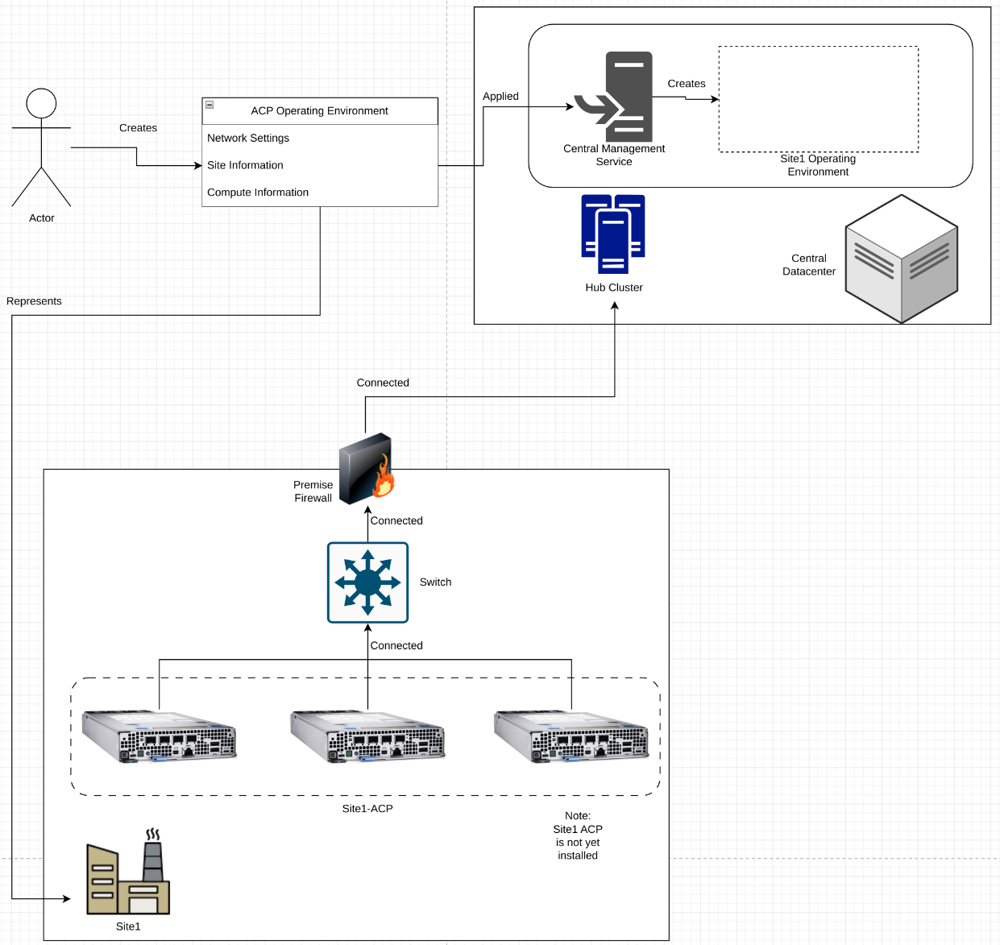
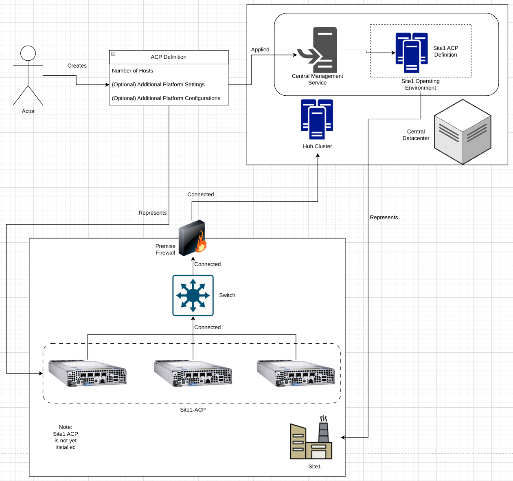
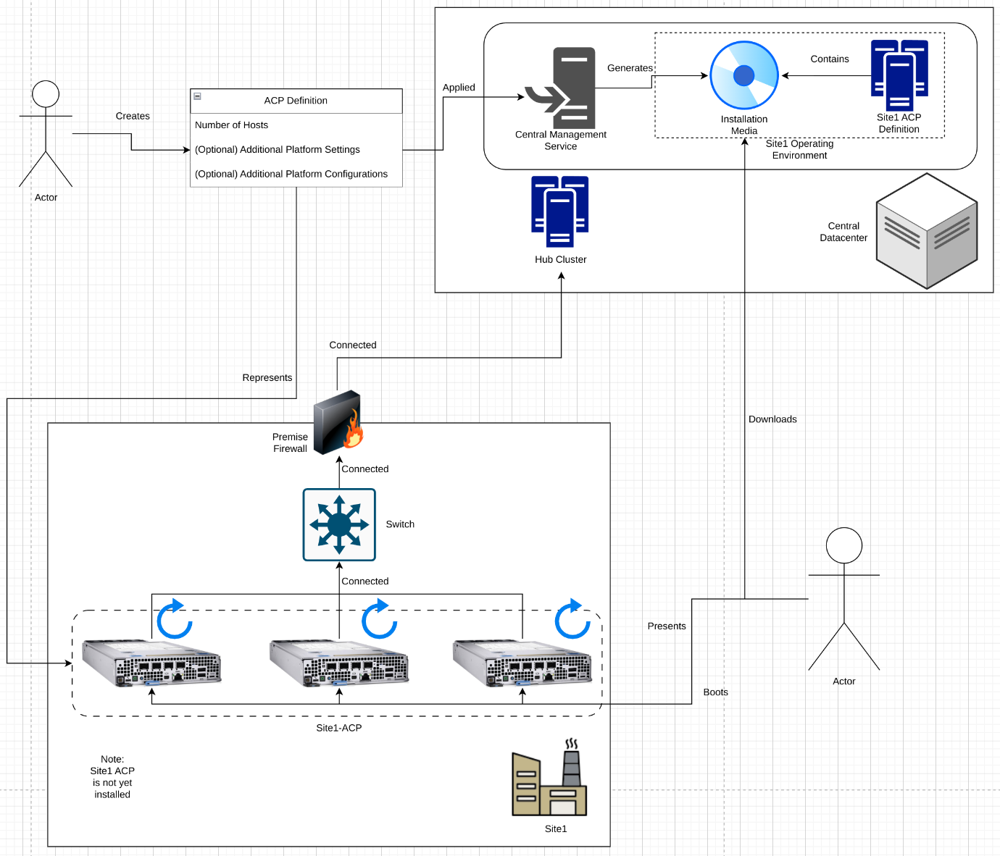
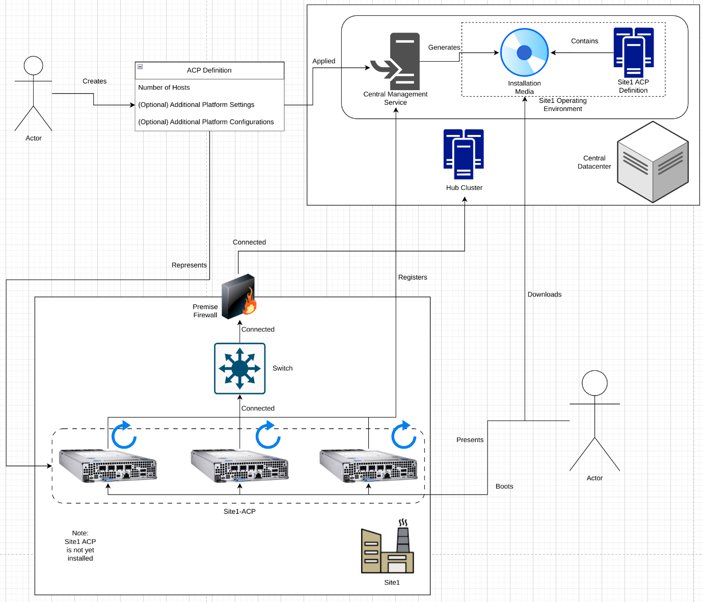
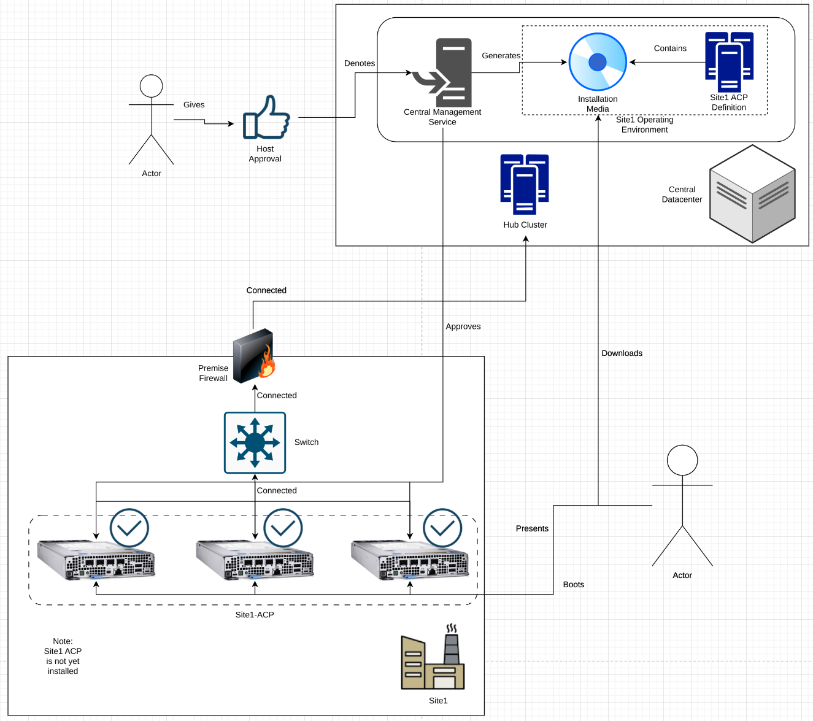
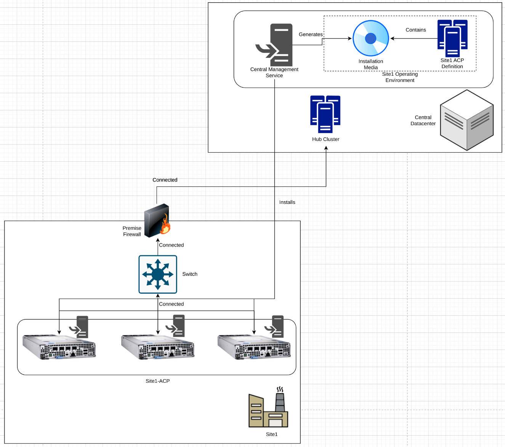
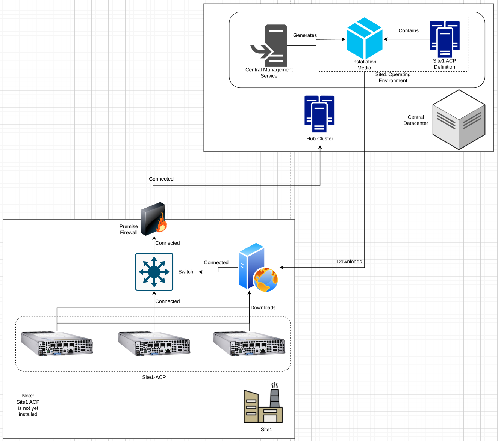
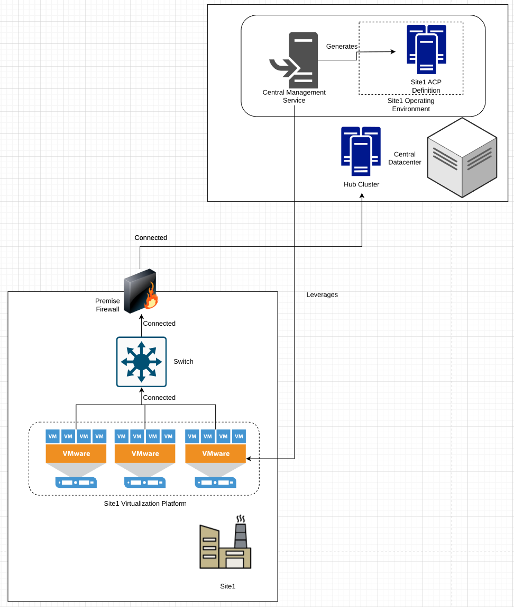
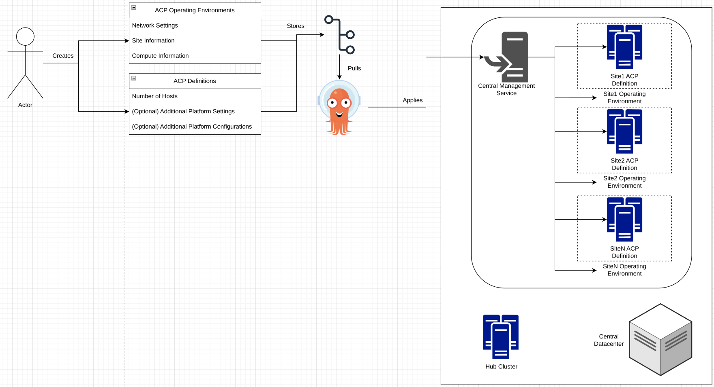

# Automated ACP Installs from a Hub
This pattern outlines a solution for installing ACPs at various distributed sites in an automated fashion, using a hub cluster to drive the automated installation.

As ACPs will often be deployed to many sites, the ability to install from a central location is paramount to rapid deployment and adoption of the solution when a large number of sites require the functionality an ACP provides.

This solution requires a central, reachable hub, running the core set of hub services, than can be contacted by the sites where an ACP will be installed.

## Table of Contents
* [Abstract](#abstract)
* [Problem](#problem)
* [Context](#context)
* [Forces](#forces)
* [Solution](#solution)
* [Resulting Content](#resulting-context)
* [Examples](#examples)
* [Rationale](#rationale)

## Abstract
| Key | Value |
| --- | --- |
| **Platform(s)** | Advanced Compute Platform |
| **Scope** | Installation |
| **Tooling** | <ul><li>Red Hat Advanced Cluster Management</li></ul> |
| **Pre-requisite Blocks** | N/A |
| **Pre-requisite Patterns** | <ul><li>[ACP Standardized Architecture - Highly Available](../acp-standardized-architecture-ha/README.md)</li><li>[ACP Standardized Architecture - Non-Highly Available](../acp-standardized-architecture-non-ha/README.md)</li><li>[Hub Standard Services](../rh-hub-standard-services/README.md)</li></ul> |
| **Example Application** | N/A |

## Problem
**Problem Statement:** Building and installing a single ACP is a fairly strightforward process, but needs to be repeated at each location where an ACP will be installed. The effort to accomplish these installs inidividually grows dramatically with the number of sites that require the functionality, and thus installation of, an ACP.

In addition, the knowledge and understanding required to fully complete the installation process may not be available at each site, requiring a more centralized, scalable approach to building ACPs at remote sites.

## Context
This pattern is best applied when multiple sites need an ACP installed in an automated fashion, with the responsibility for the majority of the technical setup steps should be handled by an application or service running on a centralized cluster. This process scales to thousands of ACPs, and can be used to deploy, redeploy, and ultimately drive day 2+ management of ACPs at scale.

This pattern focuses on the initial setup of the ACP. Another pattern will focus on centralized and standardized deployment of the platform's core services.

A few key assumptions are made:
- The intended context of the platform aligns to the [Standard HA ACP Architecture](../acp-standardized-architecture-ha/README.md), the [Standard Non-HA ACP Architecture](../acp-standardized-architecture-non-ha/README.md), or any valid ACP architecture as needed.
- The standard set of [Hub Services](../rh-hub-standard-services/README.md) are available for consumption.
- Connectivity from the sites to where the ACPs will be deployed back to the hub has been established

For simplicity, some diagrams will show a single site engaging with a hub, however this process can be scaled up as needed to handle thousands of ACPs. In addition, a hub will be shown running in a core datacenter, but could be running in a public/private cloud, or other location, assuming connectitiy to the sites is available.

## Forces
- **Highly Automated:** This pattern outlines how an ACP can be installed with little/no intervention at the site level, shifting the responsibility for the intermediate installation steps to the hub.
- **Simplicity:** This pattern's solution is designed to allow for non-IT personnel to complete the required steps to begin the ACP installation, and optionally, to drive the installation process with minimal training, depending on the roles and responsibilities of the organization.
- **Scalablility:** This pattern's solution allows for many ACPs to be installed, even simultaneously, across geographically distributed sites.
- **Customization:** This pattern's solution allows for full customization of the ACPs being built, with some aligning to the highly-available architecture, and some aligning to the non-highly available architecture, or any other valid architecture as needed. In addition, full control over the set of installation parameters is available.

## Solution
The solution is to leverage a hub's central management services and, optionally, a declarative approach to define the desired ACPs at sites, and allow for the hub's central management services to create the necessary assets and drive the installation.

At a high level, the main steps to this pattern's solution are:
| Step Number | Title | Description | Applied at Location |
| --- | --- | --- | --- |
| 1 | Define ACP Operating Environment | Provide information about the operational location of the ACP, such as network settings, CPU architecture, and location | Hub |
| 2 | Define Desired ACP | Provide the desired state of an installed ACP, such as number of hosts | Hub |
| 3 | Generation of Installation Media | The hub automatically creates installation resources to allow for discovery of metal assets to install to | ACP Site |
| 4 | Attachment of Installation Media | The created installation media is presented to the ACP nodes, either via block device or over a network | ACP Site |
| 5 | Approval of Discovered Hosts | The hosts booted to the installation media are validated and accepted | Hub |
| 6 | ACP Installation | The ACP is automatically installed by the hub after approval of the discovered hosts | Hub |

The solution section of this pattern will outline an automated installation of an ACP running on bare-metal from a hub using a block device to provide the installation media to the hosts, with details about the steps above. The [Examples](#examples) section will outline additional scenarios.

### Step 1 - Defining ACP Operating Environment
The first step defines the locations where ACPs will operate, along with some settings of the site, such as networking capabilities and physical compute information.

These operating environments are usually associated with the physical sites where an ACP will deployed. Technically, multiple ACPs can be deployed to a single operating environment, however a 1:1 ACP operating enviroment:ACP is common.

This step is actioned against the hub that will be handling the ACP installation, and can be completed through a web-based user experience, or through an automated process, such as leveraging the declarative state management service of a hub.

The central management service of the hub will create and manage the defined operational environment, which at this stage, is empty, as no desired cluster has been defined.

**Pros:**
- Allows for one to many ACPs to be installed at a site
- Associates with a physical deployment location for easier tracking of ACPs

**Cons:**
- Requires some knowledge of the site up-front

### Step 2 - Define Desired ACP
Next, the desired ACP is defined against the central management service on the hub. This definition contains the number of hosts that will comprise the ACP, along with, optionally, more granual settings for the ACP, if desired.

The central management service will map the ACP definition into the operating environment, and combine the revalant information to form the full installation automation and installation media.

**Pros:**
- Creates ACP definition on the hub without needing to fully define every setting/possibility
- Associates the ACP with the operational environment (site)

**Cons:**
- Requires knowledge of desired ACP architecture and optional settings if needed

### Step 3 - Generation of Installation Media
With both the ACP's operating environment and the ACP itself defined, the central management service of the hub will generate the required installation media that is used to bootstrap the hosts and begin the cluster installation.

This generated media contains enough information to have the hosts download the necessary boot information from the hub, and to have them call home to the hub to begin the next steps in the process.

**Pros:**
- Automatically creates the required installation assets
- Embeds the call-home and initial configuration information

**Cons:**
- Requires compute and storage to generate and store installation media

### Step 4 - Attachment of Installation Media
Next, the generated installation media is presented to the hosts so they may be bein the boot process, and then call home to the hub.

This step can be handled maunally by presenting the installation media to the hosts using physical media such as a USB flash drive, or fully automated through additional tooling and out-of-band management interfaces available on many bare-metal server-class devices. In addition, nextwork-based booting to the generated installation media is also an option.

Once the devices have downloaded to appropriate resources to finish the boot sequence, they'll begin calling home to the hub, allowing for continuation of the automated process.

**Pros:**
- Automatically registers hosts with the hub

**Cons:**
- May require manual intervention if automation or out-of-band management is not available
- Requires proper connectivity and network configuration to reach the hub

### Step 5 - Approval of Discovered Hosts
The last step is the approval of the discovered hosts. This step is taken to ensure the correct hosts are being installed to the correct ACP opeating environment, and into the correct ACP cluster.

In additition, the hosts will perform self-tests and evaluations to ensure the installation process will be successful. Failed checks will be displayed for remediation, and the installation will be blocked until all checks have successfully passed.

**Pros:**
- Self-tests and evaluations are performed automatically
- Hosts can be approved in bulk
- Hosts will automatically report information to the hub

**Cons:**
- Requires being able to idenfity what discovered nodes should be part of what ACP

### Step 6 - ACP Installation
Once the correct number of hosts have checked in and been approved, the hub will initiate the installation process. This is initiated automatically once all appropriate checks have passed, denoting that both the hub and the hosts believe the installation will be successful.

This process will take time, but does not need to be monitored, as the hub will handle the various installation phases automatically.

**Pros:**
- Automatically handles the installation of the ACP

**Cons:**
- Requires time and bandwidth to complete

## Resulting Context
The resulting context is the ability to build ACPs at remote sites in an automated fashion, without needing deep technical expertise available at the sites, and without needing to manually create installation media for every site. This allows for significantly increased consumption of ACPs as part of overall solutions over manually installing them at each site. In addiition, a large number of ACPs can be deployed through this method to geographically distributed sites without needing large centralized support teams.

## Examples
The [Solution](#solution) section of this pattern showcases a flow where the constructs required on the hub are created by a centralized team, then the installation media is handed off to an on-site resource to be presented to the physical hosts, then the final approval is given by that centralized team.

A few additional flows will be considered in this section:
- Network booting the hosts using the installation media
- Installation onto an underlying platform
- Leveraging declarative tooling to scale ACP operating environment and ACP definition deployment

### Network booting the hosts using the installation media
The hub's management service, by default, generates a few different types of installation media, one of which can be used to boot the hosts over a network. This can be referred to using network services, such as bootp and PXE/iPXE, to allow for a more hands-off approach to the process.

In this example, the generated installation media for networking booting is downloaded to a web server at the site. Then, the hosts are network booted, where network services inform the hosts that the installation media is available for download from the web server. The hosts retrieve the installation media over the network, boot, then continue on with the rest of the process like normal.

Optionally, this can be fully automated using IT automation tooling to configure the site's web server and network services.

### Installation onto an underlying platform
In certain situations, ACPs can be virtualized on top of other platforms that provide virtualization. The hub's central management platform features a set of pre-built integrations for virtualization and compute providers, which allows to hub to simply consume the virtualization platform and create an ACP without needing additional support, or without needing to generate installation media.

In this example, the site has a virtualization platform that the hub's central management service has an existing integration for. This allows for a "direct" installation of the ACP by the hub, without any additional input. This provides a similiarily heavily automated experience when building ACPs at remote sites.

### Leveraging declarative tooling to scale ACP operating environment and ACP definition deployment
Finally, another example is using declarative tooling and GitOps to define clusters at scale, and ensure they're consistent and managed on the hub, which in turn ensures consistency as the ACPs are deployed to remote sites.

This allow for significant scaling of this solution over manually defining each site or ACP at every site, reducing the burden on the centralized management team when deploying ACPs to a large number of sites.

In addition, templating functionality of the declarative state management service could be used to build a large number of ACP operating environment definitions and ACP definitions without needing to manually define them individually.

## Rationale
The rationale for this pattern is to address the need for repeatable and automated deployment of ACPs at a large number of edge sites without needing a large centralized team. This pattern's solution leverages functionality of a service provided by a centralized application, the hub's central management service, to accomplish this. This approach also leads to greater consistency at scale, helping to eliminate support and troubleshooting burdens when building and operating ACPs.

## Footnotes

### Version
1.0.0

### Authors
- Josh Swanson (jswanson@redhat.com)