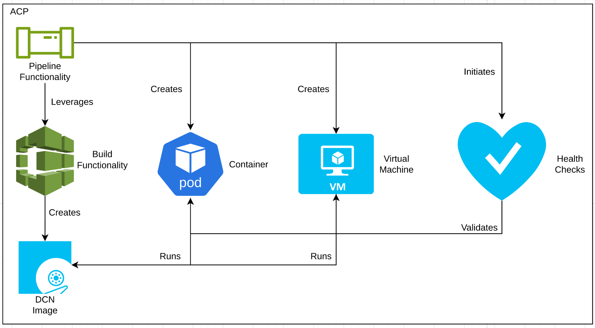

# Building, Testing, and Hosting Images for DCNs on an ACP or Hub
This pattern outlines a solution for building, testing, and hosting DCN images on an ACP (Advanced Compute Platform) or hub, leveraging core services and built-in functionality. 

As the images that will be deployed to DCNs need to be built, tested, and ultimately hosted for consumption by the DCNs, a platform that can provide tooling and capability to meet the steps required to complete this process is required.

This solution can be deployed centrally onto a hub, optionally using ACPs to mirror or cache the images, or can be deployed to ACPs themselves, depending on requirements.

## Table of Contents
* [Abstract](#abstract)
* [Problem](#problem)
* [Context](#context)
* [Forces](#forces)
* [Solution](#solution)
* [Resulting Content](#resulting-context)
* [Examples](#examples)
* [Rationale](#rationale)

## Abstract
| Key | Value |
| --- | --- |
| **Platform(s)** | Advanced Compute Platform |
| **Scope** | Virtualization, Pipelines, Build, and Image Registry |
| **Tooling** | <ul><li>Red Hat OpenShift GitOps</li></ul> |
| **Pre-requisite Blocks** | N/A |
| **Pre-requisite Patterns** | <ul><li>[Image Mode for Distributed Control Nodes](../image-mode-for-dcns/README.md)</li></ul> |
| **Example Application** | N/A |

## Problem
**Problem Statement:** The images that will be deployed to distributed control nodes, based off [bootable containers](https://developers.redhat.com/articles/2024/09/24/bootc-getting-started-bootable-containers) need to be built, tested, and hosted on a platform that's reachable from the DCNs, and also has the build, test, and host functionality available to drive the process. This build, test, and host process mirrors the processes used for containerized applications today, and since the images are simply bootable containers, there's significant enough overlap that methodologies and tooling can be shared and re-used.

In addition, the number of DCN images may grow as the number of deployed DCNs grows, requiring a platform capable of providing for a large number of images being built, tested, and hosted, without requiring heavy customization to support the required scale.

## Context
This pattern can be applied to environments where DCN images need to be built, tested, and hosted for the DCNs to retrieve during provisioning or update cycles. It relies on core functionality provided by ACPs and hubs, and can be applied to either, or both, as dictated by connectivity, locality, or image customization requirements.

A few key assumptions are made:
- The intended context of the platform aligns to the [Standard HA ACP Architecture](../acp-standardized-architecture-ha/README.md)
- The standard set of [ACP Services](../rh-acp-standard-services/README.md) are available for consumption.
- Connectivity from the ACP to the DCNs is available and established

Since this pattern can be applied to multiple target platforms, a target of an ACP deployed at a remote site will be used throughout most of the pattern documentation for beveritry.

## Forces
- **Highly Automated:** This pattern outlines how an ACP can leverage multiple services to build, test, and host DCN images, without needing manual intervention when moving between tools, or when moving from the build to testing phases.
- **Modularity:** This pattern's solution can be added to or subtracted from, or optionally, integrated into higher-level flows as required.
- **Scalable:** This pattern's solution allows for many DCN images to be built and tested, limited only by the amount of compute available, and the amount of storage available.
- **Customization:** This pattern's solution allows for full customization of the DCN images being built, allowing for complete control of content built and tested, and ultimately deployed to DCNs.

## Solution
The solution is to leverage the pipeline functionality of an ACP to orchestrate other services of the ACP to build, test, and host the operating system images.

At a high level, the three goals of this pipeline are:
- Building the DCN operating system images
- Testing and validating the DCN opeating system images
- Hosting the built and tested images for consumption by DCNs 

The underlying requirements for achieving these goals may change depending on requirements, but these are the overarching goals of leveraging this solution.

### Building the DCN operating system images
Using the pipeline functionality of an ACP, the build functionality can be connected to a source of truth outlining the desired DCN images, and allow for repeatable runs when changes to the images are required.

As a quick review, distributed control node operating systems are a combination of content, configurations, and applications built into a single image that's applied to physical systems or virtual machines. The required number of builds may grow depending on the number of sites, devices, or a combination of both.

By leveraging the compute capacity and build functionality of an ACP, the build process is platformed onto the ACP, initiated by a pipeline run, and the created content is the DCN images, removing the need for additional compute infrastructure.

**Pros:**
- Leverages existing functionality of the ACP
- Requires no external support from other platforms or technologies

**Cons:**
- Requires available compute capacity

### Testing and validating the DCN opeating system images
Next, continuing to use the pipeline functionality, the built images can be tested on the ACP, either by starting the images as a containerized workload, or by creating virtual machines running the operating system image. Various checks can be run, such as ensuring the base system starts, applications start and become available, and other checks as required.

Since an ACP provides the capability to run virtualized and containerized workloads, no additional platforms are required. Instead, the ACP can fully facilitate this phase, and allows for customizations of the required health checks.

**Pros:**
- Also leverages existing functionality of the ACP
- Doesn't require any supporting or additional platforms or technologies

**Cons:**
- Requires available storage and compute capacity.

### Hosting the built and tested images for consumption by DCNs 
Once the images have been built and tested/validated, the images can then be hosted for consumption by DCNs. The built-in functionality of the ACP is simply re-used to provide this functionality.

This allows the DCNs to consume these images when being initially deployed, or when updating to a newer DCN image version.

**Pros:**
- Uses base functionality of the ACP

**Cons:**
- Requires configuring the internal registry (if not using another registry hosted by the ACP)
- Requires connectivity between the ACP and the DCNs

## Resulting Context
The resulting context is the ability to build, test and validate, and host DCN operating system images on an existing ACP, without needing to deploy additional tools and technologies. In addition, the process is highly automated, leveraging tooling to drive the various services and capabilities of the platform into a singular, consumable flow.

## Examples
An example of this pattern would be connecting the pipeline functionality to the source of truth for DCN images, which triggers a run of the phases when the content in that source of truth changes. The resulting new DCN operating system images would then be made immediately available for the DCNs to consume.

In this example, a change to the DCN image definition is initiated by an actor, which is then stored in a source control system.

The pipeline has been connected to this source control system, and routinely checks for changes. Should a change be found, the pipeline functionality automatically initates a pipeline run to build and test the new image, according to the new definition.

Once complete, the DCNs can then download the new image, and optionally, automatically apply it to themselves.

Optionally, the rollout could be controlled in stages, or controlled using image tags.

This allows for a "gitops-style" build, test, and rollout methodology for the DCN operating system images, which allows for treating those physical assets as code and code driven resources.

## Rationale
The Rationale for this pattern is to address the need for a high level of testing and validation around distributed control node deployment and operation, and conquering the challenges around building and maintaining those images. In addition, special focus was given to using services and functionality that are already provided by an ACP, leveraging the existing platform to drive and provide the expected behavior and functionality.

## Footnotes

### Version
1.0.0

### Authors
- Josh Swanson (jswanson@redhat.com)
