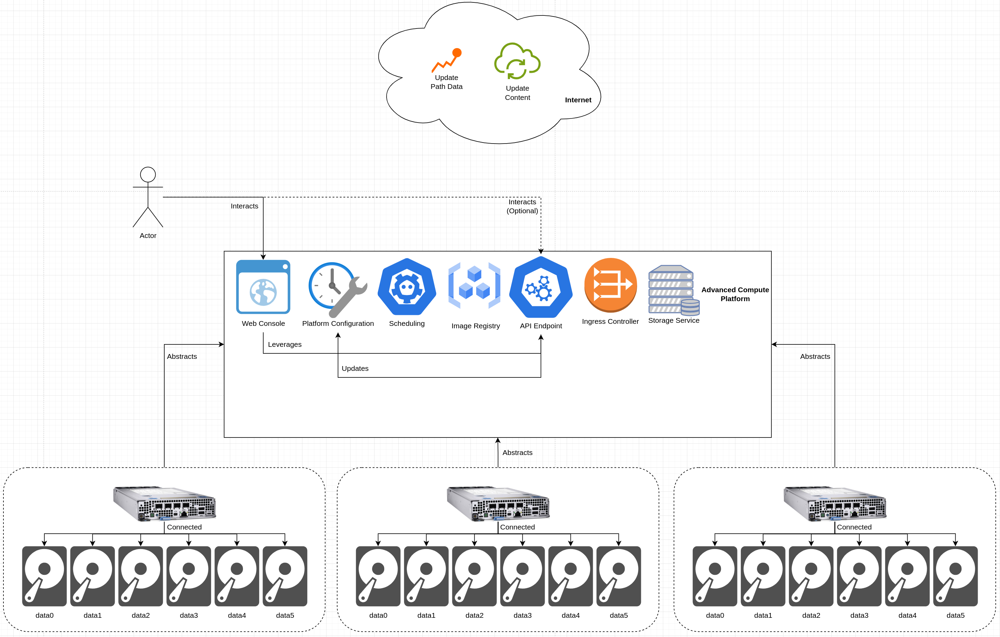
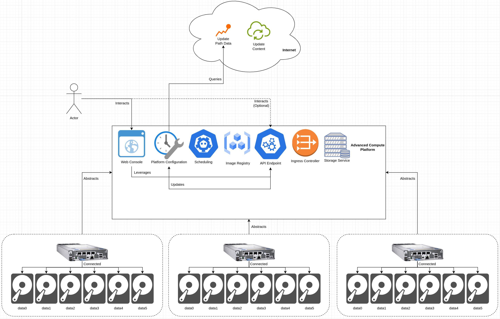
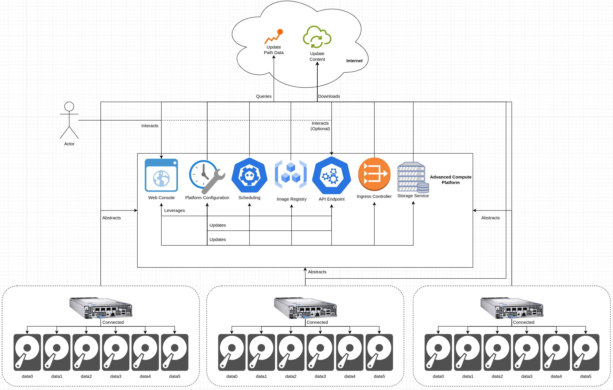
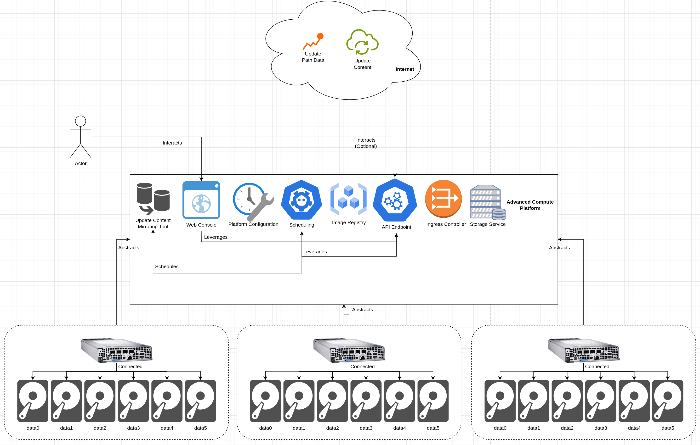
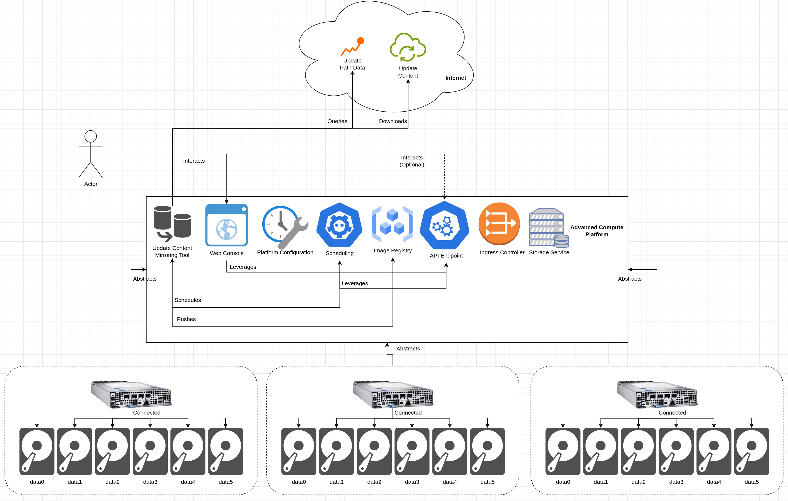
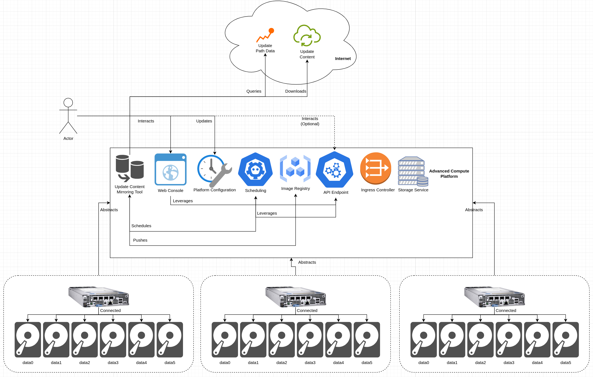
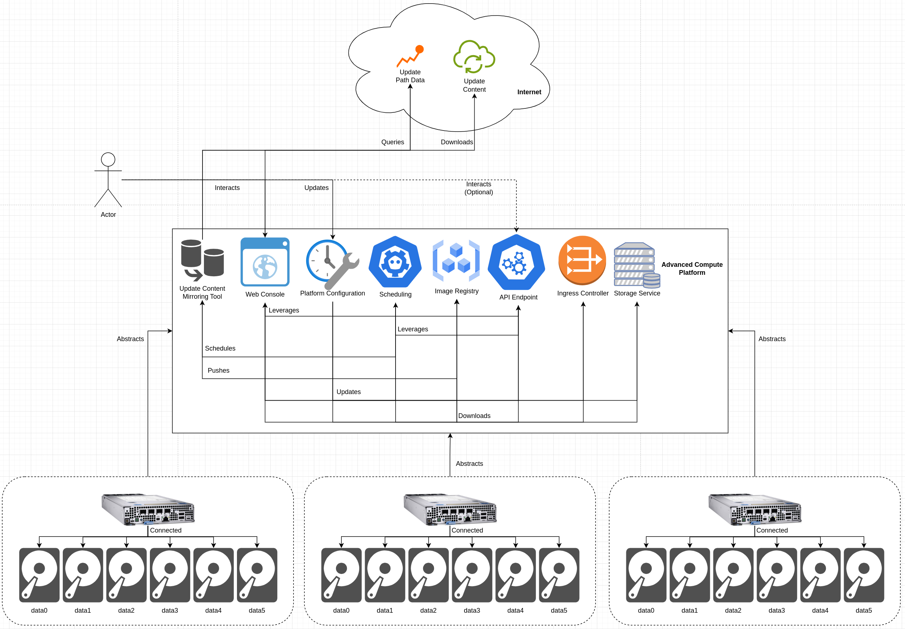
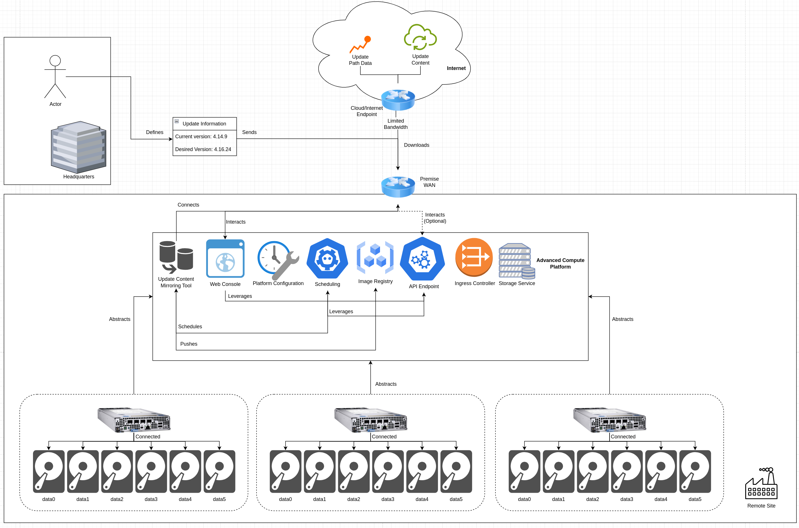
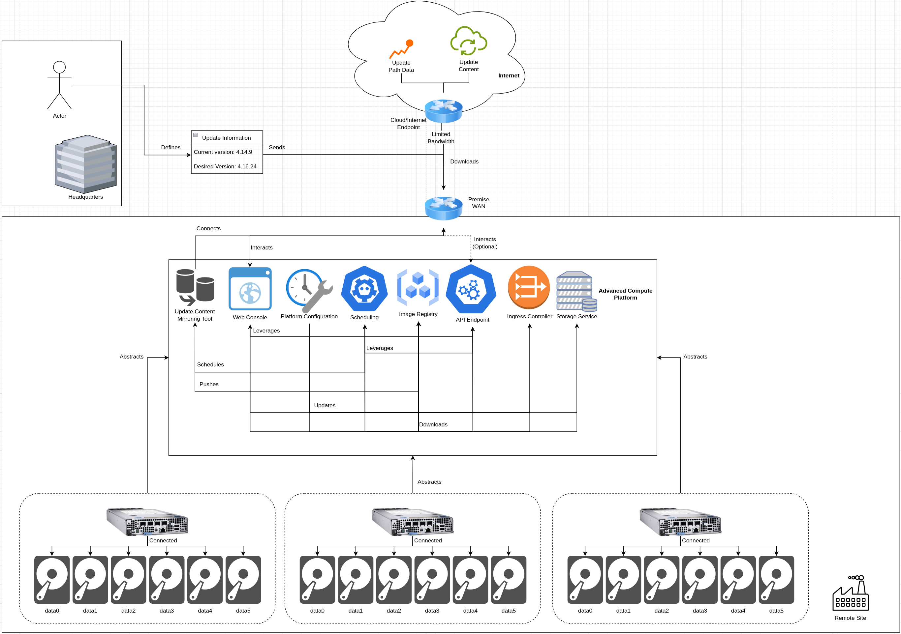
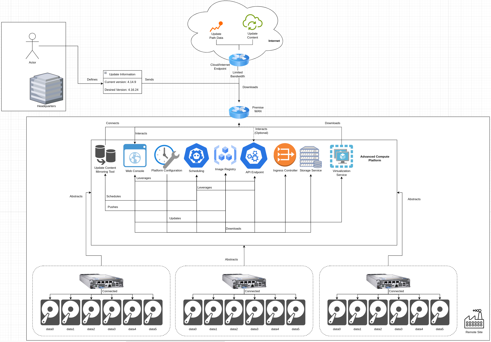

# Caching Platform Update Content on an ACP
This pattern walks through a solution to cache update content for an ACP on the ACP itself, using built-in platform fuctionality.

As ACPs are often deployed outside of datacenters or clouds at sites with less-than-ideal connections, pulling update content over a WAN link can take a significant amount of time, which may be incompatible with shorter maintenance windows.

This pattern aims to significantly speed up the platform update process by caching content "locally", allowing for caching to happen ahead of the actual update initiation.

## Table of Contents
* [Abstract](#abstract)
* [Problem](#problem)
* [Context](#context)
* [Forces](#forces)
* [Solution](#solution)
* [Resulting Content](#resulting-context)
* [Examples](#examples)
* [Rationale](#rationale)

## Abstract
| Key | Value |
| --- | --- |
| **Platform(s)** | TBD |
| **Scope** | TBD |
| **Tooling** | TBD |
| **Pre-requisite Blocks:** | <ul><li>[Backing the Internal Registry with Persistent Storage](../../blocks/backing-internal-registry-with-storage-ha/README.md)</li><li>[Mirroring Update Content](../../blocks/mirroring-update-content/README.md)</ul> |
| **Example Application** | TBD |

## Problem
**Problem Statement:** ACPs, being a modern platform for running multiple types of workloads, are updated in-place by pulling content from a remote source by default. This process works well in a datacenter or cloud, where bandwidth is essentially unlimited. However, when deployed to remote sites that do not have unlimited bandwidth, the traditional update methodology can cause extended update cycles, as the limited bandwith is saturated by downloading update content.

To resolve this, an ACP should be able to cache update content locally on the platform, then pull from that local cache when running an update to streamline and accelerate the update process. In addition, tight control around the cached content should be available, as to consume as few resources as necessary to achieve a successful update.

## Context
An ACP provides a consistent, unified platform for current generation and next generation workloads powered by a single control plane. This provides efficiency and consistency for operating at great scale.

As a modern platform, updates are applied in-place by the platform, after being told to perform an update. By default, the platform will identify the correct update path, download the correct update content, automatically relocate workloads, and roll through itself to complete the update. During this process, workload availability is prioritized as much as possible, and control plane functionality is automatically updated in steps to ensure continuity of service.

The use case and approach covered in this pattern is broadly applicable to ACP deployments, as bandwidth is often limited at remote sites where ACPs are deployed, and maintenance windows are often limited to avoid interrupting business operations.

The following services will be leveraged to achieve successful solution deployment:
| Service | Description | Usage in this Pattern |
| --- | --- | --- |
| Storage | Provides consumable storage in multiple formats and topologies | Provides storage for running existing workloads, supporting their persistent data needs |

## Forces
1. **Leverage Existing Functionality:** This pattern's solution should leverage the ACP's core services for caching update content
2. **Minimizing Update Duration:** This pattern's solution should provide a path to a faster update process than attempting to pull content over a limited WAN link
3. **Minimal Resource Consumption:** This pattern's solution should not introduce large resource requirements to be successfully implimented
4. **Fine Grained Control:** A high degree of specificity and control should be available around what update content to cache, and where the content should be cached
5. **Internet Connectivity:** This solution is designed to work in situations where internet connectivity is available, even through a proxy, to gather update path data, and to sync update content

## Solution
The solution is to to leverage the persistent storage and compute capacity of the platform, and pre-download the desired update content to the platform. Then, the platform can be configured to pull images from itself.

### Default Configruation
By default, an ACP pulls update path information and update content directly from sources on the internet when an update is initiated.

First, an actor interacts with either the platform's web console, which uses the platform's API under the covers, or the the API directly to initiate an update. This triggers an update to the platform's configuration, denoting an updated desired version.

Next, the platform gathers update path information to best determine how to get from the current version to the desired version. This update path data is hosted on the internet, which the platfrom queries:

Once the update path is defined, the various component versions are updated, and they each begin downloading update content and working toward the new desired version:

On a datacenter or cloud connection, where bandwidth is effectively unlimited, this is fine, as the components won't exhaust the available bandwidth when performing an update.

**Pros:**
- The latest available update content is pulled and applied to the platform
- No platform customizations need to be made
- No additional compute or storage is required

**Cons:**
- Consumes a relatively large amount of bandwidth during the update process

### Update Content Caching Configuration
When bandwidth is not unlimited, update content can be cached to the platform, either to the internal image registry, or to another image registry, ahead of running the platform update process.

In this configuration, an actor (or optionally, automated/scheduled job) interacts with the platform to begin a sync of update content. The platform schedules the mirroring tool, which is started on the platform.

The mirroring tool queries for update path data and maps out the required update content. Once the required content has been identified, the tool downloads the content and pushes it into a destination location on the platform, such as the internal image registry.

This process will run until completition, using the available bandwidth at the deployment location. The update content will automatically be pushed to the configured target location, such as the platform's internal image registry.

Once the process is complete, a cluster configuration change is made to inform the platform that update is content is not available locally:

Now, an update process is initiated. The platform will still query what update path to take, however, the content to achieve the new desired version will be pulled from the local source.

**Pros:**
- Speeds up the update download process in bandwidth-contstrained environments
- Allows for tight update version control
- Leverages built-in platform functionality

**Cons:**
- Requires compute and storage on the platform
- May not update to the latest available version, depending on when content was synced
- Still requires an active internet connection to query update path data

## Resulting Context
The resulting context from this pattern is the ability to download update content ahead of a scheduled maintenance window, allowing for tighter control around the version of the platform to be updated to, and lowering the burden on the available bandwidth at a site during a maintenance window.

This can help significantly speed up the update process, and the update content is already available at the deployment site of the ACP, and not being pulled from a source on the internet.

With the deployment of this pattern's solution, the deployed ACP is able to complete the download of update content at the speed of the connections between the nodes of the platform, minus some overhead, instead of being subject to the speed of the connection of the site. Thus, maintenance windows can be smaller, and interruption to workloads, applications, and ultimately business functionality, is miminized, if not eliminated.

## Examples
The solution section of this pattern covers the standard platform configuration update process, and an updated one that leverages this pattern's solution. As an example, two real-world scenario will be considered:

- an ACP, deployed at a remote site, with limited available bandwidth, will begin downloading update content ahead of a maintenance window, complete the process, then wait for the maintenance window to actually begin the update.
- an ACP, deployed at a remote site, will sync an incomplete amount of update content: core platform update content will be cached, but update content for a specific service (the virtualization service) will not be cached locally.

### Syncing Content Ahead of a Maintenance Window
In this example scenario, XYZ corporation has a scheduled maintenance window in 2 weeks, and has an ACP deployed at a remote location with limited bandwidth.

An actor at a central location defines the platform's current version and desired version after an update cycle, and sends that information to the platform. The update update content mirroring tooling consumes that content, maps out the upgrade path, and downloads the appropriate content to the platform:

The content is then pulled to the platform over the next few days, and completes before the maintenance window begins. In addition, a update is made to the platform, informing it that update content has been cached locally.

Once the update window opens, an actor at a central location updates the desired version of the platform, and the update process begins. The various platform components then pull their update from the local cache, allowing for a faster update process:

### Partial Sync of Content Before an Update
In this example scenario, ABC corporation wants to cache update for the core platform functionally on the platform itself, but does not have enough storage to cache update content for all of the platform's services.

Similiar to the previous example scenario, the desired update content is sent to the platform, and the specified content is stored by the platform's built-in image registry. In addition, the platform configuration is updated to denote that update content is available locally.

When an update is initiated, the various components of the platform first attempt to pull their update content from the local cache, however, if the update content required is not found, then the component falls-back to the update content available on the internet:

Even though the component is now pulling content from a source that isn't the local cache, the specified version will still be what's downloaded and applied, even if a newer version is available from the content source on the internet.

## Rationale
The rationale behind this pattern is two-fold:
1. Support operating platforms at locations with limited bandwidth
2. Allow for tighter control around specific versions to upgrade to

### 1. Support operating platforms at locations with limited bandwidth
Remote sites often have limited bandwidth and unreliable connections, however these should not be barriers to operating an ACP at that site. Functionality of the platform, plus additional tooling, should be able to create an operational experience that is not subject to the bandwidth constraints of the site.

This is primarily a challenge when attempting to upgrade a platform, as update content is required to be downloaded from a specified location, defaulting to an internet-hosted source. To compensate for the unreliability or lack of bandwidth, content can be cached on the platform, allowing for an update to happen using the platform as what serves up the update content.

This helps lower the overall time required to complete an update of the platform, and helps limit interruptions to key business functions.

### 2. Allow for tighter control around specific versions to upgrade to
By default, platforms are tied to specific channels, and will automatically update to the latest stable release within that channel, assuming it is safe to do so. Some organizations may choose to more closely define what version to upgrade to, and sync content according to that definition.

The mirroring tool used within this pattern's solution and examples allows for explicit version control when syncing content, or optionally, can be kept more generic, allowing for greater flexibility when choosing what platform versions to update to, and caching the appropriate content accordingly.

## Footnotes

### Version
1.0.0

### Authors
- Josh Swanson (jswanson@redhat.com)