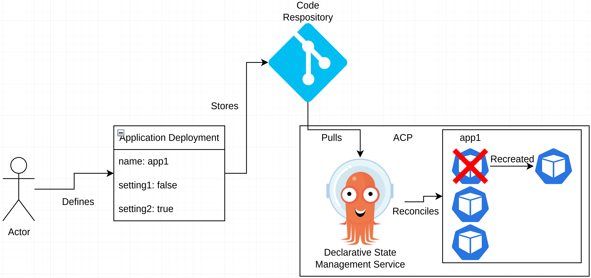
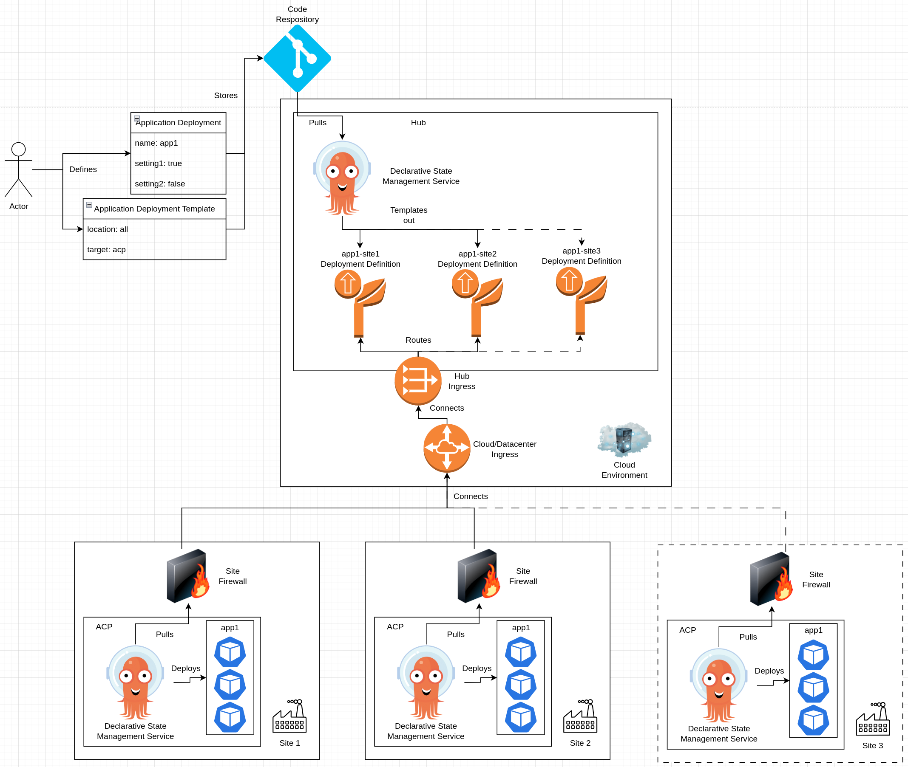

# Cloud/Datacenter to Edge Application Deployments
This pattern showcases how to consume services and functionality provided by an ACP, and optionally, by a hub, to drive application deployments from a central location, such as a cloud or datacenter, down to ACPs across sites.

In addition, the core services of an ACP can be further leveraged to handle application deployments down to far edge devices, using the same pattern.

## Table of Contents
* [Abstract](#abstract)
* [Problem](#problem)
* [Context](#context)
* [Forces](#forces)
* [Solution](#solution)
* [Resulting Content](#resulting-context)
* [Examples](#examples)
* [Rationale](#rationale)

## Abstract
| Key | Value |
| --- | --- |
| **Platform(s)** | TBD |
| **Scope** | TBD |
| **Tooling** | TBD |
| **Pre-requisite Blocks** | TBD |
| **Example Application** | TBD |

## Problem
**Problem Statement:** Application deployment to edge locations, and further to edge devices, is often challenging to operationalize and manage at scale. Due to this, application deployments to edge platforms and devices are often inconsistent, hard to support, and hard to troubleshoot in the event of issues.

To support application deployment at scale, ACPs, optionally along with a hub cluster, should provide a consistent set of features and functionality to run and management deployments. This functionality should integrate with a source of truth, and operate in a declarative fashion, allowing application deployments to be pre-defined, with the appropriate tools responsible for driving the deployment and ongoing reconciliation.

In addition, customization between sites, deployment targets, and applications should be possible, allowing for fine-grained deployments that meet operational requirements.

## Context
ACPs are, fundamentally, deployment targets for workloads running at sites. They provide a consistent set of services that come together to power and automate these workloads: declarative state management, converged storage, IT automation, and more.

As part of the declarative state management service, application deployments can be defined and rolled out to ACPs deployed at scale, either from a hub or simply to the platform itself. In addition, the declarative state management service is also capable of managing deployments to targets beyond the platform, allowing for application deployments to be defined at the hub or ACP level, then rolled out across the platform and to far edge targets, all using the same declarative method and tooling provided by the declarative state management service.

This use case highlights leveraging ACPs as deployment targets: reliable platforms to run mission-critical workloads. It also highlights how ACPs can be used as springboards to drive deployments to targets beyond the platform itself. Finally, it also showcases how a hub can be used as a higher level orchestrator, pushing application deployments down to ACPs at scale.

This pattern's examples will showcase the various options, working through the levels that could be included when deploying applications at scale.

Deployment options highlighted in this pattern:
| Deployment Source | Deployment Target | Method | Description |
| --- | --- | --- | --- |
| Hub | ACP | Push, Pull | Defining application deployments centrally from a hub to be deployed to ACPs |
| ACP | Edge Device | Push, Pull | Defining application deployments at the ACP level, deployed to edge devices |
| Hub | Edge Device | Push, Pull | Defining application deployments at the highest level, then using an ACP to drive deployments out to edge devices |

## Forces
1. **Scalablility:** This pattern's solution scales to many ACPs, each handling many deployments to edge devices.
2. **Customization:** This pattern's solution allows for customization of each application deployment, if required, for fine-grained control of deployments.
3. **Consistency:** This pattern's solution drives a high level of consistency across deployments, as tooling and technology is responsible for the application rollouts instead of manual processes.
4. **Reconciliation:** The defined application deployments are automatically reconciled by the deployment target, offloading responsibility and improving consistency.

## Solution
The solution is to leverage the declarative state management service, and the functionality it provides, to consume application deployment definitions and manage the deployments.

In the simplest configuration, an application deployment definition is created and stored in a code repository, and a configuration is made against the declarative state management service to consume that application deployment definition. From there, the declarative state management service will pull the application deployment definition, validate it, and initiate the deployment.

Because the declarative state management service acts as a bridge between the code repository storing the deployment definition and the deployment target, in this case, the same ACP where the service is running, the code repository becomes the source of truth for the deployed applications.

The service also acts in a constant state of reconciliation, routinely checking the deployed applications to see if they match their deployment definition in the code repository. If they drift, they are reconciled by the service automatically.

For example, is a component of the application is deleted, it will be automatically recreated by the declarative state management service, bringing it back into alignment with the definition in the code repository.

While this functionality protects against application drift, it also can be leveraged for application updates or configuration changes. If the application deployment definition is updated, the deployed application is modified through the normal reconciliation process to match the new definition.

The most straightforward example is used here in the solution section, however the [examples](#examples) section of this pattern shows how the solution is scaled across ACPs, edge devices, and more.

The application definition can contain any resource the platform has available, such as pods, deployments, routes, services, virtual machines, storage, and more. In addition, this service can also be used to configure and manage core components and services of the platform, if desired.

## Resulting Context
The resulting context from this pattern is the ability to run applications at scale, where a source of truth is applied and reconciled against the target deployment locations, such as an ACP, edge devices, or across many different sites.

This means that application deployments become more consistent, with a significantly easier management strategy than manually deploying applications across ACPs. In addition, visibility is provided into the current deployment state, allowing for easier troubleshooting if necessary.

By leveraging the declarative state management service, a more complete and robust operational state is achieved, allowing for easier lifecycle management, greater flexibility, and lower overall operational burden when running applications at scale.

## Examples
The [solution](#solution) section highlights an example of leveraging the declarative state management service directly on an ACP to deploy applications to that same ACP, however a few additional examples are highlighted here, showcasing how the service can be used to scale deployments:
- Scaling Deployments Across ACPs from a Hub
- Scaling Deployments Across Edge Devices from an ACP
- Scaling Deployments Across Edge Devices from a Hub
- Templating Application Deployments

### Scaling Deployments Across ACPs from a Hub
ACPs are fully feature-complete without a hub, however, when managing ACPs at scale, a hub provides a central point to drive configuration and application deployments. This architecture is commonly referred to as a "hub and spoke" style deployment, where ACPs would be the spokes, connected back to a central hub, where configuration and deployment information are pulled from.

Because the declarative state management service runs on the hub and on ACPs, application definitions can be created that target many ACPs, allowing for a simplified and centralized deployment process.

This approach allows for a high degree of scaling without having to interface with each ACP directly, instead, the ACPs are connected back to a central hub, and pull application deployments from it. The hub provides a centralized point of configuration and visibility, and facilitates deployments out to the ACPs at scale.

While the hub performs some high level rendering functions, responsibility for the deployment of the applications and constant reconciliation is still the responsibility of the ACPs themselves, as they're running the declarative state management service. This facilitates local autonomy at the ACP level: if the hub cluster experiences an outage, or connectivity to it is lost, applications continue to function as they were, according to the last known deployment definition. Should a component of the application drift or be deleted, it will be reconciled by the instnace of the declarative state management service running on that ACP.

Once connection is re-established to the hub, deployment definitions will be automatically pulled, and if an update to an application deployment definition has been made, it will be automatically applied.

Typically, the pull model is used for the connection between the ACPs and the hub, as this method simplifies the required connectivity changes to facilitate communication: the ACPs simply need to be allowed to call out to the hub, as opposed to requiring the hub to communicate directly via an inbound connection, from the point of reference of the ACP. Outbound connections are usually preferred at sites, as they are viewed as more secure and easier to manage.

**Pros:**
- Easier management of a large number of ACPs, as all configuration and deployments are driven from a single location
- Provides a singular point to review application deployment status and, if required, adjust deployment targets
- Simplified lifecycle management for applications, as definitions are rendered in bulk centrally

**Cons:**
- Requires resources and a platform to run hub services
- Either inbound connectivity for pull mode, or outbound connectivity for push mode, is required, which may require firewall or network changes
- ACPs must be registered to the hub to operate in pull mode

### Scaling Deployments Across Edge Devices from an ACP
ACPs and the declarative state management service can also be used to drive application deployments to edge devices. These devices typically have limited compute availability, and do not run the declarative state management service. Instead, the service on the ACP is extended, allowing it to manage deployments to targets outside of the ACP itself, and to take on the responsibility for deployment and reconciliation, offloading that work to where more compute is available.

In this example, the declarative state management service on the ACP is responsible for creating the connection between the code repository and the edge devices, acting as an intermediary. The service renders the application deployment into the individual components to deploy, then pushes those definitions out to the edge devices.

This approach removes the need for the edge devices to run the declarative state management service, and instead offloads the reconciliation to the ACP. As the edge devices often have very limited compute resources, this frees up resources for more applications to be run on a single device.

Similar to the example above, the edge devices inherit some responsibility for the applications. In the event of a failure of an application component, the device will attempt to recover it. In addition, if the device looses power or is rebooted, it will automatically attempt to recover and reschedule the workload.

However, because the declarative state management service is running externally to the edge devices, the reconciliation is handled from the ACP. This means that if a change is made to the application on the device and the connection from the ACP is lost, the application drift will not be reconciled until the connection back to the ACP is restored.

**Pros:**
- Simplified application deployment flow to a large number of edge devices, as the ACP provides a centralized place to drive deployments from
- Allows for per-device or per-application customizations, as required
- Leverages already running functionality on the ACP, instead of additional management software

**Cons:**
- Requires registering the edge devices to the ACP's declarative state management service
- Connectivity between the ACP and the edge devices is required, ideally for push deployments, however pull is also possible

### Scaling Deployments Across Edge Devices from a Hub
The previous two examples have shown how to run deployments from one source to a destination (or set of destinations) directly, however, another approach can also be taken. Using the declarative state management service, an ACP can be used as an intermediary, allowing a hub to drive deployments all the way down to edge devices.

This approach combines the functionality of the two previous examples, where the hub renders deployment definitions for the applications that will run on the ACPs, and the ACPs render and deploy applications the edge devices. However, one additional configuration is added: the hub also renders the deployment deployment definitions for the edge devices, which are then pulled down by the ACPs.

The difference in these deployment definitions, as opposed to the standard application deployment definitions, is that they actually contain the configurations for the declarative state configuration service on the ACPs, as opposed to the components of the application to deploy. Essentially, what's being rendered and applied are the configurations that tell the desired state configuration service of that ACP to deploy an application to an edge device.

Similar to the above examples, this can be run in both pull and push mode. In the diagram, pull and push are combined: the application definitions are pulled to the ACPs from the hub cluster, then pushed to the edge devices from the ACPs.

**Pros:**
- Centralized deployment location: originating from the hub
- Allow for deployments to ACPs and to edge devies in a single flow
- Brings all deployments under a unified operational approach, regardless of site/target

**Cons:**
- Increased complexity of deployments, as some are "meta" deployments, which are configurations to the declarative state management service
- Connectivity does need to be allowed/configured for deployments to flow from hub to edge devices

### Templating Application Deployments
The final example leverages a feature of the desired state management service: templating out application deployments. This removes the requirement to define every application deployment statically, instead, offloading templating functionality to the service. This greatly simplifies application deployments across a large number of sites, while only needing to maintain one application deployment template.

As opposed to statically defining application deployments for site 1 and site 2, an application deployment template is instead created. This is consumed by the declarative state management service, which then renders an application deployment definition from the application deployment, according to the application deployment template.

In this example, an application is templated and rendered for every acp at all locations, as specified in the application deployment template. This could be customized to search for specific labels or architectures, such as highly-available ACPs instead of non highly-available ACPs, for example.

This is also dynamic, as the templating is run routinely to ensure all appropriate deployment targets have a rendered application definition. For example, if a new site is brought online and registered to the hub cluster, the declarative state management service will automatically render a new deployment definition, which will result in the application being deployed.

**Pros:**
- Only one application definition needs to be maintained, as opposed to many statically linked to deployment targets
- Templating is performed automatically
- Customizations per deployment are possible

**Cons:**
- Deployments do not wait for change control/other processes, they begin as soon as a new match to the application deployment template is found
- Per deployment customization requires maintaining a flexible application deployment definition

## Rationale
The rationale behind this pattern is to lower the overall costs, challenges, and risks associated with deploying applications to a large number of deployment targets, specifically edge deployments.

By leveraging built in functionality, deployments can be templated, applied, upgraded, rolled-back, and removed as needed, without needing to interact with a large set of disparate tools. In addition, deployments are automatically reconciled, increasing their availability, and improving business continuity overall.

ACPs provide the core service to achieve these goals as part of the standard deployment package, to simplify the overall operational experience, and allow for faster onboarding and quicker realization of value.

## Footnotes

### Version
1.0.0

### Authors
- Josh Swanson (jswanson@redhat.com)