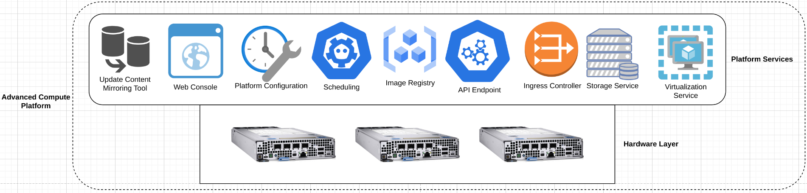
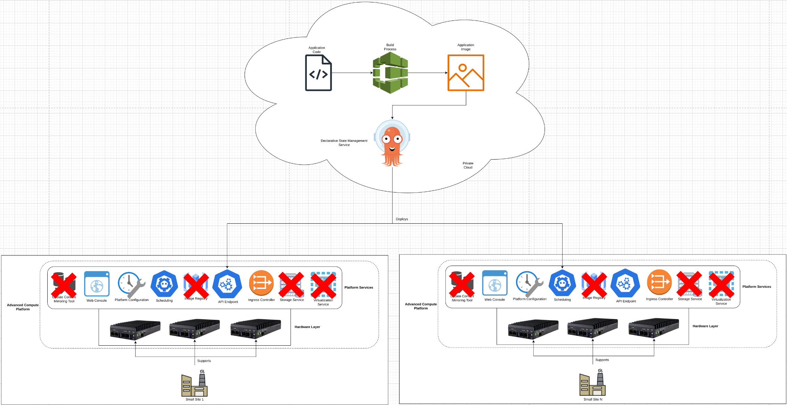

# Deploying ACPs to Small Form-Factor Hardware
This pattern outlines a solution for installing ACPs onto limited or purpose-build hardware platforms, where tradeoffs between platform functionality and hardware availability are required.

ACPs provide a large amount of functionality as part of the standard platform deployment, which can be leveraged after the platform installation completes. However, in some deployment situations, a full suite of functionality is not required, and instead, the platform needs to run on more limited hardware. The ACP deployment flow provides the ability to turn off functionality to lower the overall resource requirements for a deployment platform.

This solution can be applied anywhere limited hardware is the only option for an ACP deployment, and not all functionality of a standard ACP is required.

## Table of Contents
* [Abstract](#abstract)
* [Problem](#problem)
* [Context](#context)
* [Forces](#forces)
* [Solution](#solution)
* [Resulting Content](#resulting-context)
* [Examples](#examples)
* [Rationale](#rationale)

## Abstract
| Key | Value |
| --- | --- |
| **Platform(s)** | Advanced Compute Platform |
| **Scope** | Installation |
| **Tooling** | <ul><li>Red Hat Advanced Cluster Management</li><li>Red Hat Ansible Automation Platform</li></ul> |
| **Pre-requisite Blocks** | N/A |
| **Pre-requisite Patterns** | <ul><li>[ACP Standardized Architecture - Highly Available](../acp-standardized-architecture-ha/README.md)</li><li>[ACP Standardized Architecture - Non-Highly Available](../acp-standardized-architecture-non-ha/README.md)</li><li>[Hub Standard Services](../rh-hub-standard-services/README.md)</li></ul> |
| **Example Application** | N/A |

## Problem
**Problem Statement:** Advanced compute platforms provide a full suite of features and functionality by default, all of which is installed automatically when the platform is initially set up. However, not all deployment locations for an ACP can support the required hardware to run the full set of ACP features and functionality. Instead, only a subset of functionality is required, and the hardware that the ACP will be deployed to is limited, due to power availability, thermal capabilities, and other constraints found in edge locations.

Because ACPs are composable platforms, they should provide the ability to select the required set of features and functionality at installation, and if less than the standard set of features and functionality are selected, consume less overall hardware to run the core platform.

## Context
This pattern can be applied anytime an ACP is being deployed where the underlying hardware is not limited by some factor, such as power or cooling, and where the full set of features and functionality are not required. The intention is to provide a balance between the required hardware to enable the platform, the core platform functionality, and the ability to use more of the available hardware for workloads. While some compute power is required for the platform to function, the overall amount can be limited to better fit into challenging compute locations, or to limit the cost of the platform and hardware required.

This pattern's solution must be applied at installation time, it cannot be applied after the platform has been installed.

A few key assumptions are made:
- The intended context of the platform aligns to the [Standard HA ACP Architecture](../acp-standardized-architecture-ha/README.md), the [Standard Non-HA ACP Architecture](../acp-standardized-architecture-non-ha/README.md), or any valid ACP architecture as needed.
- The required features and functionality to support the desired workloads have been idenitified
- Proper testing has been completed to ensure the desired workloads do not require features or functionality that won't be deployed to limited ACPs.

This pattern can be used with either the [semi-automated single ACP install process](../../blocks/install-media-playbook/README.md), or the [fully-automated installation from a hub](../automated-acp-install-from-hub/README.md).

## Forces
- **Integration:** This pattern's solution should integrate with the existing ACP install processes, and only require minimal deviation from the standard installation flow.
- **Simplicity:** This pattern's solution should not require deep knowledge of the underlying components of the platform, instead only requiring some key configuration changes to adjust what will ultimately be deployed as part of the platform.
- **Scalablility:** This pattern's solution should be repeatable across sites with similar constraints and requirements, allowing for a large number of sites to run similiar platform installations where appropriate.
- **Customization:** This pattern's solution should allow for customization across deployment hardware footprints, according to power, cooling, and budgetary constraints relative to the desired workloads for that platform.

## Solution
The solution is to leverage the customizability of the platform at installation time, specifying a more limited set of features and functionality than the default set. This sacrifices some features and functionality of the platform, however, it enables installation on more limited or constrainted hardware, and frees up hardware resources to run workloads on top of the platform.

Since ACPs can be run on bare metal or on other platforms, such as public/private clouds, virtualization platforms, etc, the default feature and functionality set includes resources for integrating with the underlying platform for simplified operations. If running on bare metal, these can omitted at installation time to save resources. In addition, additional functionality of the platform can be omitted from installation to further save resources.

> Note:
>
> For simplicity, not all ACP features and services are shown in the following diagrams for simplicity.

### The Default Feature and Functionality Set
By default, ACPs provide features, functionality, tooling, and services centered around building, running, and maintaining mission-critical workloads. The platform provides functionality around running containerized, virtualized, and even serverless workloads, all using the same control plane and set of core services for management and automation.

In addition to the required core services such as scheduling and platform configuration, additional functionality is deployed to help simplify interaction with the platform - functionality such as the web console, declarative state management service. Also, functionality for helping direct inbound traffic to the backing application is provided by the ingress service.

In this example, the platform has been deployed to a set of server-class devices with the full feature set. This is possible because the site can support running this level of hardware from a power, cooling, and space perspective.

In this configuraiton, the platform can be used to build, deploy, manage, automate, and generally support operations at the site.

**Pros:**
- Provides the full suite of features and functionality of the platform
- Allows for a wide range of workloads, such as CI/CD, build/test/run flows, automation of resources external to the platform
- Functions as an almost "cloud in a box" platform

**Cons:**
- Requires hardware capable of housing the full platform feature set
- Requires support at the site for that hardware in the form of space, power, and cooling

### Omitting Features and Functionality
When evaluating if the full set of platform features and functionality are required, the following considerations can help drive the decision:
- Can the site support the required hardware to run the full set of platform features?
- Does the site require the full set of features and functionality, or will some functions be run centralized and then deployed out to sites?
- Does the site require the ability to interact with the platform, or will management be handled centrally, in a fully automated manor?
- What types of workloads will be run at the site, and what do those workloads require?

The resulting information from these considerations can help shape the requirements of the platform, leading to a more slimmed down feature set that still provides the required capabilities for the desired workloads at the site.

This section will discuss the first consideration - support of server grade hardware - while other scenarios aligned to these considerations will be outlined in the [Examples](#examples) section.

### Deployment to Limited Hardware
If a site does not have the ability to support larger, server-grade hardware to run an ACP, then small form-factor hardware can be used, provided it meets the platform requirements. To help lower these requirements, platform features and functionality can be omitted at installation time to help the platform fit onto smaller hardware.

In the example above, server-grade hardware was used for deployment of an ACP at a site, because the site could support the hardware with the appropriate power, cooling, and space requirements. In this scenario, however, the site cannot suport server-grade hardware, so smaller form-factor hardware has been selected:

Here, a small site does not have the ability to support space/power/cooling for server-grade hardware, but can suport fanless small form-factor hardware that's powerful enough to run the platform. In addition, the site does not need to mirror update content, or store application content locally, or run virtual machines, so those features have been omitted from installation, allowing the platform to fit onto a smaller hardware footprint while still providing the ability to run the required workloads for the site.

**Pros:**
- Allow for platforms to be deployed onto smaller form-factor hardware at sites
- Requires less power/cooling/space at the site
- Still provides the ability to run the required workloads

**Cons:**
- Does not provide all the same features and functionality as a full platform installation

## Resulting Context
The resulting context is the ability to deploy ACPs to sites that can't support full-fledged server-grade hardware, maintaining consistency and functionality at the platform level while accomidating smaller hardware footprints. This gives greater flexibility when selecting what sites can run an ACP, and also enables greater consistency across the organization as more sites can run the same foundational platform.

The installation configuration required for this can be integrated into a semi-automated or fully-automated deployment flow, limiting the required time and energy investment to customize platforms to the site's requirements.

This also allows for ACPs to be run outside of the traditional "plant datacenter" or only in sites of a certain size, enabling adoption and consumption of the platform's features and services at a much broarder scale.

Finally, this allows for more of the hardware supporting the platform to be available for workloads instead of consumed by the platform, helping to focus investment on what's needed to enable smooth operations at the site.

## Examples
The [Solution](#solution) section of this pattern showcases a small site that cannot support server-grade hardware, so some platform features and functionality are omitted to fit onto smaller form-factor hardware. This section will showcase two additional secnarios:
- Build functionality is handled centrally, then deployed to ACPs at sites
- A site that does not require the ability to interact with the platform easily, due to management and operations being handled centrally

### Building Applications Centrally, Deploying to Edge Sites
To limit the required resources to run an ACP at a remote site, self-developed applications can be built and tested in a central location where compute is more freely available, and then deployed to sites with limited compute footprints for their ACPs.

This flips the perspective of the ACPs from build and test platforms to simply deployment platforms, more focused on supporting the site's mission critical workloads over providing a developer experience. This is typically preferred, as most development is handled through a centralized approach on a centralized development platform.

This approach works for deploying any type of workload to an ACP. For example, virtual machine templates could be created centrally, then imported at each site, removing the requirement for additional compute and storage to build and maintain the templates at each site.

### Site Does Not Need to Interact with the Platform Directly
Another use case is removing the web console from the platform, not only to save resources, but because direct interaction with the platform at the site is not a desired workflow. This can be the desired approach when the site lacks the knowledge and expertise to operate the platform, instead, everything is driven centrally, and through highly automated, GitOps-style flows.

While this doesn't exclusively prevent interaction with the platform, it can help prevent unintentional changes being made to the platform that aren't driven through a centralized approach.

## Rationale
The rationale for this pattern is to address wanting ACPs deployed to many different sites, providing organizational consistency, while also supporting sites that have limited capabilities to provide and support hardware. It helps build towards "fit for purpose" platforms, that meet requirements of the various workloads of a site, while helping to limit hardware investment without sacrificing on required functionality.

Since consistency is key when operating edge sites at scale, the ability to leverage a common platform at each site helps to scale the capabilities of the organization, while still remaining flexible enough to support the needs of an individual site.

## Footnotes

### Version
1.0.0

### Authors
- Josh Swanson (jswanson@redhat.com)