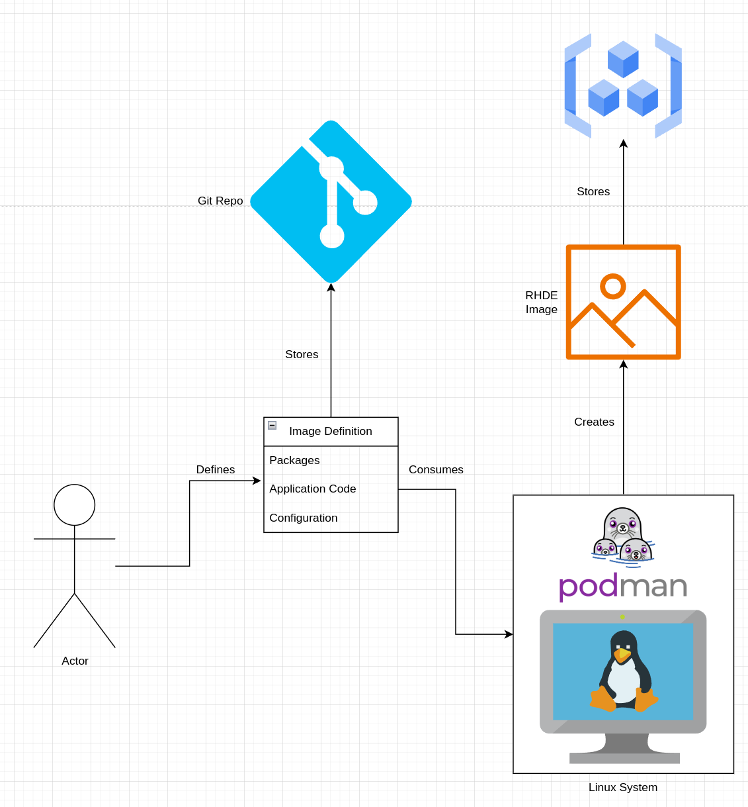
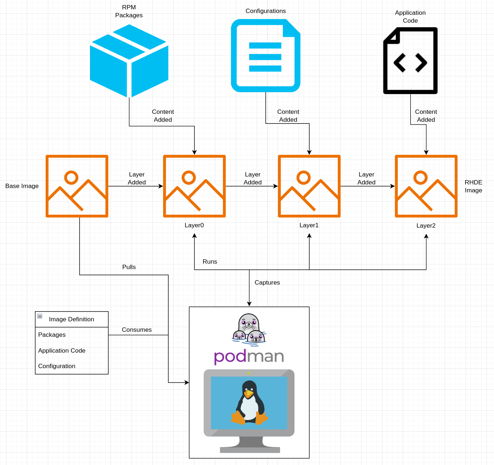
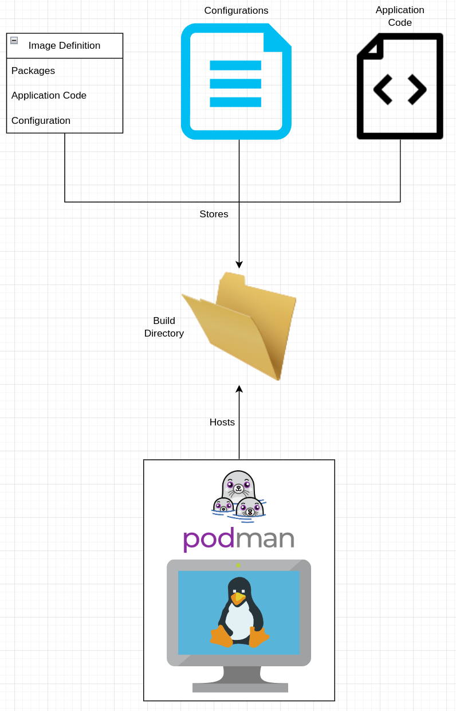
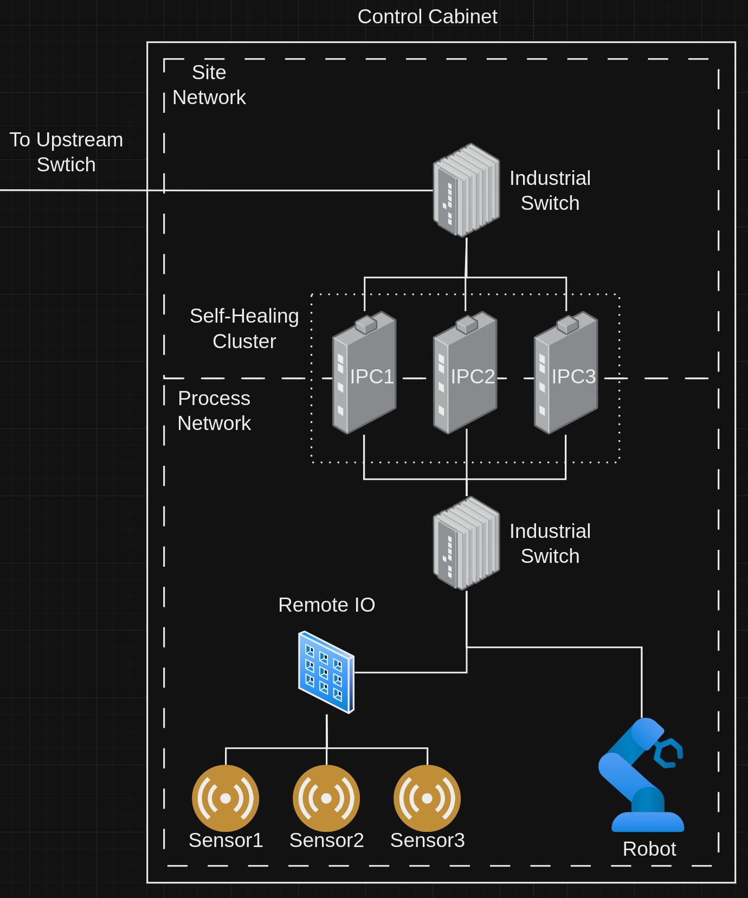
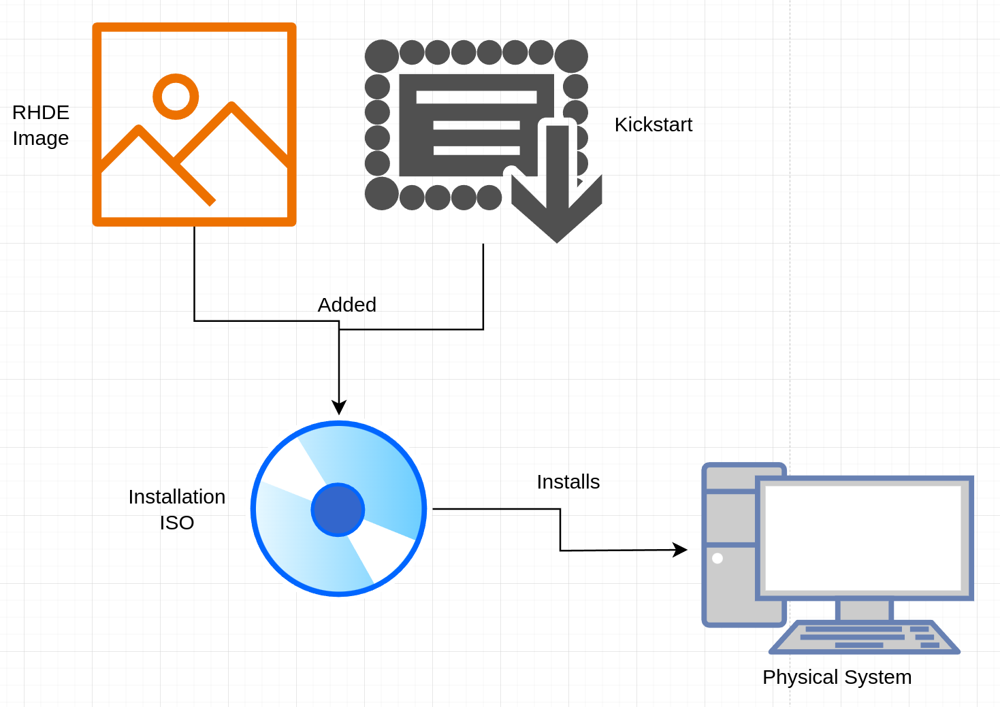

# Creating Red Hat Device Edge Images without an ACP
This pattern gives a technical look at creating Red Hat Device Edge images when an Advanced Compute Platform is not available.

## Table of Contents
* [Abstract](#abstract)
* [Problem](#problem)
* [Context](#context)
* [Forces](#forces)
* [Solution](#solution)
* [Resulting Content](#resulting-context)
* [Examples](#examples)
* [Rationale](#rationale)


## Abstract
| Key | Value |
| --- | --- |
| **Platform(s)** | TBD |
| **Scope** | TBD |
| **Tooling** | TBD |
| **Pre-requisite Blocks** | TBD |
| **Example Application** | TBD |

## Problem
**Problem Statement:** Red Hat Device Edge images must be built before being deployed to run containerized appplications on a container orchestration platform, or optionally, deployed to bare-metal systems to run workloads.

While ACPs provide the tooling and capability to build Red Hat Device Edge images as part of the core feature set, an ACP may not be always available.

## Context
This pattern outlines how to build Red Hat Device Edge images without using an ACP, instead relying on a Linux system that can build images. This system must be capable of running containers, and have sufficient system resources available, such as CPU, memory, and disk space.

In addition, if additional content is going to be added to the image, access to the internet or access to offline mirrors is required, and for some content, access to the Red Hat customer portal may be required.

Appropriate tooling must be available on the system used to build images, and it's recommended to have an image registry available to store the image once the build is complete.

## Forces
1. **Minimal Requirements:** This pattern's solution can be run on small systems, requiring little system resources.
2. **Flexibility:** This pattern's solution can build any desired Red Hat Device Edge image simply by changing the build information.
3. **Consistency:** Red Hat Device Edge images built across different systems will be consistent, allowing for builds to be run from multiple locations, or optionally, a central location and synchronized.
4. **Time to Delivery:** This pattern's solution is built to get images ready for consumption quickly, allowing for rapid testing and prototyping.
5. **Simplicity:** This pattern's solution focuses on getting images built over a fully automated/integrated approach, requiring less up-front investment in infrastruture and time.

## Solution
By leveraging Podman on an appropriate Linux system, such as one running Red Hat Enterprise Linux, Red Hat Device Edge, Fedora, or other Linux operating systems, Red Hat Device Edge systems can be built and consumed with ease. In addition, these images can be leveraged on container platforms or bare-metal systems.



Red Hat Device Images are built from image definition files, which are identical to Dockerfiles/Containerifles. These files define what customizations are made to the image. These customizations can include operating system packages, application code, and configurations.

Once the definition is created and any additional files are made available, Podman will consume these entities and create the RHDE image. If content needs to be pulled or installed, the build process, orchestrated by podman, will execute those steps.

The Red Hat Device Edge build process is identical to the standard container image build process, as a RHDE image is simply a container image.

When building container images or RHDE images, a base image is specified and pulled to the system. Then, for each instruction in the image defintion file (or Containerfile/Dockerfile), a layer is added to the image. These layers are created by executing the instruction in the image definition file, and then capturing the resulting output. Podman will continally add on layers as specified in the image definition file.



Builds typically happen within the context of a directory on the Linux system, allowing for local content to be added to the image. This means configuration files, compiled execution code, and many other types of content can be built into the image.



It is recommended to use source control as much as possible, storing the image definitions, application code, and anything else, to provide an audit trail and facilitate collaboration when defining images.

## Resulting Context
The resulting context is the ability to rapidly build Red Hat Device Images with minimal infrastructure. The built images are identical to images built elsewhere, and can optionally be leveraged to create installation media for virtual machines and bare metal systems, while also being usable immedately as containers.

This solution serves as a "first-step" into building Red Hat Device Edge images, and is the basis for more built out solutions, such as using pipelines on an ACP, or leveraging automation to trigger and manage builds.

## Examples
Two example definitions of Red Hat Device Edge images will be covered, along with an example on creating an installation ISO to use for bare-metal systems.

### Red Hat Device Edge - Self-Healing Cluster
An example use case for Red Hat Device Edge is to create a cluster of [self-healing](../self-healing-dcns/README.md) systems that are responsible for critical workloads:



To faciliate this, the clustering packages need to be added to the image to allow for partipication in a cluster after deployment.

The image definition handles adding those packages:
```
FROM registry.redhat.io/rhel9/rhel-bootc:latest

USER root

# Install base system packages
RUN dnf \
    --enablerepo=rhel-9-for-x86_64-baseos-rpms \
    --enablerepo=rhel-9-for-x86_64-appstream-rpms \
    install -y \
    cloud-init \
    podman \
    vim-enhanced \
    NetworkManager-wifi \
    systemd-container \
    git \
    runc \
    && dnf clean all \
    && rm -rf /var/{cache,log} /var/lib/{dnf,rhsm}

# Install Cockpit for web-based administrator
RUN dnf \
    --enablerepo=rhel-9-for-x86_64-baseos-rpms \
    --enablerepo=rhel-9-for-x86_64-appstream-rpms \
    install -y \
    cockpit \
    && dnf clean all \
    && rm -rf /var/{cache,log} /var/lib/{dnf,rhsm}

# Install self-healing cluster packages
RUN dnf \
    --enablerepo=rhel-9-for-x86_64-baseos-rpms \
    --enablerepo=rhel-9-for-x86_64-appstream-rpms \
    --enablerepo=rhel-9-for-x86_64-highavailability-rpms \
    install -y \
    pcs \
    pacemaker \
    corosync \
    fence-agents-all \
    && dnf clean all \
    && rm -rf /var/{cache,log} /var/lib/{dnf,rhsm}

# Copy network configuration script
COPY setup-network.sh /usr/local/bin/setup-network.sh
RUN chmod +x /usr/local/bin/setup-network.sh
```

In this example, a base set of packages is installed, a web-based system administration tool is added, the self-healing clustering packages are added, and finally, a simple configuration script is added. Once the image is built, all these packages and configurations are available as part of the image.

These are added to a build directory:
```bash
$ ls -lsa rhde-images/build/
total 24
0 drwxr-xr-x. 1 jswanson jswanson  218 Oct  7 10:45 .
0 drwxr-xr-x. 1 jswanson jswanson   46 Sep  5 13:17 ..
4 -rw-r--r--. 1 jswanson jswanson 1130 Sep 16 10:49 Containerfile # Image definition file
4 -rw-r--r--. 1 jswanson jswanson  973 Sep 16 17:49 setup-network.sh # Additional file to add to image
```

Then, a build is triggered using the CLI:
```bash
# Call podman and tell it to build
podman build \
# Specify the path to the build directory
rhde-images/build/ \
# Add a tag to use to identify the image later
--tag rhde-cluster:1.0.0
```

Once complete, the image is ready for consumption.

### Red Hat Device Edge - Workstation
Similar to the previous image, this image will be used as a workstation, installing a desktop experience that can be used for displaying dashboards, web pages, or remoting into other systems.

These configurations are set in the image definition:
```
FROM registry.redhat.io/rhel9/rhel-bootc:latest
 
USER root

# Install base system packages and utilities
RUN dnf \
    --enablerepo=rhel-9-for-x86_64-baseos-rpms \
    --enablerepo=rhel-9-for-x86_64-appstream-rpms \
    install -y \
    podman \
    vim-enhanced \
    NetworkManager-wifi \
    systemd-container \
    git \
    runc \
    skopeo \
    lorax \
    ansible-core \
    cockpit \
    && dnf clean all \
    && rm -rf /var/{cache,log} /var/lib/{dnf,rhsm}

# Install workstation package group
RUN dnf \
    --enablerepo=rhel-9-for-x86_64-baseos-rpms \
    --enablerepo=rhel-9-for-x86_64-appstream-rpms \
    groupinstall -y \
    workstation \
    --excludepkgs=rootfiles \
    && dnf clean all \
    && rm -rf /var/{cache,log} /var/lib/{dnf,rhsm}

# Install OCP cli and packages to make install media
RUN dnf \
    --enablerepo=rhel-9-for-x86_64-baseos-rpms \
    --enablerepo=rhel-9-for-x86_64-appstream-rpms \
    --enablerepo=rhocp-4.16-for-rhel-9-x86_64-rpms \
    install -y \
    openshift-clients \
    nmstate \
    && dnf clean all \
    && rm -rf /var/{cache,log} /var/lib/{dnf,rhsm}

# Install Microshift
RUN dnf \
    --enablerepo=rhel-9-for-x86_64-baseos-rpms \
    --enablerepo=rhel-9-for-x86_64-appstream-rpms \
    --enablerepo=rhocp-4.16-for-rhel-9-x86_64-rpms \
    --enablerepo=fast-datapath-for-rhel-9-x86_64-rpms \
    install -y microshift \
    && dnf clean all \
    && rm -rf /var/{cache,log} /var/lib/{dnf,rhsm}

# Install rdesktop from EPEL
RUN dnf \
    install -y https://dl.fedoraproject.org/pub/epel/epel-release-latest-9.noarch.rpm \
    && dnf clean all \
    && rm -rf /var/{cache,log} /var/lib/{dnf,rhsm}

RUN dnf \
    install -y \
    rdesktop \
    htop \
    && dnf clean all \
    && rm -rf /var/{cache,log} /var/lib/{dnf,rhsm}

RUN dnf \
    remove -y epel-release-latest-9 \
    && dnf clean all \
    && rm -rf /var/{cache,log} /var/lib/{dnf,rhsm}

# Install helm binary
RUN curl -L https://mirror.openshift.com/pub/openshift-v4/clients/helm/latest/helm-linux-amd64 -o /usr/local/bin/helm
RUN chmod +x /usr/local/bin/helm
```

In this example, content from additional remote repositories and from web servers is added to the image.

### Creating a Bootable ISO
To install these images to a bare-metal system, the container image is added to a boot ISO along with a kickstart file.

RHDE images are the content to be installed, while kickstarts are the instructions on how to install that content to the system. A boot ISO stores the kickstart and image, and provides a minimal operating system that's used to run the instructions in the kickstart file and apply the RHDE image content to the system.



A minimal/boot iso can be used to create the installation iso, as a full package set is not required to install content to the system.

For this example, a simple kickstart, which contains the instructions on how to install the content to the system, has been created:
```bash
text
network --bootproto=dhcp --activate
clearpart --all --initlabel --disklabel=gpt
ignoredisk --only-use=vda
reqpart --add-boot
part / --grow --fstype xfs
ostreecontainer --url=/run/install/repo/container --transport=oci --no-signature-verification
services --enabled=sshd
user --name="user" --groups=wheel --plaintext --password='password'
rootpw 'R3dh4t123!'
reboot
%post
install -o root -g root -m400 \<\-e \'%wheel\\tALL=\(ALL\)\\tNOPASSWD: ALL\'\) /etc/sudoers.d/freewheelers
systemctl set-default graphical.target
systemctl enable cockpit.socket
%end
```

First, the RHDE image is unpacked to a local directory:
```bash
# Call Skopeo and tell it to copy
skopeo copy \
# Speify the RHDE image to copy
"docker://rhde-workstation:1.0.0" \
# Copy to a directory called "container"
"oci:container/"
```

Then, the `mkksiso` utility is used to create the image:
```bash
mkksiso \
# Specify the path to the kickstart file
--ks local.ks \
# Add the directory where Skopeo unpacked the RHDE image
--add container/ \
# Add the following to the boot cmdline
--cmdline "console=tty0 console=ttyS0,115200n8" \
# Remove the following from the boot cmdline
--rm-args "quiet" \
# Path to the ISO to add the container image and kickstart to
/tmp/rhel-9.4-x86_64-boot.iso \
# Path to the output iso
/tmp/rhde-workstation-installer.iso
```

Once complete, the ISO can be used to install the RHDE image to bare-metal systems.

## Rationale
This pattern works within the constraints of not having a full platform available to fully automate and integrate the RHDE image build process, instead leveraging CLI utilities. As a tradeoff, this pattern requires very little setup and infrastructure to use, and is useful for rapid testing or for initial evaluation of Red Hat Device Edge.

Automation can be added to this pattern's solution to elevate it to a more "enterprise-grade" solution after the initial evaluation phase, as part of a path-to-production plan.

## Footnotes

### Version
1.0.0

### Authors
- Josh Swanson (jswanson@redhat.com)
