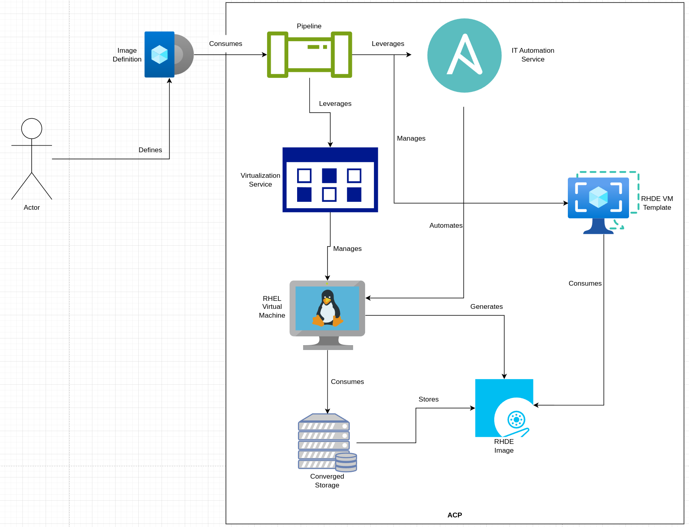

# Creating and Hosting Red Hat Device Images Images on an ACP
This pattern gives a technical look at how to create and host RHDE images on an ACP, using the ACP's built in functionality to create, curate, and host the images. These can then be deployed to edge devices that can communicate with the ACP, or used to create virtual machines on the ACP itself.

## Table of Contents
* [Abstract](#abstract)
* [Problem](#problem)
* [Context](#context)
* [Forces](#forces)
* [Solution](#solution)
* [Resulting Content](#resulting-context)
* [Examples](#examples)
* [Rationale](#rationale)

## Abstract
| Key | Value |
| --- | --- |
| **Platform(s)** | Red Hat OpenShift |
| **Scope** | Virtualization |
| **Tooling** | <ul><li>Red Hat OpenShift GitOps</li></ul> |
| **Pre-requisite Blocks** | <ul><li>[Example ACP Networking](../../blocks/example-network-config/README.md)</li><li>[ACP Network Configuration](../../blocks/acp-network-configuration/)</li><li>[Creating Bridged Networks on an ACP](../../blocks/acp-bridge-networks/README.md)</li><li>[Creating Virtual Machines via Code](../../blocks/virtual-machines-as-code/README.md)</li><li>[Importing Installer ISOs](../../blocks/importing-installer-isos/README.md)</li><li>[Enabling Tekton Virtual Machine Tasks](../../blocks/enabling-tekton-vm-tasks/README.md)</li><li>[Creating Virtual Machine Tempaltes and Cluster Preferences](../../blocks/ocp-virt-templates-and-preferences/README.md)</li></ul> |
| **Pre-requisite Patterns** | <ul><li>[ACP Standard Architecture](../acp-standardized-architecture-ha/README.md)</li><li>[ACP Standard Services](../rh-acp-standard-services/README.md)</li></ul> |
| **Example Application** | N/A |

## Problem
**Problem Statement:** Red Hat Device Edge, an operating system typically used for purpose built, lower compute devices, requires device images to be composed before being deployed. The composure step requires some compute capacity and an instance of Red Hat Enterprise Linux. Without the availability of a compute platform, a dedicated system must be built and maintained, increasing management burden and overhead costs.

## Context
This pattern can be applied to ACPs where virtualization, pipeline functionality, and the IT automation service has been enabled. Virtualization and IT automation services are offered by both highly available and non-highly available ACPs, and enabled as part of the standard set of ACP services. Pipeline functionality is easily added to ACPs if desired.

A few key assumptions are made:
- The intended context of the platform aligns to the [Standard HA ACP Architecture](../acp-standardized-architecture-ha/README.md)
- The standard set of [ACP Services](../rh-acp-standard-services/README.md) are available for consumption.
- Physical connections, such as power and networking, have been made to the target hardware
- The upstream network configuration is completed and verified
- The virtualization service has been installed is ready to be leveraged
- The IT automation service has been installed and is ready to be leveraged
- The pipeline functionality has been enabled and is ready to be leveraged

## Forces
- **Reapeatability:** This pattern' solution should be repeatable over time, allowing for tweaks to desired images, or simply to repeat with newer package sets for effective lifecycle management.
- **Customizability:** The pattern's process should allow for images to be generated with full customizations, such as different package sets or for different use cases, such as headless IPCS, or HMIs.
- **Ease of Consumption:** This pattern's solution should be easily leveraged, allowing for guick and efficient image generation and hosting.
- **Self-contained:** An ACP aligned to the assumptions above is able to provide all of the required functionalty and provide the solution outlined below.

## Solution
The solution for this pattern is to create and consume a pipeline hosted on an ACP that drives the image compose process, gathers the resulting image, hosts it on the ACP for devices to provision from, and optionally, creates virtual machine templates that can be used for virtualization on the platform itself.

The pipeline takes an image definition as input, then leverages services provided on the ACP to drive the creation and storage of the composed image. Once complete, the underlying infrastructure created is destroyed, as it is no longer needed.

As this pipeline is the cornerstone of the solution of this pattern, it will be walked through in detail below.

### Pipeline Overview

## Resulting Context
The resulting context is the ability to specify image requirements or definitions, and have the platform automically handle the process to create and host those images. Image composition and hosting should happen without manual intervention, and be easily repeated and customized, removing any management burden associated with the process.

## Examples

### Creating a kernel-rt/Deterministic Image
### Creating an HMI Image
### Creating an Updated Image

## Rationale
The rationale for this pattern is to have a completely automated way to create and host RHDE images, such that device provisioning and management is far more easily adopted over having to manually maintain infrastructure to serve the same purpose. Simple image defintiions should be fed into this automated process, with the expected output being consumable images.

## Footnotes

### Version
1.0.0

### Authors
- Josh Swanson (jswanson@redhat.com)