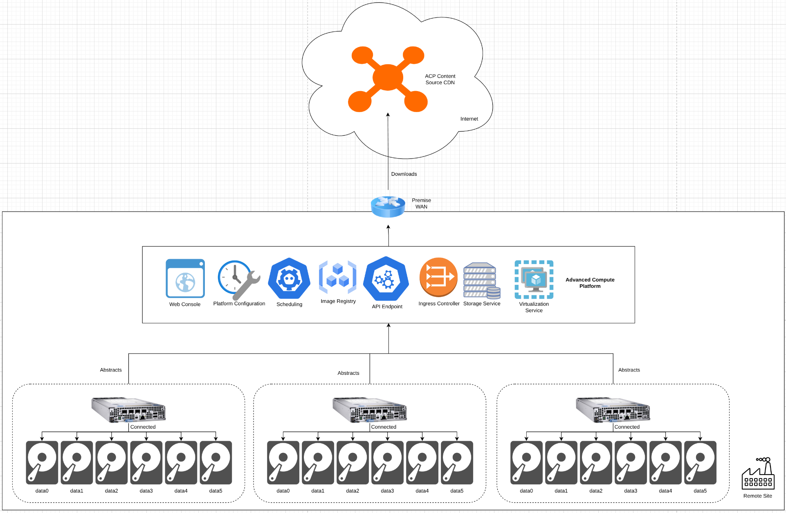
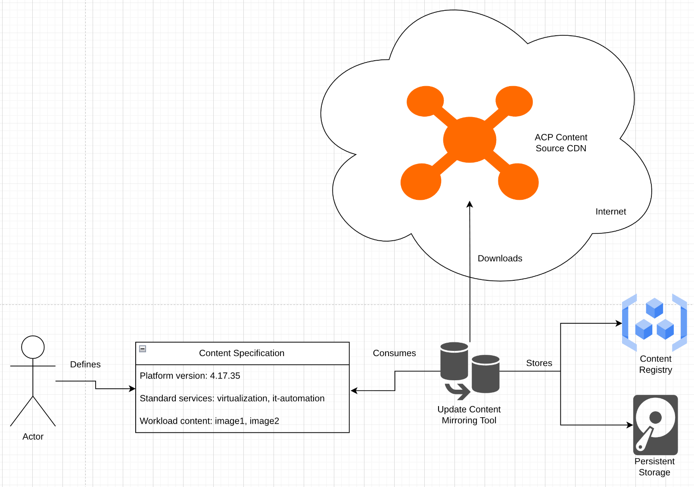
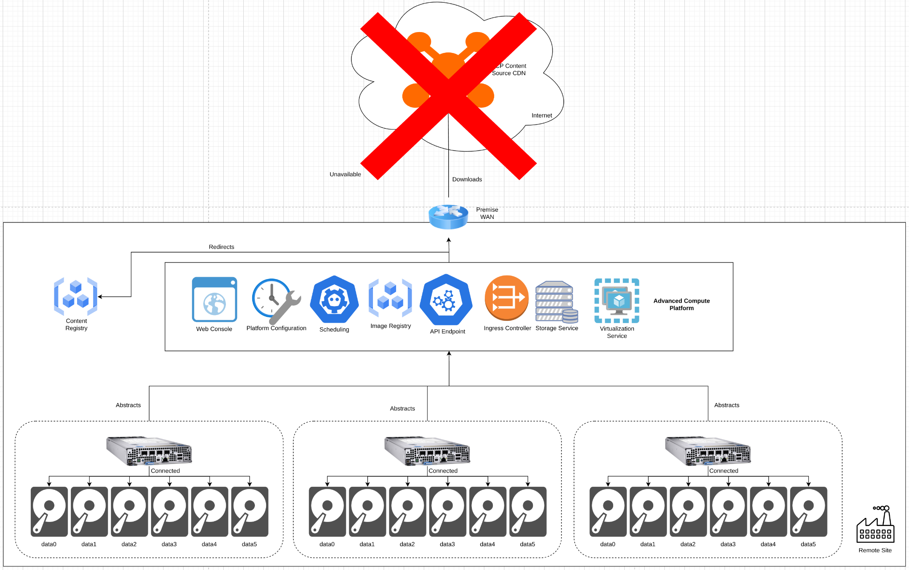
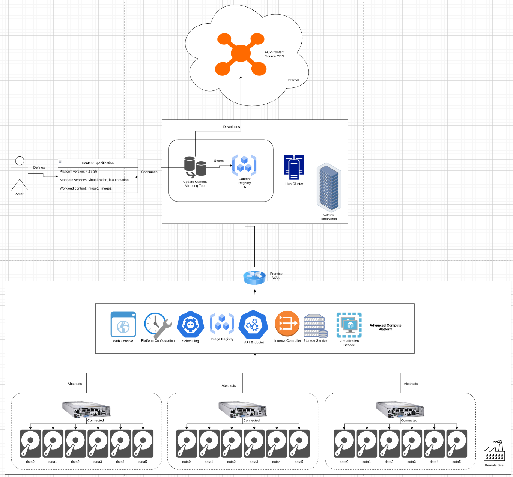
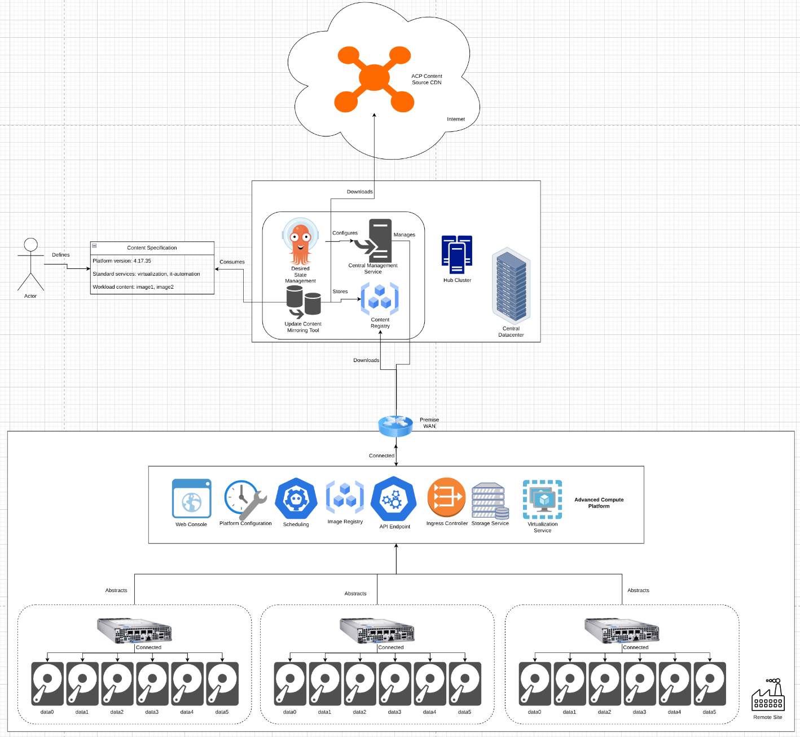
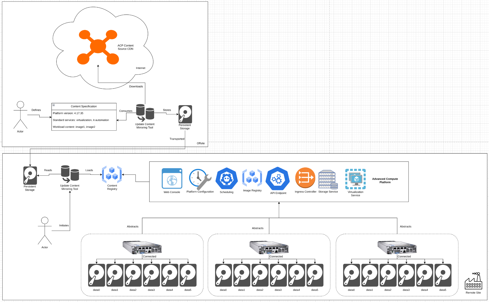

# Deploying and Managing Disconnected ACPs
This pattern outlines a solution for installing and managing ACPs that are not connected to the internet, and unable to pull platform and application content from internet-based content sources.

ACPs, by default, are configured to pull content from trusted sources publically available when installing and adding/configuring features and functionality. In addition, application content deployed to the platform is pulled from specified sources, which are usually external to the platform, and sometimes hosted in cloud or public environments.

This solution can be applied anywhere where an ACP cannot or should not be able to connect to the public internet, for security, operational, or connectivity reasons.

## Table of Contents
* [Abstract](#abstract)
* [Problem](#problem)
* [Context](#context)
* [Forces](#forces)
* [Solution](#solution)
* [Resulting Content](#resulting-context)
* [Examples](#examples)
* [Rationale](#rationale)

## Abstract
| Key | Value |
| --- | --- |
| **Platform(s)** | Advanced Compute Platform |
| **Scope** | Installation |
| **Tooling** | <ul><li>Red Hat Advanced Cluster Management (Optional)</li><li>Red Hat Ansible Automation Platform (Optional)</li></ul> |
| **Pre-requisite Blocks** | N/A |
| **Pre-requisite Patterns** | <ul><li>[ACP Standardized Architecture - Highly Available](../acp-standardized-architecture-ha/README.md)</li><li>[ACP Standardized Architecture - Non-Highly Available](../acp-standardized-architecture-non-ha/README.md)</li><li>[Hub Standard Services](../rh-hub-standard-services/README.md)</li><li>[ACP Standard Services](../rh-acp-standard-services/README.md)</li></ul> |
| **Example Application** | N/A |

## Problem
**Problem Statement:** Advanced compute platforms provide a full suite of features and functionality, which are provided by platform content with optional configurations. This content is typically downloaded from publically accessable sources during the installation of the platform, or when a new feature or functionality is installed and configured. However, not all ACPs will have connectivity to these content sources, due to connectivity challenges, security requirements, or operational standards.

In addition, applications deployed on the platform may not deploy successfully if the content is hosted in a public or cloud respository that a disconnected platform cannot reach.

Despite a lack of connectivity to retrieve the core platform or application content, an ACP should still be able to be installed, upgraded, have new features and functionality deployed, and have applications be deployable.

## Context
This pattern can be applied anytime an ACP is being deployed into an environment where connectivity to public content sources available on the internet is not allowed or configured. This pattern's solution works for platforms consume the full list of [standard services](../rh-acp-standard-services/README.md), or for a more streamlined or slimmed down installation of the platform. This allows for full functionality of the platform without needing any external connection to the internet, or to content sources available on the internet. This solution can also be leveraged for ACPs deployed into environments where the external connectivity makes installation and upgrades of the platform unreasonably slow.

This pattern's solution requires proper planning to ensure successful deployment of the platform and workloads, however it can be applied after the platform has been installed through a connected process if desired.

A few key assumptions are made:
- The intended context of the platform aligns to the [Standard HA ACP Architecture](../acp-standardized-architecture-ha/README.md), the [Standard Non-HA ACP Architecture](../acp-standardized-architecture-non-ha/README.md), or any valid ACP architecture as needed.
- The required features and functionality to support the desired workloads have been idenitified
- The target workloads for the ACP have been identified, and their content made available to the disconnected ACP.

This pattern can be used with either the [semi-automated single ACP install process](../../blocks/install-media-playbook/README.md), or the [fully-automated installation from a hub](../automated-acp-install-from-hub/README.md), assuming connectivity to a hub is available.

## Forces
- **Resilience:** This pattern's solution should allow for the same installation and operational experience for the platform and workloads, regardless of the connected or disconnected state.
- **Security:** This pattern's solution should allow for ACPs to be operated in highly protected, highly trusted environments where external connectivity is considered too much of a risk to the platform.
- **Consistency:** This pattern's solution should be repeatable across sites with similar constraints and requirements, allowing for a large number of sites to run similiar platform installations where appropriate.
- **Customization:** This pattern's solution should allow for customization across deployment hardware footprints, according to power, cooling, and budgetary constraints relative to the desired workloads for that platform.

## Solution
The solution is two fold: content mirroring and platform configuration are combined to provide the solution for operating an ACP in a fully disconnected state.

For review, the default ACP architecture involves the platform being able to reach out to publically accessable content sources to download during initial installation, the addition of additional features and functionality, and during workload deployment:

The two sections below walk through the components of this solution, while the [Examples](#examples) section showcases the solution in action in a few different situations.

> Note:
>
> For simplicity, not all ACP features and services are shown in the following diagrams.

> Note:
>
> The content mirroring tool used throughout this pattern is the same tooling as what's used for the [caching platform update content on an ACP](../caching-platform-updates-on-an-acp/README.md) solution.

### Platform Content Mirroring
For disconnected ACPs, all content required by the platform, standard services, and workloads must be mirrored and be made available to the disconnected platfom. This content is mirrored to a location that is reachable by the disconnected platform, either co-located at the destination deployment site, or available through an internal network.

The content mirroring tooling takes a configuration that outlines desired platform version, functionality, and optionally, additional content to be mirrored, and downloads it from the publically available content sources. The downloaed content can be stored in a content registry directly, or optionally, written to persistent storage for transportation to a destination.

Refer to the [Examples](#examples) section of this pattern for a few example use cases.

### Platform Configuration
By default, ACPs are configured to pull their content from publically accessable sources on the internet, which works well for datacenter and cloud deployments, but does not support disconnected environments, or even all edge deployments where connectivity is limited. To support retrieving platform and workload content from alternate sources, the platform can be configured to retrieve content from mirrored or internally available sources, instead of reaching out to the default sources on the internet.

This configuration's behavior is transparent to the workload and to the operator of the platform. When content is required, the platform will automatically redirect the request to the configured internal location, without needing specific configuration at the feature or workload level.

**Pros:**
- Provides full platform functionality when fully disconnected
- Transparent to end users and operators of the platform

**Cons:**
- Requires knowledge of the desired platform version and standard services
- Requires available persistent storage to store the content
- Requires an internally reachable content registry for the platform to pull the content from

## Resulting Context
The resulting context is the ability to deploy ACPs, standard services, and workloads when external connectivity is not available, while maintaining consistency with the functionality provided by a "connected" ACP. The end user experience, features and functionality, and operational experience are all consistent across connected and disconnected platforms, and across deployment methodologies.

The content mirroring portion of this pattern's solution can be automated and scaled, allowing for many platforms to be run across a large number of deployment locations or targets, all consuming the same set of mirrored content (or optionally, the same content across many mirrors), driving consistency and operational efficiency.

In addition, the platform configuration can be deployed at scale using a hub, or through automation at deployment time. In addition, it can be applied to already-installed platforms as a day-2 operation, through any standard tooling that's used to manage ACPs.

This also allows for ACPs to be run outside of the traditional "plant datacenter" or edge location, instead allowing for platform deployment and operation on mobile platforms, high security sites, or other locations that do not have, or do not provide, external connectivity to internal resources.

## Examples
The [Solution](#solution) section of this pattern highlights the core components required to enact the solution. In this section, three scenarios will be outlined that leverage that solution:

1. Mirroring content to an internally reachable location
2. Managing Disconnected ACPs from a Hub
3. Transporting content via "sneakernet" to fully disconnected locations

### Mirroring Content to an Internally Reachable Location
Some industrial sites operate in a "mostly disconnected" mode, meaning that connectivity back to internal/corporate resources is allowed, but connectivity to the internet is not.

For the purposes of this pattern, this use case can be considered disconnected, and a content mirror can be run centrally for ACPs at sites to pull content from.

This approach leverages the disconnected methodology, and provides all the benefits of full platform functionality, version consistency, and operational consistency without needing to allow the deployed ACPs to pull content from the internet directly.

### Managing Disconnected ACPs from a Hub
Building on the previous example, if connectivity back to a central location is allowed, then ACPs at remote sites can be managed using a [hub](../rh-hub-standard-services/README.md). This allows for [highly-automated ACP installs](../automated-acp-install-from-hub/README.md), along with deployment of applications and policies at scale from a central management location.

In this use case, the ACP configuration to leverage an internal content source for workloads and platform content is simply a configuration item that can be applied from the hub in a broad or targeted approach.

### Transporting Content via "Sneakernet" to Fully Disconnected Locations
For fully disconnected sites that have no outside connectivity, the content mirroring tool can be used to download the required content to persistent storage that can be physically transported to the site, then leveraged again to load the content from storage to a content repository on-site that the ACP can reach.

This allows for operation at sites that have no connectivity, at all, outside of the site itself.

## Rationale
The rationale for this pattern is to address wanting ACPs deployed to sites that operate in a disconnected manner, while retaining full feature parity with ACPs that are deployed in connected or semi-connected environments. This allows for the platform's features and functionality to be consumed in even more operational environments without significant drift from the standard platform deployment configuration.

Since consistency is key when operating edge sites at scale, the ability to leverage a common platform, regardless of the connectivity model at each site, helps to scale the capabilities of the organization, while still remaining flexible enough to support the needs of an individual site.

## Footnotes

### Version
1.0.0

### Authors
- Josh Swanson (jswanson@redhat.com)