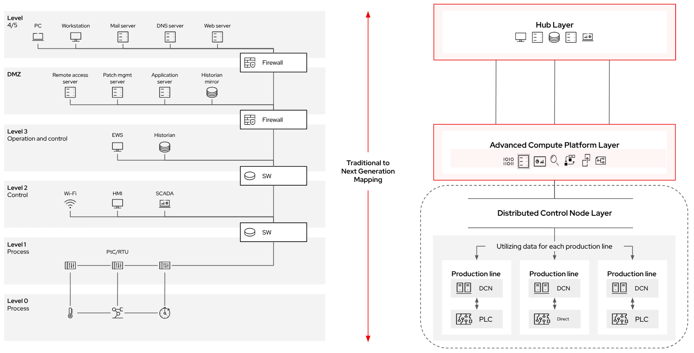

# Distributed Control Node Overview
This pattern outlines a solution for the distributed control node (DCN) layer of the industrial edge platform. DCNs represent the most localized compute at the industrial edge, positioned closest to equipment, sensors, and actuators. They provide the functionality needed to run workloads where latency, determinism, and environmental constraints demand compute directly adjacent to operations.

The overall goal of this pattern is to describe the DCN’s role as the “last-mile” compute platform, bridging the ACP at the site with operational technology (OT) endpoints. It delivers lightweight, autonomous compute designed to host gateways, protocol adapters, analytics functions, and small-scale control workloads.

This pattern should be considered complementary to the broader [industrial edge platform pattern](../industrial-edge-platform/README.md), which outlines all three layers (hub, ACP, and DCN). This document focuses specifically on the DCN layer, providing a deeper dive into its purpose, requirements, and usage.

As a reminder, the DCNs are the "lowest level" of the industrial edge architecture, being deployed at the greatest scale to the furthest edge locations:

DCNs typically map to functions found in layers 1 and 2 of the Purdue model, however they often bridge across many different layers to provide functionality:

## Table of Contents
* [Abstract](#abstract)
* [Problem](#problem)
* [Context](#context)
* [Forces](#forces)
* [Solution](#solution)
* [Resulting Context](#resulting-context)
* [Examples](#examples)
* [Rationale](#rationale)

## Abstract
| Key | Value |
| --- | --- |
| **Platform(s)** | <ul><li>Distributed Control Node</li></ul> |
| **Scope** | <ul><li>Installation</li><li>Operation</li><li>Workload Hosting</li></ul> |
| **Tooling** | <ul><li>Red Hat Enterprise Linux for Edge</li><li>Podman</li><li>Ansible Automation Platform (Optional)</li></ul> |
| **Pre-requisite Blocks** | <ul><li>Site Hardware</li><li>Networking</li><li>ACP (optional but recommended)</li></ul> |
| **Pre-requisite Patterns** | <ul><li>ACP standard services (optional)</li></ul> |
| **Example Application** | <ul><li>Protocol Gateways (OPC UA, Modbus, Ethernet/IP)</li><li>Local Analytics and Filtering</li><li>Condition Monitoring</li><li>Low-latency Control Functions</li></ul> |

## Problem
**Problem Statement:** At industrial sites, many workloads must run at the extreme edge, where constraints of latency, determinism, bandwidth, and resilience rule out hosting them in a centralized ACP or remote hub. These workloads include protocol mediation, local event filtering, near-real-time analytics, and small-scale automation logic.  

Historically, such capabilities have been delivered via specialized hardware or vendor-specific gateways, leading to fragmentation, limited portability, and higher lifecycle costs.

Without a consistent DCN platform, organizations face:
- Vendor lock-in with proprietary gateways and appliances.
- Limited ability to update, patch, or secure field-deployed compute.
- Lack of visibility into distributed assets and workloads.
- Higher integration costs when connecting edge data into site- or enterprise-level systems.

## Context
This pattern applies wherever compute must be placed adjacent to industrial assets such as production lines, robots, pumps, or sensors.  

The DCN is intended to:
- Deliver lightweight, manageable compute at the far edge.
- Host protocol adapters and localized analytics where network or latency constraints make ACP hosting impractical.
- Operate in constrained environments with limited power, ruggedized form factors, or intermittent connectivity.
- Function independently when disconnected, but optionally report into an ACP for coordination and lifecycle management.

Key assumptions:
- Hardware is resource-constrained compared to ACPs (often single-node, compact, or rugged devices).
- Connectivity to the ACP or hub may be intermittent or bandwidth-limited.
- Workloads must be portable, manageable, and updateable in the field.
- DCNs may need to run with no operator presence on-site.

## Forces
- **Latency and Determinism:** DCNs must run workloads with strict timing constraints directly adjacent to assets.
- **Resilience:** Must continue operations locally during disconnects or ACP outages.
- **Resource Constraints:** Limited compute, power, and cooling drive the need for lightweight platforms and workloads.
- **Security:** Must be hardened against tampering and cyber threats in physically exposed environments.
- **Manageability:** DCNs require simplified deployment, updates, and monitoring, often automated from the ACP or hub.
- **Diversity of Hardware:** Must support a range of rugged and compact devices while delivering a consistent software footprint.
- **Autonomy:** DCNs must run with little or no operator intervention for extended periods.
- **Scalability:** DCNs should be deployable in large fleets, with minimal per-device customization.

## Solution
The DCN layer is deployed on ruggedized or compact edge devices, providing lightweight compute near industrial assets. It typically runs a stripped-down OS image optimized for security and minimal footprint, containerized workloads via Podman, and local management tools.  

Key solution attributes:
- **Lightweight OS:** Delivered via image-based deployments such as [RHEL for Edge](../rhel-for-edge-dcn/README.md).
- **Container Runtime:** Containerized workloads managed with Podman.
- **Declarative Deployment:** Pre-built golden images allow for factory provisioning or automated rollout.
- **Management Integration:** Optionally managed by an ACP, enabling fleet-scale observability and lifecycle control.
- **Protocol & Analytics Hosting:** Supports protocol adapters, local filtering, and analytics workloads where latency or bandwidth requires compute close to assets.
- **Disconnected Operations:** Continues operating autonomously when disconnected from ACP or hub.

The DCN ensures that critical edge workloads are consistent, portable, and maintainable without reliance on vendor-specific hardware.

## Resulting Context
By adopting DCNs, organizations gain:
- A uniform, lightweight platform for running diverse edge workloads.
- Reduced reliance on proprietary gateways or siloed field devices.
- Consistent management, observability, and security across all deployed edge nodes.
- Ability to extend modern IT and OT practices to the extreme edge.
- Improved reliability and flexibility for workloads that cannot tolerate hub- or ACP-level latency.

The DCN becomes the execution point closest to operations, ensuring the industrial edge platform can serve the full range of site needs.

## Examples - TODO

### Protocol Gateway Hosting
Running OPC UA and Modbus adapters on a DCN to bridge legacy equipment into ACP-hosted applications.  

### Local Analytics
   Performing vibration analysis or condition monitoring locally, filtering data before sending results to ACP or hub.  

### Disconnected Operation  
   Running containerized workloads on DCNs at remote pumping stations with only intermittent connectivity back to an ACP.  

## Rationale
The rationale for this pattern is to provide a consistent, manageable, and secure platform for workloads that must run at the extreme edge. DCNs complement ACPs and hubs by delivering localized compute where latency, determinism, or connectivity constraints demand it.  

By standardizing the DCN layer, industrial organizations can replace fragmented vendor gateways with flexible, IT-aligned platforms that integrate seamlessly into site and enterprise architectures—without sacrificing performance or resilience.

## Footnotes

### Version
1.0.0

### Authors
- Josh Swanson (jswanson@redhat.com)