# Stretched ACP vs. Independent ACPs Across Two Data Rooms
This pattern compares two architectural approaches for deploying ACPs at edge sites with two data rooms: a single **stretched ACP** spanning both rooms, and **two independent ACPs**, one per room. It examines the trade-offs between automatic workload recovery, change isolation, cross-ACP orchestration, networking dependencies, and behavior during site disconnection.

Both approaches aim to provide workload continuity during a data room failure, but they differ fundamentally in how that continuity is achieved — and at what cost in complexity, hardware, and operational risk.

## Table of Contents
* [Abstract](#abstract)
* [Problem](#problem)
* [Context](#context)
* [Forces](#forces)
* [Solution](#solution)
  * [Approach A: Stretched ACP](#approach-a-stretched-acp)
  * [Approach B: Two Independent ACPs](#approach-b-two-independent-acps)
  * [Cross-ACP Workload Scheduling with ACM](#cross-acp-workload-scheduling-with-acm)
  * [Linking SDNs Across ACPs with Submariner](#linking-sdns-across-acps-with-submariner)
  * [Cross-ACP Virtual Machine Migration](#cross-acp-virtual-machine-migration)
  * [Storage Requirements for the Two-ACP Model](#storage-requirements-for-the-two-acp-model)
  * [Disconnected Site Behavior](#disconnected-site-behavior)
  * [Failure Domains and Blast Radius](#failure-domains-and-blast-radius)
  * [Workload Recovery Comparison](#workload-recovery-comparison)
  * [Approach Comparison](#approach-comparison)
* [Resulting Context](#resulting-context)
* [Examples](#examples)
* [Rationale](#rationale)
* [Further Reading](#further-reading)

## Abstract
| Key | Value |
| --- | --- |
| **Platform(s)** | Advanced Compute Platform |
| **Scope** | <ul><li>Architecture</li><li>Availability</li><li>Networking</li><li>Workload Scheduling</li></ul> |
| **Tooling** | <ul><li>Red Hat OpenShift</li><li>Red Hat Advanced Cluster Management (Approach B)</li><li>Submariner (Approach B, optional)</li></ul> |
| **Pre-requisite Blocks** | N/A |
| **Pre-requisite Patterns** | <ul><li>[ACP Standardized Architecture - Highly Available](../acp-standardized-architecture-ha/README.md)</li><li>[Control Plane Sizing](../acp-control-plane-sizing/README.md)</li><li>[ACP Standard Services](../rh-acp-standard-services/README.md)</li></ul> |
| **Example Application** | N/A |

## Problem
**Problem Statement:** Edge sites with two data rooms must decide how to organize their ACP deployment across the physical topology. The two rooms provide an opportunity for physical redundancy, but the way the ACP (or ACPs) is architected determines whether that redundancy translates into workload continuity during a room failure.

A single stretched ACP provides automatic workload rescheduling when a room is lost — the platform's built-in scheduler handles recovery without any external orchestration. However, the stretched ACP is a single administrative and operational domain: upgrades, configuration changes, and misconfigurations affect the entire platform at once.

Two independent ACPs provide full isolation for changes and operations — an upgrade or misconfiguration on one ACP does not affect the other. However, workload failover between ACPs is not automatic. It requires a higher-level orchestrator such as Red Hat Advanced Cluster Management (ACM) on a hub, along with cross-ACP networking, which introduces dependencies that may not be available if the site becomes disconnected from the hub.

The wrong choice can result in:
- Workload downtime during a room failure due to lack of automatic rescheduling
- Platform-wide outages caused by a single bad change with no blast radius isolation
- Cross-ACP workload scheduling that depends on hub connectivity, failing exactly when it's needed most (during a site event)
- Unnecessary operational complexity from running two independent ACPs when a stretched ACP would suffice
- Over-reliance on a single ACP when isolation and independent lifecycle management would better serve the site's needs

## Context
This pattern applies to ACPs deployed on bare-metal hardware at edge sites that have two physically separated data rooms. It is relevant when:
- The site requires workload continuity during a room-level failure
- The organization is deciding between a single ACP spanning both rooms or two ACPs, one per room
- The site may operate in a disconnected or semi-connected state where hub connectivity is intermittent
- Workloads include both containers and virtual machines that require different recovery behaviors

Key assumptions:
- Both data rooms have sufficient compute, storage, and networking to host workloads
- Network connectivity exists between the two rooms with latency suitable for etcd replication (less than 10ms RTT, per [Red Hat guidance for deployments spanning multiple sites](https://access.redhat.com/articles/3220991))
- For Approach B, a hub running Red Hat Advanced Cluster Management is available (on-site or centralized)
- The ACP is built on Red Hat OpenShift, deployed on bare-metal hardware

## Forces
- **Automatic Recovery:** A stretched ACP provides built-in workload rescheduling during node or room failures. Two independent ACPs require external orchestration for cross-ACP failover.
- **Change Isolation:** Two independent ACPs provide full blast radius isolation for upgrades, configuration changes, and operational errors. A stretched ACP is a single domain where changes affect everything.
- **Hub Dependency:** Cross-ACP orchestration in the two-ACP model depends on a hub. This dependency creates a risk during site disconnection when the hub may be unreachable.
- **Operational Complexity:** A single ACP is simpler to operate — one control plane, one SDN, one storage layer, one upgrade lifecycle. Two ACPs double the operational surface.
- **Networking:** A stretched ACP has a unified SDN. Two independent ACPs have isolated SDNs that must be linked (via Submariner or similar) if cross-ACP service discovery is needed.
- **Storage:** A stretched ACP can leverage a single converged storage pool across rooms. Two independent ACPs have isolated storage pools, requiring data replication for cross-ACP failover.
- **Site Autonomy:** A stretched ACP is fully autonomous — no external dependencies for workload management. The two-ACP model with cross-ACP scheduling depends on the hub's reachability.
- **Supportability:** Stretched ACP configurations have specific latency requirements and must meet Red Hat's published guidance. Two independent ACPs are individually standard deployments with no special requirements beyond the ACM integration.

## Solution
This section compares the two approaches in detail, covering architecture, workload recovery, cross-ACP scheduling, networking, and behavior during disconnection.

### Approach A: Stretched ACP
A stretched ACP is a single platform deployment with its control plane and worker nodes distributed across both data rooms. The platform's SDN, storage, scheduling, and control plane services span the rooms as a unified deployment. A tie-breaker node in a third location maintains etcd quorum during a room failure.

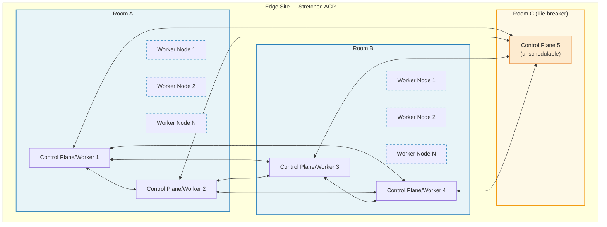
```mermaid
graph TB
    subgraph site["Edge Site — Stretched ACP"]
        subgraph roomA["Room A"]
            A1["Control Plane/Worker 1"]
            A2["Control Plane/Worker 2"]
            AW1["Worker Node 1"]
            AW2["Worker Node 2"]
            AWn["Worker Node N"]
        end
        subgraph roomB["Room B"]
            B1["Control Plane/Worker 3"]
            B2["Control Plane/Worker 4"]
            BW1["Worker Node 1"]
            BW2["Worker Node 2"]
            BWn["Worker Node N"]
        end
        subgraph roomC["Room C (Tie-breaker)"]
            C1["Control Plane 5<br/>(unschedulable)"]
        end
    end

    A1 <--> A2
    A1 <--> B1
    A1 <--> B2
    A1 <--> C1
    A2 <--> B1
    A2 <--> B2
    A2 <--> C1
    B1 <--> B2
    B1 <--> C1
    B2 <--> C1

    style roomA fill:#e8f4f8,stroke:#2980b9,stroke-width:2px
    style roomB fill:#e8f4f8,stroke:#2980b9,stroke-width:2px
    style roomC fill:#fef9e7,stroke:#f39c12,stroke-width:2px
    style C1 fill:#fdebd0,stroke:#e67e22
    style AW1 stroke-dasharray: 5 5,stroke:#2980b9
    style AW2 stroke-dasharray: 5 5,stroke:#2980b9
    style AWn stroke-dasharray: 5 5,stroke:#2980b9
    style BW1 stroke-dasharray: 5 5,stroke:#2980b9
    style BW2 stroke-dasharray: 5 5,stroke:#2980b9
    style BWn stroke-dasharray: 5 5,stroke:#2980b9
```

> Worker nodes shown with dashed borders are optional — the number deployed depends on workload requirements at the site.

**Key characteristics:**
- Single control plane (etcd, API server, scheduler, controller manager) spanning both rooms
- Single software-defined network (SDN) — pods in Room A can reach pods in Room B natively
- Single converged storage pool (if using ODF/Ceph stretched storage) or storage per room
- Single upgrade lifecycle — the entire platform upgrades as one unit
- Automatic workload rescheduling on node or room failure — no external orchestrator needed

#### How Workload Rescheduling Works

When a node or room fails in a stretched ACP, the platform handles recovery automatically using its built-in scheduling and virtualization capabilities:

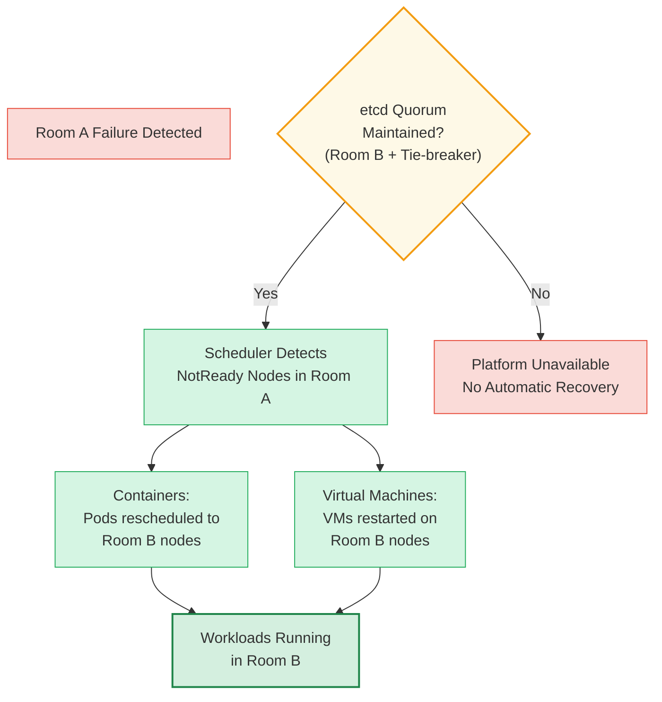
```mermaid
flowchart TB
    F["Room A Failure Detected"]
    Q{"etcd Quorum<br/>Maintained?<br/>(Room B + Tie-breaker)"}

    Q -- "Yes" --> S1
    S1["Scheduler Detects<br/>NotReady Nodes in Room A"]
    S1 --> C["Containers:<br/>Pods rescheduled to<br/>Room B nodes"]
    S1 --> V["Virtual Machines:<br/>VMs restarted on<br/>Room B nodes"]
    C --> R["Workloads Running<br/>in Room B"]
    V --> R

    Q -- "No" --> NQ["Platform Unavailable<br/>No Automatic Recovery"]

    style F fill:#fadbd8,stroke:#e74c3c
    style Q fill:#fef9e7,stroke:#f39c12,stroke-width:2px
    style S1 fill:#d5f5e3,stroke:#27ae60
    style C fill:#d5f5e3,stroke:#27ae60
    style V fill:#d5f5e3,stroke:#27ae60
    style R fill:#d4efdf,stroke:#1e8449,stroke-width:2px
    style NQ fill:#fadbd8,stroke:#e74c3c
```

This is entirely self-contained by the ACP. The platform scheduler sees all nodes in both rooms, detects that Room A's nodes are `NotReady`, and redistributes workloads to the surviving Room B nodes. This requires no external connections or management plane/hub functionality.

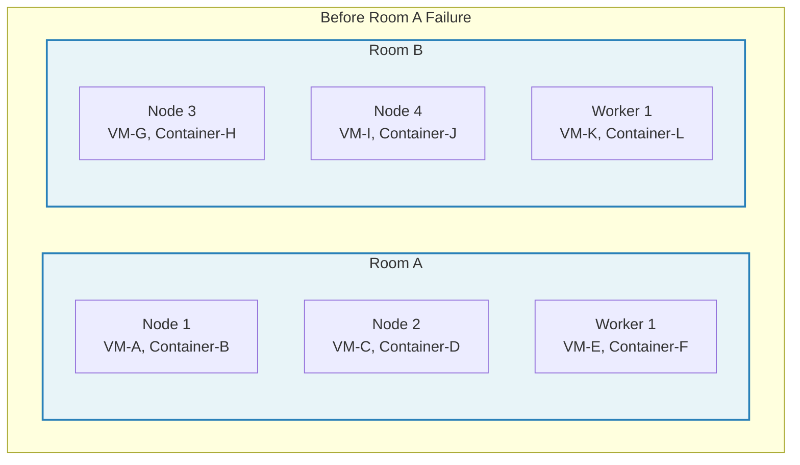
```mermaid
graph TB
    subgraph before["Before Room A Failure"]
        subgraph rA1["Room A"]
            A1b["Node 1<br/>VM-A, Container-B"]
            A2b["Node 2<br/>VM-C, Container-D"]
            AW1b["Worker 1<br/>VM-E, Container-F"]
        end
        subgraph rB1["Room B"]
            B1b["Node 3<br/>VM-G, Container-H"]
            B2b["Node 4<br/>VM-I, Container-J"]
            BW1b["Worker 1<br/>VM-K, Container-L"]
        end
    end

    style rA1 fill:#e8f4f8,stroke:#2980b9,stroke-width:2px
    style rB1 fill:#e8f4f8,stroke:#2980b9,stroke-width:2px
```

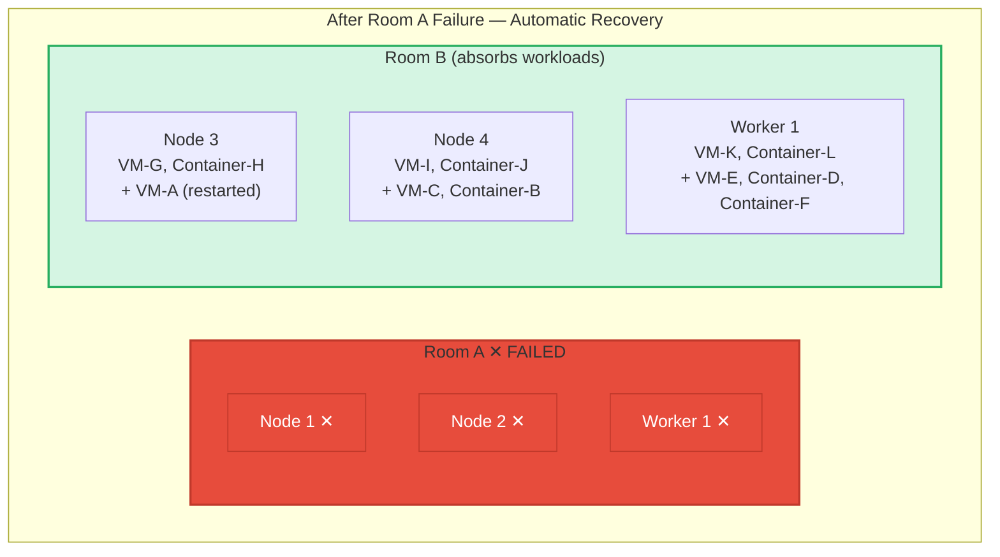
```mermaid
graph TB
    subgraph after["After Room A Failure — Automatic Recovery"]
        subgraph rA2["Room A ✕ FAILED"]
            A1a["Node 1 ✕"]
            A2a["Node 2 ✕"]
            AW1a["Worker 1 ✕"]
        end
        subgraph rB2["Room B (absorbs workloads)"]
            B1a["Node 3<br/>VM-G, Container-H<br/>+ VM-A (restarted)"]
            B2a["Node 4<br/>VM-I, Container-J<br/>+ VM-C, Container-B"]
            BW1a["Worker 1<br/>VM-K, Container-L<br/>+ VM-E, Container-D, Container-F"]
        end
    end

    style rA2 fill:#e74c3c,stroke:#c0392b,stroke-width:2px
    style rB2 fill:#d5f5e3,stroke:#27ae60,stroke-width:2px
    style A1a fill:#e74c3c,stroke:#c0392b,color:#fff
    style A2a fill:#e74c3c,stroke:#c0392b,color:#fff
    style AW1a fill:#e74c3c,stroke:#c0392b,color:#fff
```

**Pros:**
- Automatic workload rescheduling — no external orchestration required
- Single SDN — pods communicate across rooms natively without tunnel overlays or service mesh
- Single control plane — one API endpoint, one set of credentials, one management interface
- Single upgrade lifecycle — one upgrade operation covers the entire site
- Lower hardware overhead — one set of control plane nodes instead of two
- Fully autonomous — no dependency on a hub for workload recovery
- Simplified storage — single storage pool can span rooms (with the converged storage service)

**Cons:**
- Single blast radius — a bad upgrade, misconfiguration, or platform bug affects all workloads across both rooms simultaneously
- Single upgrade lifecycle is also a risk — rolling back a failed upgrade impacts the entire site
- Requires strict inter-room latency for etcd (less than 10ms RTT) ([source](https://access.redhat.com/articles/3220991))
- Platform-level failures (API server outage, etcd corruption) affect both rooms
- No ability to test changes in one room before applying to the other
- Platform protections exist (rolling upgrades, canary deployments for workers), but they operate within a single ACP — a fundamentally broken change still propagates

---

### Approach B: Two Independent ACPs
Two independent ACPs deploy a separate platform instance in each data room. Each ACP has its own control plane, SDN, storage, and upgrade lifecycle. Cross-ACP workload scheduling, if needed, is handled by a higher-level orchestrator such as Red Hat Advanced Cluster Management (ACM) on a hub.

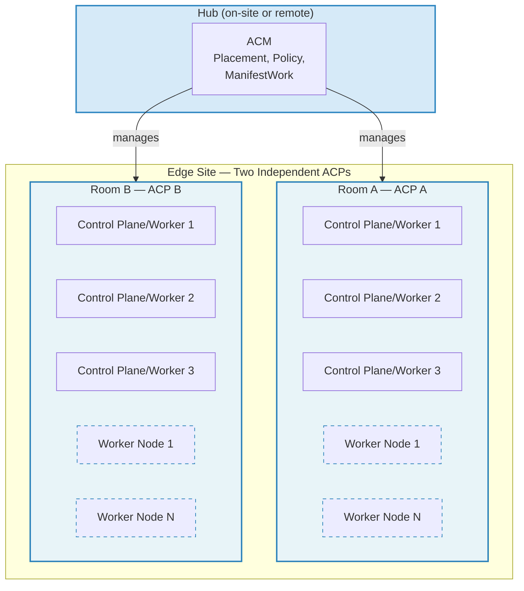
```mermaid
graph TB
    subgraph site["Edge Site — Two Independent ACPs"]
        subgraph roomA["Room A — ACP A"]
            A1["Control Plane/Worker 1"]
            A2["Control Plane/Worker 2"]
            A3["Control Plane/Worker 3"]
            AW1["Worker Node 1"]
            AWn["Worker Node N"]
        end
        subgraph roomB["Room B — ACP B"]
            B1["Control Plane/Worker 1"]
            B2["Control Plane/Worker 2"]
            B3["Control Plane/Worker 3"]
            BW1["Worker Node 1"]
            BWn["Worker Node N"]
        end
    end

    subgraph hub["Hub (on-site or remote)"]
        ACM["ACM<br/>Placement, Policy,<br/>ManifestWork"]
    end

    ACM -- "manages" --> roomA
    ACM -- "manages" --> roomB

    style roomA fill:#e8f4f8,stroke:#2980b9,stroke-width:2px
    style roomB fill:#e8f4f8,stroke:#2980b9,stroke-width:2px
    style hub fill:#d6eaf8,stroke:#2e86c1,stroke-width:2px
    style AW1 stroke-dasharray: 5 5,stroke:#2980b9
    style AWn stroke-dasharray: 5 5,stroke:#2980b9
    style BW1 stroke-dasharray: 5 5,stroke:#2980b9
    style BWn stroke-dasharray: 5 5,stroke:#2980b9
```

> Worker nodes shown with dashed borders are optional — the number deployed depends on workload requirements at the site.

**Key characteristics:**
- Two independent control planes — each ACP is a fully autonomous platform instance
- Isolated SDNs — pods in ACP A cannot natively reach pods in ACP B without explicit network linking
- Isolated storage pools — each ACP manages its own storage
- Independent upgrade lifecycles — ACP A can be upgraded independently of ACP B
- Cross-ACP workload scheduling requires ACM (Placement API, ManifestWork)
- Cross-ACP networking requires Submariner or similar overlay

#### How Cross-ACP Failover Works

Unlike a stretched ACP, two independent ACPs do not automatically reschedule workloads between each other. Each ACP handles its own internal failures (node-level), but a room-level failure (which takes down an entire ACP) requires the hub to orchestrate workload placement on the surviving ACP.

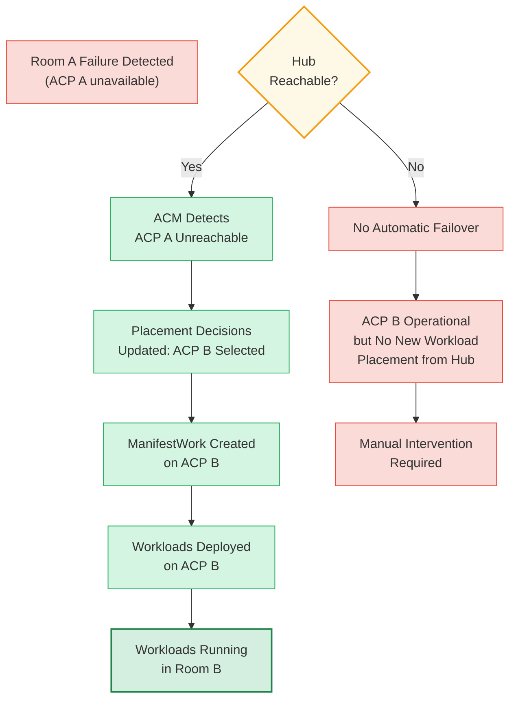
```mermaid
flowchart TB
    F["Room A Failure Detected<br/>(ACP A unavailable)"]
    H{"Hub<br/>Reachable?"}

    H -- "Yes" --> P1
    P1["ACM Detects<br/>ACP A Unreachable"]
    P1 --> P2["Placement Decisions<br/>Updated: ACP B Selected"]
    P2 --> P3["ManifestWork Created<br/>on ACP B"]
    P3 --> P4["Workloads Deployed<br/>on ACP B"]
    P4 --> R["Workloads Running<br/>in Room B"]

    H -- "No" --> D1["No Automatic Failover"]
    D1 --> D2["ACP B Operational<br/>but No New Workload<br/>Placement from Hub"]
    D2 --> D3["Manual Intervention<br/>Required"]

    style F fill:#fadbd8,stroke:#e74c3c
    style H fill:#fef9e7,stroke:#f39c12,stroke-width:2px
    style P1 fill:#d5f5e3,stroke:#27ae60
    style P2 fill:#d5f5e3,stroke:#27ae60
    style P3 fill:#d5f5e3,stroke:#27ae60
    style P4 fill:#d5f5e3,stroke:#27ae60
    style R fill:#d4efdf,stroke:#1e8449,stroke-width:2px
    style D1 fill:#fadbd8,stroke:#e74c3c
    style D2 fill:#fadbd8,stroke:#e74c3c
    style D3 fill:#fadbd8,stroke:#e74c3c
```

The critical dependency is the hub. If it is unreachable during the failure event, no new cross-ACP placement decisions can be made. Existing workloads on ACP B continue running, but workloads from the failed ACP A are not automatically moved.

**Pros:**
- Full change isolation — upgrades, configurations, and policy changes on ACP A do not affect ACP B
- Independent upgrade lifecycle — one ACP can be upgraded and validated before the other, enabling a canary-style rollout across the site
- Platform-level failure isolation — API server outage, etcd corruption, or a bad operator on one ACP has zero impact on the other
- Each ACP is a standard 3-node compact deployment — no stretched ACP latency requirements or special configuration
- Each ACP is independently functional during hub disconnection for its own workloads
- Better blast radius control for testing new platform versions, operators, or configurations

**Cons:**
- No automatic cross-ACP workload rescheduling — requires ACM on a hub for failover orchestration
- Hub dependency for cross-ACP scheduling — if the hub is unreachable, no failover orchestration occurs
- Higher hardware overhead — two complete control planes instead of one
- Higher operational complexity — two ACPs to monitor, upgrade, and manage
- Cross-ACP networking requires additional tooling (Submariner) and introduces its own failure modes
- Cross-ACP storage replication required for stateful workload failover
- Two sets of credentials, certificates, and configurations to manage

---

### Cross-ACP Workload Scheduling with ACM
In the two-ACP model, Red Hat Advanced Cluster Management provides the orchestration layer for placing workloads across ACPs. The key APIs involved are:

**Placement API:** Dynamically selects target ACPs based on labels, health, resource availability, and custom scoring. The Placement controller on the hub evaluates conditions and produces a `PlacementDecision` — a list of selected targets. ([source](https://open-cluster-management.io/docs/concepts/content-placement/placement/))

**ManifestWork API:** Dispatches Kubernetes resources from the hub to a managed ACP. A ManifestWork resource created in an ACP's namespace on the hub is picked up by the work agent running on that ACP, which applies the resources locally. ([source](https://open-cluster-management.io/docs/concepts/work-distribution/manifestwork/))

**ManifestWorkReplicaSet:** Combines Placement and ManifestWork to automatically distribute resources to all ACPs selected by a Placement. This eliminates the need to manually create individual ManifestWork resources per ACP. ([source](https://open-cluster-management.io/docs/concepts/work-distribution/manifestworkreplicaset/))

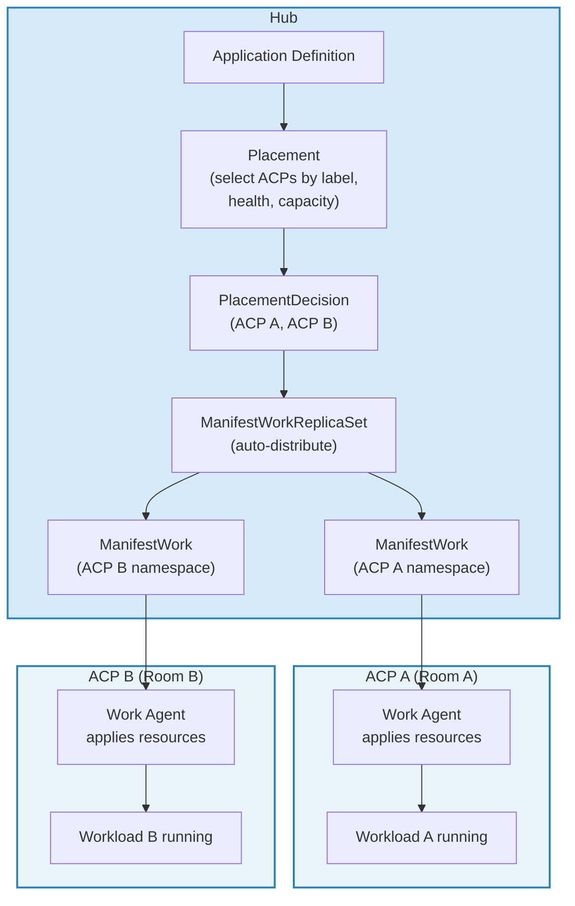
```mermaid
graph TB
    subgraph hub["Hub"]
        APP["Application Definition"]
        PL["Placement<br/>(select ACPs by label,<br/>health, capacity)"]
        PD["PlacementDecision<br/>(ACP A, ACP B)"]
        MWR["ManifestWorkReplicaSet<br/>(auto-distribute)"]
        MWA["ManifestWork<br/>(ACP A namespace)"]
        MWB["ManifestWork<br/>(ACP B namespace)"]
    end

    subgraph clA["ACP A (Room A)"]
        WA["Work Agent<br/>applies resources"]
        WLA["Workload A running"]
    end

    subgraph clB["ACP B (Room B)"]
        WB["Work Agent<br/>applies resources"]
        WLB["Workload B running"]
    end

    APP --> PL
    PL --> PD
    PD --> MWR
    MWR --> MWA
    MWR --> MWB
    MWA --> WA
    WA --> WLA
    MWB --> WB
    WB --> WLB

    style hub fill:#d6eaf8,stroke:#2e86c1,stroke-width:2px
    style clA fill:#e8f4f8,stroke:#2980b9,stroke-width:2px
    style clB fill:#e8f4f8,stroke:#2980b9,stroke-width:2px
```

#### Failover Flow with ACM

When ACP A becomes unavailable:
1. ACM's health monitoring detects that ACP A is unreachable
2. The Placement controller re-evaluates selection, removing ACP A from the PlacementDecision
3. Workloads that were targeted at ACP A are rescheduled to ACP B via new ManifestWork resources
4. The work agent on ACP B applies the resources, starting the workloads

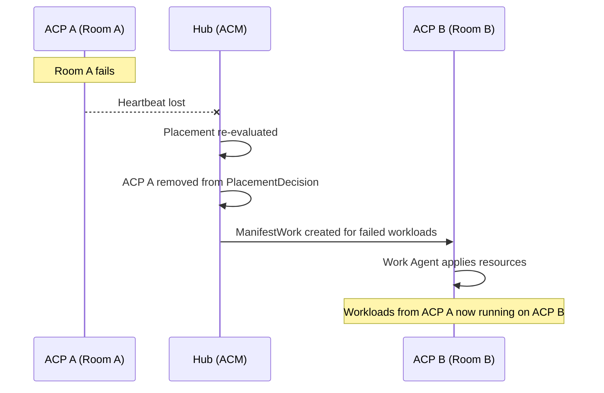
```mermaid
sequenceDiagram
    participant CA as ACP A (Room A)
    participant Hub as Hub (ACM)
    participant CB as ACP B (Room B)

    Note over CA: Room A fails
    CA--xHub: Heartbeat lost
    Hub->>Hub: Placement re-evaluated
    Hub->>Hub: ACP A removed from PlacementDecision
    Hub->>CB: ManifestWork created for failed workloads
    CB->>CB: Work Agent applies resources
    Note over CB: Workloads from ACP A now running on ACP B
```

This flow depends entirely on the hub being reachable. If the hub is also impacted (co-located in Room A, network path through Room A, etc.), the failover does not occur. See [Disconnected Site Behavior](#disconnected-site-behavior) for details.

#### Disaster Recovery with OpenShift DR

For stateful workloads requiring data failover, OpenShift Data Foundation provides Disaster Recovery (DR) orchestration in conjunction with ACM. The DRPolicy resource on the hub defines the relationship between the two managed ACPs and uses either Metro-DR (synchronous replication, low latency) or Regional-DR (asynchronous replication, higher latency) to replicate storage between them. ([source](https://docs.redhat.com/en/documentation/red_hat_advanced_cluster_management_for_kubernetes/2.13/html-single/business_continuity/index))

---

### Linking SDNs Across ACPs with Submariner
In the two-ACP model, each ACP has its own isolated SDN. Pods on ACP A cannot directly reach pods or services on ACP B by default. If cross-ACP service communication is required, the SDNs must be linked.

**Submariner** is the supported tool for cross-ACP networking with ACM on the hub. It creates encrypted tunnels between gateway nodes on each ACP, enabling:
- **Pod-to-pod** connectivity across ACPs
- **Service discovery** across ACPs via the `<service>.<namespace>.svc.clusterset.local` DNS format
- **ServiceExport/ServiceImport** resources that make services on one ACP visible to another

([source](https://access.redhat.com/documentation/en-us/red_hat_advanced_cluster_management_for_kubernetes/2.9/html/networking/networking))

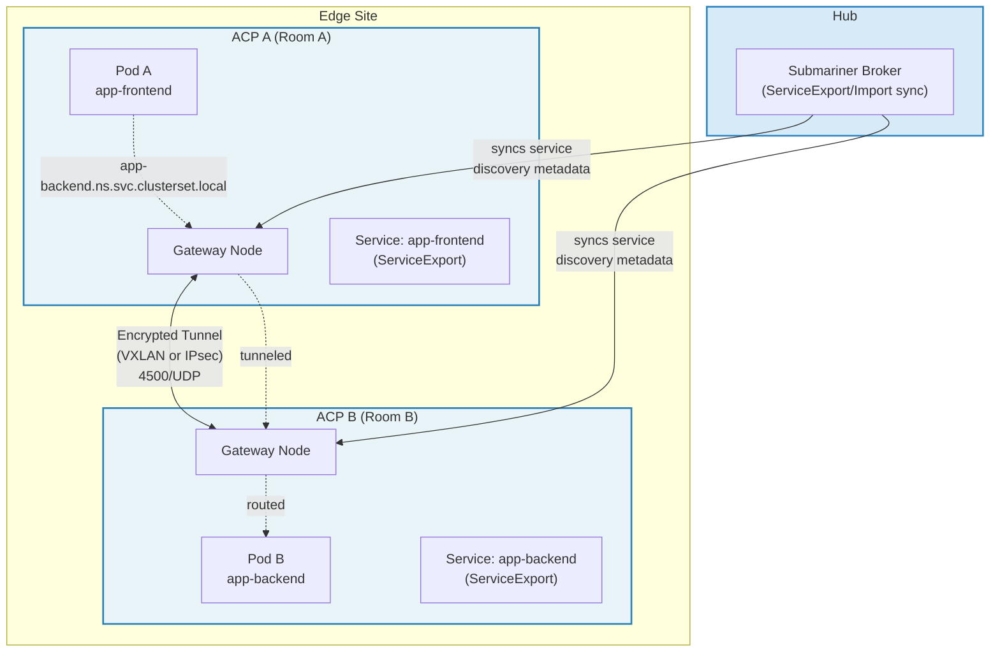
```mermaid
graph TB
    subgraph site["Edge Site"]
        subgraph clA["ACP A (Room A)"]
            GWA["Gateway Node"]
            PA["Pod A<br/>app-frontend"]
            SA["Service: app-frontend<br/>(ServiceExport)"]
        end
        subgraph clB["ACP B (Room B)"]
            GWB["Gateway Node"]
            PB["Pod B<br/>app-backend"]
            SB["Service: app-backend<br/>(ServiceExport)"]
        end
    end

    GWA <-- "Encrypted Tunnel<br/>(VXLAN or IPsec)<br/>4500/UDP" --> GWB

    PA -. "app-backend.ns.svc.clusterset.local" .-> GWA
    GWA -. "tunneled" .-> GWB
    GWB -. "routed" .-> PB

    subgraph hub["Hub"]
        BROKER["Submariner Broker<br/>(ServiceExport/Import sync)"]
    end

    BROKER -- "syncs service<br/>discovery metadata" --> GWA
    BROKER -- "syncs service<br/>discovery metadata" --> GWB

    style clA fill:#e8f4f8,stroke:#2980b9,stroke-width:2px
    style clB fill:#e8f4f8,stroke:#2980b9,stroke-width:2px
    style hub fill:#d6eaf8,stroke:#2e86c1,stroke-width:2px
```

#### Requirements
- Non-overlapping Pod and Service CIDRs between the two ACPs, or Globalnet enabled for address translation ([source](https://access.redhat.com/documentation/en-us/red_hat_advanced_cluster_management_for_kubernetes/2.9/html/networking/networking))
- IP reachability between gateway nodes on each ACP
- Firewall rules: 4500/UDP and 4490/UDP on gateway nodes; 4800/UDP on all nodes if using OpenShift-SDN

#### Hub Dependency for Service Discovery

Submariner uses a broker, typically running on the hub, to synchronize ServiceExport and ServiceImport metadata between ACPs. If the hub is unavailable:
- **Existing tunnels remain active** — data-plane connectivity between ACPs continues to function
- **New service exports are not synced** — services newly exported on one ACP are not discovered by the other
- **Existing service discovery entries remain cached** — previously discovered services continue to resolve

This means Submariner has a partial hub dependency: the data plane is resilient, but the control plane (service discovery updates) requires the broker on the hub.

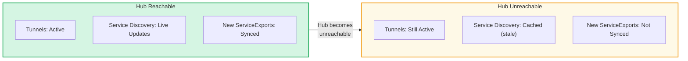
```mermaid
graph LR
    subgraph connected["Hub Reachable"]
        direction TB
        C1["Tunnels: Active"]
        C2["Service Discovery: Live Updates"]
        C3["New ServiceExports: Synced"]
    end

    subgraph disconnected["Hub Unreachable"]
        direction TB
        D1["Tunnels: Still Active"]
        D2["Service Discovery: Cached (stale)"]
        D3["New ServiceExports: Not Synced"]
    end

    connected -- "Hub becomes<br/>unreachable" --> disconnected

    style connected fill:#d5f5e3,stroke:#27ae60,stroke-width:2px
    style disconnected fill:#fef9e7,stroke:#f39c12,stroke-width:2px
```

---

### Cross-ACP Virtual Machine Migration
In the two-ACP model, virtual machines can be migrated between ACPs — a capability that is particularly valuable during planned maintenance windows. This allows an operator to drain VMs from one ACP, perform maintenance (upgrades, hardware service, firmware updates), and then migrate VMs back.

#### Migration Methods

The platform supports two methods for cross-ACP VM migration:

**Cold Migration (Supported — Migration Toolkit for Virtualization):**
Cold migration shuts down the VM on the source ACP, copies the VM definition and disk data to the target ACP, and starts the VM on the target. This is a fully supported workflow using the Migration Toolkit for Virtualization (MTV), which supports OpenShift Virtualization as both a source and destination provider. ([source](https://docs.redhat.com/en/documentation/migration_toolkit_for_virtualization/2.10/pdf/planning_your_migration_to_red_hat_openshift_virtualization/index))

**Live Migration (Technology Preview — OpenShift Virtualization 4.20+ / ACM 2.15+):**
Cross-ACP live migration moves a running VM from one ACP to another without shutting it down. This is available as a Technology Preview feature in OpenShift Virtualization 4.20+ with ACM 2.15+. It requires both ACPs' migration networks to be connected to the same L2 network segment. Technology Preview features are not supported with Red Hat production SLAs and should not be relied on for production use. ([source](https://docs.redhat.com/en/documentation/red_hat_advanced_cluster_management_for_kubernetes/2.15/html-single/virtualization/index))

#### Requirements for Cross-ACP VM Migration

| Requirement | Cold Migration (MTV) | Live Migration (Tech Preview) |
|---|---|---|
| **Tooling** | Migration Toolkit for Virtualization | OpenShift Virtualization 4.20+ with ACM 2.15+ |
| **VM downtime** | Yes — VM is shut down during transfer | No — VM remains running |
| **Network** | IP reachability between ACPs | L2 network connectivity between migration networks |
| **Storage** | Target ACP must have storage available for VM disks | Shared or replicated storage accessible from both ACPs |
| **Hub** | Required (MTV orchestration) | Required (ACM orchestration) |
| **Production support** | Fully supported | Technology Preview only |

#### Maintenance Use Case: Drain and Migrate

When one ACP requires maintenance (platform upgrade, hardware service, or firmware updates), VMs can be migrated to the other ACP to avoid workload disruption:

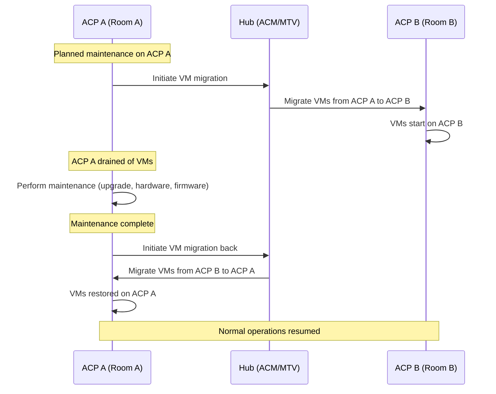
```mermaid
sequenceDiagram
    participant CA as ACP A (Room A)
    participant Hub as Hub (ACM/MTV)
    participant CB as ACP B (Room B)

    Note over CA: Planned maintenance on ACP A
    CA->>Hub: Initiate VM migration
    Hub->>CB: Migrate VMs from ACP A to ACP B
    CB->>CB: VMs start on ACP B
    Note over CA: ACP A drained of VMs
    CA->>CA: Perform maintenance (upgrade, hardware, firmware)
    Note over CA: Maintenance complete
    CA->>Hub: Initiate VM migration back
    Hub->>CA: Migrate VMs from ACP B to ACP A
    CA->>CA: VMs restored on ACP A
    Note over CA,CB: Normal operations resumed
```

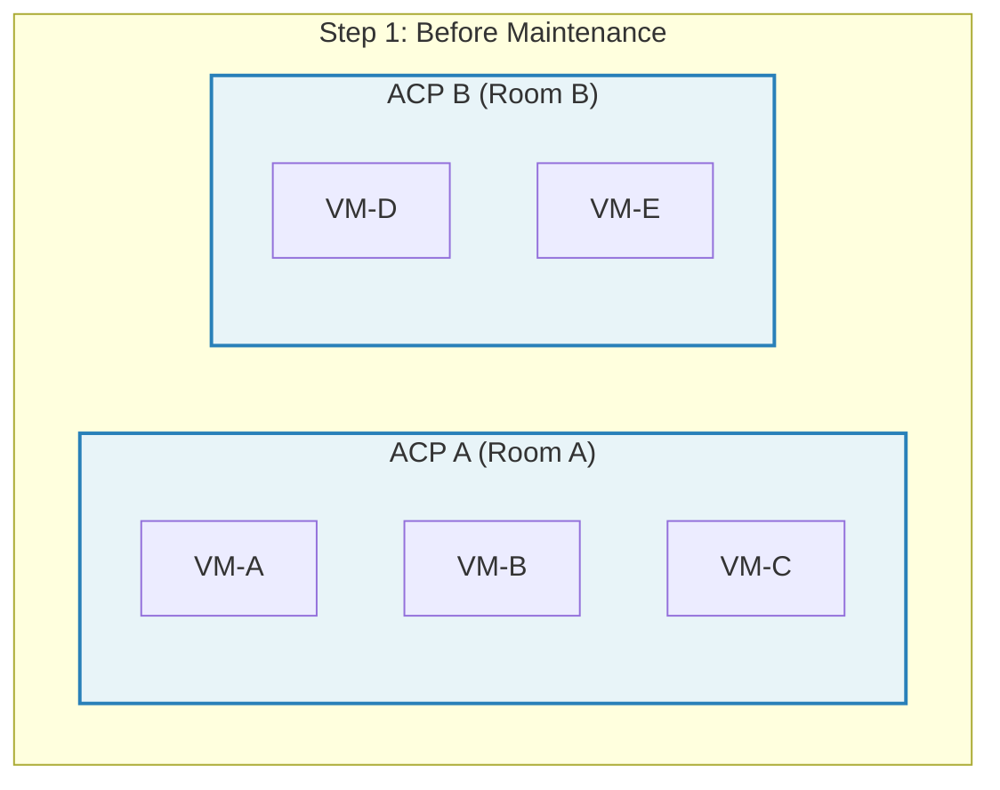
```mermaid
graph TB
    subgraph step1["Step 1: Before Maintenance"]
        subgraph s1A["ACP A (Room A)"]
            s1A1["VM-A"]
            s1A2["VM-B"]
            s1A3["VM-C"]
        end
        subgraph s1B["ACP B (Room B)"]
            s1B1["VM-D"]
            s1B2["VM-E"]
        end
    end

    style s1A fill:#e8f4f8,stroke:#2980b9,stroke-width:2px
    style s1B fill:#e8f4f8,stroke:#2980b9,stroke-width:2px
```

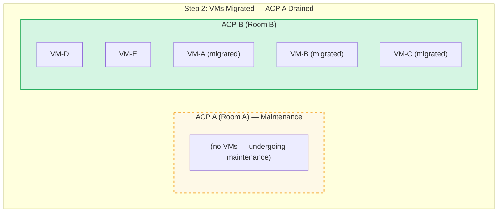
```mermaid
graph TB
    subgraph step2["Step 2: VMs Migrated — ACP A Drained"]
        subgraph s2A["ACP A (Room A) — Maintenance"]
            s2A1["(no VMs — undergoing maintenance)"]
        end
        subgraph s2B["ACP B (Room B)"]
            s2B1["VM-D"]
            s2B2["VM-E"]
            s2B3["VM-A (migrated)"]
            s2B4["VM-B (migrated)"]
            s2B5["VM-C (migrated)"]
        end
    end

    style s2A fill:#fef9e7,stroke:#f39c12,stroke-width:2px,stroke-dasharray: 5 5
    style s2B fill:#d5f5e3,stroke:#27ae60,stroke-width:2px
```

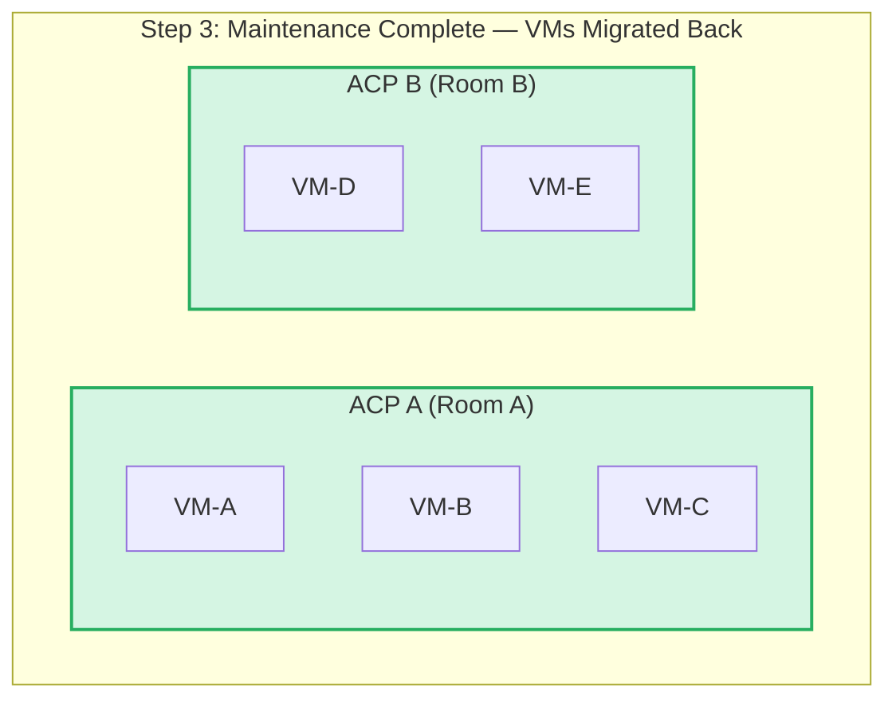
```mermaid
graph TB
    subgraph step3["Step 3: Maintenance Complete — VMs Migrated Back"]
        subgraph s3A["ACP A (Room A)"]
            s3A1["VM-A"]
            s3A2["VM-B"]
            s3A3["VM-C"]
        end
        subgraph s3B["ACP B (Room B)"]
            s3B1["VM-D"]
            s3B2["VM-E"]
        end
    end

    style s3A fill:#d5f5e3,stroke:#27ae60,stroke-width:2px
    style s3B fill:#d5f5e3,stroke:#27ae60,stroke-width:2px
```

This drain-and-migrate pattern enables zero-downtime maintenance for VM workloads across two independent ACPs. It requires the hub to be reachable during the migration, and assumes the receiving ACP has sufficient compute and storage capacity to temporarily absorb the migrated VMs.

> **Note:** Containerized workloads do not require cross-ACP migration for maintenance. In the two-ACP model, containerized applications can be redeployed to the target ACP via ACM's Placement and ManifestWork APIs without a migration step — they are simply scheduled fresh on the target.

---

### Storage Requirements for the Two-ACP Model
The two-ACP model introduces storage considerations that do not apply to a stretched ACP. Because each ACP has its own isolated storage pool, cross-ACP workload failover and VM migration both require careful planning for how storage is provided and replicated.

#### Stretched ACP Storage

In a stretched ACP, storage can be delivered in two ways:
- **ODF Stretched Storage:** A single OpenShift Data Foundation (Ceph) storage pool stretched across both rooms with an arbiter in a third location. Data is synchronously replicated between rooms. This provides a unified storage layer that is transparent to workloads. ([source](https://docs.redhat.com/en/documentation/red_hat_openshift_data_foundation/4.13/html/configuring_openshift_data_foundation_disaster_recovery_for_openshift_workloads/introduction-to-stretch-cluster-disaster-recovery_stretch-cluster))
- **Per-Room Storage:** Each room has its own local storage (local disks, converged storage within the room). Workloads use storage local to their room. During a room failure, workloads rescheduled to the surviving room must wait for storage to be re-provisioned or restored from backup.

#### Two Independent ACPs: Storage Options

With two independent ACPs, each ACP manages its own storage. Cross-ACP workload failover and VM migration require one of the following approaches:

**Option 1: External Shared Storage**
An external storage system (SAN, NAS, or dedicated storage appliance) accessible from both ACPs provides a shared data layer. Both ACPs mount volumes from the same storage backend, eliminating the need for data replication during failover or migration.

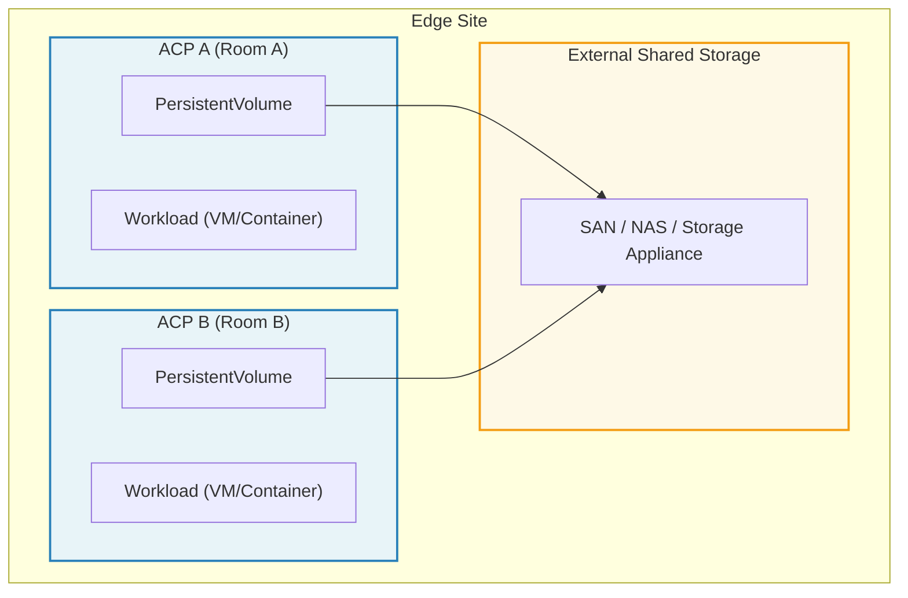
```mermaid
graph TB
    subgraph site["Edge Site"]
        subgraph clA["ACP A (Room A)"]
            CA_W["Workload (VM/Container)"]
            CA_PV["PersistentVolume"]
        end
        subgraph clB["ACP B (Room B)"]
            CB_W["Workload (VM/Container)"]
            CB_PV["PersistentVolume"]
        end
        subgraph storage["External Shared Storage"]
            SAN["SAN / NAS / Storage Appliance"]
        end
    end

    CA_PV --> SAN
    CB_PV --> SAN

    style clA fill:#e8f4f8,stroke:#2980b9,stroke-width:2px
    style clB fill:#e8f4f8,stroke:#2980b9,stroke-width:2px
    style storage fill:#fef9e7,stroke:#f39c12,stroke-width:2px
```

**Requirements:**
- The external storage must be accessible from nodes in both ACPs (iSCSI, FC, NFS, or similar)
- CSI driver or storage provisioner compatible with the external system must be deployed on both ACPs
- Storage-level HA or replication should be configured on the external system to avoid the storage becoming a single point of failure
- Both ACPs must have appropriate network connectivity and credentials to the shared storage

**Pros:**
- Simplifies VM migration — disk data does not need to be copied between ACPs
- Faster failover — no data transfer delay
- Centralized storage management

**Cons:**
- External storage system is a shared dependency — its failure affects both ACPs
- Requires additional infrastructure (storage appliance, SAN switches, cabling to both rooms)
- Storage system must be in a location accessible from both rooms (or replicated across rooms)

**Option 2: ODF with Metro-DR or Regional-DR**
Each ACP runs its own OpenShift Data Foundation instance with local storage. Data is replicated between the two ODF instances using either Metro-DR (synchronous, low latency) or Regional-DR (asynchronous). ACM on the hub and the OpenShift DR operator orchestrate failover of both the application and its data. ([source](https://docs.redhat.com/en/documentation/red_hat_advanced_cluster_management_for_kubernetes/2.13/html-single/business_continuity/index))

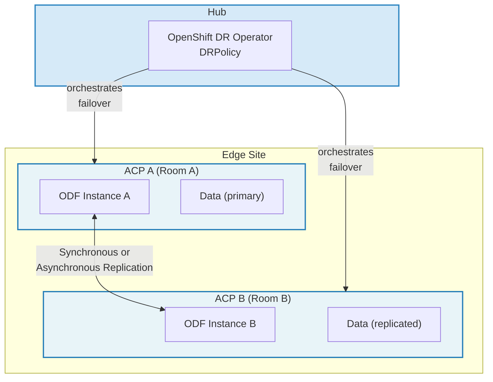
```mermaid
graph TB
    subgraph site["Edge Site"]
        subgraph clA["ACP A (Room A)"]
            CA_ODF["ODF Instance A"]
            CA_D["Data (primary)"]
        end
        subgraph clB["ACP B (Room B)"]
            CB_ODF["ODF Instance B"]
            CB_D["Data (replicated)"]
        end
    end

    CA_ODF <-- "Synchronous or<br/>Asynchronous Replication" --> CB_ODF

    subgraph hub["Hub"]
        DR["OpenShift DR Operator<br/>DRPolicy"]
    end

    DR -- "orchestrates<br/>failover" --> clA
    DR -- "orchestrates<br/>failover" --> clB

    style clA fill:#e8f4f8,stroke:#2980b9,stroke-width:2px
    style clB fill:#e8f4f8,stroke:#2980b9,stroke-width:2px
    style hub fill:#d6eaf8,stroke:#2e86c1,stroke-width:2px
```

**Requirements:**
- ODF deployed on both ACPs with sufficient disk capacity
- Network connectivity between ACPs for replication traffic
- Hub running ACM and the OpenShift DR operator
- Metro-DR requires low latency (<10ms RTT) between ACPs; Regional-DR tolerates higher latency

**Pros:**
- No external storage dependency — each ACP is self-contained for storage
- Replication is managed by ODF, integrated with ACM's DR orchestration
- Supports both synchronous (zero RPO) and asynchronous (near-zero RPO) modes

**Cons:**
- Requires ODF on both ACPs — additional compute and disk resources
- Replication consumes network bandwidth between rooms
- Hub dependency for DR orchestration — if the hub is unreachable, failover requires manual intervention
- More complex to configure and operate than external shared storage

**Option 3: Per-ACP Local Storage (No Cross-ACP Replication)**
Each ACP uses only local or converged storage with no replication to the other ACP. Cross-ACP failover for stateful workloads is not supported — only stateless workloads can be rescheduled across ACPs.

**Pros:**
- Simplest storage configuration — no replication, no external systems
- Lowest cost and complexity

**Cons:**
- Stateful workloads (VMs, databases) cannot be failed over between ACPs
- Only viable if all workloads requiring cross-ACP failover are stateless

#### Storage Summary

| Storage Approach | Cross-ACP VM Migration | Stateful Failover | External Dependencies | Hub Required |
|---|---|---|---|---|
| **External Shared Storage** | Yes — no data copy needed | Yes | Storage system accessible from both ACPs | For orchestration only |
| **ODF Metro-DR/Regional-DR** | Yes — data replicated | Yes | None (ODF self-contained) | Yes (DR orchestration) |
| **Per-ACP Local Storage** | Cold migration only (data must be copied) | No | None | For orchestration only |

> **Recommendation for cross-ACP VM migration:** External shared storage provides the simplest path for VM migration during maintenance. If external storage is not available, ODF with Metro-DR provides a fully software-defined alternative, at the cost of additional complexity and hub dependency.

---

### Disconnected Site Behavior
Edge sites may lose connectivity to the hub due to network outages, WAN failures, or intentional disconnection. The behavior of each approach during disconnection differs significantly.

#### Stretched ACP: Fully Autonomous

A stretched ACP has no dependency on a hub for workload scheduling or recovery. During a disconnection:
- The platform continues operating normally
- Node-level failures trigger automatic rescheduling
- Room-level failures trigger automatic rescheduling (if quorum is maintained)
- No degradation in platform capabilities

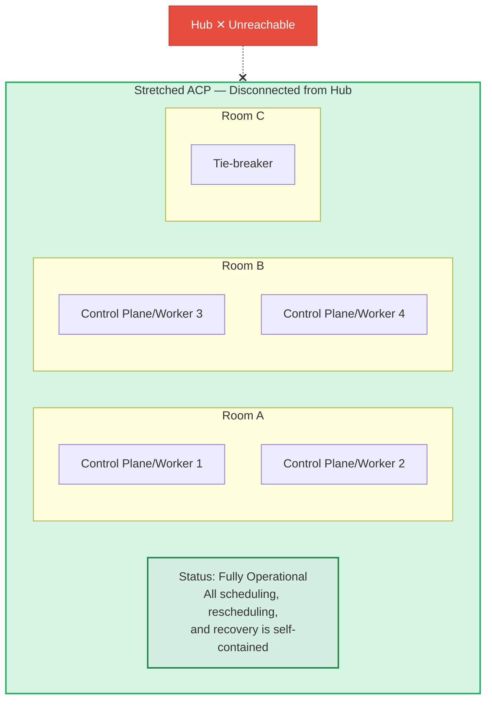
```mermaid
graph TB
    subgraph stretched["Stretched ACP — Disconnected from Hub"]
        subgraph rA["Room A"]
            SA1["Control Plane/Worker 1"]
            SA2["Control Plane/Worker 2"]
        end
        subgraph rB["Room B"]
            SB1["Control Plane/Worker 3"]
            SB2["Control Plane/Worker 4"]
        end
        subgraph rC["Room C"]
            SC1["Tie-breaker"]
        end
        STATUS["Status: Fully Operational<br/>All scheduling, rescheduling,<br/>and recovery is self-contained"]
    end

    HUB["Hub ✕ Unreachable"]

    HUB -.-x stretched

    style stretched fill:#d5f5e3,stroke:#27ae60,stroke-width:2px
    style HUB fill:#e74c3c,stroke:#c0392b,color:#fff
    style STATUS fill:#d4efdf,stroke:#1e8449,stroke-width:2px
```

The only capabilities lost during disconnection are hub-provided services (policy distribution, observability aggregation, etc.), not core platform scheduling.

#### Two Independent ACPs: Individually Functional, Orchestration Lost

Each independent ACP continues to function for its own workloads during disconnection. However, cross-ACP orchestration is lost:
- Each ACP handles its own node-level failures normally
- If ACP A fails entirely (room failure), ACP B does not automatically absorb ACP A's workloads
- No new Placement decisions, ManifestWork resources, or failover actions from ACM
- Submariner tunnels may remain active, but service discovery is stale
- Manual intervention is required to deploy workloads on ACP B

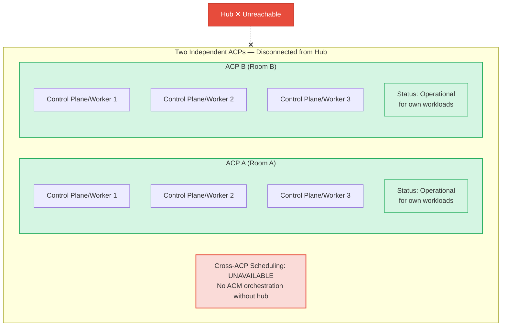
```mermaid
graph TB
    subgraph twoCluster["Two Independent ACPs — Disconnected from Hub"]
        subgraph clA2["ACP A (Room A)"]
            TA1["Control Plane/Worker 1"]
            TA2["Control Plane/Worker 2"]
            TA3["Control Plane/Worker 3"]
            STATA["Status: Operational<br/>for own workloads"]
        end
        subgraph clB2["ACP B (Room B)"]
            TB1["Control Plane/Worker 1"]
            TB2["Control Plane/Worker 2"]
            TB3["Control Plane/Worker 3"]
            STATB["Status: Operational<br/>for own workloads"]
        end
        CROSS["Cross-ACP Scheduling: UNAVAILABLE<br/>No ACM orchestration without hub"]
    end

    HUB2["Hub ✕ Unreachable"]

    HUB2 -.-x twoCluster

    style clA2 fill:#d5f5e3,stroke:#27ae60,stroke-width:2px
    style clB2 fill:#d5f5e3,stroke:#27ae60,stroke-width:2px
    style HUB2 fill:#e74c3c,stroke:#c0392b,color:#fff
    style CROSS fill:#fadbd8,stroke:#e74c3c,stroke-width:2px
    style STATA fill:#d5f5e3,stroke:#27ae60
    style STATB fill:#d5f5e3,stroke:#27ae60
```

#### Disconnection Summary

| Capability | Stretched ACP | Two Independent ACPs |
|---|---|---|
| **Individual node failure recovery** | Automatic | Automatic (within each ACP) |
| **Room failure recovery** | Automatic (if quorum maintained) | Requires hub for cross-ACP failover |
| **Cross-ACP workload scheduling** | N/A (single ACP) | Unavailable without hub |
| **Service discovery between rooms** | Native SDN (always works) | Submariner: cached/stale without hub |
| **Manual failover possible** | N/A | Yes, but requires direct ACP access |

---

### Failure Domains and Blast Radius
The two approaches have fundamentally different failure domain models. Understanding these domains is critical for assessing the risk profile of each approach.

#### Stretched ACP Failure Domains

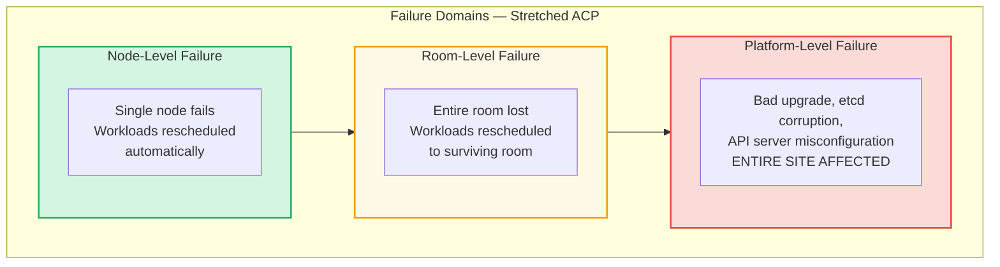
```mermaid
graph TB
    subgraph domains["Failure Domains — Stretched ACP"]
        subgraph node["Node-Level Failure"]
            NF["Single node fails<br/>Workloads rescheduled<br/>automatically"]
        end
        subgraph room["Room-Level Failure"]
            RF["Entire room lost<br/>Workloads rescheduled<br/>to surviving room"]
        end
        subgraph cluster["Platform-Level Failure"]
            CF["Bad upgrade, etcd corruption,<br/>API server misconfiguration<br/>ENTIRE SITE AFFECTED"]
        end
    end

    node --> room --> cluster

    style node fill:#d5f5e3,stroke:#27ae60,stroke-width:2px
    style room fill:#fef9e7,stroke:#f39c12,stroke-width:2px
    style cluster fill:#fadbd8,stroke:#e74c3c,stroke-width:2px
```

The stretched ACP handles node and room-level failures well, but a **platform-level failure** (bad upgrade, operator bug, etcd corruption, certificate expiration) impacts all workloads across both rooms simultaneously. The platform has built-in protections (rolling upgrades with `maxUnavailable: 1`, Machine Config Operator canary rollouts), but these operate within the single ACP — they limit the speed of propagation, not the blast radius.

#### Two Independent ACPs Failure Domains

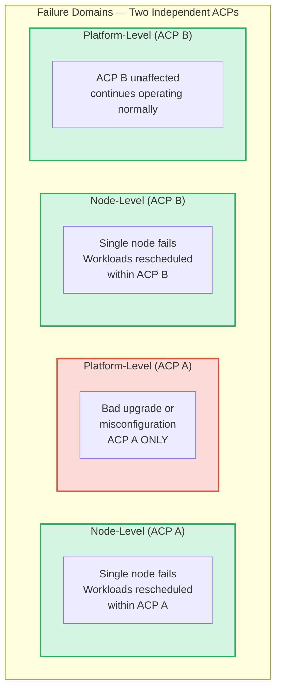
```mermaid
graph TB
    subgraph domains["Failure Domains — Two Independent ACPs"]
        subgraph nodeA["Node-Level (ACP A)"]
            NFA["Single node fails<br/>Workloads rescheduled<br/>within ACP A"]
        end
        subgraph clusterA["Platform-Level (ACP A)"]
            CFA["Bad upgrade or<br/>misconfiguration<br/>ACP A ONLY"]
        end
        subgraph nodeB["Node-Level (ACP B)"]
            NFB["Single node fails<br/>Workloads rescheduled<br/>within ACP B"]
        end
        subgraph clusterB["Platform-Level (ACP B)"]
            CFB["ACP B unaffected<br/>continues operating normally"]
        end
    end

    style nodeA fill:#d5f5e3,stroke:#27ae60,stroke-width:2px
    style clusterA fill:#fadbd8,stroke:#e74c3c,stroke-width:2px
    style nodeB fill:#d5f5e3,stroke:#27ae60,stroke-width:2px
    style clusterB fill:#d5f5e3,stroke:#27ae60,stroke-width:2px
```

With two independent ACPs, a platform-level failure on ACP A has **zero impact on ACP B**. This is the strongest argument for the two-ACP model: full blast radius isolation for platform-level failures, upgrades, and operational errors.

This enables a **canary upgrade pattern** across the site:

```mermaid
flowchart LR
    U1["Upgrade ACP A<br/>(canary)"]
    V1["Validate ACP A<br/>(workloads healthy?)"]
    D{"Healthy?"}
    U2["Upgrade ACP B"]
    RB["Roll Back ACP A<br/>ACP B unaffected"]

    U1 --> V1 --> D
    D -- "Yes" --> U2
    D -- "No" --> RB

    style U1 fill:#fef9e7,stroke:#f39c12
    style V1 fill:#fef9e7,stroke:#f39c12
    style D fill:#fef9e7,stroke:#f39c12,stroke-width:2px
    style U2 fill:#d5f5e3,stroke:#27ae60
    style RB fill:#fadbd8,stroke:#e74c3c
```

---

### Workload Recovery Comparison

| Failure Scenario | Stretched ACP | Two Independent ACPs |
|---|---|---|
| **Single node failure** | Automatic rescheduling to other nodes in the ACP | Automatic rescheduling within the affected ACP |
| **Room failure (physical)** | Automatic rescheduling to surviving room (quorum required) | Surviving ACP unaffected; failed ACP's workloads require ACM-driven failover (hub required) |
| **Bad upgrade** | Affects entire site — both rooms impacted | Affects only the upgraded ACP; other ACP continues unaffected |
| **etcd corruption** | Site-wide impact — platform unavailable until recovered | Only the affected ACP is down; other ACP operates normally |
| **Operator misconfiguration** | Propagates across entire ACP (both rooms) | Isolated to the ACP where the change was made |
| **Container recovery** | Pods rescheduled by scheduler | Within ACP: same; cross-ACP: requires ACM on hub |
| **VM recovery** | VMs restarted on surviving nodes by OpenShift Virtualization | Within ACP: same; cross-ACP: requires ACM on hub + storage replication |
| **Cross-ACP VM migration (planned)** | N/A — single ACP uses node drain/live-migrate natively | Supported via MTV (cold) or cross-ACP live migration (Tech Preview); requires hub + shared/replicated storage |
| **Hub disconnection** | No impact on recovery capabilities | No cross-ACP failover or VM migration; each ACP operates independently |

---

### Approach Comparison

| Aspect | Stretched ACP | Two Independent ACPs |
|---|---|---|
| **Number of control planes** | 1 | 2 |
| **Room failure recovery** | Automatic (platform-native) | Requires ACM on hub |
| **Change isolation** | None — single ACP | Full — independent lifecycles |
| **Upgrade strategy** | Single rolling upgrade | Canary: upgrade one, validate, then upgrade other |
| **SDN** | Unified — native cross-room pod communication | Isolated — requires Submariner for cross-ACP networking |
| **Storage** | Single pool (stretch) or per-room | Isolated pools — replication required for failover |
| **Hub dependency** | None for scheduling/recovery | Required for cross-ACP scheduling and failover |
| **Disconnected behavior** | Fully operational | Each ACP operational individually; no cross-ACP orchestration |
| **Hardware overhead** | Lower (1 control plane) | Higher (2 control planes) |
| **Operational complexity** | Lower (1 ACP) | Higher (2 ACPs + ACM + Submariner) |
| **Blast radius (platform failure)** | Both rooms | One room only |
| **Blast radius (physical failure)** | One room (recoverable) | One room (recoverable if hub available) |
| **Cross-ACP VM migration** | N/A — node drain + live-migrate within ACP | Supported: cold (MTV), live (Tech Preview OCP 4.20+/ACM 2.15+) |
| **Storage for cross-ACP failover** | Single pool (ODF stretch or per-room) | External shared storage, ODF Metro-DR/Regional-DR, or per-ACP local (stateless only) |
| **Inter-room latency requirement** | Strict: <10ms RTT for etcd | None for individual ACPs; only needed for Submariner tunnels and Metro-DR replication |
| **Supportability** | Stretched ACP guidance applies ([source](https://access.redhat.com/articles/3220991)) | Standard individual ACP deployments |
| **Best suited for** | Sites prioritizing automatic recovery and operational simplicity | Sites prioritizing change isolation, independent lifecycles, and blast radius control |

---

## Resulting Context
By evaluating these two approaches against the site's operational priorities, organizations can make an informed decision:

- **Sites that prioritize automatic workload recovery and operational simplicity** should lean toward a stretched ACP. The single control plane handles all scheduling and rescheduling natively, with no external dependencies. This is the simpler model to operate, especially for organizations that are standardizing on a single platform pattern across many sites.

- **Sites that prioritize change isolation, independent upgrade lifecycles, and blast radius control** should lean toward two independent ACPs. This model provides full isolation between rooms at the platform level, enabling canary upgrades and protecting against platform-level failures. However, it requires ACM on a hub, introduces cross-ACP networking complexity, and creates a dependency on hub connectivity for failover orchestration.

The choice also depends on the site's connectivity profile:
- **Well-connected sites** with reliable hub access can leverage the two-ACP model effectively, as ACM-driven failover is available when needed.
- **Frequently disconnected sites** or sites where the hub may be unreachable during a room-level failure should strongly favor the stretched ACP model to avoid losing cross-ACP orchestration when it's needed most.

## Examples

### Example 1: Manufacturing Site with High Availability Priority
A manufacturing site runs MES and SCADA workloads across two data rooms. The site's primary concern is that workloads continue running during any single room failure, with minimal operator intervention. The site has reliable network connectivity between rooms and a hub at a central location.

**Recommendation:** Stretched ACP. The automatic workload rescheduling ensures that a room failure is handled by the platform without waiting for ACM or operator intervention. The manufacturing workloads require continuous availability that cannot depend on hub connectivity.

### Example 2: Regulated Site Requiring Independent Change Control
A regulated edge site must demonstrate that changes can be validated in a controlled manner before full deployment. Auditors require evidence that a platform change was tested on a subset of the environment before broad rollout.

**Recommendation:** Two independent ACPs. The canary upgrade pattern (upgrade ACP A, validate, then upgrade ACP B) provides the evidence trail and isolation required by regulatory frameworks. Each ACP's independent lifecycle supports the site's change control requirements.

### Example 3: Semi-Connected Site with Intermittent Hub Access
An edge site has intermittent WAN connectivity to the hub. The site must continue operating, including recovering from room-level failures, during periods of disconnection.

**Recommendation:** Stretched ACP. The site cannot depend on hub connectivity for failover orchestration. A stretched ACP provides room-level workload recovery without any external dependency, ensuring resilience even during WAN outages.

### Example 4: Multi-Tenant Site with Workload Isolation
An edge site hosts workloads from multiple business units or tenants who require platform-level isolation. A failure or change impacting one tenant's platform must not affect another.

**Recommendation:** Two independent ACPs. Each ACP can be assigned to a tenant or business unit, providing full isolation for workloads, configuration, and lifecycle management. The overhead of two control planes is justified by the isolation requirement.

### Example 5: Planned ACP Maintenance with VM Migration
An edge site runs two independent ACPs, each hosting virtual machines running production workloads. ACP A requires a platform upgrade and hardware firmware updates that will require node reboots. The site needs to maintain VM availability throughout the maintenance window.

**Recommendation:** Two independent ACPs with cross-ACP VM migration. Before maintenance begins, VMs on ACP A are migrated to ACP B using the Migration Toolkit for Virtualization (cold migration, supported) or cross-ACP live migration (if available and approved for use in the environment). Once ACP A is drained, the upgrade and firmware updates are performed without workload impact. After maintenance, VMs are migrated back.

This use case requires:
- Hub reachable for migration orchestration
- ACP B has sufficient compute capacity to temporarily host ACP A's VMs
- External shared storage accessible from both ACPs (simplest), or ODF Metro-DR replicating VM disk data between ACPs
- If using cold migration, a planned maintenance window aligned to acceptable VM downtime during the migration itself

> **Note:** In a stretched ACP, this use case is handled differently — nodes in one room can be cordoned and drained individually, with the platform's built-in scheduler redistributing workloads to the other room's nodes. No cross-ACP migration tooling is needed, but the maintenance must be performed node-by-node rather than draining an entire room at once.

## Rationale
The rationale for this pattern is to clearly articulate the trade-off between **automatic recovery** (stretched ACP) and **change isolation** (two independent ACPs) for dual-room edge deployments. This is one of the most consequential architectural decisions for a site, as it determines:
- Whether workload recovery during a room failure is automatic or orchestrated
- Whether a bad platform change can affect the entire site or only half of it
- Whether the site can operate fully autonomously or depends on hub connectivity for critical failover scenarios

Both approaches are valid, and the right choice depends on the site's operational priorities, connectivity profile, and regulatory requirements. By documenting the trade-offs, dependencies, and failure modes of each approach, this pattern enables organizations to make that decision with full visibility into the consequences.

The stretched ACP is the simpler model with fewer moving parts and stronger autonomous behavior. The two-ACP model provides stronger isolation and independent lifecycle management at the cost of orchestration complexity and hub dependency. Neither is universally superior — the pattern exists to help match the architecture to the site's needs.

## Further Reading
### Related Patterns
- [Control Plane Sizing for ACPs](../acp-control-plane-sizing/README.md) — details on 3-node vs. 5-node control plane configurations for stretched ACPs
- [ACP Standardized Architecture - Highly Available](../acp-standardized-architecture-ha/README.md)
- [ACP Standard Services](../rh-acp-standard-services/README.md)
- [Hub Standard Services](../rh-hub-standard-services/README.md)

### External References
- [Red Hat Guidance for Deployments Spanning Multiple Sites](https://access.redhat.com/articles/3220991)
- [OpenShift Data Foundation — Stretch Cluster Disaster Recovery](https://docs.redhat.com/en/documentation/red_hat_openshift_data_foundation/4.13/html/configuring_openshift_data_foundation_disaster_recovery_for_openshift_workloads/introduction-to-stretch-cluster-disaster-recovery_stretch-cluster)
- [RHACM Business Continuity](https://docs.redhat.com/en/documentation/red_hat_advanced_cluster_management_for_kubernetes/2.13/html-single/business_continuity/index)
- [RHACM Networking — Submariner](https://access.redhat.com/documentation/en-us/red_hat_advanced_cluster_management_for_kubernetes/2.9/html/networking/networking)
- [Open Cluster Management — Placement API](https://open-cluster-management.io/docs/concepts/content-placement/placement/)
- [Open Cluster Management — ManifestWork API](https://open-cluster-management.io/docs/concepts/work-distribution/manifestwork/)
- [Open Cluster Management — ManifestWorkReplicaSet](https://open-cluster-management.io/docs/concepts/work-distribution/manifestworkreplicaset/)
- [Submariner Project — Getting Started](https://submariner.io/getting-started/)
- [RHACM 2.15 — Virtualization and Cross-ACP VM Migration](https://docs.redhat.com/en/documentation/red_hat_advanced_cluster_management_for_kubernetes/2.15/html-single/virtualization/index)
- [Migration Toolkit for Virtualization — Planning Your Migration](https://docs.redhat.com/en/documentation/migration_toolkit_for_virtualization/2.10/pdf/planning_your_migration_to_red_hat_openshift_virtualization/index)
- [OpenShift Container Platform 4.21 — Live Migration](https://docs.redhat.com/en/documentation/openshift_container_platform/4.21/html/virtualization/live-migration)
- [OpenShift — Recommended etcd Practices](https://docs.openshift.com/container-platform/4.13/scalability_and_performance/recommended-performance-scale-practices/recommended-etcd-practices.html)
- [etcd FAQ — Cluster Sizing and Quorum](https://etcd.io/docs/v3.4/faq/)

## Footnotes

### Version
1.0.0

### Authors
- Josh Swanson (jswanson@redhat.com)
