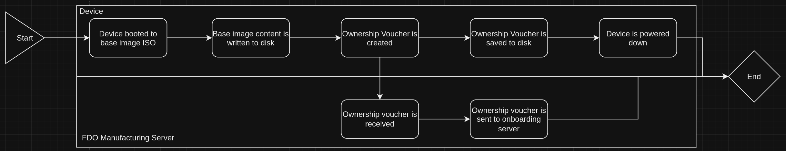

# Embedding Red Hat Device Edge at Device Manufacturing
This pattern dives into recommendations for embedding Red Hat Device Edge on devices as they are manufactured.

## Table of Contents
* [Abstract](#abstract)
* [Problem](#problem)
* [Context](#context)
* [Forces](#forces)
* [Solution](#solution)
* [Resulting Content](#resulting-context)
* [Examples](#examples)
* [Rationale](#rationale)

## Abstract
| Key | Value |
| --- | --- |
| **Platform(s)** | TBD |
| **Scope** | TBD |
| **Tooling** | TBD |
| **Pre-requisite Blocks** | TBD |
| **Example Application** | TBD |

## Problem
**Problem Statement:** Small form-factor devices, espically those headed to industrial sites, are routinely shipped with unsupported operating systems and without workloads, resulting in a heavy burden for secure onboarding and installation being placed on system integrators or end customers.

**Resolution:** By standardizing on a specific operating system with post-installation capabilities and embedding it at manufacturing time, the following can be achieved:
1. A consistent platform of hardware, drivers, and software being shipped to all end consumers
2. A strong story around secure onboarding and protected access to content
3. Vendor backing of everything: board to workload, allowing for full support of the stack
4. Guarantee of ongoing bugfixes, security updates, and enhancements

## Context
This pattern represents a standard deployment process for embedding RHDE on specific hardware as it's manufactured, including the hooks needed to securely onboard the device at the final deployment location. The objective is to send devices out with just enough content to perform a secure and automated onboarding and provisioning process, but without any restricted/licensed/controlled content until they've been attested to at their final destination.

This pattern will use an example application, however this is customizable based on deployment specifics.

In addition, this pattern has a few assumptions:
1. The hardware is, for the most part, identical, or close enough to not requiring customization of the base image for different revisions. If customizations are required, multiple images can be built.
2. The device manufacturer will be responsible for the FDO infrastructure, including the manufacturing server, rendezvous server, and onboarding server.
3. Red Hat will ship and support a compliant FDO client in the package set for RHDE.
4. The devices will have connectivity to the FDO rendezvous server. This does not mean internet connectivity, but could, depending on the architecture.
5. The hardware must have a TPM for FDO to work.
6. Validation of RHDE on the target hardware has been done, and is known to work.

## Forces
1. **Ease of Use:** To increase the adoption of devices by system integrators and end consumers, devices should be easily onboarded and automatically made productive upon deployment.
2. **Consistency:** To drive a more consistent deployment across customers, a common process and set of functionality is used to ensure every device is identical. 
3. **Scalability:** This process scales to millions of devices, without requiring additional supporting infrastructure or manual intervention when deploying devices in bulk.
4. **Increased Adoption:** As devices are more easily deployed and onboarded, customers and system integrators gain confidence in process and devices, and more readily purchase and deploy new systems as new use cases or workloads are identified.

## Solution
This solution's various steps have been broken up into phases to better group them according to the involved parties at each part.

For reverence, this visualization of FDO can be used:


### Phase 1 - Setup and Preparation
#### Step 1 - Creating FDO Infrastructure
In this step, the necessary FDO infrastructure is created and exposed for consumption. As the device manufacturer, the following components are required:
- **Manufacturing server:** Located at the manufacturer's premises, the Manufacturing server signs the device, creates a voucher to set the device ownership, and binds it to a specific platform or cloud.
- **Rendezvous server:** This server is located at the owner's premises or the platform where the device management system will be used (such as a public cloud). It receives the voucher generated by the Manufacturing server during the first device boot. The server then matches the device UUID with a target platform or cloud and provides information to the device about which Owner server endpoint it should use.
- **Owner or onboarding server:** This is located at the owner's premises or the platform where the device will be deployed. After device authentication, a secure channel is created between the device and this server that is used to send the required pieces (such as files and scripts) for the onboarding automation to the device.

These components should be deployed and maintained according to production-grade best practices.

#### Step 2 - Creating Base Image ISO
Using [bootc-image-builder](https://access.redhat.com/documentation/en-us/red_hat_enterprise_linux/9/html/using_image_mode_for_rhel_to_build_deploy_and_manage_operating_systems/creating-bootc-compatible-base-disk-images-with-bootc-image-builder_using-image-mode-for-rhel-to-build-deploy-and-manage-operating-systems#creating-iso-images-by-using-bootc-image-builder_creating-bootc-compatible-base-disk-images-with-bootc-image-builder), a specification of the content and customizations can be defined be fed in via a toml configuration file:
```toml
[customizations]
installation_device = "/dev/sda" # Customize to correct installation storage device
[customizations.fdo]
manufacturing_server_url = "https://manufacturing.fdo.company-name.com" # Customize to correct URL
```

Once configured, an installable ISO can be generated:
```bash
sudo podman run \
    --rm \
    -it \
    --privileged \
    --pull=newer \
    --security-opt label=type:unconfined_t \
    -v $(pwd)/config.toml:/config.toml \
    -v $(pwd)/output:/output \
    registry.redhat.io/rhel9/bootc-image-builder:latest \
    --type iso \
    --config config.toml \
  image-registry.company-name.com/device-images/iot-device:1.0.0 # Customize accordingly
```

An iso will be created that can be used to install devices.

### Step 3 - Preparing Workloads to be Deployed
In preparation for devices to start pulling content and workloads after onboarding, it's required to make these workloads available.

It's recommended to have credentials safely delivered to the devices after they've been onboarded, using FDO as the secure mechanism. These credentials could, for example, provide access to:
1. Updated OS images/updates
2. Containerized workload images
3. Configurations required to deploy workloads

As part of this preparation, container images for the example workload have been loaded into an image registry that requires authentication, and a [quadlet](https://www.redhat.com/sysadmin/quadlet-podman) configuration file has been deployed to a web server.


### Phase 2 - Manufacture Devices
#### Step 1 - Applying Image to Devices


As devices are manufactured, one of the last steps to be completed is applying the base image to disk. This step accomplishes a few key goals:
1. Application of base image to devices
2. Creation of ownership vouchers
3. Forwarding of ownership vouchers to onboarding server

Once complete, the devices are prepared to be shipped to their destination and securely onboarded. In addition, the devices can be stored for long periods of time, without issue, however pulling updates once onboarded at their destination is recommended.

### Phase 3 - Setup for Secure Onboarding
#### Step 1 - Gathering Desired State for Devices
With the devices ready to be deployed, their desired state after onboarding can be identified.

For this example, the devices will be deployed with three applications: an smart building management application, a process control application, and an IoT data relay to report in data from these applications.

These three applications will be deployed onto a single device, converting it into a multi-purpose device:


Responsibility for pulling and starting applications will be offloaded to Podman, which will be instructed via quadlet files:


After onboarding, the device will download these configuration files, load them, then begin pulling and starting the applications.

#### Step 2 - Contextualizing Vouchers with Desired State


1. Contextualize vouchers with workloads

### Phase 4 - Deploy Devices
1. Ensure connectivity to rendezvous server
2. Connect devices
3. Onboard devices

