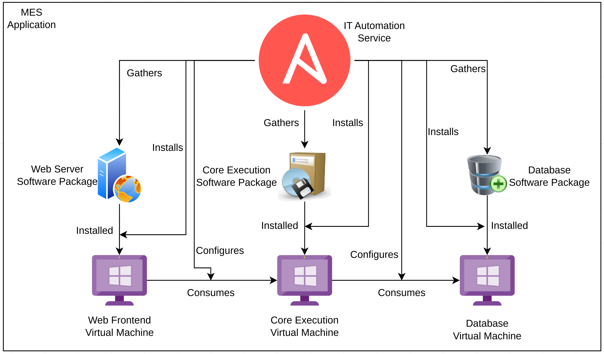

# Preparing to Run Existing Workloads on an ACP
This pattern prepares an ACP for running existing workloads found on current-generation platforms at industrial locations.

As ACPs are next-generation platforms, their functionality and provided services are capable of running modern workloads, however full functionality for existing workloads is provided via the ACP's core services.

## Table of Contents
* [Abstract](#abstract)
* [Problem](#problem)
* [Context](#context)
* [Forces](#forces)
* [Solution](#solution)
* [Resulting Content](#resulting-context)
* [Examples](#examples)
* [Rationale](#rationale)

## Abstract
| Key | Value |
| --- | --- |
| **Platform(s)** | TBD |
| **Scope** | TBD |
| **Tooling** | TBD |
| **Pre-requisite Blocks** | TBD |
| **Example Application** | TBD |

## Problem
**Problem Statement:** While next generation workloads are being introducted by vendors in the industrial control space, organizations will not adopt them immediately, instead running their existing set of workloads on top of the appropriate platform to support business operations.

To support ongoing operations powered by existing workloads, as well as provide full support for next-generation workloads all on a single platform, ACPs must provide consumable services to support existing workloads, and allow for topologies and configurations that mimic existing platforms.

## Context
An ACP provides a consistent, unified platform for next generation containerized workloads, as well as existing workloads that rely heavily on existing platform functionality, such as virtualizaiton.

To support ongoing business operations, an ACP can be configured to mirror the functionality of existing platforms to support existing workloads, while keeping the forward focus for next generation workloads.

This use case can be considered "table-stakes", as existing mission-critical workloads must continue to function identically as they do currently on a new platform, as they do currently on an existing platform. This allows for a simplified migration story, and allows for modernization over time.

This pattern will highlight how various services of an ACP are consumed to provide a like for like experience for these workloads.

The following services will be highlighted:
| Service | Description | Usage in this Pattern |
| --- | --- | --- |
| Virtualization | Provides virtual machines and lifecycle functionality across different guest operating systems | Provides compute blocks, in the form of virtual machines, for running existing applications |
| Network Configuration | Configures and manages network connectivity of the platform | Replicates existing network connectivity patterns on existing platforms to an ACP |
| Storage | Provides consumable storage in multiple formats and topologies | Provides storage for running existing workloads, supporting their persistent data needs |
| IT Automation | Provides a task-orentated idempotent automation framework for managing application lifecycles | Automates and orchestrates existing workload lifecycle operations, such as installation and upgrading |
| Declarative State Configuration Service | Provides a simplified interface to describe infrastructure requirements with constant enforcement | Allows for simple description of the required infrastructure, which is then deployed and enforced on the ACP |

## Forces
1. **Mirroring Existing Functionality:** This pattern provides identical functionality with existing platforms for virtual workloads, allowing for identical functionality when running on an ACP.
2. **ACP Value-Add:** This pattern calls out the functionality provided by an ACP that is above and beyond what an existing platform provides, specific to running existing workloads.
3. **Hyperconverged Approach:** Mirroring existing platforms, an ACP should consume a small number of systems and present unified, consumable pools of storage and compute to support workloads.
4. **Limited Supporting Resources:** An ACP should not require much/any intervention from non-techical on-site resources, instead handling as many functions as possible autonomously.

## Solution
The solution is to both deploy an ACP according to the published standard architectures and consume the offered services to achieve the desired result.

To highlight the function of each service in this solution, an existing software stack will be used as an example: an MES stack, which uses 3 Windows-based systems: a database, a core execution system, and a web frontend system.

Today, this application lives on a virtualization platform that is also hosting other virtualized application:

If this virtualization platform is hyperconverged, then the underlying hardware is often abstracted into consumable pools and presented for consumption by hosted virtualized workloads by platform services:

Often, connectivity for the virtual machines follows a "directly connected" model, where physical connections of the underlying hardware, and virtual connections from the virtual machines to the platform are combined to create logical connections between the virtual machines and the networking stack. This allows the virtual machines and their applications to appear directly connected to the network, even if multiple virtual machines on the platform are sharing a single physical link:

An ACP can provide the same functionality, and provide more services that improve operational efficiency, streamline lifecycle management, and run applications that are containerized as opposed to just virtualized applications.

### Declarative State Management Service
The declarative state management service takes definitions for resources provided by the platform, and enforces those definitions against the platform.

This service can configure and manage any resource on the platform, however for this use case, it's used to drive the deployment and management of the required infrastructure components, mainly, virtual machines.

In this example, the declarative state mangement service consumes the resources provided by the virtualization service to deploy virtual machines. In addition, the service tracks the created resources, and reconciles against the intended state if resources are changed. Should a change be detected, the virtualization service is once again consumed to reconcile the resource.

**Pros:**
- Constant enforcement of resource definitions, preventing drift
- Automatic tracking of resources and supporting elements created by the platform
- Visualizes the state of the deployed resources
- Changes are made through code, allowing for auditing and safety checks

**Cons:**
- Requires building/obtaining definitions for resources, such as virtual machines
- Definitions must be stored in a repository the service can access

### Virtualization Service
The virtualization service provides resources and functionality for running virtual machines. Most commonly, this service handles the configuration and lifecycle of virtual machines, and also provides full functionality for templating, snapshotting, cloning, and other common functions.

The resources provided by this service can be consumed directly, however, it's recommended to leverage the declarative state management service, which then consumes the virtualization service, for an enterprise-grade deployment and lifecycle management workflow.

For this example of running an virtualized MES, the virtualization service is responsible for deploying the virtual machines from a template.

**Pros:**
- Provides a consistent interface to manage virtual machines at scale
- Automatically manages supporting resources necessary for virtual machines
- Provides for fine-grained control around each virtual machine
- Provides full templating and deployment from template functionality

**Cons:**
- Virtual machine templates must be set up for some operating systems before being able to run deployments 
- Provided templates may need customization to meet enterprise requirements

### Network Configuration Service
The network configuration service manages the configuration of physical and logical network connections of the underlying hardware supporting the platform. It automatically applies the desired configuration to interfaces, and if necessary, rolls back incorrect configurations if they fail to apply.

This service is leveraged to provide connectivity to virtual machines that mirrors the connectivity of existing virtualization platforms, by both performing the necessary configuration of the phyiscal interfaces, but also creating the logical connections within the ACP the virtual machines will be attached to.

By default, an ACP provides an software-defined network that resources leverage to communicate. In this use case, that SDN is bypassed, which sacrifices some of the native SDN functionality in favor of a more traditional connectivity model for the virtual machines.

**Pros:**
- Provides a like-for-like connectivity experience for virtualized workloads
- Allows for industrial procotols to be handled by applications within virtual machines
- Configuration is automatically applied and enforced

**Cons:**
- Requires some understanding of networking concepts
- Offloads some network functionality, such as isolation, to the networking stack from the platform's SDN

### Storage Service
The storage service abstracts physical storage devices into consumable pool(s) that workloads on the ACP can leverage for persistent data needs. The service is capable of discovering and automatically managing physical devices, handles replication and failover, and presents these capabilities in a consumable, performant way.

For this workload, the storage service is expected to present consumable blocks of storage to be used for virtual machine's boot and data disks, and to provide access across the platform. Should a virtual machine be live-migrated or rescheduled to another node, the storage service handles access to the data, backed by the underlying physical disks.

For the example use case of an MES installed on virtual machines, each virtual machine requires at least one virtual hard drive for the operating system, with some requiring more. The storage service provides capacity and functionality for those virtual hard drives.

**Pros:**
- Provides consistent storage across platform architectures
- Provides uniform access to data across nodes in highly-available deployments
- Storage can be consumed by many types of workloads, including containerized and virtualized

**Cons:**
- Converged storage requires highly-available architectures and compute/memory capacity to run
- Dynamic storage for non-highly available architectures require configuration for data redundancy

### IT Automation Service
The IT automation service provides functionality for managing and configuring systems both hosted on an ACP and outside of the platform, using an easy to understand programming format. The service provides functionality for consuming automation from code repos, various connection methods, and abstraction of target-specific commands or interfaces.

The objective of the service for this use case is to automate away lifecycle management tasks related to running virtual machines, such as operating system updates and configuration, as well as application lifecycle management tasks, such as installation, tuning, and upgrades.

An ACP's other core services handle the management of the infrastructure that supports the example MES workload, but don't directly manage the operating system within the virtual machine, or the application itself. This is where the IT automation service is leveraged: to round out functionality by complimenting the other ACP services, and provide a robust set of capabilities for full end-to-end management of workloads running on the platform.

During the initial install of the MES onto virtual machines provided by the platform, the IT automation service handles gathering up the required software packages, installing those software packages, and configuring the application components to communicate with each other.

## Resulting Context
The resulting context from this pattern is to run existing virtualized workloads on an ACP, providing a like for like experience from the workload's perspective. This provides a viable alternative to existing platforms, and allows for migration of existing applications onto a more modern, capable platform.

In addition, this pattern's solution leverages the additional functionality of an ACP over existing platforms, allowing for constant desired state reconciliation, and for completely automated installion and ongoing management workflows. These cababilities are provided by an ACP's core set of services, meaning they're pre-configured and ready for consumption.

By consuming these services, a more complete and robust operational state is achieved, simplifying lifecycle management, application updates/upgrades, leading to lower management overhead and soft costs.

## Examples
The solution section of this pattern covers running an existing MES deployment on top of an ACP, along with desciptions and utilization of the involved core services provided by the platform.

A second use can also be considered: running a fully containerized workload on the same platform as an existing workload that's deployed to virtual machines, such as the MES discussed here.

In this example, the deployment of the MES is kept on virtual machines, and deployed to an ACP. In addition, another application, a distributed control system, has been completely modernized, leveraging a microservice architecture, and is also deployed to the same ACP.

Despite different application architectures, and leveraging different functionality and services, the workloads are consolidated onto a single platform, highlighting an ACP's capabilities to run both existing and new workloads without requiring more overhead.

In this example, the MES is consuming data, via the API endpoints of the DCS, allowing data to be gathered, transformed, and displayed in the MES. This enables higher level business functions to have greater visibility into the processes running at the edge site.

In addition, the control plane functions and core services of the ACP are also run on the platform, alongside the other two workloads, enabling these workloads, as well as providing key functionality for their deployment and operation.

This example showcases the benefits to businesses in adopting a modern approach to edge computing: adopting a platform, such as an ACP, provides a suite of services and capabilities beyond what current platforms allow, while still having full support for existing workloads, which can be migrated to the platform.

## Rationale
The rationale behind this pattern is two-fold:
1. Provide full functionality for existing workloads to run on a modern platform
2. Lower the overall costs and challenges associated with running compute at edge locations

### 1. Provide full functionality for existing workloads to run on a modern platform
This expectation can be considered a baseline requirement for platforms running at edge locations. It is expected, to support ongoing business operations, that platforms be able to accommodate existing workloads, without requiring changes to the deployed application.

Since applications deployed at the edge are typically mission-critical, their availability and uptime is paramount to business success.

### 2. Lower the overall costs and challenges associated with running compute at edge locations
Two threads emerge from this rationale point: leveraging services and tooling to improve operations, and providing next-generation functionality alongside support for current workloads.

1. By leveraging the core services of an ACP, manual intervention in steps such as application installation and upgrades can be reduced or eliminated, increasing consistency and speed. In addition, constant enforcement of the desired state prevents drift and outages, without requiring manual intervention, further reducing management overhead and costs. Consuming these services, provided by an ACP, enable better outcomes for the business.
2. As next generation workloads are introduced by vendors, it will be necessary to have next generation platform functionality to support them. An ACP already provides support for many next generation workloads today, and gains functionality through in-place upgrades, which the platform itself manages. This strategy reduces risk associated with adopting new applications, and limits risks associated with platform lifecycle maintenance tasks.

## Footnotes

### Version
1.0.0

### Authors
- Josh Swanson (jswanson@redhat.com)