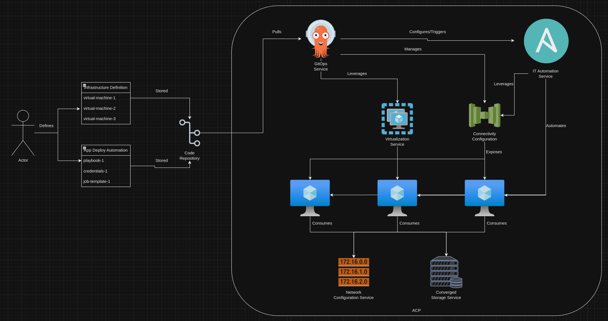
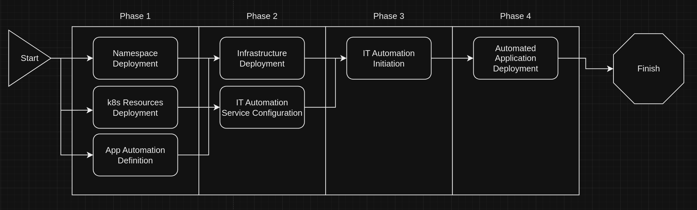

# Using GitOps to Setup Infrastructure and Install Applications on Virtual Machines
This pattern gives a technical look at how the gitops service of an ACP can be used to both provision required infrastructure and configure the automation service to install applications.

## Table of Contents
* [Abstract](#abstract)
* [Problem](#problem)
* [Context](#context)
* [Forces](#forces)
* [Solution](#solution)
* [Resulting Content](#resulting-context)
* [Examples](#examples)
* [Rationale](#rationale)

## Abstract
| Key | Value |
| --- | --- |
| **Platform(s)** | Red Hat OpenShift |
| **Scope** | Virtualization |
| **Tooling** | <ul><li>Red Hat OpenShift GitOps</li></ul> |
| **Pre-requisite Blocks** | <ul><li>[TODO](../../blocks/todo)</li></ul> |
| **Pre-requisite Patterns** | <ul><li>[ACP Standard Architecture](../acp-standardized-architecture-ha/README.md)</li><li>[ACP Standard Services](../rh-acp-standard-services/README.md)</li><li>[Virtualization on ACPs](../virtualization-on-acp/README.md)</ul> |
| **Example Application** | N/A |

## Problem
**Problem Statement:** Often, virtual machines require applications to be deployed after they've been provisioned, as they're usually deployed from clean or empty templates of just operating system images. This flow may involve multiple tools, when a single tool or single flow is optimal for easy of use.

## Context
This pattern can be applied to ACPs where deployment of an application involves both the need to provision and manage virtual machines, as well as run some post-deployment automation to handle application installation. It uses a single service to drive consumption of other ACP services to accomplish the full flow.

A few key assumptions are made:
- The intended context of the platform aligns to the [Standard HA ACP Architecture](../acp-standardized-architecture-ha/README.md)
- The standard set of [ACP Services](../rh-acp-standard-services/README.md) are available for consumption.
- Physical connections, such as power and networking, have been made to the target hardware
- The upstream network configuration is completed and verified
- The application's required operating systems as available as [templates](../windows-templates-acp-virtualization/README.md) within the ACP's virtualization service.
- The application deployment has been automated and is ready for deployment by the ACP's [IT automation](../rh-acp-standard-services/README.md) service.

## Forces
- **Single Service Entrypoint:** This pattern outlines how a single service on an ACP can drive others to accomplish a complex flow without needing to manually interface with other services, instead opting to drive consumption under one umbrella.
- **Modularity:** This pattern's solution can be consumed as a single large flow, or optionally, broken apart, where the individual components are leveraged when needed.
- **Broad Applicability:** This pattern's solution works across different virtual machine operating systems and across applications, as operating system specific and application specific elements are handled transparently by the gitops and it automation services.
- **Reusability:** This pattern's solution can be replicated for many different applications, simply changing out definitions or pointers to automation code bases.
- **Transparency:** By loading both definitions of infrastructure and automation configuration into platform-native assets, all components and steps related to the full deployment process are visible within the deployment location and context.

## Solution
The solution is to leverage the gitops service of an ACP to drive both the deployment of the required infrastructure to support an application, and also configure the IT automation service to connect to and deploy the application via automation.

In this flow, the infrastructure components, such as virtual machines, k8s services, routes, config maps, etc, are directly deployed by the gitops service, in the same way they would be for fully containerized services. In addition, the configuration of the IT automation service is also initiated by the gitops service, according to the defined automation definition. Then, after the appropriate infrastructure is in place, the IT automation service is initiated, according to the new configuration, to deploy the application to the appropriate infrastructure.

### Deployment Flow
The execution of this process can be broken down into four main logical phases, representing when resources are deployed or services configured.

#### Phase 1
In phase 1, the base constructs are deployed, such as namespaces, supporting kubernetes resources such as services, secrets, etc. In addition, the confguration for the IT automation service is configured as a k8s resource. This provides visibility into the full list of resources and assets required to fully deploy the desired appliation on the requested infrastructure. In addition, it allows kubernetes-native resources to read in the desired configuration for the IT automation service, and apply it.

#### Phase 2
In phase 2, the infrastructure required to support the application is deployed onto the platform. In the example of this pattern, this includes virtual machines, which also consume other services of the platform, such as network configuration and converged storage.

In addition, the configuration of the IT automation service is executed, by consuming the reviously created definition. This is handled by a one-shot kubernetes job, which communicates directly with the IT automation service.

#### Phase 3
The third phase is compromised of the initiation of the IT automation service. This step happens logically after the infrastructure has been deployed and is available. In this phase, the IT automation service is directed to the newly configured aseets, and begins to execute against the now available infrastructure.

#### Phase 4
The final phase is the IT automation, having been initiated in phase 3, executing the pre-configured tasks to complete the application deployment. This may include tasks such as operating system configuration, downloading files, and ultimately running the application installation.

Once this phase completes, the application should be installed and ready for consumption.

## Resulting Context
The resulting context is the ability to perform end-to-end application deployments of applications that require virtual machines, all from a single service hosted on the platform. The full flow is handled by one service, even though multiple services contribute in reaching the end result of a deployed application.

## Examples
PLACEHOLDER FOR NOW

## Rationale
The Rationale for this pattern is to drive greater consumption and easier on-ramping of consumption of services on the platform, while keeping the interface to consume them more simplistic. Ideally, the entire process from infrastructure deployment to application deployment is automated, and driven through a single interface for easy troubleshooting and simplicity.

## Footnotes

### Version
1.0.0

### Authors
- Josh Swanson (jswanson@redhat.com)