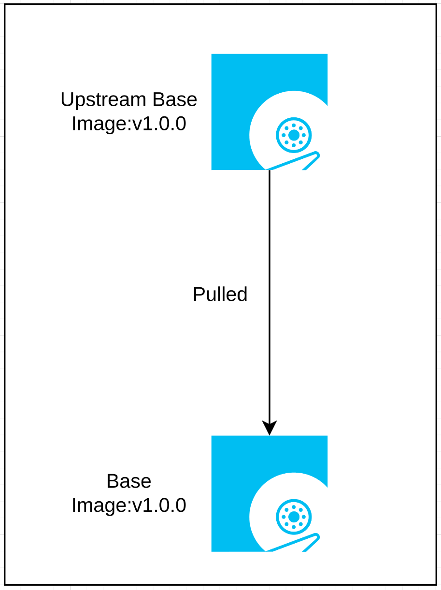

# Image Mode For Distributed Control Nodes
This pattern walks through a solution for distributed control node operating systems, leveraging bootable containers as the foundation for the immutable operating system images, and deploying to small footprint, purpose built hardware.

As DCNs are often deployed in hostile computing environments, their ability to operate and self-heal are paramount to seamless operation. In addition, the deployed image should contain the required configuration, applications, and other customizations to allow for the device to simply boot and be productive without manual intervention.

This pattern aims to highlight the value of leveraging immutable, purpose-built operating system images, which mirror container methodology, for operating highly distributed systems in hostile operating environment.

## Table of Contents
* [Abstract](#abstract)
* [Problem](#problem)
* [Context](#context)
* [Forces](#forces)
* [Solution](#solution)
* [Resulting Content](#resulting-context)
* [Examples](#examples)
* [Rationale](#rationale)

## Abstract
| Key | Value |
| --- | --- |
| **Platform(s)** | TBD |
| **Scope** | TBD |
| **Tooling** | TBD |
| **Pre-requisite Blocks:** | TBD |
| **Example Application** | TBD |

## Problem
**Problem Statement:** DCNs are generally deployed for specific purposes, into hard to reach locations, and often deployed at great scale and in a very distributed manor. These deployment locations and operating requirements often make operating these systems challenging, as they still require customization, configuration, application deployment, and updates. These changes, while required, do introduce risk, and as such, devices need to be able to favor availability of their connectiity and applications over running the latest and greatest updates if issues occur, to allow for remote troubleshooting.

To resolve this, an operating system for a distributed control node should include the required configurations, customizations, and application related content, and should feature automatic and configurable roll-forward and roll-back mechanisms to allow for simplified operation of nodes deployed at scale, in a highly-distributed fashion.

## Context
Distributed control nodes, or DCNs, are typically purpose-built systems, that run a single application, or serve a single purpose. The applications or operational purposes of these systems differ greatly, but use a common base with proper customizations to support the requirements of the workload or deployment purpose.

To support the operational challenges associated with running these purpose-built systems at scale, the foundational operating system, customizations, configurations, application content, and health checks can be built into an immutable image, that is then deployed to the hardware. After deployment, the systems simply boot the image, and begin operating according to the specified image.

In addition, during normal operation, the systems can be rolled forward or backward between image versions, favoring availability over latest and greatest, and can even be switched between images, changing the deployed configurations and applications, without requiring a redeployment of the entire platform.

This approach mirrors the container-native approach to application deployment: building in application and configuration code to container images, then simply deploying them at scale. This approach is extended, using software functionality known as [bootable container](https://developers.redhat.com/articles/2024/09/24/bootc-getting-started-bootable-containers), to extend this operational methodology to bare-metal systems, including DCNs. This allows for greater operational efficiency and greater consistency when running a large fleet of devices with multiple purposes.

## Forces
- **Customizability:** This pattern's solution allows for full control and customization of the images that are applied to the DCNs, mirroring the current operating system paradigm functionality, while recieving the benefits of image-mode deployment methodology.
- **Customizability:** This pattern's solution can be fully customized according to the required content and confirugations of the DCNs, regardless or role or use case.
- **Broad Applicability:** This pattern's solution works for any physical system or virtual machine that will be using image mode.
- **Reusability:** This pattern's solution can be replicated for many different operating system images, optionally spanning across sites, geos, or other groupings.

## Solution
The solution is to to leverage container methodoloy of building images that contain the required operating elements, such as customizations, configurations, applications, and health checks into an image, then deploying it as a bootable, immutable image onto a bare-metal system which is then deployed to the field. No post-deployment configuration or automation is required, instead, the devices boot the image with the included customizations and configurations, and start the specified application(s).

This approach aligns with the "plug device it and walk away" methodology desired when deploying devices in a highly distributed manner, without subject matter experts at the deployment location.

### Current Deployment Methodology for DCNs
The current deployment methodology for operating systems for DCNs is not imaged based, but instead is based on individual software packages being installed to form the operating system, then configurations applied, then applications deployed on the configured, installed system.

First, the base set of systems is installed onto a device when installing it:

This process combines the individual transactions of hundreds of packages into a single big transtion, with iterates over the installation of the packages required to install the operating system.

Next, additional packages are added on top of the operating system packages to support the desired workload. These packages could be to support virtualized workloads, or containerized workloads, or bare-metal workloads that require additional functions and libraries from the operating system.

After these two layers of packages have been installed, configurations are then added to the system, which configure both the core packages of the operating system, and the packages that will support the desired workload:

Finally, after these three layers have been applied, the workload can then be deployed and started on the system.

The last three phases (adding additional packages, adding configurations, and deploying the workload) are all completed after the initial system installation has occured, and require either manual intervention to complete, or require the use of an automation tool.

This post-installation customization approach introduces the opportunity for configuration drift, due to manual intervention and possible errors when completing the required setup tasks, or require investment in knowledge, expertise, and training on an automation tool. In addition, an automation tool may require connectivity to the systems themselves to complete the various tasks, which can further complcate the deployment of the system.

**Pros:**
- Large existing knowledge base due to the widespread use of this type of deployment methodology

**Cons:**
- Requires access to operating system content when installing the system
- Requires access to additional content when installing workload-supporting content
- Requires available sources of configuration files for full configuration of the system
- Requires available workload sources for workload deployment
- Requires either manual invervention or connectivity to an automation tool to layer on additional packages, configurations, and the workload
- Each layer needs to be updated and maintained

### Image Mode for DCNs
In an image mode approach for distributed control nodes, a complete operating system image is built and booted, eliminating the need for post-configuration after deployment. Instead, everything required to run the workload, such as additional packages, configurations, and even the workload itself, are built into a single image that's deployed to the system.

First, an upstream image is pulled, which becomes the base for the next steps of the image build process.

From this image, the required additional packages are installed into the image, creating an intermediary image.

Then, configurations are added to create another itermediary image.

Finally, the workload is added, to create the final, ready to deploy image.

This final image contains everything required to un the workload, needing only to be deployed to the target system. Once deployed, the system can be booted, and will begin running the workload.

This methodology allows for the final image to be deployed to the device, then booted. No post-installation work is required, instead, the device can simply be deployed, and will immediately be productive and ready.

In addition, each step in this process, if one as one flow, becomes individual layers that can be deployed individually, updated individually, or if desired, before the source for a new image.

For example, if two systems both share the same configurations and both require the same set of additional packages, such as a container runtime or virtualization packages, but run different workloads, a single image can be the source for both, cutting down on duplicate steps, and instead only branching at the end.

**Pros:**
- Greatly reduced requirements for deployment of systems
- Simplified overall deployment at scale
- Tighter control around content and configurations being added to system images

**Cons:**
- Requires centralized image build capacity
- May require adjustments in testing of functionality when building images

## Resulting Context
The resulting context from this pattern is the ability to create "ready to go" images for devices that can be deployed at scale, are infinitely customizable, and don't require post-installation work to complete the deployment. The need for additional knowledge, manual intervention, and automation tooling is eliminated by front-loading the building and testing of images for devices.

The devices deployed using this methodology can simply have their image built and applied, then be booted. Once booted, they'll start running the specified workload, and won't require any additional steps to be in a productive state.

In addition, because these images are each independent, even between versions of the same image, the devices can be rolled forward and back as needed, allowing for rapid changes of a single or multiple layers within the image, or rolled back to a known good state to ensure availablility of the application and the system for remote troubleshooting.

## Examples
The solution section of this pattern covers the comparison between the predominient deployment methodology for DCNs and the one representing the new solution recommended within this pattern. In this section, two examples will be highlighted:

- Building DCN images according to their role at sites, with site-specific customizations: a human-machine interface system, a system running deterministric workloads, and a system running an IoT gateway, bridging two network segments
- Switching between images of different purposes without needing to reprovision the device
- Adding health checks to the image, which allows the systems to self-check if an update was successful, and if necessary, roll back to a previous version

### Building Images According to Role with Site-Specific Customizations
Because DCN images follow the container build methodology, each image, and layers within the image, can be used independently. In addition, images can be built from each other, allowing for branching and customizations of images according to requirements.

In this example, an organization can build three base images that align to the main roles of the various systems deployed at sites, from an upstream base image. As described in the [Solution](#solution) section of this pattern, an upstream image is first pulled, which becomes the foundation for further customization:

Then, three images are built from that common base, according to the requirements of the specified workload or role. In this example, three images built:
- An HMI image, containing UI packages, and kiosk mode configurations
- A deterministic image, where performance tuning packages and configurations are added
- An IoT gateway image, where container runtime packages and network configurations are added

Then, each image is further built on my adding site-specific configurations, such as PTP time sources:

These images, having started out as a single generic base image, then having had multiple layers of content added, now are ready to deploy to the various devices at the sites.

### Switching Between Different Images on a Device
If devices need to change purposes, the running image can be switched out for another image without needing to re-deploy the device. Instead, the device will pull the new image, apply it, then only needs to be rebooted to start running the new image.

For example, at site 2, two devices are deployed - a deterministic system and an IoT gateway system:

However, requirements have now changed, and a second IoT gateway system is required, while the deterministic system is no longer required.

Without needing to totally redeploy the deterministic system, and without needing to purchase another system, the deterministic system's image can be changed to the IoT gateway image. After a reboot, the system will now begin operating as an IoT gateway:

This same methodology works for updates to images: even though the same image is used, the new image version is an independent image that can be booted on its own, and rolled forward or back to as needed.

### Including Health Checks in the Image
An available feature of images is to perform health checks of the platform, and if issues are found, roll back the platform to a previous image or previous image version, favoring availability of applications and the systems for remote troubleshooting.

If these health checks are enabled and included in the image, the system will automatically perform them when booting:

If the system, and optionally the additional health checks all pass, the system is deemed healthy, and no further action is taken.

If, however, after a new image version that introduced a faulty configuration to the image, the workload fails to start and fails the healthcheck, the healthcheck service will denote this failure:

After a number of failed health checks, the healthcheck service will initiate a rollback to a previous version:

This functionality helps ensure systems and workloads are running as expected, and takes appropriate actions without manual intervention.

## Rationale
The rationale behind this pattern is two-fold:
1. Reduce or eliminate the need for post-installation work
2. Ensure devices are easy to manage at scale

### 1. Reduce or eliminate the need for post-installation work
Remote sites often have limited bandwidth and unreliable connections, and often lack personnel with deep IT knowledge. As such, devices deployed into these environments should be designed to be as simple as possible, relying on up-front testing and validation instead of post-deployment configuration and troubleshooting.

This pattern's approach leverages a new methodology that builds bespoke images that simply start up and begin working, instead of requiring manual or automated intervention after deployment. This methodology allows for easier deployments at scale, and doesn't require specialized knowledge or access from an automation tool to achieve productive, working devices.

### 2. Ensure devices are easy to manage at scale
As each image is independently bootable, devices can be rolled forward or backward as needed, and can be switched between images if the purpose of a devices changes, or if requirements of the site change over time.

In addition, devices will self-check when booting, and have enough local autonomy to roll back if issues occur when updating to a new image. This process happens automatically, favoring availability of workloads and devices over running the latest image version. These health checks are customizable and extensible, allowing for deep customization where required.

## Footnotes

### Version
1.0.0

### Authors
- Josh Swanson (jswanson@redhat.com)
- Ram Gopinathan (rgopinat@redhat.com)
