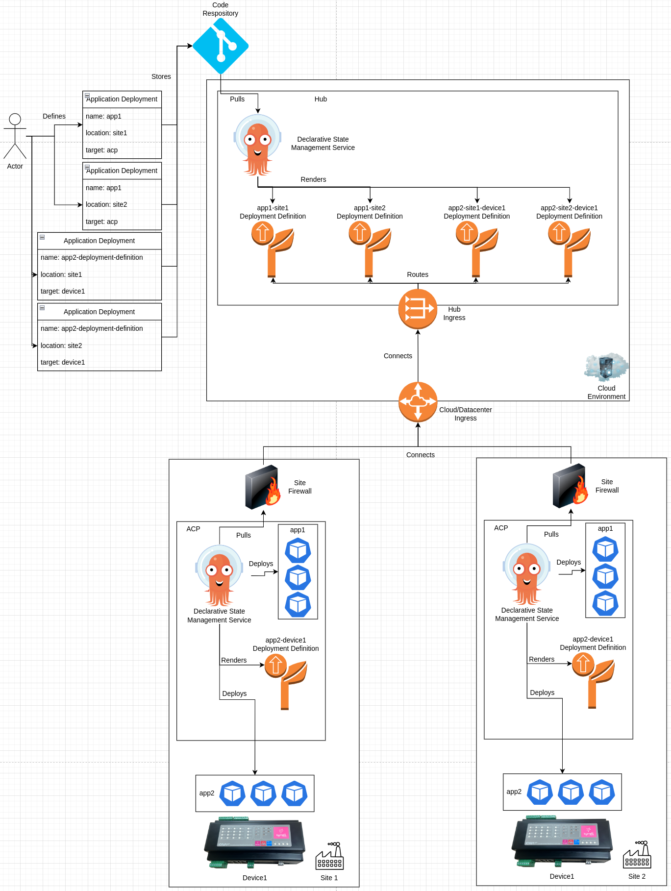
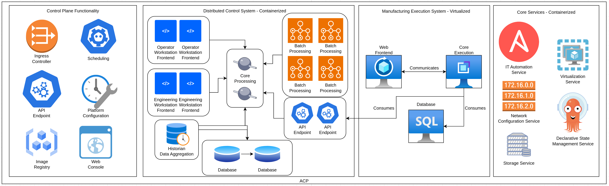

# Industrial Edge Platform Overview
This pattern outlines a solution for next generation compute platforms operating at industrial sites, such as manufacturing plants, oil refineries, and other locations. It encompases small form-factor devices up through small-scale "datacenter-like" environments, providing consistent, easily managed, and future-lookng functionality for any workloads running at these sites today.

The overall goal of this pattern is to provide the ability to run existing and next generation workloads across the industrial edge (or similar) environment, with the freedom to adapt and extend the functionality over time to support new requirements.

This pattern's solution can be considered a "meta-pattern", outlining a high-level vision, with links to other architectural patterns that are more detailed around individual elements.

## Table of Contents
* [Abstract](#abstract)
* [Problem](#problem)
* [Context](#context)
* [Forces](#forces)
* [Solution](#solution)
* [Resulting Content](#resulting-context)
* [Examples](#examples)
* [Rationale](#rationale)

## Abstract
| Key | Value |
| --- | --- |
| **Platform(s)** | <ul><li>Advanced Compute Platform</li><li>Distributed Control Nodes</li></ul> |
| **Scope** | <ul><li>Installation</li><li>Operation</li></ul> |
| **Tooling** | <ul><li>Red Hat Advanced Cluster Management (Optional)</li><li>Red Hat Ansible Automation Platform (Optional)</li></ul> |
| **Pre-requisite Blocks** | N/A |
| **Pre-requisite Patterns** | N/A |
| **Example Application** | N/A |

## Problem
**Problem Statement:** The modern industrial environment,while primarily focused on individual processes and flows that ultimately create products or assemblies, now requires more than just hardware PLCs and basic I/O functionality. Higher level operations, such as distributed control systems, manufacturing execution systems, supervisory control and data acquisition systems, and other critical applications require "IT-like" compute be available at the site.

These compute environments often being operational challenges and introduce additional burden on the site, given their lack, consistency, automation, and general day-to-day requirements, introducing undue cost and risk to the site's core production functions.

In addition, the inflexibility of these existing platforms prevents the deployment of newer workloads provided by vendors and developed in-house, limiting the ability of the business to gain insight into existing processes and work towards improving them. Also the ability to deploy new functionality to the site prevents new revenue streams or additional functionality from being realized.

## Context
This pattern can be applied anytime compute is required for mission-critical applications that need to be run outside of a core data center or cloud environment, with focus on industrial sites and the core workloads that enable site operations.

The overall goal is to lower the management burden associated with the adoption and operation of IT functionality, providing a stable and consistent compute experience while allowing for the adoption of next generation workloads and functionality without needing to replace the core platform. This pattern provides a broad look at the driving factors that drive this industrual edge platform approach, and will provide links to other patterns that give more depth about individual elements of the platform itself.

A few key assumptions are made:
- The intended use of the platform is to provide compute and hardware abstraction functionality for key workloads across a broad array of hardware
- Deployment will happen in a highly distributed fashion, with both commonality and site-specific customizations
- Workoads will range from existing/legacy to modernized to deterministic, bringing many different requirements for the platform to fulfill

## Forces
- **Resilience:** This pattern's solution should allow for the same installation and operational experience for the platform and workloads, regardless of the connected or disconnected state.
- **Security:** This pattern's solution should allow for ACPs to be operated in highly protected, highly trusted environments where external connectivity is considered too much of a risk to the platform.
- **Consistency:** This pattern's solution should be repeatable across sites with similar constraints and requirements, allowing for a large number of sites to run similiar platform installations where appropriate.
- **Customization:** This pattern's solution should allow for customization across deployment hardware footprints, according to power, cooling, and budgetary constraints relative to the desired workloads for that platform.
- **Observability:** This pattern's solution should provide visibility into the operational status of the platform and the workloads from a central location, allowing for greater operational efficiency across deployment locations
- **Managability:** This pattern's solution should be easily managed from both the site perspective and the fleet perspective, allowing for lower overall soft costs associated with operating the platform
- **Ease of Use:** This pattern's solution should be consumable by non-IT individuals, allowing for tooling and user experiences that overlay the underlying technical details in favor of simplified, approachable flows
- **Flexibility:** This pattern's solution should be adaptable to many different types of workloads, allowing for configuration and reconfiguration of the platform to support new requirements or scale up/out as needed

## Solution
The solution includes three main layers to the overall industrial edge platform: the hub layer, the advanced compute platform layer, and the distributed control node layer. A full architectural deployment may not necessitate (or allow for) all three layers, however this does not limit the overall compute functionality the platform is able to provide.

Each layer is targeted at a specific set of workloads, but by no means is exclusive to only those workloads. Instead, workloads can be shifted and moved as required by connectivity, compute requirements, failure domains, or other driving forces. The below information is provided as a guide to start placing elements of the platform into an architecture. Overlayed to the existing Purdue operational model for OT environments, a rough mapping helps visualize where the layers of the platform would be integrated into existing environments:

### The Hub Layer
The hub layer represents the highest-level management plane, where the other two layers are predominately managed from. The lifecycle management, application deployment, and centralized observability and monitoring services live at this layer. 

The overall goal of the [hub services](../rh-hub-standard-services/README.md) is to provide for centralized, easily consumable flows for deploying, updating, and managing the other two layers as they are deployed at scale to remote sites. This allows for full control from a centralized location to the advanced compute layer, (optionally) through the advanced compute layer, down to the distributed control node layer.

Since this layer most likely lives in an IT-managed compute domain, yet can make changes against large numbers of systems in the OT domain, strong RBAC and change processes are required to ensure the operational requirements of OT are met, while still gaining the benefits of centralized management via IT tooling and technologies.

This layer can be leveraged even when connectivity is limited or intermittment, however it cannot be used if the sites are completely disconnected. To facilitate fully disconnected sites, hub services can be installed on an ACP at the site to allow for consumption of their functionality.

### The Advanced Compute Layer
The advanced compute layer lives at sites, typically on reasonably powerful hardware, and provides a hyperconverged-style compute platform designed to run many types of workloads, ranging from traditional virtualized workloads through containerized workloads through next generation workloads, such as AI workloads and serverless workloads.

The goal of the platform is to provide a consistent, managable platform that allows for all different types of workloads to be run on the same platform, supported by a consistent set of [standard services](../rh-acp-standard-services/README.md) that are consumed to support those workloads.

Typically, the ACP is responsible for running manufacturing execution systems, distributed control systems, supervisory control and data aquisition systems, and other systems found at industrual sites, that support the operation of the site towards product or part production.

The platform is deployable in different architectures, such as [highly-available](../acp-standardized-architecture-ha/README.md) and [non-highly available](../acp-standardized-architecture-non-ha/README.md), to support as many deployment locations and constraints as possible. However, despite the deployment differences, the platform's provided services remain consistent.

An ACP provides a solid, stable platform that, in addition to running workloads, also can act as a [management conduit for distributed control](../build-test-host-dcn-images-on-acp/README.md) nodes, allowing for a high degree of site autonomy. An ACP can be operated in a fully connected, [partially connected](../caching-platform-updates-on-an-acp/README.md), or [fully disconnected](../disconnected-acp/README.md) environment, without compromising on the features or functionality of the platform itself.

### The Distributed Control Node Layer
The distributed control node layer lives at the "bottom" of the architecture, primarily on small form factor, purpose-built devices. These systems are usually dedicated to a single task, and operate in an [image-based](../image-mode-for-dcns/README.md) mode for increased resiliancy.

These devices are often standalone, yet can optionally be [clustered](../self-healing-dcns/README.md) to provide some failover or redundancy capability if desired.

The main workloads for these devices are human-machine interfaces that show realtime data, IoT gateways that gather data from industrial devices and sensors, software-defined control systems, computer-vision systems, and other workloads that typically reside out on the manufacturing floor or within a control cabinet.

The DCN platform is focused on availability at all costs, allowing for remote management to be successful even in the event of a failed update or other issues introduced by platform or application changes.

## Resulting Context
The resulting context is the ability to deploy and manage platforms and workloads at the appropriate location, across a large number of deployment sites with varying levels of connectivity and throughput, in a highly automated, easily managed approach. This spans across various hardware footprints at sites, allowing for consistency at the application and platform levels, despite differences in underlying hardware and networking.

Overall, this solution provides a high level of consistency for running applications across the various deployment targets, while providing a centralized management story. It leverages all three layers to deliver and manage applications, and can use the ACP and DCN layers to provide "supporting" capabilities when needed, allowing for platforms to be installed, updated, and managed.

As much as possible, this solution aims to leverage automation and tooling to deploy and manage the lifecycle of applications across a large fleet, regardless of the need for either declarative or procedural methodology. This automation can be initiated at the hub layer, but driven at a lower layer (such as from an ACP) to fit into the security paradigm of an industrial location.

## Examples
The [Solution](#solution) section of this pattern highlights the individual layers that come together to form a full architecture of the industrial edge platform. Within this examples section, a few key use cases will be pulled from existing patterns.

1. Self-Healing DCNs within a Single Cabinet
2. Running Existing Applications and Next Generation Workloads on the Same ACP
3. Zero-Touch Provisioning of ACPs from a Hub
4. Cloud to Edge Application Deployments

### Self-Healing DCNs within a Single Cabinet
A self-healing cluster could be set up on DCNs located within a cabinet, allowing for the functions of those DCNs to move freely between them:

These functions could include: running virtualized workloads, such as an application within a Windows virtual machine, a containerized deterministic application, such as a software-based control runtime with a control strategy, or other workloads as desired.

In this example, the failure of a single DCN will not remove the ability for the cabinet to function, and depending on the configuration of the workloads, may automatically recover from a DCN failure.

### Running Existing Applications and Next Generation Workloads on the Same ACP
As ACPs provide functionality for workloads that are containerized, microservice based, or virtualized, a single ACP provides the functionality needed to run applications at a site. For example, an MES, which still requires virtual machines, is deployed to the same ACP where a modernized, containerized DCS is also running.
e

Despite different application architectures, and leveraging different functionality and services, the workloads are consolidated onto a single platform, highlighting an ACP's capabilities to run both existing and new workloads without requiring more overhead.

In this example, the MES is consuming data, via the API endpoints of the DCS, allowing data to be gathered, transformed, and displayed in the MES. This enables higher level business functions to have greater visibility into the processes running at the edge site.

In addition, the control plane functions and core services of the ACP are also run on the platform, alongside the other two workloads, enabling these workloads, as well as providing key functionality for their deployment and operation.

This example showcases the benefits to businesses in adopting a modern approach to edge computing: adopting a platform, such as an ACP, provides a suite of services and capabilities beyond what current platforms allow, while still having full support for existing workloads, which can be migrated to the platform.

### Zero-Touch Provisioning ACPs from a Hub
Another example for the industrial edge platform is using declarative tooling and GitOps at the hub level to define and deploy ACPs to remote sites at scale, and ensure they're consistent and managed by the hub, which in turn ensures consistency as the ACPs are deployed to remote sites.

This allow for significant scaling of this solution over manually defining each site or ACP at every site, reducing the burden on the centralized management team when deploying ACPs to a large number of sites.

In addition, templating functionality of the declarative state management service could be used to build a large number of ACP operating environment definitions and ACP definitions without needing to manually define them individually.

### Cloud to Edge Application Deployment - Hub to DCN Through an ACP
ACPs are fully feature-complete without a hub, however, when managing ACPs at scale, a hub provides a central point to drive configuration and application deployments. This architecture is commonly referred to as a "hub and spoke" style deployment, where ACPs would be the spokes, connected back to a central hub, where configuration and deployment information are pulled from.

Because the declarative state management service runs on the hub and on ACPs, application definitions can be created that target many ACPs, allowing for a simplified and centralized deployment process.

This approach allows for a high degree of scaling without having to interface with each ACP directly, instead, the ACPs are connected back to a central hub, and pull application deployments from it. The hub provides a centralized point of configuration and visibility, and facilitates deployments out to the ACPs at scale.

While the hub performs some high level rendering functions, responsibility for the deployment of the applications and constant reconciliation is still the responsibility of the ACPs themselves, as they're running the declarative state management service. This facilitates local autonomy at the ACP level: if the hub cluster experiences an outage, or connectivity to it is lost, applications continue to function as they were, according to the last known deployment definition. Should a component of the application drift or be deleted, it will be reconciled by the instnace of the declarative state management service running on that ACP.

Once connection is re-established to the hub, deployment definitions will be automatically pulled, and if an update to an application deployment definition has been made, it will be automatically applied.

Typically, the pull model is used for the connection between the ACPs and the hub, as this method simplifies the required connectivity changes to facilitate communication: the ACPs simply need to be allowed to call out to the hub, as opposed to requiring the hub to communicate directly via an inbound connection, from the point of reference of the ACP. Outbound connections are usually preferred at sites, as they are viewed as more secure and easier to manage.

## Rationale
The rationale for this pattern is to address the needs for next-generation compute capabilities at industrial sites with respect for security, consistency, scalability, and reliability.

The overall objective is to provide one singluar, consistency way to deploy and manage platforms and applications onto those platforms, regardless of the underlying hardware, and working within the network and security boundries that have come to define the modern industrial edge site.

## Footnotes

### Version
1.0.0

### Authors
- Josh Swanson (jswanson@redhat.com)