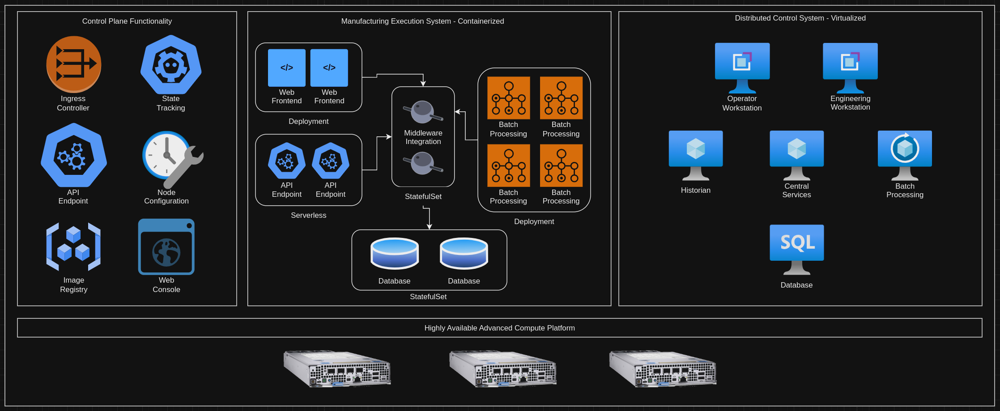
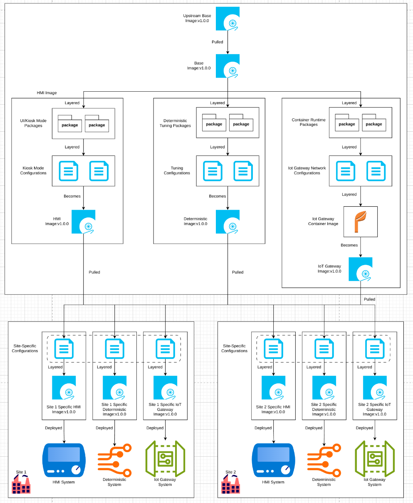

# Industrial Edge Platform Overview
This pattern outlines a solution for next generation compute platforms operating at industrial sites, such as manufacturing plants, oil refineries, and other locations. It encompases small form-factor devices up through small-scale "datacenter-like" environments, providing consistent, easily managed, and future-lookng functionality for any workloads running at these sites today.

The overall goal of this pattern is to provide the ability to run existing and next generation workloads across the industrial edge (or similar) environment, with the freedom to adapt and extend the functionality over time to support new requirements.

This pattern's solution can be considered a "meta-pattern", outlining a high-level vision, with links to other architectural patterns that are more detailed around individual elements.

## Table of Contents
* [Abstract](#abstract)
* [Problem](#problem)
* [Context](#context)
* [Forces](#forces)
* [Solution](#solution)
* [Resulting Content](#resulting-context)
* [Examples](#examples)
* [Rationale](#rationale)

## Abstract
| Key | Value |
| --- | --- |
| **Platform(s)** | <ul><li>Advanced Compute Platform</li><li>Distributed Control Nodes</li></ul> |
| **Scope** | <ul><li>Installation</li><li>Operation</li></ul> |
| **Tooling** | <ul><li>Red Hat Advanced Cluster Management (Optional)</li><li>Red Hat Ansible Automation Platform (Optional)</li></ul> |
| **Pre-requisite Blocks** | N/A |
| **Pre-requisite Patterns** | N/A |
| **Example Application** | N/A |

## Problem
**Problem Statement:** The modern industrial environment,while primarily focused on individual processes and flows that ultimately create products or assemblies, now requires more than just hardware PLCs and basic I/O functionality. Higher level operations, such as distributed control systems, manufacturing execution systems, supervisory control and data acquisition systems, and other critical applications require "IT-like" compute be available at the site.

These compute environments often being operational challenges and introduce additional burden on the site, given their lack, consistency, automation, and general day-to-day requirements, introducing undue cost and risk to the site's core production functions.

In addition, the inflexibility of these existing platforms prevents the deployment of newer workloads provided by vendors and developed in-house, limiting the ability of the business to gain insight into existing processes and work towards improving them. Also the ability to deploy new functionality to the site prevents new revenue streams or additional functionality from being realized.

## Context
This pattern can be applied anytime compute is required for mission-critical applications that need to be run outside of a core data center or cloud environment, with focus on industrial sites and the core workloads that enable site operations.

The overall goal is to lower the management burden associated with the adoption and operation of IT functionality, providing a stable and consistent compute experience while allowing for the adoption of next generation workloads and functionality without needing to replace the core platform. This pattern provides a broad look at the driving factors that drive this industrual edge platform approach, and will provide links to other patterns that give more depth about individual elements of the platform itself.

A few key assumptions are made:
- The intended use of the platform is to provide compute and hardware abstraction functionality for key workloads across a broad array of hardware
- Deployment will happen in a highly distributed fashion, with both commonality and site-specific customizations
- Workoads will range from existing/legacy to modernized to deterministic, bringing many different requirements for the platform to fulfill

## Forces
- **Resilience:** This pattern's solution should allow for the same installation and operational experience for the platform and workloads, regardless of the connected or disconnected state.
- **Security:** This pattern's solution should allow for ACPs to be operated in highly protected, highly trusted environments where external connectivity is considered too much of a risk to the platform.
- **Consistency:** This pattern's solution should be repeatable across sites with similar constraints and requirements, allowing for a large number of sites to run similiar platform installations where appropriate.
- **Customization:** This pattern's solution should allow for customization across deployment hardware footprints, according to power, cooling, and budgetary constraints relative to the desired workloads for that platform.
- **Observability:** This pattern's solution should provide visibility into the operational status of the platform and the workloads from a central location, allowing for greater operational efficiency across deployment locations
- **Managability:** This pattern's solution should be easily managed from both the site perspective and the fleet perspective, allowing for lower overall soft costs associated with operating the platform
- **Ease of Use:** This pattern's solution should be consumable by non-IT individuals, allowing for tooling and user experiences that overlay the underlying technical details in favor of simplified, approachable flows
- **Flexibility:** This pattern's solution should be adaptable to many different types of workloads, allowing for configuration and reconfiguration of the platform to support new requirements or scale up/out as needed

## Solution
The solution includes three main layers to the overall industrial edge platform: the hub layer, the advanced compute platform layer, and the distributed control node layer. A full architectural deployment may not necessitate (or allow for) all three layers, however this does not limit the overall compute functionality the platform is able to provide.

Each layer is targeted at a specific set of workloads, but by no means is exclusive to only those workloads. Instead, workloads can be shifted and moved as required by connectivity, compute requirements, failure domains, or other driving forces. The below information is provided as a guide to start placing elements of the platform into an architecture. Overlayed to the existing Purdue operational model for OT environments, a rough mapping helps visualize where the layers of the platform would be integrated into existing environments:

### The Hub Layer
The hub layer represents the highest-level management plane, where the other two layers are predominately managed from. The lifecycle management, application deployment, and centralized observability and monitoring services live at this layer. 

The overall goal of the [hub services](../rh-hub-standard-services/README.md) is to provide for centralized, easily consumable flows for deploying, updating, and managing the other two layers as they are deployed at scale to remote sites. This allows for full control from a centralized location to the advanced compute layer, (optionally) through the advanced compute layer, down to the distributed control node layer.

Since this layer most likely lives in an IT-managed compute domain, yet can make changes against large numbers of systems in the OT domain, strong RBAC and change processes are required to ensure the operational requirements of OT are met, while still gaining the benefits of centralized management via IT tooling and technologies.

This layer can be leveraged even when connectivity is limited or intermittment, however it cannot be used if the sites are completely disconnected. To facilitate fully disconnected sites, hub services can be installed on an ACP at the site to allow for consumption of their functionality.

### The Advanced Compute Layer
The advanced compute layer lives at sites, typically on reasonably powerful hardware, and provides a hyperconverged-style compute platform designed to run many types of workloads, ranging from traditional virtualized workloads through containerized workloads through next generation workloads, such as AI workloads and serverless workloads.

The goal of the platform is to provide a consistent, managable platform that allows for all different types of workloads to be run on the same platform, supported by a consistent set of [standard services](../rh-acp-standard-services/README.md) that are consumed to support those workloads.

Typically, the ACP is responsible for running manufacturing execution systems, distributed control systems, supervisory control and data aquisition systems, and other systems found at industrual sites, that support the operation of the site towards product or part production.

The platform is deployable in different architectures, such as [highly-available](../acp-standardized-architecture-ha/README.md) and [non-highly available](../acp-standardized-architecture-non-ha/README.md), to support as many deployment locations and constraints as possible. However, despite the deployment differences, the platform's provided services remain consistent.

An ACP provides a solid, stable platform that, in addition to running workloads, also can act as a [management conduit for distributed control](../build-test-host-dcn-images-on-acp/README.md) nodes, allowing for a high degree of site autonomy. An ACP can be operated in a fully connected, [partially connected](../caching-platform-updates-on-an-acp/README.md), or [fully disconnected](../disconnected-acp/README.md) environment, without compromising on the features or functionality of the platform itself.

### The Distributed Control Node Layer
The distributed control node layer lives at the "bottom" of the architecture, primarily on small form factor, purpose-built devices. These systems are usually dedicated to a single task, and operate in an [image-based](../image-mode-for-dcns/README.md) mode for increased resiliancy.

These devices are often standalone, yet can optionally be [clustered](../self-healing-dcns/README.md) to provide some failover or redundancy capability if desired.

The main workloads for these devices are human-machine interfaces that show realtime data, IoT gateways that gather data from industrial devices and sensors, software-defined control systems, computer-vision systems, and other workloads that typically reside out on the manufacturing floor or within a control cabinet.

The DCN platform is focused on availability at all costs, allowing for remote management to be successful even in the event of a failed update or other issues introduced by platform or application changes.

## Resulting Context
The resulting context is the ability to deploy and manage platforms and workloads at the appropriate location, across a large number of deployment sites with varying levels of connectivity and throughput, in a highly automated, easily managed approach.

### HERE ###

ACPs, standard services, and workloads when external connectivity is not available, while maintaining consistency with the functionality provided by a "connected" ACP. The end user experience, features and functionality, and operational experience are all consistent across connected and disconnected platforms, and across deployment methodologies.

The content mirroring portion of this pattern's solution can be automated and scaled, allowing for many platforms to be run across a large number of deployment locations or targets, all consuming the same set of mirrored content (or optionally, the same content across many mirrors), driving consistency and operational efficiency.

In addition, the platform configuration can be deployed at scale using a hub, or through automation at deployment time. In addition, it can be applied to already-installed platforms as a day-2 operation, through any standard tooling that's used to manage ACPs.

This also allows for ACPs to be run outside of the traditional "plant datacenter" or edge location, instead allowing for platform deployment and operation on mobile platforms, high security sites, or other locations that do not have, or do not provide, external connectivity to internal resources.

## Examples
The [Solution](#solution) section of this pattern highlights the core components required to enact the solution. In this section, three scenarios will be outlined that leverage that solution:

1. Mirroring content to an internally reachable location
2. Managing Disconnected ACPs from a Hub
3. Transporting content via "sneakernet" to fully disconnected locations

### Mirroring Content to an Internally Reachable Location
Some industrial sites operate in a "mostly disconnected" mode, meaning that connectivity back to internal/corporate resources is allowed, but connectivity to the internet is not.

For the purposes of this pattern, this use case can be considered disconnected, and a content mirror can be run centrally for ACPs at sites to pull content from.

This approach leverages the disconnected methodology, and provides all the benefits of full platform functionality, version consistency, and operational consistency without needing to allow the deployed ACPs to pull content from the internet directly.

### Managing Disconnected ACPs from a Hub
Building on the previous example, if connectivity back to a central location is allowed, then ACPs at remote sites can be managed using a [hub](../rh-hub-standard-services/README.md). This allows for [highly-automated ACP installs](../automated-acp-install-from-hub/README.md), along with deployment of applications and policies at scale from a central management location.

In this use case, the ACP configuration to leverage an internal content source for workloads and platform content is simply a configuration item that can be applied from the hub in a broad or targeted approach.

### Transporting Content via "Sneakernet" to Fully Disconnected Locations
For fully disconnected sites that have no outside connectivity, the content mirroring tool can be used to download the required content to persistent storage that can be physically transported to the site, then leveraged again to load the content from storage to a content repository on-site that the ACP can reach.

This allows for operation at sites that have no connectivity, at all, outside of the site itself.

## Rationale
The rationale for this pattern is to address wanting ACPs deployed to sites that operate in a disconnected manner, while retaining full feature parity with ACPs that are deployed in connected or semi-connected environments. This allows for the platform's features and functionality to be consumed in even more operational environments without significant drift from the standard platform deployment configuration.

Since consistency is key when operating edge sites at scale, the ability to leverage a common platform, regardless of the connectivity model at each site, helps to scale the capabilities of the organization, while still remaining flexible enough to support the needs of an individual site.

## Footnotes

### Version
1.0.0

### Authors
- Josh Swanson (jswanson@redhat.com)