# Using the IT Automation Service for DCN Operating System Lifecycle Management
This pattern walks through lifecycle management of distributed control node operating systems, where the interactions and integrations are driven by the IT automation service.

ACPs provide a large set of core services that can be consumed to power workloads, but also for lifecycle management and automation of systems that exist around the ACP, providing a more complete solution to operating platforms at remote sites.

This pattern aims to simplify the lifecycle management process for distributed control nodes by leveraging existing services, allowing for a more consumable lifecycle management story for DCNs without needing additional infrastructure.

## Table of Contents
* [Abstract](#abstract)
* [Problem](#problem)
* [Context](#context)
* [Assumptions](#assumptions)
* [Forces](#forces)
* [Solution](#solution)
* [Resulting Content](#resulting-context)
* [Examples](#examples)
* [Rationale](#rationale)

## Abstract
| Key | Value |
| --- | --- |
| **Platform(s)** | TBD |
| **Scope** | TBD |
| **Tooling** | TBD |
| **Pre-requisite Blocks:** | TBD |
| **Example Application** | TBD |

## Problem
**Problem Statement:** Distributed control nodes, or DCNs, are typically small-form factor, purpose built devices running open and modern operating systems, which require updates and upgrades throughout the lifecycle of the system. Building and hosting these operating systems requires compute and automation capacity to run and orchestrate the appropriate tools and features.

To resolve this, an ACP and its core services should be leveraged to build, stage, host, and even distribute the necessary content to provide full lifecycle capabilities for DCN operating systems. In addition, the platform should allow for rollback, low/zero-touch provisioning, and more lifecycle-aligned workflows and tasks for full DCN lifecycle management.

## Context
An ACP provides a consistent, unified platform for current generation and next generation workloads powered by a single control plane. This provides efficiency and consistency for operating at great scale.

A DCN is a more compact, purpose-built system that typically run a low number of workloads per system, however require significantly less hardware, and can operate in a highly distributed deployment model.

The two layers combined represent a holistic approach to edge computing, allowing for form-factor specific platforms aligned to available hardware and workload requirements.
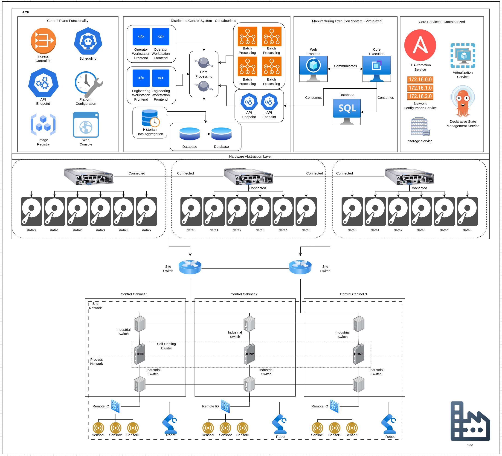

A function of a modern platform approach is a simplified lifecycle management process, allowing for easy upgrades, rollbacks, and full customization of the update content created for DCNs. A fully automated process should handle the creation and hosting of this update content, leveraging the appropriate tools and technologies to provide a seamless experience when creating update content for DCNs, where an ACP provides the required computing and hosting capabilities.

The solution covered in this pattern is broadly applicable to any deployment where an ACP is available, and DCNs are deployed and need update content, subject to the assumptions called out in the [Assumptions](#assumptions) section.

The following services will be leveraged to achieve successful solution deployment:
| Service | Description | Usage in this Pattern |
| --- | --- | --- |
| Virtualization | Provides virtual machines and lifecycle functionality across different guest operating systems | Provides compute blocks, in the form of virtual machines, for running existing applications |
| Storage | Provides consumable storage in multiple formats and topologies | Provides storage for running existing workloads, supporting their persistent data needs |
| IT Automation | Provides a task-orentated idempotent automation framework for managing application lifecycles | Automates and orchestrates existing workload lifecycle operations, such as installation and upgrading |

## Assumptions
Where this pattern's solution is broadly applicable, there are a few key assumptions that must be met before deploying the solution.

This pattern's solution assumes the following:
1. The deployed distributed control nodes are [rpm-ostree based](https://www.redhat.com/en/blog/red-hat-device-edge-rpm-ostree-updates) image mode Red Hat Device Edge, as opposed to [bootc based](https://developers.redhat.com/articles/2024/09/24/bootc-getting-started-bootable-containers) image mode Red Hat Device Edge, or rpm-based Red Hat Device Edge.
2. The desired way to interact with the solution is through the [IT automation service](https://www.redhat.com/en/technologies/management/ansible), as opposed to other services available on an ACP, such as the [declarative state management](https://www.redhat.com/en/technologies/cloud-computing/openshift/gitops) service, or the optional [pipelines service](https://www.redhat.com/en/blog/introducing-openshift-pipelines).
3. The [virtualization service](https://www.redhat.com/en/technologies/cloud-computing/openshift/virtualization) is ready for consumption. If virtualization functionality is not being provided by the ACP, the solution can be extended to leverage another virtualization provider.
4. The [IT automation service](https://www.redhat.com/en/technologies/management/ansible) is ready for consumption, and can communicate with the ACP to leverage the platform's capabilities.
5. The ACP and DCNs can communicate over a network connection. This solution's examples will show the ACP and DCNs deployed at the same site, however, this is not a hard requirement. The ACP could be deployed in a central location, while the DCNs are deployed in a highly distributed manor, as long as connectivity is available.
6. The ACP can access upstream content provided by Red Hat, or the content is cached and accessable to the ACP.

## Forces
1. **Leverage Existing Functionality:** This pattern's solution should leverage the ACP's core services, removing the need for additional hardware or software for proper DCN operating system lifecycle management.
2. **Simplified Experience:** This pattern's solution should provide a simplified experience around creating and hosting update content for DCNs, removing the need for deep knowledge around tooling and process.
3. **Minimal Resource Consumption:** This pattern's solution should leverage services and resources only when they are needed, and not leave the resources needed to create DCN update content running long-term.
4. **Fine Grained Control:** This patten should allow for full customization around what DCN update content should be created, and when it should be hosted and ready for consumption by the DCNs.
5. **Repeatability:** This solution should provide a reusable experience that can be leveraged anytime update content for DCNs is needed, and should be able to build off existing content for smaller deltas between update cycles.

## Solution
The solution is to to leverage the IT automation service to interact with ACP-provided services in a workflow to create and host update content for DCNs. This content can be used to build new DCNs, or to update existing ones.
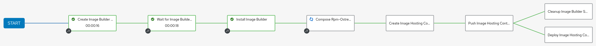

The solution section of this pattern will walk through the various stages of the workflow, while the example section will highlight examples of the solution after deployment in a few different environments.

### Initiating the Content Build Workflow
This pattern's solution is initiated by providing a definition of the updated DCN operating system image to the workflow, which is then passed along by the IT automation service to the various steps in the workflow.
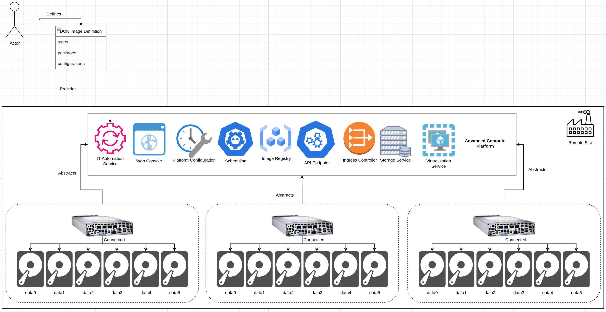

If desired, previous content can be specified to compose a static update from the current DCN operating system image. In addition, static verions can be defined to tightly control what content is composed into the updated DCN operating system image.

### Creation of Update Content Build Infrastructure
Once the updated DCN operating system image is fed into the workflow, the IT automation service leverages the virtualization service of the ACP (or an external virtualization service, if required) to create the required infrastructure for building DCN operating system images.
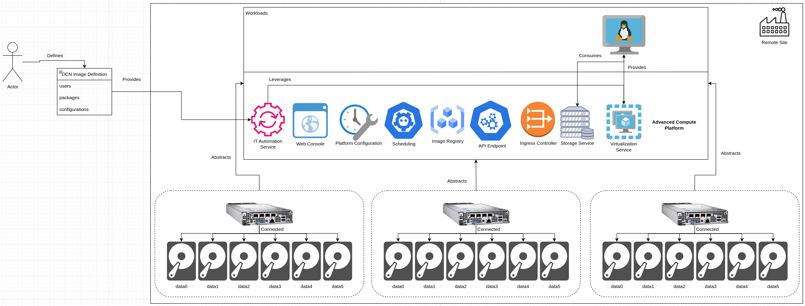

### Installation of Update Content Build Tooling
After the required infrastructure is available, the IT automation package communicates with the created infrastructure to install the required tooling to compose updated DCN images. This step, when performed by the IT automation service, eliminates the need for deep understanding of the installation process of the DCN image build tooling.
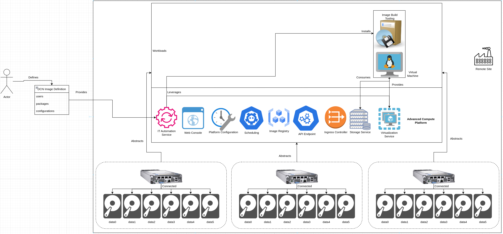

### Composing the Updated DCN Operating System Image
Once the appropriate tooling is installed, the IT automation service leverages the tooling to build an updated DCN operating system image according to the provided image defintion. Because this step is handled by the IT automation service, thorough understanding of the DCN operating system image build tooling is not required.
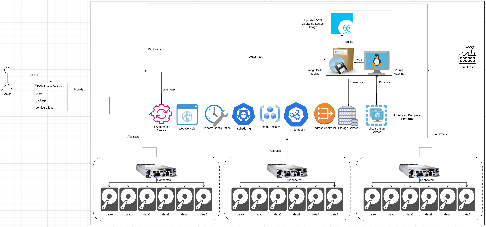

Optionally, the image can be built from an existing DCN operating system image. This will be shown in the [Examples](#examples) section of this pattern.

### Creating a Image Hosting Container
By default, DCNs are able to pull their operating system images over a network, using standard web calls to retrieve content when initiated. A simple web server can host the updated DCN operating system image, and can be containerized for greater portibility.

In addition, an ACP provides the capability to run containerized workloads, and also provides the ability to store container images either in the internal registry built into the platform, or in a registry installed on top of the platform.

The IT automation service leverages the created infrastructure to create a container image that contains the required web server application code, and the newly composed DCN operating system image, along with the proper configuration for the web server application to serve up the DCN operating system image content.
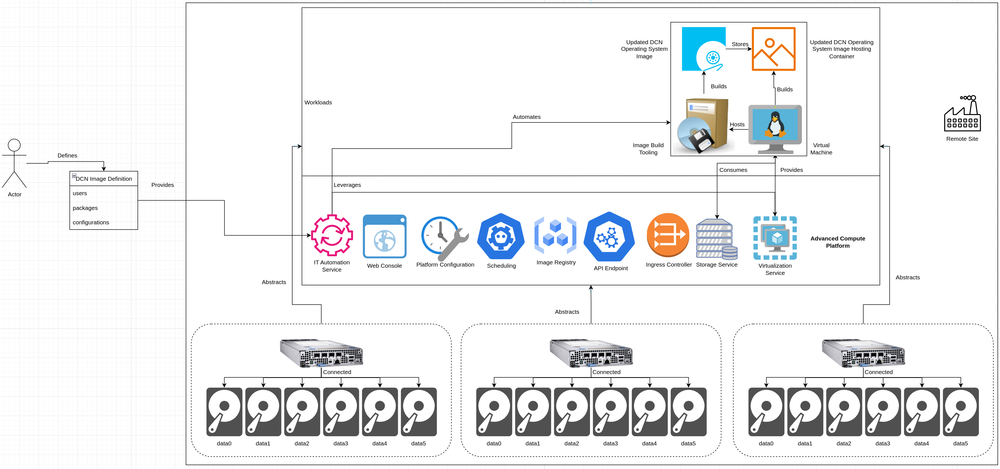

### Storing the Image Hosting Container in a Registry
With the image hosting container created, it can now be pushed into a registry, such as the ACP's internal regisry, for deployment in the future. Registries besides the ACP's internal registry are also options, however, the platform's internal registry will be used for simplicity.
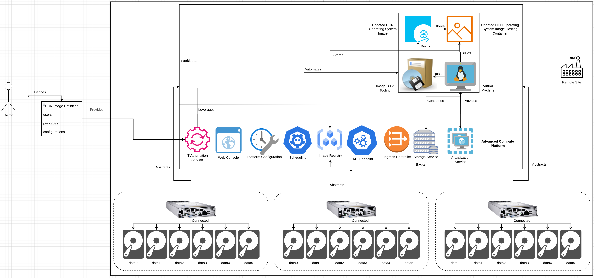

### Removing the Created Infrastructure
With the updated DCN operating system image created and now stored in the ACP's internal image registry, the image building tooling and supporting infrastructure is no longer needed. The IT automation service, after completing all the previous tasks, deletes the created infrastructure from the platform, releasing the corresponding compute and storage for consumption by other workloads.
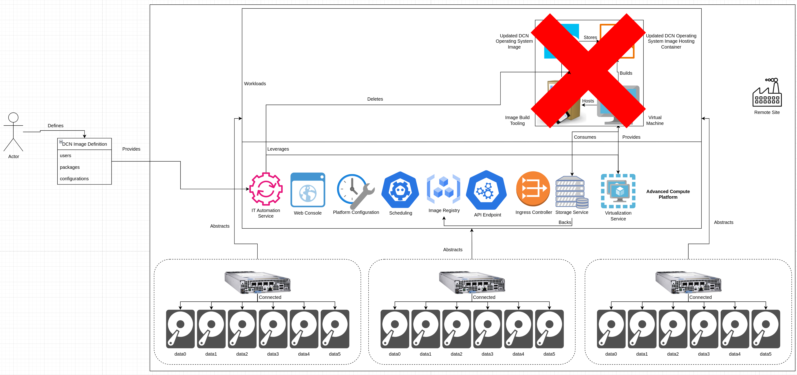

### Deploying the Image Hosting Container to the ACP
Finally, to make the newly created DCN operating system image content available over a network, the IT automation service leverages the platform's API, declaring a deployment of the DCN operating system image hosting container is desired. The underlying platform services coordinate to pull the hosting container from the internal registry, schedule it, continually ensure the container is running, and ensure external traffic can reach the deployed container.
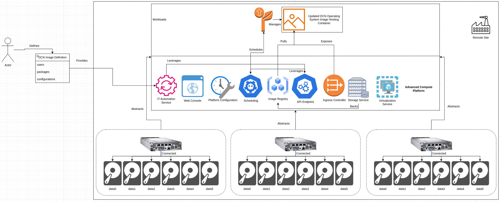

## Resulting Context
The resulting context from this pattern's solution is a repeatable, highly automated process, driven by the IT automation service, that leverages the capabilities of the platform to build and host updated DCN operating system images that are accessable over a network.

This solution provides this functionality without requiring additional platforms to be deployed, instead leveraging spare capacity on an existing ACP. In addition, deep knowledge of the underlying tools and technologies is not required, instead, automation is pre-built and deployed to orchestrate against the required services and tools.

With this solution deployed, an end user only needs to initiate the process with an updated DCN operating system image definition, and the IT automation service, leveraging the other platform services, runs the process end-to-end, allowing for simplified lifecycle management of DCN operating systems.

## Examples
The solution section of this pattern covers the individual steps that combine to form the solution. Within this section, a few real-world examples will be detailed:

- Updating DCNs from an ACP hosting an updated DCN operating system image
- Creating an updated DCN operating system image from an existing DCN operating system image
- Leveraging an external virtualization service instead of the ACP's virtualization service

### Updating DCNs from an ACP Hosting an Updated DCN Operating System Image
For DCNs that can communicate over a network with an ACP that's hosting their updated operating system image, such as ones deployed at the same site, the update content will be served up by the ACP's core services as the DCNs request it.
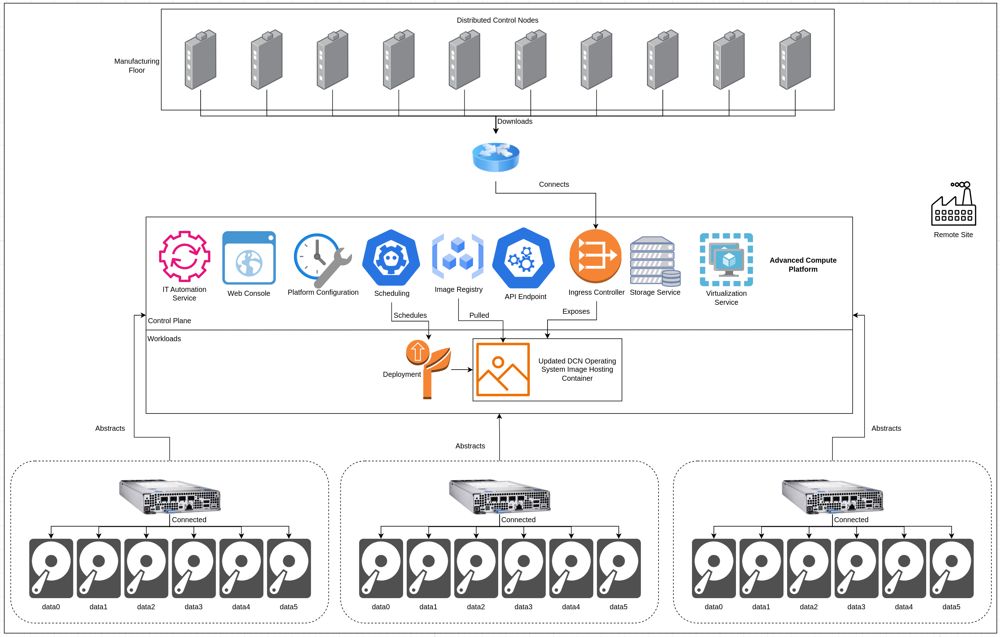

**Pros:**
- Doesn't require additional access from outside of the deployment site
- Content supplied at the speed of the site's internal network
- Limits the amount of data required to be downloaded over the site's external connection, regardless of the number of deployed DCNs

**Cons:**
- Requires deployment of this solution's pattern

### Creating an Updated DCN Operating System Image from an Existing DCN Operating System Image
To allow for streamlined, delta-only updates, updated DCN operating system images can be built from previously created DCN operating system images, using the same solution. This modification of the solution leverages all the same core services.

During the [Composing the Updated DCN Operating System Image](#composing-the-updated-dcn-operating-system-image) step of the process, the image building tooling can pull an existing image, and build an update from it.

In this example, version 1.0.0 has already been composed and is currently hosted, while version 2.0.0 is desired. The IT automation service will configure the image build tooling to pull from the existing version 1.0.0 when building version 2.0.0:
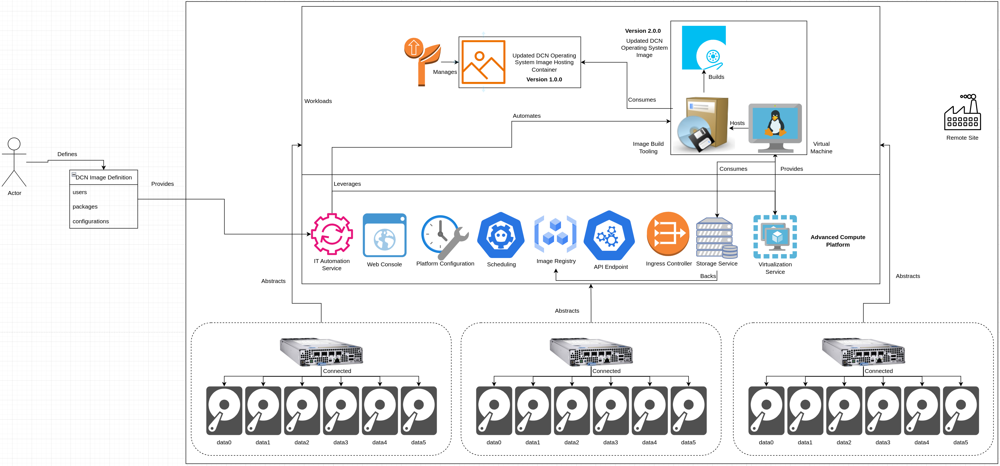

In addition, after a new version of the DCN operating system image has been built and stored in the platform's internal registry, the IT automation service will update the deployment of the image hosting container, and the platform will automatically roll out the new version:
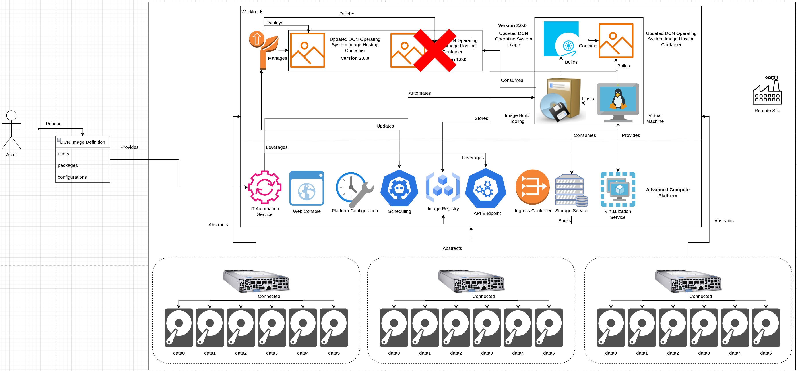

**Pros:**
- Creates delta updates so less data/compute is required by the DCNs to update
- Automatically rolls out new versions

**Cons:**
- DCN operating system image compose may take longer
- DCNs immediately see new content, and could be deployed to a newer version if being re-imaged

### Leveraging an External Virtualization Service Instead of the ACP's Virtualization Service
In some environments, an ACP may be centrally deployed in a datacenter or cloud, and not responsible for virtualization. In this situation, the IT automation service can leverage an external virtualization service, such as one provided by the cloud or other virtualization platforms, in the same way the ACP's virtualization service is leveraged.
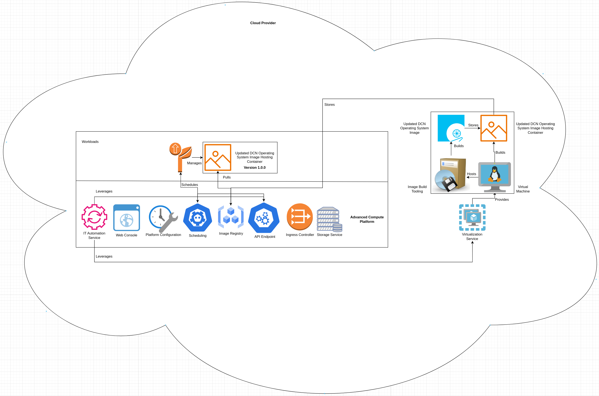

**Pros:**
- Operates the same way as if the ACP's virtualization service is leveraged
- Lowers the resource requirements for the ACP down to just running the image hosting container

**Cons:**
- Requires configuration of the IT automation service to communicate with the external virtualization provider
- Requires configuration of communication between the ACP and the cloud provider's (or other virtualization provider's) virtualization service endpoint(s)
- Requires configuration of connectivity between the ACP, cloud or datacenter networking, and the deployed DCNs

## Rationale
The rationale behind this pattern is two-fold:
1. Allow for lifecycle management of DCN operating systems via an automated workflow
2. Use the built-in functionality of an ACP

### 1. Allow for Lifecycle Management of DCN Operating Systems via an Automated Workflow
To best support meeting compliance and security requirements, frequent updates are needed for deployed systems. In addition, building and hosting those updates can be challenging, depending on the available skillset of the end users of the DCNs themselves, or whomever is responsible for them.

This pattern's solution aims to solve these challenges by leveraging an automated workflow, that is pre-programed with the appropriate logic and flow to accomplish the tast of building updated DCN operating system images without manual intervention, and without requiring deep technical knowledge on the tools required to build updated images.

### 2. Use the Built-In Functionality of an ACP
ACPs require compute capacity to offer a great deal of flexibility and functionality, and as such, should support common use cases and workflows without needing the deployment of additional platforms or resources.

This solution leverages what's already provided by an ACP to accomplish an automated workflow for an existing use case, allowing for an ACP to act as an "all-in-one" platform.

## Footnotes

### Version
1.0.0

### Authors
- Josh Swanson (jswanson@redhat.com)