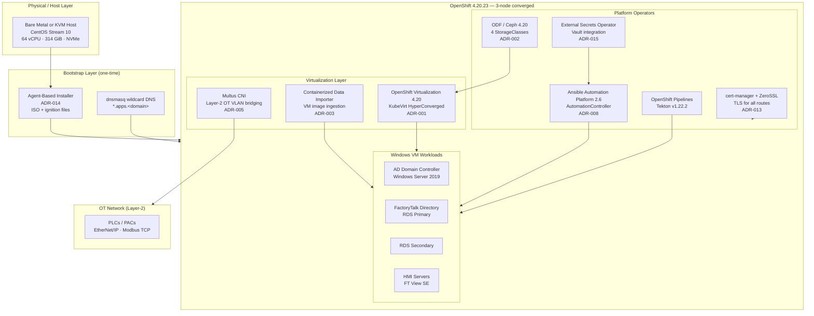
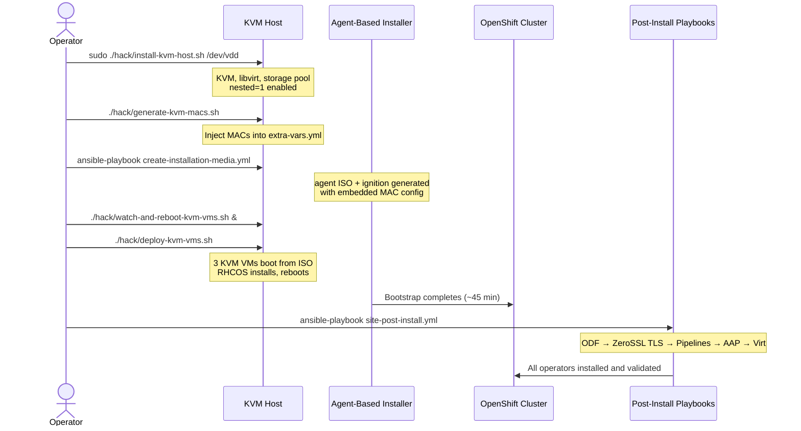

# Pattern 01 — Platform Foundation: OpenShift Virtualization vs VMware

> **ADRs**: [ADR-001](../docs/adrs/001-openshift-virtualization-as-ot-platform.md) · [ADR-002](../docs/adrs/002-storage-backend-odf-ceph.md) · [ADR-014](../docs/adrs/014-cluster-bootstrap-agent-based-installer.md)  
> **Validated**: v1.0.0 (June 8, 2026)

## Problem Statement

OT environments (factory-floor HMI, SCADA, historians) have historically lived on isolated VMware vSphere clusters. This creates:

- A separate management plane disconnected from IT infrastructure
- Manual VM lifecycle (deploy, snapshot, backup, patch) via vSphere UI
- No GitOps — VM configs exist only in vCenter, not in version control
- Expensive per-VM Windows licensing bundled into vSphere licensing tiers
- No native integration with modern CI/CD, secrets management, or observability
- Upgrade cycles measured in months (change-control, proprietary tooling)

**Goal**: Run the same Windows Server / FactoryTalk workloads on a platform that unifies IT and OT control under a single, API-driven, GitOps-ready cluster.

---

## Why OpenShift Virtualization (not VMware, not Proxmox, not Hyper-V)

| Dimension | VMware vSphere | OpenShift Virtualization |
|-----------|---------------|--------------------------|
| VM definition | vCenter GUI / `.vmx` file | Kubernetes `VirtualMachine` CRD (YAML in Git) |
| Disk storage | vSAN or NFS | ODF/Ceph RBD — same storage used by containers |
| Networking | NSX or vDS portgroups | Multus CNI + NMState — same SDN as containers |
| Backup | vSphere Data Protection or Veeam | OADP + qemu-guest-agent VSS freeze |
| Secrets | vCenter roles / manual | External Secrets Operator pulling from Vault |
| Automation | PowerCLI or vRA | Ansible + Tekton Pipelines (same toolchain as containers) |
| Observability | vROps (separate license) | OpenShift built-in (Prometheus/Grafana) |
| Licensing cost | vSphere Foundation + Enterprise license | Included in Red Hat OCP subscription |
| Upgrade path | vCenter + ESXi upgrades (coordinated) | `oc adm upgrade` (same as OCP) |
| GitOps | No | Yes — VM YAML committed to Git, reconciled by ArgoCD |
| Live Migration | vMotion (requires shared storage) | KubeVirt Live Migration (same mechanism, no vSAN needed) |
| OT VLAN bridging | NSX or manual portgroup | Multus `cnv-bridge` + NMState NNCP (declarative, version-controlled) |

**The decisive factor**: In this project, the management cluster IS the OT platform. There is no separate hypervisor tier. OpenShift runs bare-metal (or on KVM for dev/test), and VMs run alongside containers on the same nodes. One API, one RBAC model, one observability stack.

---

## Platform Stack Diagram



---

## Key Decisions and Constraints

### 1. Converged cluster topology (compute + storage on same nodes)
All three OpenShift nodes run both compute workloads (VMs, pods) and ODF/Ceph storage. This is valid for dev/test and smaller production sites. For larger deployments (5+ VMs with SQL), dedicated storage nodes are recommended.

### 2. Agent-Based Installer (not Assisted Installer)
ABI generates a bootable ISO with embedded ignition config and MAC-addressed network configuration. This allows completely disconnected bootstrap — no phone-home to `cloud.redhat.com`. On KVM, the `create-installation-media.yml` playbook handles all of this including MAC injection.

> See [hack/deploy-kvm-vms.sh](../hack/deploy-kvm-vms.sh) and [hack/watch-and-reboot-kvm-vms.sh](../hack/watch-and-reboot-kvm-vms.sh) — the watch-and-reboot script is mandatory because KVM VMs shut down after RHCOS installation and will not restart automatically without it.

### 3. ODF/Ceph as the sole storage backend
Four StorageClasses are available post-ODF install:
- `ocs-storagecluster-ceph-rbd` — block (RBD), used for VM OS disks
- `ocs-storagecluster-cephfs` — shared file (CephFS), used for ISOs, media
- `ocs-storagecluster-ceph-rbd-virtualization` — RBD tuned for KubeVirt
- `openshift-storage.noobaa.io` — S3-compatible object storage

VM OS disks always use RBD (`ceph-rbd-virtualization`). The CSI snapshot capability of RBD is what enables sub-second VM cloning (Pattern 02).

### 4. No macvlan on KVM hosts
KVM virtio interfaces do not support macvlan. Setting `odf_use_multus: false` is mandatory on KVM. All Multus bridging uses `cnv-bridge` + Linux bridge (Pattern 03).

---

## Bootstrap Sequence



### site-post-install.yml step order (mandatory)

The `site-post-install.yml` master playbook enforces this sequence:

```
Step 1: ODF/Ceph (storage must exist before anything writes PVCs)
Step 2: cert-manager + ZeroSSL (TLS for all ingress routes)
Step 3: OpenShift Pipelines (Tekton operator)
Step 4: Ansible Automation Platform 2.6
Step 5: OpenShift Virtualization + CDI
```

Each step validates the previous before proceeding. ZeroSSL EAB credentials (`acme.solvers`, `zerossl_account.kid/.key`) must be in a Vault secret or passed as `-e @~/acme-vars.yml` before running step 2.

---

## Capacity Planning

Based on ADR-018 and validated deployment:

| Resource | Per Control Node | 3-node Total | Host Reserve | Available |
|----------|-----------------|--------------|-------------|-----------|
| vCPU | 16 | 48 | 14 | 50 (incl. VyOS) |
| RAM | 88 GiB | 264 GiB | 46 GiB | 268 GiB |
| OS Disk | 120 GiB | 360 GiB | — | via `acp-vms` pool |
| ODF Disk | 200 GiB × 2 | 1.2 TiB raw | — | ~400 GiB usable (3× replication) |

**Rule of thumb**: Each Windows VM requires ~16 GiB RAM + ~120-150 GiB RBD PVC. virt-launcher adds ~0.3 GiB overhead per VM. Budget at least 14 vCPU and 16 GiB for the KVM host OS.

---

## Known Failure Modes

| Failure | Symptom | Fix |
|---------|---------|-----|
| KVM VMs stay off after RHCOS | `control-1/2` never reboot | Run `watch-and-reboot-kvm-vms.sh` BEFORE `deploy-kvm-vms.sh` |
| cert-manager CSV wait false positive | Pipelines CSV matches first | Filter `until` by `metadata.name contains 'cert-manager-operator'` |
| Huge pages reserved but VMs OOM | `HugePages_Free` equals `HugePages_Total` | Set `vm.nr_hugepages=0`; huge pages are disabled by default (`ENABLE_HUGEPAGES=false`) |
| Over-committed host | VMs freeze, OOM kills in dmesg | Run `hack/check-host-capacity.sh` before each deployment |
| ZeroSSL `acme` undefined | `site-post-install.yml` fails | Pass `-e @~/acme-vars.yml` or `-e skip_cert_manager=true` |
| `community.general` missing | `json_query` filter errors | `ansible-galaxy collection install community.general` first |
